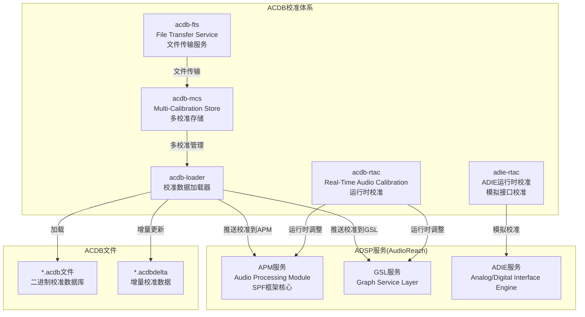
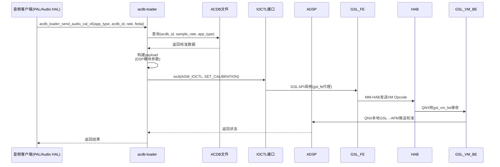
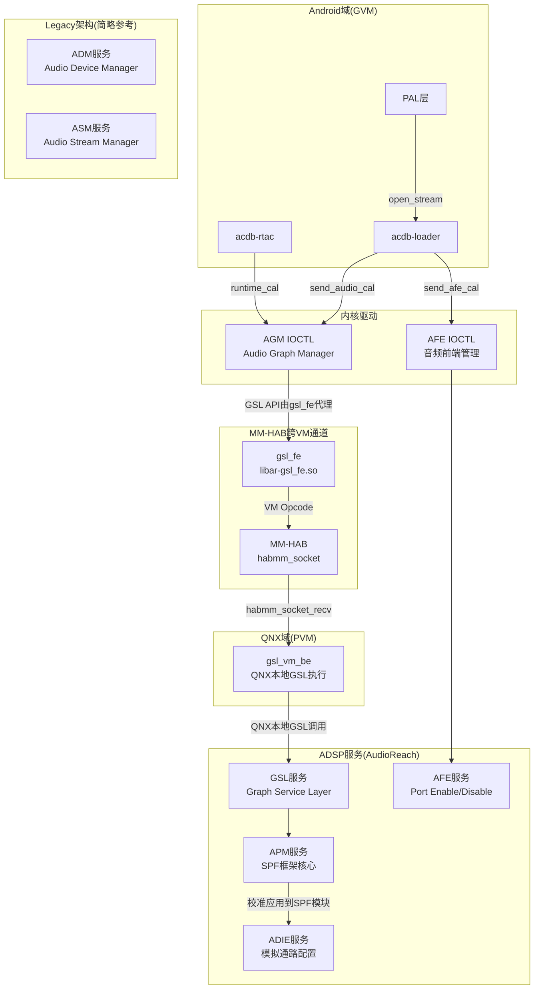

[← N.5 audio-chime早期提示音](16_5.1_audio-chime早期提示音.md) | [← 返回SA8295 Vendor+QNX双域音频架构深度解析](README.md) | [返回导航](../README.md) | [N.7 ACDB校准数据（Android →](16_7.1_ACDB校准数据Android与QNX双域共享.md)

---

N.6 ACDB校准体系

N.6.1 ACDB概述

ACDB(Audio Calibration Database)是高通平台的核心校准体系，存储了音频设备的校准参数（如增益、滤波器系数、延迟补偿等），在音频流打开时推送到ADSP，确保DSP处理链使用正确的校准数据。



N.6.2 acdb-loader校准加载器

`acdb-loader`是ACDB体系的核心组件，负责从ACDB二进制数据库文件中读取校准数据并推送到ADSP：

```cpp
// acdb-loader核心API
class AcdbLoader {
public:
    // 初始化ACDB加载器
    static int acdb_loader_init_v4();

    // 发送音频校准数据（主接口）
    static int acdb_loader_send_audio_cal_v6(
        int app_type,      // 应用类型（如69943）
        int acdb_id,       // ACDB设备ID（如15=Speaker）
        int sample_rate,   // 采样率
        int fedai_id       // Front-End DAI ID
    );

    // 发送自定义校准
    static int acdb_loader_send_custom_cal(
        int acdb_id,
        int sample_rate,
        void *cal_data,
        size_t cal_size
    );

    // 发送AFE校准
    static int acdb_loader_send_afe_cal(
        int acdb_id,
        int sample_rate,
        int port_id
    );
};
```

#### 校准推送流程



N.6.3 acdb-mcs多校准存储

`acdb-mcs`(Multi-Calibration Store)支持为同一设备存储多个校准配置，适应不同使用场景：

```cpp
// acdb-mcs API
class AcdbMcs {
public:
    // 分配校准ID
    static int acdb_mcs_alloc_cal_id(
        int acdb_id,
        int app_type,
        int sample_rate,
        int *cal_id);

    // 释放校准ID
    static int acdb_mcs_dealloc_cal_id(int cal_id);

    // 应用校准配置
    static int acdb_mcs_apply_cal(int cal_id);

    // 获取当前校准信息
    static int acdb_mcs_get_cal_info(
        int cal_id,
        struct cal_info *info);
};
```

**多校准场景示例**：

| 设备 | 校准场景A | 校准场景B | 校准场景C |
|------|----------|----------|----------|
| Speaker | 驻车模式(大音量) | 行驶模式(中等音量) | 夜间模式(低音量) |
| Headset | 32Ω耳机 | 16Ω耳机 | 高阻抗耳机 |
| BT SCO | 宽带语音 | 窄带语音 | HD Voice |

N.6.4 acdb-fts文件传输服务

`acdb-fts`(File Transfer Service)负责在Android域和ADSP之间传输校准文件：

```cpp
// acdb-fts核心功能
class AcdbFts {
public:
    // 传输ACDB文件到ADSP
    static int acdb_fts_send_file(
        const char *file_path,    // ACDB文件路径
        int partition_id          // 分区ID
    );

    // 获取ADSP侧ACDB版本
    static int acdb_fts_get_version(
        int *major,
        int *minor
    );

    // 同步增量校准
    static int acdb_fts_sync_delta(
        const char *delta_path    // .acdbdelta文件路径
    );
};
```

N.6.5 acdb-rtac运行时校准

`acdb-rtac`(Real-Time Audio Calibration)允许在音频流运行过程中动态调整校准参数，无需重新打开音频流：

```cpp
// acdb-rtac核心API
class AcdbRtac {
public:
    // 设置运行时校准
    static int acdb_rtac_set_cal(
        int port_id,              // AFE端口ID
        int acdb_id,              // ACDB设备ID
        void *cal_data,           // 校准数据
        size_t cal_size           // 数据大小
    );

    // 获取当前校准
    static int acdb_rtac_get_cal(
        int port_id,
        int acdb_id,
        void *cal_data,
        size_t *cal_size
    );

    // 设置ADIE校准
    static int adie_rtac_set_cal(
        int adie_id,
        void *cal_data,
        size_t cal_size
    );
};
```

N.6.6 ACDB ID映射表

ACDB ID是连接Android侧设备枚举和DSP校准数据的桥梁，每个音频设备都有唯一的ACDB ID：

#### 播放(RX)设备ACDB ID

| ACDB ID | 设备名称 | 说明 |
|---------|---------|------|
| 1 | HANDSET_RX | 手机听筒播放 |
| 7 | HANDSET_RX(alt) | 手机听筒播放(替代ID) |
| 10 | HEADSET_RX | 有线耳机播放 |
| 14 | SPEAKER_RX(alt) | 扬声器播放(替代ID) |
| 15 | SPEAKER_RX | 扬声器播放 |
| 18 | HDMI_RX | HDMI输出 |
| 22 | BT_SCO_RX | 蓝牙SCO播放 |
| 26 | BT_A2DP_RX | 蓝牙A2DP播放 |
| 45 | USB_RX | USB音频输出 |
| 60 | MEDIA_RX | 媒体播放(通用) |
| 66 | VOICE_RX | 语音通话播放 |

#### 录音(TX)设备ACDB ID

| ACDB ID | 设备名称 | 说明 |
|---------|---------|------|
| 4 | HANDSET_TX | 手机麦克风录音 |
| 11 | HEADSET_TX | 有线耳机麦克风录音 |
| 16 | SPEAKER_TX | 扬声器参考信号 |
| 19 | HDMI_TX | HDMI输入 |
| 23 | BT_SCO_TX | 蓝牙SCO录音 |
| 46 | USB_TX | USB音频输入 |

#### 车载特有ACDB ID

| ACDB ID | 设备名称 | 说明 |
|---------|---------|------|
| 60 | CHIME_RX | 提示音播放 |
| 89 | EC_REF_RX | 回声参考信号 |
| 130 | NAVI_RX | 导航提示音 |
| 131 | ANNOUNCEMENT_RX | 广播通知 |

N.6.7 ACDB校准数据结构

```cpp
// ACDB校准数据在DSP端的表示
struct acdb_cal_data {
    uint32_t cal_type;          // 校准类型
    uint32_t cal_size;          // 校准数据大小
    void     *cal_kv;           // 键值对数据
    uint32_t num_kv_pairs;      // 键值对数量
};

// 校准类型定义
enum acdb_cal_type {
    CAL_TYPE_AUDIO_RX    = 0,   // RX播放校准
    CAL_TYPE_AUDIO_TX    = 1,   // TX录音校准
    CAL_TYPE_AUDIO_AFE   = 2,   // AFE校准
    CAL_TYPE_AUDIO_APM   = 3,   // APM校准(AudioReach)
    CAL_TYPE_AUDIO_AGM   = 4,   // AGM校准(AudioReach)
    CAL_TYPE_AUDIO_ADIE  = 5,   // ADIE模拟校准
    // Legacy only(简略)
    CAL_TYPE_AUDIO_ADM   = 6,   // ADM校准(legacy)
    CAL_TYPE_AUDIO_ASM   = 7,   // ASM校准(legacy)
};

// ACDB键值对
struct acdb_kv_pair {
    uint32_t key;               // 参数键(如GAIN, DELAY等)
    uint32_t value;             // 参数值
};
```

N.6.8 ACDB与DSP服务交互



---

---

[← N.5 audio-chime早期提示音](16_5.1_audio-chime早期提示音.md) | [← 返回SA8295 Vendor+QNX双域音频架构深度解析](README.md) | [返回导航](../README.md) | [N.7 ACDB校准数据（Android →](16_7.1_ACDB校准数据Android与QNX双域共享.md)
