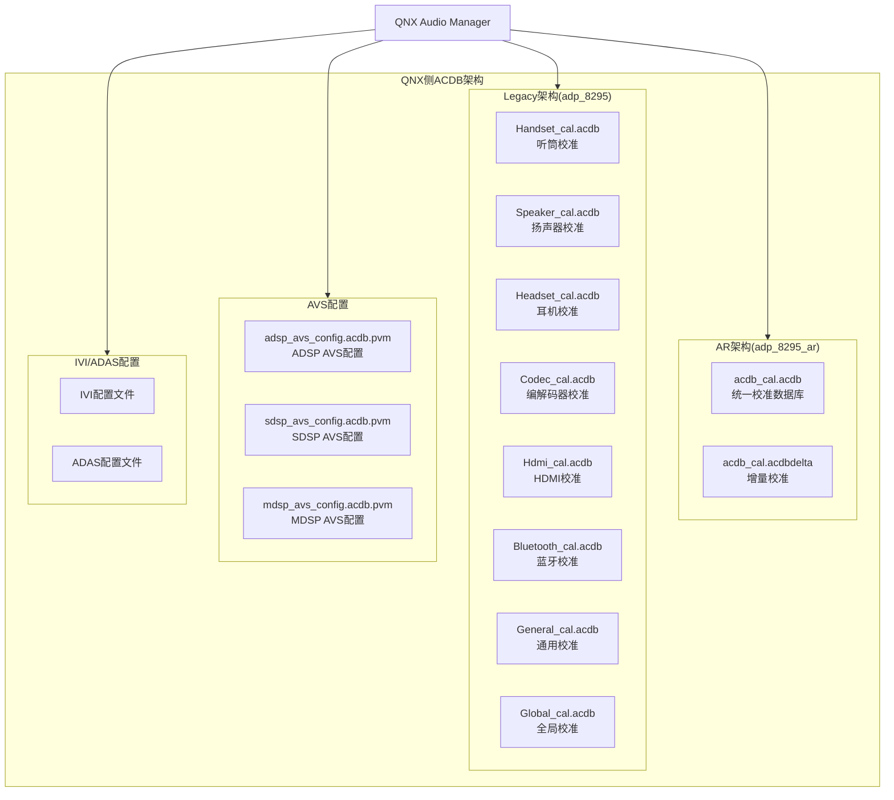

[← N.6 ACDB校准体系](16_6.1_ACDB校准体系.md) | [← 返回SA8295 Vendor+QNX双域音频架构深度解析](README.md) | [返回导航](../README.md) | [N.8 ALSA UCM配置 →](16_8.1_ALSA_UCM配置.md)

---

N.7 ACDB校准数据（Android与QNX双域共享）

N.7.1 ACDB架构概述

**Android域和QNX域共用同一套ACDB校准数据**，并非各自独立维护。ACDB(Audio Calibration Database)校准文件由QNX域持有和管理，Android域通过acdb-loader在运行时加载同一套校准数据并推送到ADSP。SA8295平台支持两种ACDB架构版本：**legacy架构**(`adp_8295`)和**AR架构**(`adp_8295_ar`)。

> **重要说明**：双域共用同一套ACDB校准数据，而非各自独立ACDB。QNX侧的ACDB文件同时也服务于Android域的acdb-loader，两者最终都将校准推送到同一个ADSP。



N.7.2 AR架构(adp_8295_ar)

AR(Audio Reach)架构是高通新一代音频架构，采用统一的ACDB数据库文件：

#### 目录结构

```
adp_8295_ar/
├── acdb_cal.acdb           # 统一校准数据库(所有设备校准合并)
├── acdb_cal.acdbdelta      # 增量校准数据(OEM定制覆盖)
└── avs_config/
    ├── adsp_avs_config.acdb.pvm   # ADSP AVS配置
    ├── sdsp_avs_config.acdb.pvm   # SDSP AVS配置
    └── mdsp_avs_config.acdb.pvm   # MDSP AVS配置
```

#### AR架构特点

| 特性 | 说明 |
|------|------|
| 统一数据库 | 所有设备校准合并在单个acdb_cal.acdb文件中 |
| 增量覆盖 | acdbdelta文件允许OEM在不修改主数据库的情况下覆盖特定参数 |
| Graph-based | 基于Graph(图)的音频处理架构，校准与Graph绑定 |
| 动态加载 | 支持运行时加载/替换校准数据 |

N.7.3 Legacy架构(adp_8295)

Legacy架构按设备类型分离校准文件：

#### 目录结构

```
adp_8295/
├── Handset_cal.acdb        # 听筒/手机麦克风校准
├── Speaker_cal.acdb        # 扬声器校准(增益/均衡/限幅)
├── Headset_cal.acdb        # 有线耳机校准
├── Codec_cal.acdb          # 编解码器校准(ADC/DAC配置)
├── Hdmi_cal.acdb           # HDMI输出校准
├── Bluetooth_cal.acdb      # 蓝牙SCO/A2DP校准
├── General_cal.acdb        # 通用校准(共享参数)
├── Global_cal.acdb         # 全局校准(系统级参数)
├── avs_config/
│   ├── adsp_avs_config.acdb.pvm
│   ├── sdsp_avs_config.acdb.pvm
│   └── mdsp_avs_config.acdb.pvm
├── ivi_config/             # IVI信息娱乐配置
│   ├── ivi_audio_route.conf
│   └── ivi_volume_table.conf
└── adas_config/            # ADAS高级驾驶辅助配置
    ├── adas_warning_tone.conf
    └── adas_chime_config.conf
```

#### 按设备分类校准内容

##### Speaker_cal.acdb

```ini
# 扬声器校准参数(示例)
[Speaker_RX]
acdb_id = 15
sample_rate = 48000

# 增益校准
rx_gain = 0dB              # 数字增益
rx_analog_gain = 3dB       # 模拟增益
spk_protection_threshold = 95dB  # 扬声器保护阈值

# 均衡器校准
eq_num_bands = 5
eq_band_1 = 100Hz, -3dB, Q=1.0
eq_band_2 = 500Hz, 0dB, Q=0.7
eq_band_3 = 2kHz, +2dB, Q=1.2
eq_band_4 = 5kHz, -1dB, Q=0.8
eq_band_5 = 10kHz, -4dB, Q=0.6

# 限幅器校准
limiter_threshold = -6dBFS
limiter_release = 50ms
```

##### Bluetooth_cal.acdb

```ini
# 蓝牙校准参数(示例)
[BT_SCO_RX]
acdb_id = 22
sample_rate = 16000         # NB: 8kHz, WB: 16kHz
nb_mode_rate = 8000
wb_mode_rate = 16000

[BT_A2DP_RX]
acdb_id = 26
sample_rate = 44100
supported_codecs = SBC,AAC,LDAC,AptX,AptX-HD
```

N.7.4 AVS配置文件

AVS(Audio Voice Subsystem)配置控制DSP子系统的行为：

```ini
# adsp_avs_config.acdb.pvm (ADSP AVS配置)
[ADSP_AVS]
# 性能模式
pvm_mode = PERFORMANCE      # PERFORMANCE / LOW_POWER / ULTRA_LOW_POWER

# 时钟配置
mips_budget = 500           # MIPS预算
clock_freq_khz = 768000    # 时钟频率

# 内存配置
lpaif_mem_size = 2048       # LPAIF内存大小(KB)

# 音频特性
afe_loopback_enable = 0     # AFE环回禁用
adm Copp.peak_detect = 1   # 峰值检测使能
```

```ini
# sdsp_avs_config.acdb.pvm (SDSP AVS配置 - 传感器处理域)
[SDSP_AVS]
pvm_mode = LOW_POWER
mips_budget = 200
```

```ini
# mdsp_avs_config.acdb.pvm (MDSP AVS配置 - 调制解调域)
[MDSP_AVS]
pvm_mode = PERFORMANCE
mips_budget = 300
```

N.7.5 IVI/ADAS配置

车载特定配置文件：

```ini
# ivi_audio_route.conf (IVI音频路由配置)
[IVI_ROUTES]
# 区域音频路由
zone0_output = TERT_TDM_RX   # 主区域输出
zone1_output = SEC_TDM_RX    # 副区域输出

# 优先级路由
navigation_priority = HIGH    # 导航高优先级
chime_priority = CRITICAL     # 提示音最高优先级
media_priority = NORMAL       # 媒体正常优先级
```

```ini
# adas_chime_config.conf (ADAS提示音配置)
[ADAS_CHIMES]
# 警告音配置
forward_collision_warning = chime_fcw.wav
lane_departure_warning = chime_ldw.wav
blind_spot_warning = chime_bsw.wav
parking_sensor_near = chime_park_near.wav
parking_sensor_far = chime_park_far.wav

# 提示音优先级
fcw_priority = 10  # 最高
ldw_priority = 8
bsw_priority = 6
park_priority = 4
```

N.7.6 Android与QNX侧ACDB共享对比

> **核心要点**：Android和QNX共用同一套ACDB校准数据，两者的校准最终都推送到同一个ADSP，仅加载方式和时机不同。

| 特性 | Android侧 | QNX侧 |
|------|----------|-------|
| 数据来源 | **同一套ACDB校准文件**（双域共享） | **同一套ACDB校准文件**（双域共享） |
| 加载方式 | acdb-loader运行时推送 | QNX AM启动时加载 |
| 文件格式 | 单个.acdb文件(AR架构) | 按设备分离或统一(取决于架构) |
| 更新机制 | acdb-rtac运行时更新 | 需要重启QNX AM |
| 校准路径 | /vendor/etc/acdbdata/ | /sys/platform/acdb/ |
| 增量支持 | .acdbdelta | .acdbdelta |
| DSP通信 | acdb-loader→gsl_fe→MM-HAB→gsl_vm_be→GSL→ADSP | QNX AM→AGM→GSL→ADSP(直连) |

---

---

[← N.6 ACDB校准体系](16_6.1_ACDB校准体系.md) | [← 返回SA8295 Vendor+QNX双域音频架构深度解析](README.md) | [返回导航](../README.md) | [N.8 ALSA UCM配置 →](16_8.1_ALSA_UCM配置.md)
