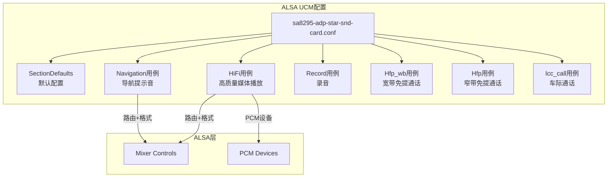
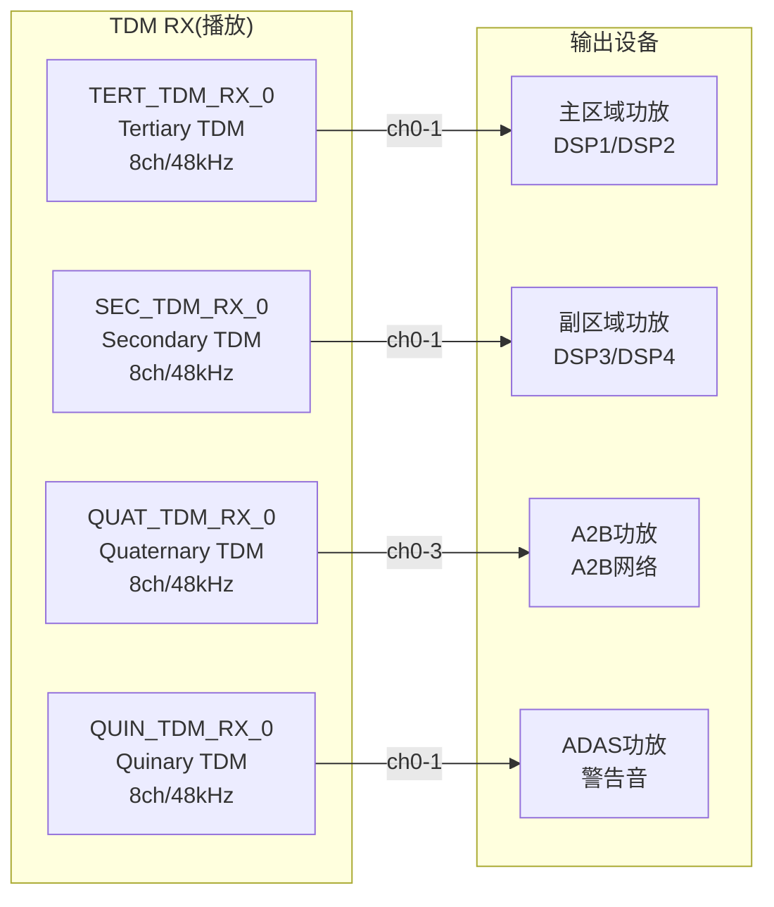
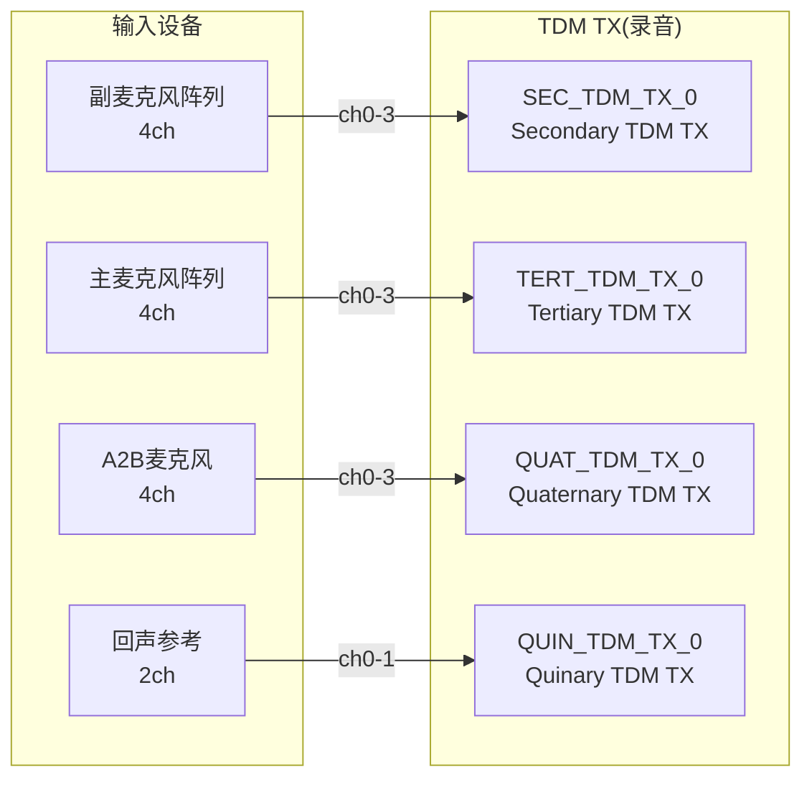

[← N.7 ACDB校准数据（Android](16_7.1_ACDB校准数据Android与QNX双域共享.md) | [← 返回SA8295 Vendor+QNX双域音频架构深度解析](README.md) | [返回导航](../README.md) | [N.9 auto-casa-xml配置 →](16_9.1_auto-casa-xml配置.md)

---

N.8 ALSA UCM配置

N.8.1 UCM概述

ALSA UCM(Use Case Manager)定义了SA8295声卡的音频用例配置，包括设备路由、格式设置和使能控制。SA8295平台的UCM配置文件为`sa8295-adp-star-snd-card.conf`。



N.8.2 UCM配置文件结构

```uci
# sa8295-adp-star-snd-card.conf
# Syntax 2格式

SectionUseCase."HiFi" {
    Comment "High quality media playback"
    Enable {
        # TDM路由配置
        cset "name='TERT_TDM_RX_0 Audio Mixer MultiMedia1' 1"
        # 格式配置
        cset "name='MULTIMEDIA1 Format' 'S16_LE'"
        cset "name='MULTIMEDIA1 Rate' 48000"
        cset "name='MULTIMEDIA1 Channels' 2"
    }
    Disable {
        cset "name='TERT_TDM_RX_0 Audio Mixer MultiMedia1' 0"
    }
}

SectionUseCase."Navigation" {
    Comment "Navigation prompt audio"
    Enable {
        cset "name='SEC_TDM_RX_0 Audio Mixer MultiMedia5' 1"
        cset "name='MULTIMEDIA5 Format' 'S16_LE'"
        cset "name='MULTIMEDIA5 Rate' 48000"
    }
    Disable {
        cset "name='SEC_TDM_RX_0 Audio Mixer MultiMedia5' 0"
    }
}

SectionUseCase."Record" {
    Comment "Audio recording from microphone"
    Enable {
        cset "name='MultiMedia2 Mixer TERT_TDM_TX_0' 1"
        cset "name='TERT_TDM_TX_0 Sample Rate' 48000"
        cset "name='TERT_TDM_TX_0 Channels' 4"
    }
    Disable {
        cset "name='MultiMedia2 Mixer TERT_TDM_TX_0' 0"
    }
}

SectionUseCase."Hfp_wb" {
    Comment "Hands-free call wideband (16kHz)"
    Enable {
        cset "name='SEC_TDM_RX_0 Audio Mixer MultiMedia7' 1"
        cset "name='MultiMedia8 Mixer SLIMBUS_7_TX' 1"
        cset "name='MULTIMEDIA7 Rate' 16000"
    }
    Disable {
        cset "name='SEC_TDM_RX_0 Audio Mixer MultiMedia7' 0"
        cset "name='MultiMedia8 Mixer SLIMBUS_7_TX' 0"
    }
}

SectionUseCase."Hfp" {
    Comment "Hands-free call narrowband (8kHz)"
    Enable {
        cset "name='SEC_TDM_RX_0 Audio Mixer MultiMedia7' 1"
        cset "name='MultiMedia8 Mixer SLIMBUS_7_TX' 1"
        cset "name='MULTIMEDIA7 Rate' 8000"
    }
    Disable {
        cset "name='SEC_TDM_RX_0 Audio Mixer MultiMedia7' 0"
        cset "name='MultiMedia8 Mixer SLIMBUS_7_TX' 0"
    }
}

SectionUseCase."Icc_call" {
    Comment "Inter-car communication call"
    Enable {
        cset "name='TERT_TDM_RX_0 Audio Mixer MultiMedia9' 1"
        cset "name='MultiMedia10 Mixer QUIN_TDM_TX_0' 1"
        cset "name='MULTIMEDIA9 Rate' 16000"
        cset "name='MULTIMEDIA10 Rate' 16000"
    }
    Disable {
        cset "name='TERT_TDM_RX_0 Audio Mixer MultiMedia9' 0"
        cset "name='MultiMedia10 Mixer QUIN_TDM_TX_0' 0"
    }
}
```

N.8.3 SectionDefaults默认配置

```uci
SectionDefaults {
    # 指定声卡设备
    cdev "hw:0"

    # Instance ID支持(SA8295平台特性)
    cset "name='Instance ID Support' 1"

    # 默认TDM配置
    cset "name='TERT_TDM_RX_0 Sample Rate' 48000"
    cset "name='TERT_TDM_RX_0 Channels' 8"
    cset "name='TERT_TDM_RX_0 Bit Format' 'S16_LE'"

    cset "name='SEC_TDM_RX_0 Sample Rate' 48000"
    cset "name='SEC_TDM_RX_0 Channels' 8"
    cset "name='SEC_TDM_RX_0 Bit Format' 'S16_LE'"

    cset "name='QUAT_TDM_RX_0 Sample Rate' 48000"
    cset "name='QUAT_TDM_RX_0 Channels' 8"
    cset "name='QUAT_TDM_RX_0 Bit Format' 'S16_LE'"

    cset "name='QUIN_TDM_RX_0 Sample Rate' 48000"
    cset "name='QUIN_TDM_RX_0 Channels' 8"
    cset "name='QUIN_TDM_RX_0 Bit Format' 'S16_LE'"

    # TX通道配置
    cset "name='TERT_TDM_TX_0 Sample Rate' 48000"
    cset "name='TERT_TDM_TX_0 Channels' 8"
    cset "name='QUIN_TDM_TX_0 Sample Rate' 48000"
    cset "name='QUIN_TDM_TX_0 Channels' 8"
}
```

N.8.4 TDM通道映射

SA8295平台使用多组TDM总线连接不同的音频设备：





N.8.5 用例与PCM设备映射

| 用例 | RX PCM | TX PCM | 采样率 | 通道 | 说明 |
|------|--------|--------|--------|------|------|
| HiFi | MultiMedia1(PCM0) | — | 48kHz | 2ch | 高质量媒体播放 |
| Navigation | MultiMedia5(PCM4) | — | 48kHz | 2ch | 导航提示音 |
| Record | — | MultiMedia2(PCM1) | 48kHz | 4ch | 麦克风录音 |
| Hfp_wb | MultiMedia7(PCM6) | MultiMedia8(PCM7) | 16kHz | 1ch | 宽带免提 |
| Hfp | MultiMedia7(PCM6) | MultiMedia8(PCM7) | 8kHz | 1ch | 窄带免提 |
| Icc_call | MultiMedia9(PCM8) | MultiMedia10(PCM9) | 16kHz | 1ch | 车际通话 |

N.8.6 Instance ID Support

SA8295平台启用`Instance ID Support`，这是高通平台对ALSA PCM设备标识的增强，允许同一PCM设备名有多个实例：

```uci
# Instance ID Support = 1 启用后
# PCM设备引用格式变为：
#   hw:CARD,DEVICE,INSTANCE
# 例如：
#   hw:0,0,0   - MultiMedia1 实例0
#   hw:0,0,1   - MultiMedia1 实例1(并发流)
```

这支持Android的**multiple_mix_dsp**模式，允许多个音频流同时使用同一个PCM设备。

---

---

[← N.7 ACDB校准数据（Android](16_7.1_ACDB校准数据Android与QNX双域共享.md) | [← 返回SA8295 Vendor+QNX双域音频架构深度解析](README.md) | [返回导航](../README.md) | [N.9 auto-casa-xml配置 →](16_9.1_auto-casa-xml配置.md)
