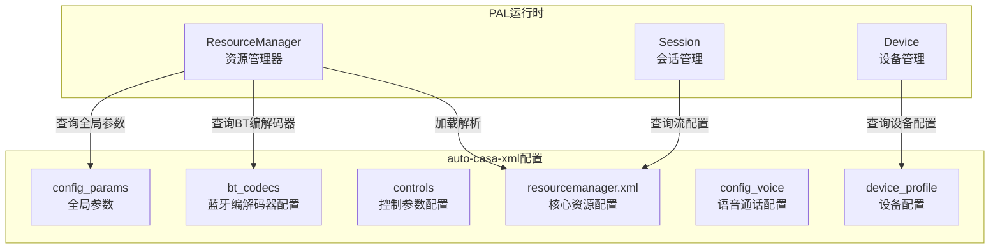
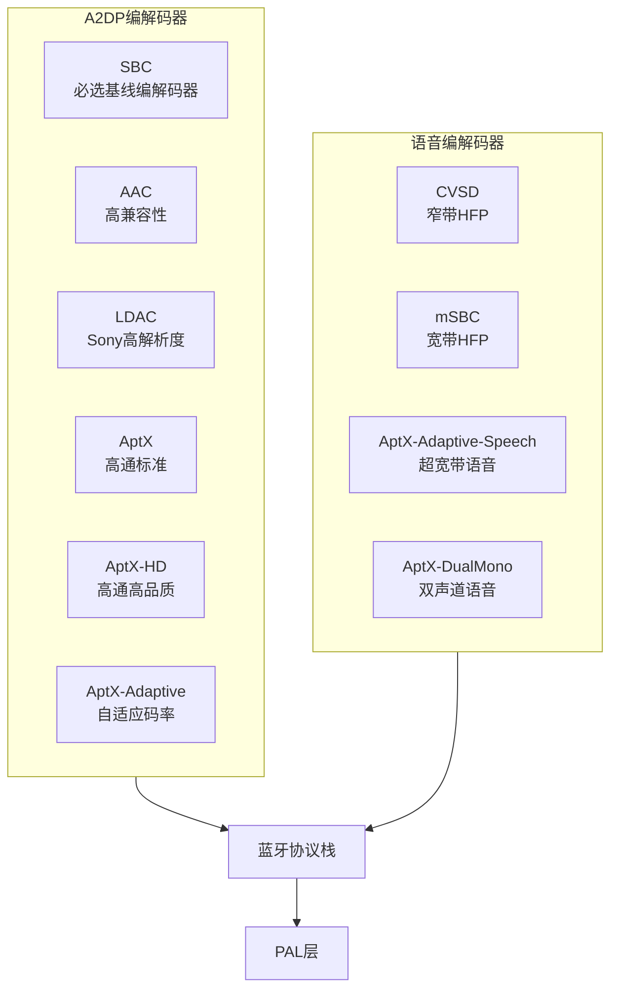

[← N.8 ALSA UCM配置](16_8.1_ALSA_UCM配置.md) | [← 返回SA8295 Vendor+QNX双域音频架构深度解析](README.md) | [返回导航](../README.md) | [N.10 AGM(Audio Graph →](16_10.1_AGMAudio_Graph_Manager深度解.md)

---

N.9 auto-casa-xml配置

N.9.1 概述

`auto-casa-xml`是PAL(Platform Abstraction Layer)层的资源配置文件，定义了音频流类型、设备配置、蓝牙编解码器、音量控制等关键参数。它是PAL运行时的"数据库"，决定了音频流如何被路由和处理。



N.9.2 resourcemanager.xml结构

```xml
<?xml version="1.0" encoding="ISO-8859-1"?>
<audio_platform_info>
    <!-- 全局配置参数 -->
    <config_params>
        <param name="native_audio_mode" value="multiple_mix_dsp"/>
        <param name="max_sessions" value="128"/>
        <param name="max_aptx_sessions" value="4"/>
        <param name="max_aaaptx_sessions" value="4"/>
    </config_params>

    <!-- 蓝牙编解码器配置 -->
    <bt_codecs>
        <codec name="AAC" format="AUDIO_FORMAT_AAC"/>
        <codec name="SBC" format="AUDIO_FORMAT_SBC"/>
        <codec name="LDAC" format="AUDIO_FORMAT_LDAC"/>
        <codec name="AptX" format="AUDIO_FORMAT_APTX"/>
        <codec name="AptX-HD" format="AUDIO_FORMAT_APTX_HD"/>
        <codec name="AptX-Adaptive" format="AUDIO_FORMAT_APTX_ADAPTIVE"/>
        <codec name="AptX-DualMono" format="AUDIO_FORMAT_APTX_DUAL_MONO"/>
        <codec name="AptX-Adaptive-Speech" format="AUDIO_FORMAT_APTX_ADAPTIVE_SPEECH"/>
    </bt_codecs>

    <!-- 控制参数 -->
    <controls>
        <control name="PLUGIN_CONTROL_VOLUME" id="0"/>
        <control name="PLUGIN_CONTROL_BOOST" id="1"/>
        <control name="PLUGIN_CONTROL_HD_VOICE" id="2"/>
        <control name="PLUGIN_CONTROL_AUDIO_BUFFER" id="3"/>
        <control name="PLUGIN_CONTROL_AUDIO_LATENCY" id="4"/>
    </controls>

    <!-- 设备配置 -->
    <device_profile>
        <!-- 麦克风设备 -->
        <device id="PAL_DEVICE_IN_HANDSET_MIC">
            <profile name="TDM-LPAIF-TX-TERTIARY" channels="8"
                     samplerate="48000" bit_width="16"/>
        </device>

        <!-- 扬声器设备 -->
        <device id="PAL_DEVICE_OUT_SPEAKER">
            <profile name="TDM-LPAIF-RX-TERTIARY" channels="8"
                     samplerate="48000" bit_width="16"/>
        </device>

        <!-- 蓝牙A2DP设备 -->
        <device id="PAL_DEVICE_OUT_BLUETOOTH_A2DP">
            <profile name="SLIMBUS_6_RX" channels="2"
                     samplerate="48000" bit_width="16"/>
        </device>
    </device_profile>

    <!-- 语音通话配置 -->
    <config_voice>
        <vsid value="0xB3000000"/>
        <mode_map>
            <mode name="NORMAL" vsid="0xB3000000"/>
            <mode name="IN_CALL" vsid="0xB3000001"/>
            <mode name="RING" vsid="0xB3000002"/>
        </mode_map>
    </config_voice>
</audio_platform_info>
```

N.9.3 config_params全局参数详解

| 参数名 | 默认值 | 说明 |
|--------|-------|------|
| `native_audio_mode` | `multiple_mix_dsp` | DSP混音模式，允许多流并发 |
| `max_sessions` | `128` | 最大同时会话数 |
| `max_aptx_sessions` | `4` | 最大AptX并发会话数 |
| `max_aaaptx_sessions` | `4` | 最大AptX-Adaptive并发会话数 |

**native_audio_mode**取值说明：

| 模式 | 说明 | 适用场景 |
|------|------|---------|
| `multiple_mix_dsp` | DSP端混音，多流共享PCM | 车载多区域并发播放 |
| `multiple_mix_host` | Host端混音，单PCM | 低延迟场景 |
| `single_mix_dsp` | DSP端混音，单PCM | 简单设备 |
| `true_native` | Native直出 | 低延迟直通模式 |

N.9.4 bt_codecs蓝牙编解码器



编解码器优先级（默认协商顺序）：

1. **LDAC** — 990kbps，最高音质
2. **AptX-Adaptive** — 自适应，平衡音质/延迟
3. **AptX-HD** — 576kbps，高品质
4. **AAC** — 320kbps，高兼容性
5. **AptX** — 352kbps，低延迟
6. **SBC** — 基线编解码器

N.9.5 controls控制参数

PAL插件控制用于在运行时调整音频处理行为：

```cpp
// 控制ID定义
typedef enum {
    PLUGIN_CONTROL_VOLUME       = 0,  // 音量控制
    PLUGIN_CONTROL_BOOST        = 1,  // 增益提升
    PLUGIN_CONTROL_HD_VOICE     = 2,  // HD语音模式
    PLUGIN_CONTROL_AUDIO_BUFFER = 3,  // 音频缓冲区配置
    PLUGIN_CONTROL_AUDIO_LATENCY = 4, // 延迟控制
} plugin_control_id_t;

// 控制使用示例
int PalStream::setControl(plugin_control_id_t id, int value) {
    switch (id) {
    case PLUGIN_CONTROL_VOLUME:
        return PayloadBuilder::setVolume(graphHandle, value);
    case PLUGIN_CONTROL_BOOST:
        return PayloadBuilder::setBoost(graphHandle, value);
    case PLUGIN_CONTROL_HD_VOICE:
        return PayloadBuilder::setHdVoice(graphHandle, value);
    case PLUGIN_CONTROL_AUDIO_BUFFER:
        return PayloadBuilder::setBufferSize(graphHandle, value);
    case PLUGIN_CONTROL_AUDIO_LATENCY:
        return PayloadBuilder::setLatency(graphHandle, value);
    }
}
```

N.9.6 device_profile设备配置

设备配置定义了PAL设备到物理接口的映射：

```xml
<!-- 设备配置映射 -->
<device_profile>
    <!-- 输入设备 -->
    <device id="PAL_DEVICE_IN_HANDSET_MIC">
        <profile name="TDM-LPAIF-TX-TERTIARY"
                 channels="8" samplerate="48000" bit_width="16"/>
        <acdb_id value="15"/>
    </device>

    <device id="PAL_DEVICE_IN_BLUETOOTH_SCO_HEADSET">
        <profile name="SLIMBUS_7_TX"
                 channels="1" samplerate="16000" bit_width="16"/>
        <acdb_id value="23"/>
    </device>

    <!-- 输出设备 -->
    <device id="PAL_DEVICE_OUT_SPEAKER">
        <profile name="TDM-LPAIF-RX-TERTIARY"
                 channels="8" samplerate="48000" bit_width="16"/>
        <acdb_id value="15"/>
    </device>

    <device id="PAL_DEVICE_OUT_BLUETOOTH_A2DP">
        <profile name="SLIMBUS_6_RX"
                 channels="2" samplerate="48000" bit_width="16"/>
        <acdb_id value="26"/>
    </device>

    <device id="PAL_DEVICE_OUT_HDMI">
        <profile name="HDMI-RX-PRIMARY"
                 channels="2" samplerate="48000" bit_width="16"/>
        <acdb_id value="18"/>
    </device>
</device_profile>
```

#### PAL设备ID与TDM接口映射

| PAL设备ID | 物理接口 | 通道数 | 采样率 | ACDB ID |
|-----------|---------|--------|--------|---------|
| PAL_DEVICE_IN_HANDSET_MIC | TDM-LPAIF-TX-TERTIARY | 8 | 48kHz | 15 |
| PAL_DEVICE_IN_BLUETOOTH_SCO_HEADSET | SLIMBUS_7_TX | 1 | 16kHz | 23 |
| PAL_DEVICE_OUT_SPEAKER | TDM-LPAIF-RX-TERTIARY | 8 | 48kHz | 15 |
| PAL_DEVICE_OUT_BLUETOOTH_A2DP | SLIMBUS_6_RX | 2 | 48kHz | 26 |
| PAL_DEVICE_OUT_HDMI | HDMI-RX-PRIMARY | 2 | 48kHz | 18 |
| PAL_DEVICE_OUT_USB_HEADSET | USB-RX | 2 | 48kHz | 45 |

N.9.7 config_voice语音通话配置

```xml
<!-- 语音通话配置 -->
<config_voice>
    <!-- VSID(Voice Session ID)定义 -->
    <vsid value="0xB3000000"/>

    <!-- 模式映射 -->
    <mode_map>
        <mode name="NORMAL"    vsid="0xB3000000"/>
        <mode name="IN_CALL"   vsid="0xB3000001"/>
        <mode name="RING"      vsid="0xB3000002"/>
    </mode_map>

    <!-- 语音设备映射 -->
    <voice_device_map>
        <device_rx="PAL_DEVICE_OUT_SPEAKER"
                  device_tx="PAL_DEVICE_IN_HANDSET_MIC"
                  vsid="0xB3000000"/>
        <device_rx="PAL_DEVICE_OUT_BLUETOOTH_SCO"
                  device_tx="PAL_DEVICE_IN_BLUETOOTH_SCO_HEADSET"
                  vsid="0xB3000001"/>
    </voice_device_map>
</config_voice>
```

N.9.8 PAL流类型定义

PAL定义了丰富的流类型，对应不同的音频使用场景：

```cpp
// PAL流类型枚举
typedef enum {
    PAL_STREAM_LOW_LATENCY       = 0,   // 低延迟播放
    PAL_STREAM_DEEP_BUFFER       = 1,   // 深缓冲播放
    PAL_STREAM_COMPRESSED        = 2,   // 压缩音频(Offload)
    PAL_STREAM_VOIP              = 5,   // VoIP通话
    PAL_STREAM_VOICE_CALL        = 6,   // 语音通话
    PAL_STREAM_VOICE_UI          = 7,   // 语音助手
    PAL_STREAM_PCM_HFP           = 8,   // 免提通话PCM
    PAL_STREAM_PROXY             = 9,   // 代理流
    PAL_STREAM_ULTRA_LOW_LATENCY = 10,  // 超低延迟
    PAL_STREAM_GENERIC_CHIME     = 11,  // 提示音
    PAL_STREAM_SPATIAL_AUDIO     = 12,  // 空间音频
    PAL_STREAM_CONTEXT_AWARE     = 13,  // 上下文感知
    PAL_STREAM_NAVI              = 14,  // 导航提示
    PAL_STREAM_SENSOR_AUDIO      = 15,  // 传感器音频
} pal_stream_type_t;
```

每种流类型对应不同的app_type和DSP处理链：

| PAL流类型 | app_type | PCM设备 | DSP处理链 |
|-----------|----------|---------|----------|
| LOW_LATENCY | 69940 | MultiMedia5 | 简单解码+音量 |
| DEEP_BUFFER | 69941 | MultiMedia1 | 完整处理链 |
| COMPRESSED | 69941 | MultiMedia2 | 解码+后处理 |
| VOIP | 69946 | MultiMedia7 | AEC+NS+编码 |
| VOICE_CALL | 69943 | VOICE | 完整语音处理 |
| GENERIC_CHIME | 69943 | MultiMedia23 | 提示音通路 |
| NAVI | 69942 | MultiMedia5 | 导航混音通路 |

---

---

[← N.8 ALSA UCM配置](16_8.1_ALSA_UCM配置.md) | [← 返回SA8295 Vendor+QNX双域音频架构深度解析](README.md) | [返回导航](../README.md) | [N.10 AGM(Audio Graph →](16_10.1_AGMAudio_Graph_Manager深度解.md)
