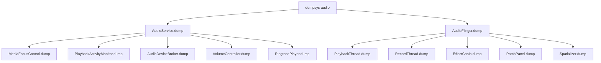

## 17.1 dumpsys audio — 音频系统全量状态

> [← 上一篇：Vendor+QNX双域架构](../16_Vendor_QNX_Architecture/README.md) | [← 返回17章](README.md) | [返回导航](../README.md) | [下一个 →](17_2.1_logcat音频日志过滤.md)

---

## 17.1.1 dumpsys audio概述

`dumpsys audio`是Android音频调试的入口命令，输出AudioService和AudioFlinger的完整运行时状态。它汇聚了Java Framework层和Native层的所有关键信息，是排查音频问题的首选工具。

**源码入口**：
- Java层：[`AudioService.dump()`](frameworks/base/services/core/java/com/android/server/audio/AudioService.java)
- Native层：[`AudioFlinger::dump()`](frameworks/av/services/audioflinger/AudioFlinger.cpp)



## 17.1.2 基本用法

```bash
# 完整dump（输出很大，建议重定向到文件）
adb shell dumpsys audio > audio_dump.txt

# 只看特定部分
adb shell dumpsys audio | grep -A 20 "Output"
adb shell dumpsys audio | grep -A 10 "Input"
adb shell dumpsys audio | grep -A 5 "Volume"
adb shell dumpsys audio | grep -A 5 "Focus"
adb shell dumpsys audio | grep -A 10 "Ringer"

# 查看活跃播放
adb shell dumpsys audio | grep -A 3 "Playback-Activity"

# 查看所有连接设备
adb shell dumpsys audio | grep -E "DEVICE_OUT|DEVICE_IN"

# 查看音频策略配置
adb shell dumpsys audio | grep -A 20 "Config"
```

## 17.1.3 dumpsys输出段落总览

| 段落 | 关键字 | 包含信息 | 诊断价值 |
|------|--------|----------|----------|
| AudioFlinger | `AudioFlinger` | Thread状态、Track列表、Underrun | 播放/录音底层状态 |
| Output线程 | `Output thread` | 输出流、设备、采样率、格式 | 路由和延迟诊断 |
| Input线程 | `Input thread` | 输入流、录音设备 | 录音问题排查 |
| Active Track | `Active tracks` | 活跃Track详情 | 确认App数据流 |
| Volume | `Volume` | 各VolumeGroup音量指数 | 音量异常排查 |
| Focus | `Focus` | 焦点持有者、焦点栈 | 焦点冲突诊断 |
| Devices | `Devices` | 连接的设备列表 | 设备路由验证 |
| Effects | `Effects` | 活跃音效链 | 音效问题排查 |
| Routes | `Routes` | 音频路由配置 | 路由策略验证 |
| Ringer | `Ringer mode` | 铃声模式、静音状态 | 静音/振动问题 |
| Playback Activity | `Playback-Activity` | 播放活跃监控 | App播放状态追踪 |
| Spatializer | `Spatializer` | 空间音频状态 | 空间音频调试 |

## 17.1.4 关键dump段落与源码对应

| dump段落 | 生成源码方法 | 源码文件 | 诊断价值 |
|----------|-------------|----------|----------|
| Output thread dump | `PlaybackThread::dumpInternals_l()` | [`Threads.cpp`](frameworks/av/services/audioflinger/Threads.cpp) | Thread类型/采样率/设备/underrun |
| Active Track dump | `PlaybackThread::dumpTracks_l()` | [`Threads.cpp`](frameworks/av/services/audioflinger/Threads.cpp) | Track状态/sessionId/帧数/underrun |
| Input thread dump | `RecordThread::dumpInternals_l()` | [`Threads.cpp`](frameworks/av/services/audioflinger/Threads.cpp) | 录音线程状态/overrun |
| Effect Chain dump | `EffectChain::dump()` | [`Effects.cpp`](frameworks/av/services/audioflinger/Effects.cpp) | 效果器状态/sessionId |
| Audio Policy dump | `AudioPolicyManager::dump()` | [`AudioPolicyManager.cpp`](frameworks/av/services/audiopolicy/managerdefault/AudioPolicyManager.cpp) | 路由策略/设备/VolumeGroup |
| Patch Panel dump | `PatchPanel::dump()` | [`PatchPanel.cpp`](frameworks/av/services/audioflinger/PatchPanel.cpp) | 音频路由连接 |
| Focus dump | `MediaFocusControl.dump()` | [`MediaFocusControl.java`](frameworks/base/services/core/java/com/android/server/audio/MediaFocusControl.java:115) | 焦点栈/焦点请求者 |
| Volume dump | `AudioService.dump()` | [`AudioService.java`](frameworks/base/services/core/java/com/android/server/audio/AudioService.java) | 音量组/流类型/索引 |
| Device dump | `AudioDeviceBroker.dump()` | [`AudioDeviceBroker.java`](frameworks/base/services/core/java/com/android/server/audio/AudioDeviceBroker.java:1498) | 设备连接/路由状态 |

## 17.1.5 Output Thread dump详解

```
Output thread 0x7f8c1234000, name MixerThread, tid 1234
  Sample rate: 48000, Format: PCM_FLOAT, Channel mask: STEREO
  Device: AUDIO_DEVICE_OUT_SPEAKER
  Active tracks: 2
  Underrun count: 3
  FastMixer: enabled, write sequence: 12345
```

**字段解读**：

| 字段 | 含义 | 调试关注点 |
|------|------|-----------|
| `name` | 线程类型 | MixerThread/DirectOutputThread/OffloadThread |
| `Sample rate` | 输出采样率 | 应为48000（标准） |
| `Format` | 输出格式 | PCM_FLOAT=高精度, PCM_16_BIT=标准 |
| `Device` | 输出设备 | 确认路由到正确设备 |
| `Active tracks` | 活跃Track数 | 0=无声, >1=多路混音 |
| `Underrun count` | underrun次数 | >0表示数据供给不足 |
| `FastMixer` | FastMixer状态 | enabled=低延迟路径 |

**不同Thread类型对比**：

| Thread类型 | 特点 | 典型延迟 |
|-----------|------|----------|
| MixerThread | 混合多路Track，支持音效 | ~20ms |
| DirectOutputThread | 单路直通，无混音 | ~10ms |
| OffloadThread | 压缩码流直通DSP | ~30ms |
| RecordThread | 录音输入 | ~10ms |

## 17.1.6 Track dump关键字段详解

```
Track 0x7f8c5678000, stream type MUSIC, session 12345
  State: ACTIVE                    ← Track状态
  Format: PCM_16_BIT               ← 采样格式
  Sample rate: 44100               ← Track采样率（可能与Thread不同，需要重采样）
  Channel mask: STEREO             ← 声道配置
  Frame count: 2048                ← 共享内存buffer帧数
  Server position: 12345678        ← AF已消费帧数
  Client position: 12346000        ← App已写入帧数
  Underrun count: 3                ← underrun次数（关键指标）
  Underrun frames: 9216            ← underrun总帧数
  Fast track: yes                  ← 是否FastMixer路径
  Volume: L:0.996 R:0.996          ← 实际音量gain
  Main buffer: 0x7f8c00000000      ← 混音buffer地址
  Aux buffer: none                 ← 辅助效果buffer
```

**Track状态枚举**：

| 状态 | 含义 | 转换触发 |
|------|------|----------|
| ACTIVE | 正在播放 | `play()`/`start()` |
| PAUSED | 暂停 | `pause()` |
| STOPPED | 已停止 | `stop()` |
| FLUSHED | 已刷新 | `flush()` |
| IDLE | 空闲 | 初始状态 |

**关键诊断指标**：

| 指标 | 正常值 | 异常含义 | 处理建议 |
|------|--------|----------|----------|
| Underrun count | 0 | >0表示App写入不及时 | 增大buffer、使用callback |
| Client-Server差值 | 接近bufferSize | 差值过大→写入过度 | 可能延迟大 |
| Fast track | yes | no→走普通Mixer路径 | 检查AUDIO_OUTPUT_FLAG_FAST |
| Volume L/R | >0.0 | 0.0=被静音 | 检查焦点duck/VolumeGroup |
| Sample rate ≠ 48kHz | 不重采样 | ≠48kHz需重采样 | 统一48kHz减少CPU开销 |

## 17.1.7 Focus dump详解

```
Audio Focus:
  Focus stack (from top):
    Source:com.example.music (uid=10123) gain=GAIN
      usage=USAGE_MEDIA, contentType=CONTENT_TYPE_MUSIC
      flags=0, lossReceived=NONE
    Source:com.example.nav (uid=10145) gain=GAIN_MAY_DUCK
      usage=USAGE_ASSISTANCE_NAVIGATION_GUIDANCE
      lossReceived=LOSS_TRANSIENT_CAN_DUCK
```

**焦点栈解读**：

- 栈顶为当前焦点持有者，拥有最高优先级
- `gain=GAIN`：获得完整焦点
- `gain=GAIN_MAY_DUCK`：获得焦点但需降低音量（duck）
- `lossReceived=LOSS_TRANSIENT_CAN_DUCK`：被临时打断但可以duck
- `lossReceived=LOSS_TRANSIENT`：被临时打断需完全静音
- `lossReceived=LOSS_PERMANENT`：被永久夺走焦点

## 17.1.8 Volume dump详解

```
Volume Group: music (0)
  Stream: STREAM_MUSIC (3)
  Min: 0, Max: 15, Current: 10
  Devices:
    AUDIO_DEVICE_OUT_SPEAKER: index 10 (60%)
    AUDIO_DEVICE_OUT_WIRED_HEADSET: index 8 (53%)
```

| 字段 | 含义 | 调试关注点 |
|------|------|-----------|
| Volume Group名 | 音量组标识 | 确认App属于正确组 |
| Stream | 关联流类型 | STREAM_MUSIC=媒体 |
| Min/Max | 索引范围 | 通常0-15或0-25 |
| Current | 当前索引 | 0=静音 |
| Devices | 各设备独立音量 | 切换设备时音量独立保存 |

## 17.1.9 Device dump详解

```
Connected devices:
  AUDIO_DEVICE_OUT_SPEAKER (0x2)
  AUDIO_DEVICE_OUT_WIRED_HEADSET (0x800)
  AUDIO_DEVICE_IN_BUILTIN_MIC (0x80000004)
  
A2DP device: addr=AA:BB:CC:DD:EE:FF name=Headphones
  Codec: AAC, sampleRate=44100, channelMode=STEREO
```

**设备类型掩码对照**：

| 掩码 | 设备类型 | 说明 |
|------|----------|------|
| 0x2 | SPEAKER | 内置扬声器 |
| 0x4 | EARPIECE | 听筒 |
| 0x800 | WIRED_HEADSET | 有线耳机 |
| 0x1000 | WIRED_HEADPHONE | 无麦克风有线耳机 |
| 0x80000 | BLUETOOTH_SCO | 蓝牙通话 |
| 0x100000 | BLUETOOTH_A2DP | 蓝牙A2DP |
| 0x40000000 | BUS | AAOS车辆总线 |

## 17.1.10 Effect Chain dump详解

```
2 effects for session 12345
  In buffer [4096 x PCM_FLOAT]   Out buffer [4096 x PCM_FLOAT]
  Active tracks: 1
  Effect 0: [uuid] [LoudnessEnhancer] [ACTIVE] [0 in] [0 out] [12345 frames]
  Effect 1: [uuid] [BassBoost] [DISABLED] [0 in] [0 out] [0 frames]
```

| 字段 | 含义 | 调试关注点 |
|------|------|-----------|
| session | Session ID | 必须与Track匹配 |
| In/Out buffer | 输入输出buffer | 帧数相同=无额外延迟 |
| Effect状态 | ACTIVE/DISABLED | DISABLED=App未启用 |
| frames | 处理帧数 | 0=未处理数据 |

## 17.1.11 播放问题完整排查流程

```mermaid
flowchart TD
    A[播放无声/异常] --> B{AudioTrack创建成功?}
    B -->|否| C[检查native_setup错误码<br>logcat -s AudioTrack]
    B -->|是| D{有活跃Track?<br>dumpsys audio | grep Active}
    D -->|否| E[检查play/start是否调用<br>检查CBLK_INVALID]
    D -->|是| F{路由到正确设备?<br>dumpsys audio | grep Device}
    F -->|否| G[检查AudioAttributes.usage<br>检查audio_policy_configuration.xml]
    F -->|是| H{音量大于0?<br>dumpsys audio | grep Volume}
    H -->|否| I[检查VolumeGroup/焦点duck<br>检查Do Not Disturb]
    H -->|是| J{有Underrun?<br>dumpsys audio | grep Underrun}
    J -->|是| K[App写入不够快<br>增大bufferSize<br>检查callback频率]
    J -->|否| L[HAL层问题<br>logcat -s audio_hw<br>检查HAL实现]
```

## 17.1.12 dumpsys audio快速诊断命令集

```bash
# === 快速状态总览 ===
adb shell dumpsys audio | head -50

# === 播放问题 ===
# 查看活跃Track
adb shell dumpsys audio | grep -A 5 "Active tracks"
# 查看Underrun
adb shell dumpsys audio | grep -i "underrun"
# 查看输出设备
adb shell dumpsys audio | grep -A 3 "Output thread"

# === 音量问题 ===
# 查看Volume Group
adb shell dumpsys audio | grep -A 5 "Volume Group"
# 查看Ringer模式
adb shell dumpsys audio | grep -A 3 "Ringer mode"

# === 焦点问题 ===
adb shell dumpsys audio | grep -A 20 "Audio Focus"

# === 设备路由问题 ===
adb shell dumpsys audio | grep -A 3 "Connected devices"
adb shell dumpsys audio | grep -A 5 "Routes"

# === 录音问题 ===
adb shell dumpsys audio | grep -A 10 "Input thread"
adb shell dumpsys audio | grep -i "overrun"

# === 音效问题 ===
adb shell dumpsys audio | grep -A 5 "Effect"

# === AAOS专用 ===
adb shell dumpsys audio | grep -A 5 "Zone"
adb shell dumpsys audio | grep -A 5 "CarAudio"
```

---

[← 上一篇：Vendor+QNX双域架构](../16_Vendor_QNX_Architecture/README.md) | [← 返回17章](README.md) | [返回导航](../README.md) | [下一个 →](17_2.1_logcat音频日志过滤.md)