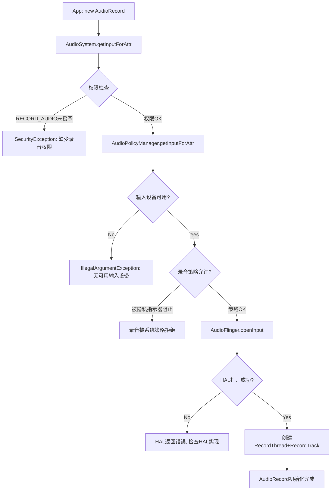
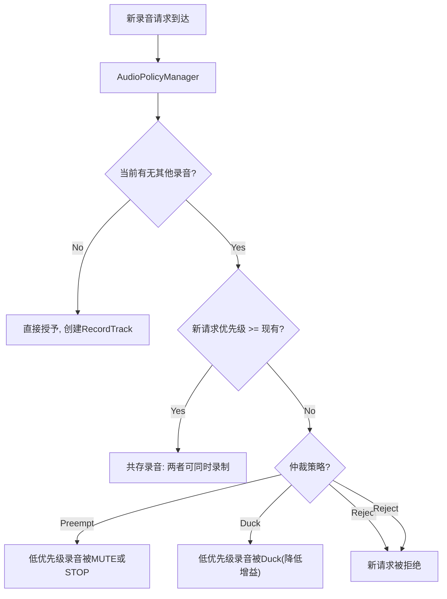
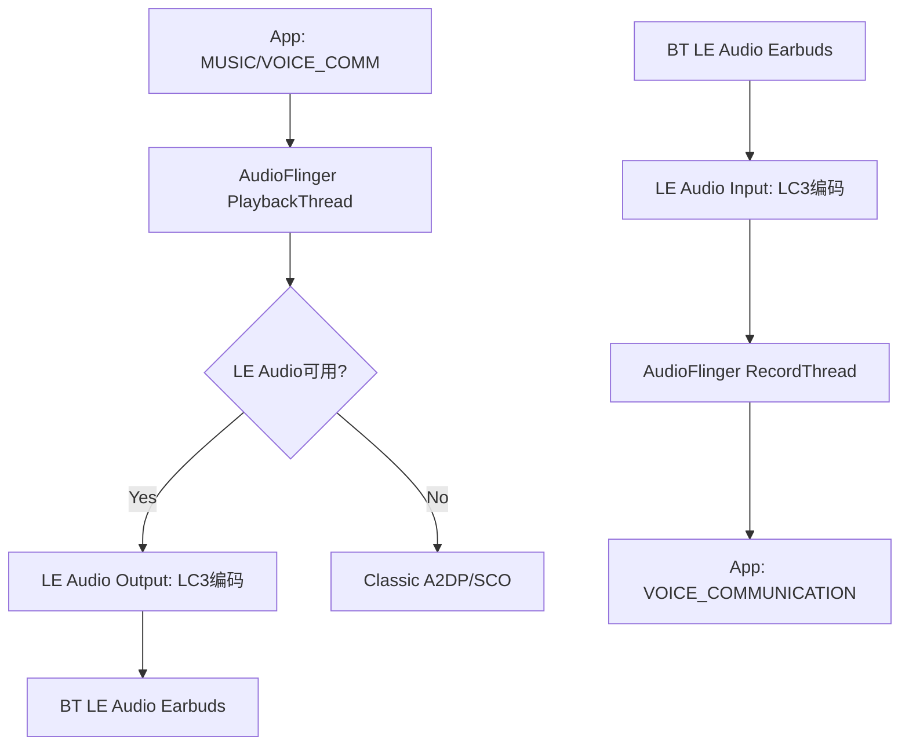

## O.11 录音问题调试

> [← 上一个](17_10.1_延迟调试深度指南.md) | [返回目录](README.md) | [下一个 →](17_12.1_HAL层调试.md)

---


O.11.1 AudioRecord创建与权限

录音问题通常从AudioRecord创建开始排查。

**AudioRecord创建流程与常见故障点**：



**录音权限检查清单**：

| 权限/策略 | 检查方法 | 失败症状 |
|-----------|---------|---------|
| RECORD_AUDIO权限 | `adb shell dumpsys package <pkg> \| grep RECORD_AUDIO` | SecurityException |
| 后台录音权限 | `adb shell appops get <pkg> RECORD_AUDIO` | 后台无法录音 |
| 隐私指示器 | `adb shell dumpsys audio \| grep "hotword\|privacy"` | 录音被静默拒绝 |
| Doze模式限制 | `adb shell deviceidle whitelist +<pkg>` | Doze期间无法录音 |
| AppOps模式 | `adb shell appops set <pkg> RECORD_AUDIO allow` | AppOps拒绝录音 |

O.11.2 录音仲裁与并发

Android 14引入了录音并发仲裁机制，多个App同时录音时需遵循优先级规则。

**录音仲裁优先级**（从高到低）：

| 优先级 | 音频源 | 说明 |
|--------|--------|------|
| 1 | VOICE_COMMUNICATION | VoIP通话，最高优先 |
| 2 | CAMCORDER | 相机录像 |
| 3 | VOICE_RECOGNITION | 语音助手 |
| 4 | MIC | 通用录音 |
| 5 | UNPROCESSED | 原始音频 |
| 6 | HOTWORD_DETECTION | 热词检测 |

**录音并发仲裁流程**：



**录音仲裁调试命令**：

```bash
# 查看当前活跃录音
adb shell dumpsys audio | grep -A10 "RecordThread"

# 查看录音Track详情
adb shell dumpsys audio | grep -A5 "Active Record"

# 查看录音仲裁日志
adb logcat -s AudioPolicyManager AudioFlinger | grep -i "capture\|record\|preempt"

# 查看App录音权限
adb shell dumpsys package <package> | grep RECORD_AUDIO
```

O.11.3 SCO音频调试

SCO（Synchronous Connection-Oriented）是蓝牙耳机语音通话的链路类型。

**SCO音频路径**：

flowchart LR
    A[App: VOICE_COMMUNICATION] --> B[AudioFlinger RecordThread]
    B --> C[Bluetooth SCO Input]
    C --> D[BT Headset Mic]
    
    E[App: VOICE_COMMUNICATION] --> F[AudioFlinger PlaybackThread]
    F --> G[Bluetooth SCO Output]
    G --> H[BT Headset Speaker]
    
    I[Telecom: CALL_AUDIO_MODE] --> J[AudioPolicyManager]
    J --> K["setMode(MODE_IN_COMMUNICATION)"]
    K --> L[激活SCO链路]
    K --> L[激活SCO链路]
```

**SCO调试命令**：

```bash
# 查看当前蓝牙音频模式
adb shell dumpsys bluetooth_manager | grep -i "sco\|audio"

# 查看音频模式
adb shell dumpsys audio | grep -i "mode\|sco\|bluetooth"

# 强制激活SCO
adb shell am broadcast -a android.bluetooth.headset.profile.action.CONNECTION_STATE_CHANGED

# 查看SCO音频路由
adb shell dumpsys audio | grep -A5 "Bluetooth"

# 监听SCO日志
adb logcat -s AudioPolicyManager BluetoothAudioManager | grep -i sco
```

**SCO常见问题与诊断**：

| 问题 | 症状 | 诊断 | 修复 |
|------|------|------|------|
| SCO未激活 | 通话无声 | 检查setMode是否为IN_COMMUNICATION | 确保Telecom正确设置模式 |
| SCO音频质量差 | 通话有杂音 | 检查SCO编码格式(PCM/CVSD) | 使用WBS(mSBC)编码 |
| SCO录音失败 | App无法通过BT录音 | 检查SCO Input设备 | 确保A2DP关闭后再开SCO |
| SCO路由错误 | 通话从Speaker输出 | 检查AudioPolicy路由规则 | 确保SCO设备优先级正确 |

O.11.4 LE Audio调试

LE Audio（Low Energy Audio）是蓝牙5.2+的新音频标准，支持LC3编码和多流。

**LE Audio音频路径**：



**LE Audio调试命令**：

```bash
# 查看LE Audio支持状态
adb shell dumpsys bluetooth_manager | grep -i "le_audio\|bass\|cap"

# 查看LE Audio音频路由
adb shell dumpsys audio | grep -i "le_audio\|hearing_aid\|a2dp"

# 查看LC3编码配置
adb shell dumpsys bluetooth_manager | grep -i "lc3\|codec"

# 查看LE Audio连接状态
adb shell dumpsys bluetooth_manager | grep -i "csip\|bass\|volume"

# 监听LE Audio日志
adb logcat -s BluetoothLeAudio BluetoothAudioManager | grep -i "le_audio\|lc3"
```

**LE Audio关键系统属性**：

| 属性 | 值 | 说明 |
|------|-----|------|
| `ro.bluetooth.leaudio.enable` | true/false | LE Audio开关 |
| `persist.bluetooth.leaudio.enabled` | 0/1 | 持久化LE Audio状态 |
| `bluetooth.core.le.audio.enabled` | true/false | 运行时LE Audio状态 |

**LE Audio vs Classic Audio对比**：

| 特性 | Classic A2DP | Classic SCO | LE Audio |
|------|-------------|-------------|----------|
| 编码 | SBC/AAC/LDAC | CVSD/mSBC | LC3 |
| 延迟 | 100-200ms | 30-50ms | 20-40ms |
| 音质 | 高 | 低 | 中高 |
| 功耗 | 高 | 中 | 低 |
| 多流 | 不支持 | 不支持 | 支持 |
| 广播 | 不支持 | 不支持 | 支持(Auracast) |

O.11.5 录音问题综合调试决策树

flowchart TB
    A[录音问题] --> B{AudioRecord创建成功?}
    B -->|No| C{错误类型?}
    B -->|Yes| D{录音数据有效?}
    
    C -->|SecurityException| C1[缺少RECORD_AUDIO权限]
    C -->|IllegalArgumentException| C2[无可用输入设备/参数无效]
    C -->|DeadObjectException| C3[AudioFlinger崩溃/重启]
    
    D -->|全是0或静音| D1{录音权限被限制?}
    D1 -->|Yes| D1a[检查AppOps和隐私指示器]
    D1 -->|No| D1b{HAL是否提供数据?}
    D1b -->|No| D1c[检查HAL Input Stream和Mic状态]
    D1b -->|Yes| D1d[检查RecordThread和Track增益]
    
    D -->|有数据但质量差| D2{问题类型?}
    D2 -->|噪音大| D2a[检查Audio Source, VOICE_RECOGNITION有HAL预处理]
    D2 -->|断断续续| D2b[检查overrun计数和线程调度]
    D2 -->|回声| D2c["检查AEC(Acoustic Echo Canceler)是否启用"]
    D2 -->|音量低| D2d[检查AudioSource增益和HAL预处理]
    
    D -->|开始后无数据| D3{start()调用成功?}
    D3 -->|No| D3a[检查焦点和权限]
    D3 -->|Yes| D3b{被高优先级录音抢占?}
    D3b -->|Yes| D3c[检查录音仲裁, 查看dumpsys audio]
    D3b -->|No| D3d[检查RecordThread是否活跃]
    
    D -->|蓝牙录音问题| D4{蓝牙类型?}
    D4 -->|Classic SCO| D4a[检查SCO链路激活和音频模式]
    D4 -->|LE Audio| D4b[检查LE Audio连接状态和LC3编码]
    D4 -->|A2DP| D4c[A2DP不支持录音, 需切换到SCO/LE]
    D4 -->|A2DP| D4c[A2DP不支持录音, 需切换到SCO/LE]
```

---

---

