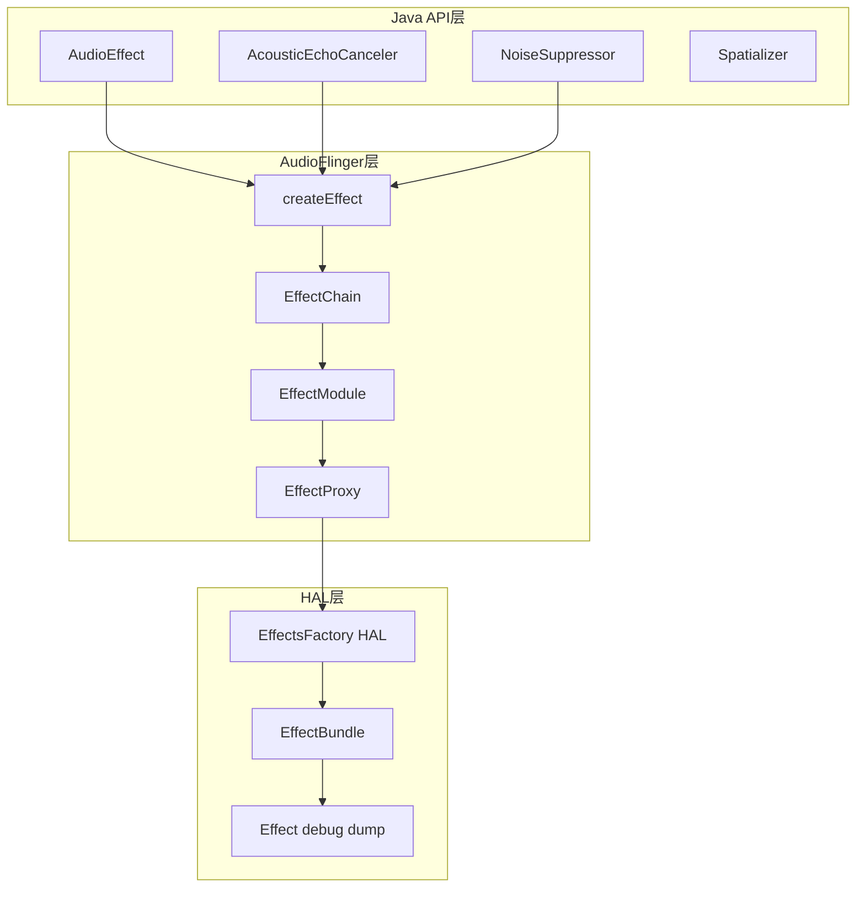
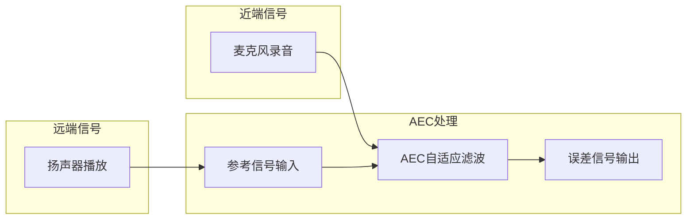
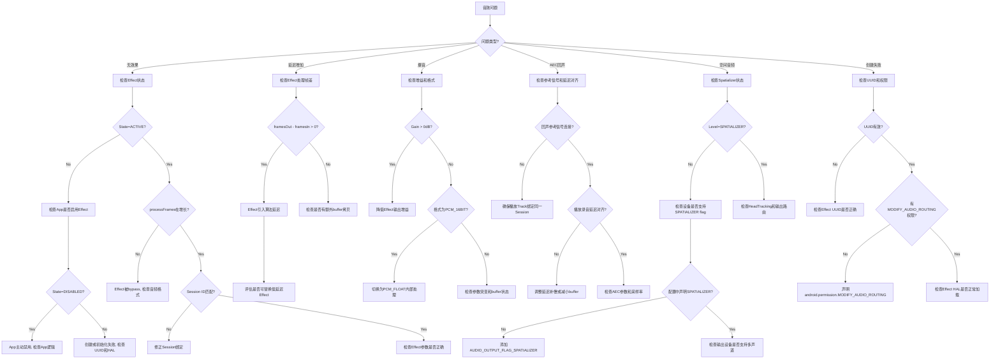

## 17.13 音效调试

> [← 上一个](17_12.1_HAL层调试.md) | [← 返回17章](README.md) | [返回导航](../README.md) | [下一个 →](17_14.1_OEM深度定制实战.md)

---

## 17.13.1 音效调试体系总览

Android音频效果框架涉及Java API层、AudioFlinger Effect引擎、HAL Effect模块三个层次。调试需关注Effect创建、Chain绑定、参数配置、数据流处理四个环节。



## 17.13.2 Effect创建流程与源码追踪

Effect从App创建到HAL执行经过多层调用（源码：[`AudioFlinger.cpp`](frameworks/av/services/audioflinger/AudioFlinger.cpp)）：

```
AudioEffect.java → AudioSystem.createEffect()
  → IAudioFlinger.createEffect()
    → AudioFlinger::createEffect()           // 行2798
      → PlaybackThread::addEffectChain_l()    // 创建Chain
      → EffectChain::addEffect_l()            // 添加Effect到Chain
        → EffectModule::create()              // 创建Effect实例
          → EffectProxy::create()             // 代理创建
            → EffectsFactory HAL → Effect Bundle
```

**关键调试日志**：

```bash
# 追踪Effect创建
adb logcat -s AudioFlinger | grep -E "createEffect|addEffect"

# 追踪Effect状态变更
adb logcat -s AudioFlinger | grep -E "EffectModule|EffectChain"

# 查看Effect创建失败原因
adb logcat -s AudioFlinger AudioPolicy | grep -i "effect.*fail\|effect.*error\|effect.*denied"
```

**Effect创建失败常见原因**：

| 错误码 | 含义 | 排查方向 |
|--------|------|----------|
| DEAD_OBJECT | Effect服务已死 | 检查HAL进程存活 |
| INVALID_OPERATION | 不支持的操作 | 检查Effect UUID是否正确 |
| BAD_VALUE | 参数值错误 | 检查Session ID / Priority |
| NO_INIT | Effect未初始化 | 检查HAL是否正常启动 |
| PERMISSION_DENIED | 权限不足 | 检查App是否有android.permission.MODIFY_AUDIO_ROUTING |

## 17.13.3 EffectChain Dump深度解读

EffectChain dump格式（源码：[`Effects.cpp`](frameworks/av/services/audioflinger/Effects.cpp) `EffectChain::dump()` 方法）：

```
N effects for session S
  In buffer [sizeInFrames x format]   Out buffer [sizeInFrames x format]   Active tracks: M
  Effect 0: [uuid] [name] [state] [N in] [N out] [processFrames]
```

**Effect状态枚举**（源码：[`EffectApi.h`](system/media/audio/include/system/audio_effect.h)）：

| 状态 | 值 | 含义 | dump显示 |
|------|-----|------|----------|
| ACTIVE | 1 | 正常处理音频数据 | active |
| INITIALIZED | 2 | 已创建但未启用 | init |
| DISABLED | 3 | App主动禁用 | disabled |
| UNINITIALIZED | 0 | 尚未创建 | uninit |

**Chain dump字段诊断**：

| 字段 | 含义 | 异常判定 |
|------|------|----------|
| N effects | Chain中Effect数量 | 为0表示无Effect生效 |
| session S | Session ID | 必须与Track Session匹配 |
| In buffer frames | 输入buffer大小 | 为0表示未连接 |
| Out buffer frames | 输出buffer大小 | 与In差异大表示格式转换 |
| Active tracks | 活跃Track数 | 为0表示无音频流过Chain |
| processFrames | 已处理帧数 | 不增长表示Effect未处理数据 |

**完整dump获取命令**：

```bash
# 获取所有Effect dump
adb shell dumpsys media.audio_flinger | grep -A 20 "effects for session"

# 获取特定Session的Effect
adb shell dumpsys media.audio_flinger | grep -A 20 "effects for session 1234"

# 获取Effect HAL dump
adb shell dumpsys android.hardware.audio.effect.IEffectsFactory/default
```

## 17.13.4 常见音效问题排查

### 音效无效果

| 排查项 | 检查方法 | 常见原因 |
|--------|----------|----------|
| Effect状态 | dump查看state字段 | state非ACTIVE |
| Session匹配 | 检查Effect与Track的Session ID | Session不匹配 |
| 音效参数 | 检查Effect参数设置 | 参数值异常 |
| 输入输出buffer | 检查In/Out buffer帧数 | buffer为0或未连接 |
| 音频格式 | 检查Effect支持的格式 | 格式不兼容导致bypass |
| Priority | 检查Effect优先级 | 被高优先级Effect抢占 |

**排查步骤**：

```bash
# 1. 确认Effect已创建
adb shell dumpsys media.audio_flinger | grep -A 5 "uuid.*<你的UUID>"

# 2. 确认Effect状态为ACTIVE
adb shell dumpsys media.audio_flinger | grep "state.*active"

# 3. 确认processFrames在增长
adb shell dumpsys media.audio_flinger | grep "processFrames" # 执行两次对比

# 4. 确认Session ID匹配
adb shell dumpsys media.audio_flinger | grep "session"
```

### 音效导致延迟增加

```bash
# 测量音效延迟 - 对比framesIn和framesOut差值
adb shell dumpsys media.audio_flinger | grep -A 3 "Effect"

# 检查是否有重采样
adb logcat -s AudioFlinger | grep "resample\|sample rate"
```

**延迟分析**：

| Effect类型 | 典型算法延迟 | 备注 |
|------------|-------------|------|
| AEC | 0-20ms | 取决于filter length |
| NS | 0-10ms | 取决于noise estimation |
| BassBoost | <1ms | IIR filter |
| Virtualizer | <5ms | HRTF处理 |
| Equalizer | <1ms | FIR/IIR filter |
| LoudnessEnhancer | <1ms | 增益处理 |
| Spatializer | 5-40ms | 取决于空间化算法 |

### 音效导致爆音

| 原因 | 表现 | 解决方法 |
|------|------|----------|
| Gain过大 | 爆音伴随音量过大 | 降低Effect输出增益 |
| 格式溢出 | PCM_16_BIT截断 | 使用PCM_FLOAT内部处理 |
| 参数突变 | 参数变化时出现杂音 | 参数渐变过渡 |
| Buffer underrun | 间歇性爆音 | 增大Effect buffer |
| 采样率不匹配 | 持续杂音 | 确认输入输出采样率一致 |

## 17.13.5 AEC/NS深度调试

AEC（Acoustic Echo Cancelation）和NS（Noise Suppression）是语音通信的关键音效。

**AEC工作原理**：AEC需要参考信号（远端播放）和近端信号（麦克风录音），通过自适应滤波消除回声。



```bash
# 查看AEC/NS效果状态
adb shell dumpsys audio | grep -A 5 "echo_cancel\|noise_suppression"

# 启用AEC debug日志
adb shell setprop persist.audio.fx.aec.debug 1

# 强制启用AEC/NS
adb shell setprop audioflinger.enable_aec 1

# 查看AEC HAL实现
adb shell lshal | grep echo
```

**AEC调试要点**：

| 检查项 | 说明 | 预期 |
|--------|------|------|
| 回声参考信号 | 播放Track是否连接到AEC | 播放信号应作为参考 |
| 延迟对齐 | 播放和录音延迟差 | 延迟差应小于AEC可处理范围 |
| 采样率匹配 | 播放和录音采样率一致 | 16kHz最优 |
| Session绑定 | AEC与播放/录音同一Session | Session ID必须一致 |
| 信号电平 | 参考信号和近端信号电平 | 电平差异不能太大 |

**AEC参考信号连接机制**（源码：[`AudioFlinger.cpp`](frameworks/av/services/audioflinger/AudioFlinger.cpp)）：

```
PlaybackThread::addEffectChain_l()
  → EffectChain::setEffectSuspended(false)
  → 播放Track的Session ID与AEC的Session ID一致时
    → AudioFlinger自动将播放数据作为参考信号
    → 通过EffectChain::process_l()传递给AEC HAL
```

**AEC常见故障**：

| 故障现象 | 根因 | 解决方法 |
|----------|------|----------|
| 回声未被消除 | 参考信号未连接 | 确认Session ID一致 |
| 回声消除不完全 | 延迟对齐偏差 | 减小播放/录音buffer |
| 声音断续 | AEC处理耗时过长 | 使用硬件AEC或优化算法 |
| 近端声音被抑制 | AEC过度收敛 | 调整AEC参数 |

**NS调试**：

```bash
# 查看NS类型
adb shell dumpsys audio | grep -i "noise"

# NS参数调整
adb shell setprop persist.audio.fx.ns.level 2  # 0=off, 1=low, 2=medium, 3=high
```

| NS Level | 噪声抑制强度 | 副作用 |
|----------|-------------|--------|
| 0 | 关闭 | 无 |
| 1 | 轻度 | 轻微语音失真 |
| 2 | 中度 | 一定语音失真 |
| 3 | 强力 | 明显语音失真 |

## 17.13.6 Spatializer调试

AOSP14的Spatializer支持空间音频（源码：[`Spatializer.cpp`](frameworks/av/services/audiopolicy/service/Spatializer.cpp)）。

```bash
# 查看Spatializer状态
adb shell dumpsys audio | grep -A 10 "Spatializer"

# 检查是否支持Spatializer
adb shell dumpsys media.audio_flinger | grep "spatializer"

# 启用/禁用Spatializer
adb shell settings put system spatial_audio_enabled 1

# 查看Spatializer支持的级别
adb shell dumpsys audio | grep "spatializer.*level"
```

**Spatializer关键调试点**：

| 字段 | 含义 | 调试关注点 |
|------|------|------------|
| Level | 空间音频级别 | NONE/SPATIALIZER确认功能激活 |
| HeadTracking | 头部追踪状态 | 蓝牙LE头部追踪器连接 |
| Channel Mask | 输出通道掩码 | 确认支持多声道输出 |
| Output stream | 关联的输出流 | 确认路由到正确设备 |
| MMAP mode | 是否使用MMAP | 影响延迟 |

**Spatializer激活条件**：

1. 设备声明`AUDIO_OUTPUT_FLAG_SPATIALIZER`（源码：[`audio_policy_configuration.xml`](frameworks/av/services/audiopolicy/config/primary_audio_policy_configuration.xml)）
2. 输出设备支持多声道（至少立体声）
3. App请求`AudioAttributes.USAGE_MEDIA`且设置空间化标志
4. 蓝牙设备需支持LE Audio或头追踪

**Spatializer dump字段解读**：

```
Spatializer:
  Level: SPATIALIZER     ← 活跃级别
  Head tracking: ENABLED ← 头追踪是否启用
  Output: 2              ← 关联的输出线程ID
  Channel mask: 0x3      ← 输出通道掩码（立体声）
  Active tracks: 1       ← 活跃的空间化Track数
```

## 17.13.7 Device Effect调试

AOSP14支持设备级Effect（Device Effect），通过`DeviceEffectProxy`代理，绑定到特定音频设备而非Session。

**Device Effect vs Session Effect**：

| 特性 | Session Effect | Device Effect |
|------|---------------|---------------|
| 绑定对象 | Session ID | 音频设备 |
| 作用范围 | 同Session的所有Track | 路由到该设备的所有音频 |
| 创建方式 | AudioEffect(session) | AudioEffect(device) |
| 典型用例 | AEC/NS | 扬声器均衡/保护 |
| 代理类 | EffectProxy | DeviceEffectProxy |

```bash
# 查看Device Effect
adb shell dumpsys media.audio_flinger | grep -A 5 "DeviceEffect"

# 创建Device Effect
adb shell am broadcast -a android.media.action.DEVICE_EFFECT_ADD \
  --ei deviceType 2 --es effectUuid "<uuid>"
```

**DeviceEffectProxy源码路径**：[`AudioFlinger.cpp`](frameworks/av/services/audioflinger/AudioFlinger.cpp)

Device Effect创建流程：
```
AudioFlinger::createEffect()
  → 检测deviceType参数不为空
    → 创建DeviceEffectProxy
      → 绑定到指定音频设备的Output Thread
        → 当音频路由到该设备时自动激活Effect
```

## 17.13.8 Effect HAL调试

Effect HAL（AIDL接口：`hardware/interfaces/audio/effect/`）提供音效的硬件加速实现。

```bash
# 查看Effect HAL服务
adb shell lshal | grep effect

# Effect HAL debug dump
adb shell dumpsys android.hardware.audio.effect.IEffectsFactory/default

# 查看所有已注册的Effect UUID
adb shell dumpsys media.audio_flinger | grep "uuid"
```

**Effect HAL注册检查**：

```bash
# 检查Effect HAL是否正常启动
adb logcat -s EffectsFactory | grep -E "load\|register\|init"

# 检查Effect库加载
adb logcat | grep "audio.*effect.*lib" | grep -E "load\|open"

# 常见Effect UUID
```

**标准Effect UUID对照**：

| Effect | UUID | 类型 |
|--------|------|------|
| AEC | ec7178ec-e518-4423-9c91-a2b6b4e1e6be | PreProcessing |
| NS | c0c69430-11e5-4ee3-af3f-d638d58c5de6 | PreProcessing |
| BassBoost | 0634f220-ddd4-11db-a0fc-0002a5d5c51b | PostProcessing |
| Virtualizer | 37cc2c00-dddd-11db-8577-0002a5d5c51b | PostProcessing |
| Equalizer | 0bed4300-ddd6-11db-8f34-0002a5d5c51b | PostProcessing |
| LoudnessEnhancer | fe3199be-aed0-413f-87bb-11260eb63cf1 | PostProcessing |
| DynamicsProcessing | e4d37040-e518-4423-9c91-a2b6b4e1e6be | Insert |

## 17.13.9 音效调试命令速查

| 场景 | 命令 | 说明 |
|------|------|------|
| Effect dump | `dumpsys media.audio_flinger \| grep -A 20 "effects for session"` | 所有Effect状态 |
| Effect HAL dump | `dumpsys android.hardware.audio.effect.IEffectsFactory/default` | HAL层Effect |
| 创建追踪 | `logcat -s AudioFlinger \| grep createEffect` | Effect创建日志 |
| AEC调试 | `setprop persist.audio.fx.aec.debug 1` | AEC详细日志 |
| NS级别 | `setprop persist.audio.fx.ns.level 2` | NS抑制级别 |
| Spatializer | `settings put system spatial_audio_enabled 1` | 空间音频开关 |
| Effect服务 | `lshal \| grep effect` | HAL服务状态 |
| UUID查询 | `dumpsys media.audio_flinger \| grep uuid` | 已注册Effect |

## 17.13.10 音效调试决策树



---

[← 上一个](17_12.1_HAL层调试.md) | [← 返回17章](README.md) | [返回导航](../README.md) | [下一个 →](17_14.1_OEM深度定制实战.md)