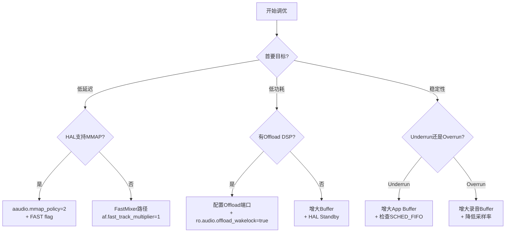

## 17.15 AudioFlinger Tunable参数

> [← 上一个](17_14.1_OEM深度定制实战.md) | [← 返回17章](README.md) | [返回导航](../README.md)

---

## 17.15.1 Property参数体系总览

AudioFlinger通过Android系统属性（Property）在运行时控制关键行为。这些属性分为编译时属性（`ro.*`前缀，需烧写后生效）和运行时属性（可动态设置）。理解每个Property的源码读取位置、默认值和生效范围是精确调优的前提。

```mermaid
graph TB
    subgraph 编译时属性
        MFT[ro.audio.max_fast_tracks]
        FST[ro.audio.flinger_standbytime_ms]
        SIL[ro.audio.silent]
        CHS[ro.af.client_heap_size_kbyte]
        OWL[ro.audio.offload_wakelock]
    end
    subgraph 运行时属性
        FTM[af.fast_track_multiplier]
        ATT[af.thread.throttle]
        APP[af.patch_park]
        TEE[af.tee]
    end
    subgraph AAudio属性
        MMP[aaudio.mmap_policy]
        MME[aaudio.mmap_exclusive_policy]
        MB[aaudio.mixer_bursts]
        HBM[aaudio.hw_burst_min_usec]
    end
    subgraph 配置文件参数
        APC[audio_policy_configuration.xml]
        APE[audio_policy_engine_configuration.xml]
        APV[audio_policy_volumes.xml]
    end
    MFT --> FastMixer
    FTM --> FastMixer
    MMP --> AAudioMMAP
    TEE --> DebugTee
    APC --> HALConfig
```



## 17.15.2 核心调试Property详解

### af.fast_track_multiplier

**源码位置**：[`Threads.cpp`](frameworks/av/services/audioflinger/Threads.cpp:296)

```cpp
static const int kFastTrackMultiplier = property_get_int32("af.fast_track_multiplier", 1);
if (kFastTrackMultiplier < 1 || kFastTrackMultiplier > 2) {
    kFastTrackMultiplier = 1;
}
```

| 参数 | 说明 |
|------|------|
| 默认值 | 1 |
| 有效范围 | 1-2 |
| 生效时机 | AudioFlinger启动时读取 |
| 影响范围 | FastMixer的sub-mix buffer数量 |

**调优场景**：

| 值 | 效果 | 适用场景 |
|----|------|----------|
| 1 | 每个Fast Track占1个burst | 最低延迟（推荐） |
| 2 | 每个Fast Track占2个burst | 更多容错空间，但延迟翻倍 |

**设置命令**：

```bash
# 设置Fast Track倍数
adb shell setprop af.fast_track_multiplier 2
# 需要重启audioserver生效
adb shell killall audioserver
```

### af.thread.throttle

**源码位置**：[`Threads.cpp`](frameworks/av/services/audioflinger/Threads.cpp:3175)

```cpp
static const bool kEnableThrottle = property_get_bool("af.thread.throttle", true);
```

**行为说明**：当启用时，MixerThread在每次混音循环后会短暂sleep，避免CPU占用过高。禁用后MixerThread会连续运行，延迟更低但功耗增加。

| 值 | CPU占用 | 延迟 | 适用场景 |
|----|---------|------|----------|
| true | 节流，CPU友好 | 略高（~1ms） | 日常使用（推荐） |
| false | 全速运行 | 最低 | 延迟调试、性能基准测试 |

### af.patch_park

**源码位置**：[`Threads.cpp`](frameworks/av/services/audioflinger/Threads.cpp:4740)

```cpp
static const int kPatchParkTimeoutMs = property_get_int32("af.patch_park", 0);
```

**行为说明**：控制Patch创建/销毁时的等待行为。非零值表示在Patch操作时暂停线程，用于调试Patch连接问题。

| 值 | 行为 | 适用场景 |
|----|------|----------|
| 0（默认） | 不暂停 | 正常运行 |
| N > 0 | 暂停N毫秒 | 调试Patch时序问题 |

### af.tee

**源码位置**：[`NBAIO_Tee.h`](frameworks/av/services/audioflinger/NBAIO_Tee.h:182)

```cpp
// 仅在ro.debuggable=true时生效
static const int kTee = property_get_int32("af.tee", 0);
```

**行为说明**：控制NBAIO（Non-Blocking Audio I/O）数据记录。Tee功能将AudioFlinger输入/输出的PCM数据写入环形缓冲区，可通过`dumpsys`导出为WAV文件进行分析。

| 值 | 记录内容 | 存储开销 |
|----|----------|----------|
| 0 | 不记录 | 0 |
| 1 | 仅输入流 | ~1.5MB/min@48kHz/stereo |
| 2 | 仅输出流 | ~1.5MB/min@48kHz/stereo |
| 3 | 输入+输出 | ~3MB/min@48kHz/stereo |

**导出Tee数据**：

```bash
# 启用Tee记录
adb shell setprop af.tee 3
adb shell killall audioserver

# 等待播放一段时间后导出
adb shell dumpsys media.audio_flinger --dump-teedata /data/misc/audioserver/tee_dump.wav

# 拉取文件
adb pull /data/misc/audioserver/tee_dump.wav
```

> **重要**：`af.tee`仅在`ro.debuggable=true`的userdebug/eng版本生效，user版本编译时会自动忽略。

## 17.15.3 编译时Property详解

### ro.audio.max_fast_tracks

**源码位置**：[`FastMixerState.cpp`](frameworks/av/services/audioflinger/FastMixerState.cpp)

```cpp
static const int kMaxFastTracks = property_get_int32("ro.audio.max_fast_tracks", 4);
```

| 参数 | 说明 |
|------|------|
| 默认值 | 4 |
| 建议值 | 8（车载多音区） |
| 生效时机 | 编译时写入build.prop |

**Fast Track数量与延迟的关系**：

```
FastMixer Buffer = max(kFastTrackMultiplier × activeFastTracks, 2) × burstSize

示例（burstSize=96, multiplier=1）：
  1 Fast Track: max(1×1, 2) × 96 = 192 frames ≈ 4ms
  2 Fast Tracks: max(1×2, 2) × 96 = 192 frames ≈ 4ms
  4 Fast Tracks: max(1×4, 2) × 96 = 384 frames ≈ 8ms
  8 Fast Tracks: max(1×8, 2) × 96 = 768 frames ≈ 16ms
```

### ro.audio.flinger_standbytime_ms

**源码位置**：[`AudioFlinger.cpp`](frameworks/av/services/audioflinger/AudioFlinger.cpp:395)

```cpp
uint32_t standbyTimeMs = property_get_int32("ro.audio.flinger_standbytime_ms", 3000);
mStandbyTimeNs = standbyTimeMs * 1000000LL;
```

**Standby时序**：

```
最后一个Track停止
    │
    ├──[3秒默认等待]──→ 进入Standby
    │                     │
    │                     └──→ 调用HAL standby()
    │                           │
    │                           └──→ DSP进入低功耗模式
    │
    └──[新Track启动]──→ 立即退出Standby
```

| 场景 | 建议值 | 理由 |
|------|--------|------|
| 手机 | 3000ms | 默认，平衡功耗和响应 |
| 车载 | 5000-10000ms | 避免频繁进出Standby产生噪声 |
| 平板 | 3000ms | 默认 |
| 低功耗模式 | 1000ms | 快速省电 |

### ro.audio.silent

**源码位置**：[`Threads.cpp`](frameworks/av/services/audioflinger/Threads.cpp:3411)

```cpp
static const bool kSilent = property_get_bool("ro.audio.silent", false);
```

当设为true时，AudioFlinger的所有输出静音（写入零数据），仅用于自动化测试。

### ro.af.client_heap_size_kbyte

**源码位置**：[`AudioFlinger.cpp`](frameworks/av/services/audioflinger/AudioFlinger.cpp:2798)

```cpp
size_t clientHeapSizeKbyte = property_get_int32("ro.af.client_heap_size_kbyte", 0);
```

| 值 | 行为 | 适用场景 |
|----|------|----------|
| 0 | 自动计算（默认） | 通用 |
| 4096 | 固定4MB堆 | 多并发Track |
| 8192 | 固定8MB堆 | 专业音频应用 |

**自动计算逻辑**：

```
默认堆大小 = max(2MB, numTracks × trackBufferSize)
```

### ro.audio.offload_wakelock

**源码位置**：[`Threads.cpp`](frameworks/av/services/audioflinger/Threads.cpp:7114)

```cpp
static const bool kEnableOffloadWakelock = property_get_bool(
    "ro.audio.offload_wakelock", true);
```

| 值 | 行为 | 风险 |
|----|------|------|
| true | Offload播放时持有wakelock | 功耗略高，但播放稳定 |
| false | Offload播放时释放wakelock | 省电，但CPU可能休眠导致播放中断 |

## 17.15.4 AAudio Property详解

### aaudio.mmap_policy

**源码位置**：[`PropertyUtils.cpp`](frameworks/av/services/audioflinger/PropertyUtils.cpp)

```cpp
int32_t MmapPolicy = property_get_int32("aaudio.mmap_policy", 2);  // AUTO
```

| 值 | 常量 | 行为 |
|----|------|------|
| 1 | NEVER | 永不使用MMAP，走AudioFlinger标准路径 |
| 2 | AUTO | HAL支持时自动使用MMAP（推荐） |
| 3 | ALWAYS | 强制使用MMAP，HAL不支持则失败 |

### aaudio.mmap_exclusive_policy

**源码位置**：[`PropertyUtils.cpp`](frameworks/av/services/audioflinger/PropertyUtils.cpp)

```cpp
int32_t MmapExclusivePolicy = property_get_int32("aaudio.mmap_exclusive_policy", 2);
```

| 值 | 行为 |
|----|------|
| 1 | 永不独占 |
| 2 | 自动选择（推荐） |
| 3 | 强制独占 |

### aaudio.mixer_bursts

```cpp
int32_t MixerBursts = property_get_int32("aaudio.mixer_bursts", 2);
```

控制AAudio MMAP流的mixer buffer大小（以burst为单位）。值越小延迟越低，但underrun风险越大。

### aaudio.hw_burst_min_usec

```cpp
int32_t HwBurstMin_usec = property_get_int32("aaudio.hw_burst_min_usec", 0);
```

硬件burst最小时长（微秒）。0表示使用HAL报告的默认值。

## 17.15.5 HAL层调试Property

| Property | 默认值 | 说明 | 典型用途 |
|----------|--------|------|----------|
| `persist.vendor.audio.hal.debug` | 0 | HAL debug级别 | 0=无, 1=基本, 2=详细, 3=全部 |
| `persist.vendor.audio.core.debug` | 0 | AIDL Core Module debug | 调试IModule接口调用 |
| `vendor.audio.hal.open.trace` | false | 追踪open/close | 排查设备打开失败 |
| `vendor.audio.hal.write.trace` | false | 追踪write/read | 排查数据流问题 |
| `vendor.audio.hal.period.trace` | false | 追踪周期时间 | 排查时序问题 |
| `audiohal.hal_24bit` | false | 强制24bit输出 | 测试高精度路径 |

```bash
# 启用HAL详细日志
adb shell setprop persist.vendor.audio.hal.debug 2
adb shell setprop vendor.audio.hal.write.trace true

# 启用后重启HAL
adb shell killall android.hardware.audio.core.IModule-service
```

## 17.15.6 配置文件可调参数

### audio_policy_configuration.xml

| 参数 | 位置 | 说明 | 调优建议 |
|------|------|------|----------|
| `samplingRates` | mixPort profile | Mix线程采样率 | 包含48000满足大多数场景 |
| `format` | mixPort profile | 音频格式 | PCM_16_BIT通用；PCM_FLOAT高精度 |
| `channelMasks` | mixPort profile | 通道掩码 | STEREO最常用 |
| `flags` | mixPort | 输出标志 | FAST标志启用低延迟路径 |
| `minDurationMs` | offload profile | Offload最小时长 | 太小导致频繁开关Offload |
| `gain` | devicePort | 增益配置 | 确保覆盖实际硬件范围 |
| `role` | mixPort/devicePort | 端口角色 | source=输出, sink=输入 |

### audio_policy_engine_configuration.xml

| 参数 | 说明 | 调优建议 |
|------|------|----------|
| ProductStrategy顺序 | 策略优先级排序 | 高优先级策略优先路由 |
| VolumeGroup映射 | 音量组到Stream映射 | 确保每组有合理曲线 |
| Criteria定义 | 策略决策条件 | OEM可扩展自定义条件 |
| defaultDevice | 策略默认设备 | 确保默认设备存在 |

### audio_policy_volumes.xml

| 参数 | 说明 | 调优建议 |
|------|------|----------|
| point坐标 | 音量曲线控制点 | 低段间距大，高段间距小 |
| deviceCategory | 设备分类 | HEADSET/SPEAKER/EARPIECE |
| ref流 | 参考曲线 | 可引用已定义曲线 |

## 17.15.7 参数调整效果对比

### 延迟优化对比（48kHz/2ch/16bit）

| 配置 | Buffer Size | AF延迟 | 总延迟(估) |
|------|-------------|--------|-----------|
| Normal Mixer (burst=4) | 768 frames | ~16ms | ~30-40ms |
| Normal Mixer (burst=2) | 384 frames | ~8ms | ~20-25ms |
| Fast Mixer (multiplier=1) | 192 frames | ~4ms | ~10-15ms |
| Fast Mixer (multiplier=2) | 384 frames | ~8ms | ~15-20ms |
| AAudio MMAP Shared | 96 frames | ~2ms | ~5-8ms |
| AAudio MMAP Exclusive | 96 frames | ~2ms | ~3-5ms |

### 功耗优化对比

| 配置 | CPU占用 | 功耗 | 说明 |
|------|---------|------|------|
| PCM Normal Mixer | 100%（基准） | 高 | 所有混合在CPU执行 |
| PCM Fast Mixer | ~80% | 中高 | Fast路径减少拷贝 |
| Offload Compressed | ~5% | 极低 | DSP解码，CPU仅控制 |
| MMAP Exclusive | ~10% | 低 | 绕过AF混合 |
| Standby | ~0% | 最低 | DSP低功耗模式 |

## 17.15.8 参数调优决策树



## 17.15.9 快速调优命令集

```bash
# === 延迟优化 ===
# 启用MMAP低延迟
adb shell setprop aaudio.mmap_policy 2
# 减少Fast Track倍数
adb shell setprop af.fast_track_multiplier 1
# 禁用线程节流
adb shell setprop af.thread.throttle false
# 重启生效
adb shell killall audioserver

# === 功耗优化 ===
# 启用Offload wakelock
adb shell setprop ro.audio.offload_wakelock true
# 设置Standby超时
adb shell setprop ro.audio.flinger_standbytime_ms 3000

# === 调试模式 ===
# 启用Tee数据记录
adb shell setprop af.tee 3
adb shell killall audioserver
# 导出Tee数据
adb shell dumpsys media.audio_flinger --dump-teedata /data/misc/audioserver/tee.wav
adb pull /data/misc/audioserver/tee.wav

# === HAL调试 ===
adb shell setprop persist.vendor.audio.hal.debug 2
adb shell setprop vendor.audio.hal.write.trace true
```

## 17.15.10 Property完整速查表

| Property | 类型 | 默认值 | 范围 | 源码位置 |
|----------|------|--------|------|----------|
| `af.fast_track_multiplier` | 运行时 | 1 | 1-2 | Threads.cpp:296 |
| `af.thread.throttle` | 运行时 | true | bool | Threads.cpp:3175 |
| `af.patch_park` | 运行时 | 0 | 0-N(ms) | Threads.cpp:4740 |
| `af.tee` | 运行时 | 0 | 0-3 | NBAIO_Tee.h:182 |
| `ro.audio.max_fast_tracks` | 编译时 | 4 | 1-32 | FastMixerState.cpp |
| `ro.audio.flinger_standbytime_ms` | 编译时 | 3000 | 0-N | AudioFlinger.cpp:395 |
| `ro.af.client_heap_size_kbyte` | 编译时 | 0 | 0-N | AudioFlinger.cpp:2798 |
| `ro.audio.silent` | 编译时 | false | bool | Threads.cpp:3411 |
| `ro.audio.offload_wakelock` | 编译时 | true | bool | Threads.cpp:7114 |
| `aaudio.mmap_policy` | 运行时 | 2 | 1-3 | PropertyUtils.cpp |
| `aaudio.mmap_exclusive_policy` | 运行时 | 2 | 1-3 | PropertyUtils.cpp |
| `aaudio.mixer_bursts` | 运行时 | 2 | 1-N | PropertyUtils.cpp |
| `aaudio.hw_burst_min_usec` | 运行时 | 0 | 0-N | PropertyUtils.cpp |
| `persist.vendor.audio.hal.debug` | 持久化 | 0 | 0-3 | Vendor HAL |
| `vendor.audio.hal.open.trace` | 运行时 | false | bool | Vendor HAL |
| `vendor.audio.hal.write.trace` | 运行时 | false | bool | Vendor HAL |

---

[← 上一个](17_14.1_OEM深度定制实战.md) | [← 返回17章](README.md) | [返回导航](../README.md)