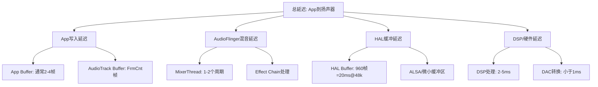
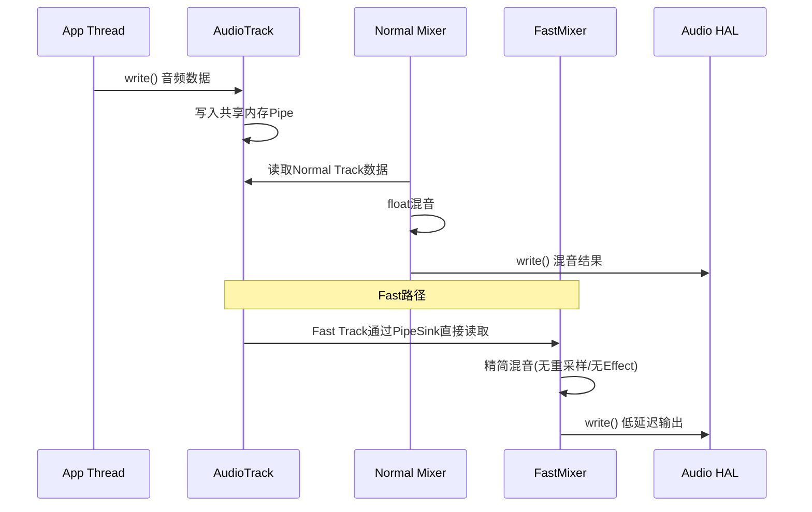
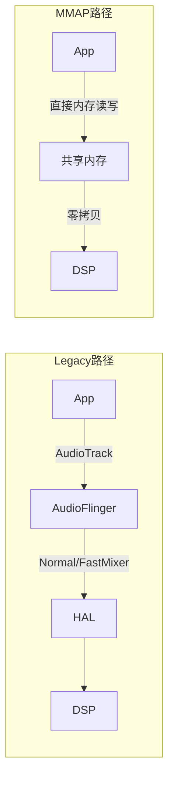
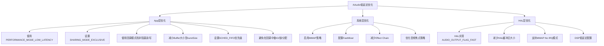
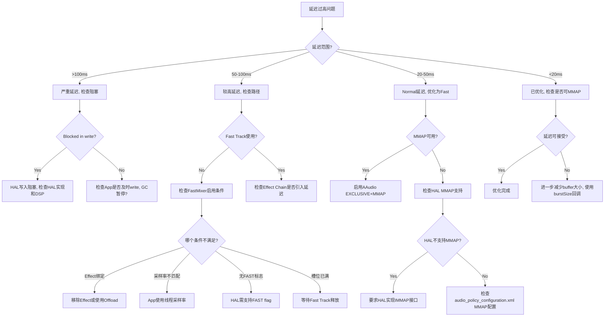

## 17.10 延迟调试深度指南

> [← 上一个](17_17.9_AudioPolicy配置验证.md) | [返回目录](README.md) | [下一个 →](17_17.11_录音问题调试.md)

---


### 17.10.1 延迟组成与测量

**Android音频延迟分层模型**：



**各层延迟参考值**：

| 延迟层 | 典型值 | Fast路径值 | MMAP路径值 | 影响因素 |
|--------|--------|-----------|-----------|---------|
| App写入 | 2-5ms | 1-2ms | <1ms | Buffer大小 |
| AudioFlinger混音 | 10-20ms | 2-4ms | 0ms(绕过) | 线程周期数 |
| HAL缓冲 | 10-20ms | 2-4ms | <3ms | HAL buffer配置 |
| DSP/硬件 | 2-5ms | 2-5ms | 2-5ms | 硬件实现 |
| **总计** | **24-50ms** | **7-15ms** | **<10ms** | - |

### 17.10.2 FastMixer延迟优化

FastMixer是Android低延迟音频的核心组件，运行在SCHED_FIFO实时线程上。

**FastMixer工作原理**：



**FastMixer启用条件**（全部满足）：

| 条件 | 检查方法 | 不满足时后果 |
|------|---------|------------|
| AudioTrack set PERFORMANCE_MODE_LOW_LATENCY | 检查App代码 | 回退到Normal Mixer |
| 采样率=线程采样率 | dumpsys audio | 回退到Normal Mixer |
| 格式=PCM_FLOAT或PCM_16_BIT | dumpsys audio | 回退到Normal Mixer |
| 通道=STEREO或MONO | dumpsys audio | 回退到Normal Mixer |
| 无Effect绑定到该Session | dumpsys audio Effect Chain | 回退到Normal Mixer |
| Fast Track槽位可用 | dumpsys audio availMask | 等待槽位释放 |
| HAL支持AUDIO_OUTPUT_FLAG_FAST | 检查HAL实现 | FastMixer不创建 |

**FastMixer dump关键字段**：

```
FastMixer status: active
Max phase increment: 0 (no SRC)
SquaredHopCount: 0
Measured latency: 8.5ms
Measured warmup: 2ms
```

| 字段 | 含义 | 正常值 | 异常关注 |
|------|------|--------|---------|
| status | FastMixer状态 | active | standby=idle, idle=未激活 |
| Max phase increment | 最大相位增量 | 0=无重采样 | >0=有SRC, 增加延迟 |
| SquaredHopCount | 跳帧计数 | 0 | >0=数据供应不及时 |
| Measured latency | 实测延迟 | <10ms | >20ms=延迟过高 |
| Measured warmup | 预热耗时 | <3ms | >5ms=调度不及时 |

### 17.10.3 MMAP低延迟路径

MMAP（Memory Map）模式是AAudio的低延迟模式，绕过AudioFlinger直接与HAL/DSP通信。

**MMAP vs Legacy路径对比**：



**MMAP启用条件**：

| 条件 | 检查方法 | 说明 |
|------|---------|------|
| HAL支持MMAP | `dumpsys audio \| grep MMAP` | 检查audio_policy_configuration.xml |
| AAudio使用LOW_LATENCY | App代码 | `setPerformanceMode(PERFORMANCE_MODE_LOW_LATENCY)` |
| DSP支持共享内存 | HAL实现 | 需HAL实现IMMAP接口 |
| 独占模式可用 | `AAudio_isMMapSupported()` | 检查系统属性 |

**MMAP调试命令**：

```bash
# 检查MMAP是否支持
adb shell dumpsys audio | grep -i mmap

# 查看MMAP Thread状态
adb shell dumpsys audio | grep -A20 "MmapThread"

# 检查AAudio MMAP策略
adb shell getprop aaudio.mmap_policy

# 检查MMAP共享内存
adb shell cat /proc/asound/card*/pcm*/sub*/hw_params

# 强制MMAP策略
adb shell setprop aaudio.mmap_policy 2  # 0=never, 1=auto, 2=always
```

**MMAP策略属性**：

| 属性值 | 策略 | 行为 |
|--------|------|------|
| 0 | NEVER | 永不使用MMAP |
| 1 | AUTO | 系统自动选择（默认） |
| 2 | ALWAYS | 优先使用MMAP |

### 17.10.4 AAudio延迟优化

AAudio是Android低延迟音频API，支持共享和独占模式。

**AAudio延迟优化清单**：



**AAudio性能模式对比**：

| 模式 | 延迟 | CPU | 兼容性 | 适用场景 |
|------|------|-----|--------|---------|
| PERFORMANCE_MODE_NONE | 20-50ms | 低 | 高 | 普通播放 |
| PERFORMANCE_MODE_LOW_LATENCY | 10-20ms | 中 | 中 | 音乐App |
| PERFORMANCE_MODE_LOW_LATENCY+EXCLUSIVE | <10ms | 高 | 低 | 专业音频/游戏 |

**AAudio延迟测量API**：

```java
// 获取输出延迟估计
AudioStream stream = ...;
AudioStreamState state = stream.getState();
if (state == AudioStreamState.OPEN) {
    // 获取框架延迟（App到AudioFlinger）
    int frameworkLatency = stream.getFramesWritten() - stream.getFramesRead();
    // 获取HAL延迟
    // 注：AAudio不直接提供HAL延迟，需通过timestamp计算
}
```

### 17.10.5 延迟问题调试决策树



---

