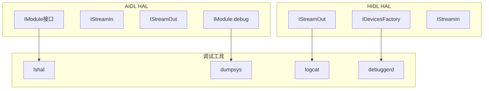
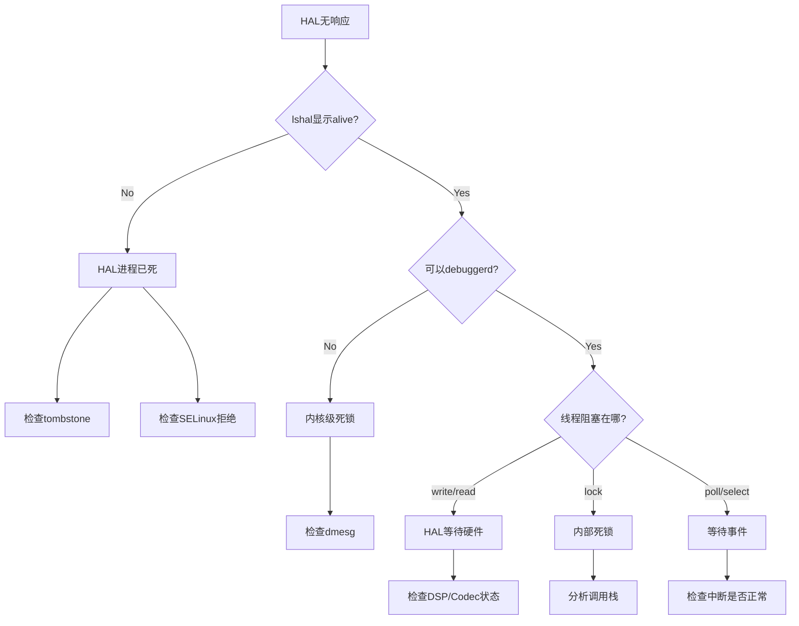
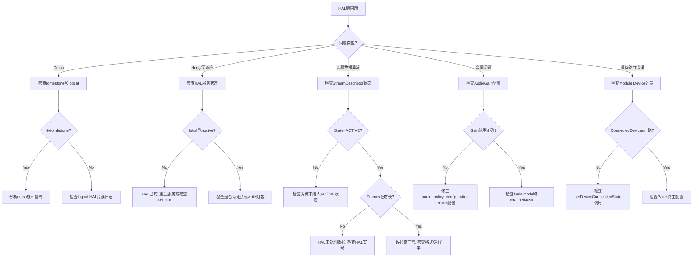

## 17.12 HAL层调试

> [← 上一个](17_17.11_录音问题调试.md) | [← 返回17章](README.md) | [返回导航](../README.md) | [下一个 →](17_17.13_音效调试.md)

---

## 17.12.1 HAL调试体系总览

Audio HAL是Android音频框架与硬件之间的桥梁。AOSP14支持AIDL和HIDL两种HAL接口，调试方法有所不同。



## 17.12.2 AIDL HAL Debug日志

AOSP14音频HAL以AIDL接口为主（`hardware/interfaces/audio/core/`），调试时需启用详细日志。

```bash
# 启用AIDL Audio HAL详细日志
adb shell setprop persist.vendor.audio.hal.debug 2

# 启用Core Module debug
adb shell setprop persist.vendor.audio.core.debug 1

# 查看HAL服务状态
adb shell dumpsys android.hardware.audio.core.IModule/default

# 查看所有音频HAL服务
adb shell lshal | grep audio
```

**AIDL HAL关键日志标签**：

| 日志标签 | 含义 | 过滤命令 |
|----------|------|----------|
| `AudioCore` | Core Module主逻辑 | `logcat -s AudioCore` |
| `AudioStreamIn` | 输入流操作 | `logcat -s AudioStreamIn` |
| `AudioStreamOut` | 输出流操作 | `logcat -s AudioStreamOut` |
| `AudioPolicy` | 策略决策 | `logcat -s AudioPolicy` |
| `Module` | HAL Module管理 | `logcat -s Module` |

**HAL debug级别说明**：

| 级别 | 含义 | 输出内容 |
|------|------|----------|
| 0 | 关闭 | 无debug日志 |
| 1 | 基本 | 打开/关闭/错误 |
| 2 | 详细 | 包含数据流参数 |
| 3 | 全部 | 包含每帧数据处理 |

## 17.12.3 HIDL HAL Debug方法

对于仍使用HIDL的遗留设备（`android.hardware.audio@7.x`）：

```bash
# HIDL HAL debug dump
adb shell lshal --debug android.hardware.audio@7.0::IDevicesFactory/default

# 启用HIDL HAL详细日志
adb shell setprop persist.vendor.audio.hal.debug 3

# 直接调用HAL debug接口
adb shell dumpsys media.audio_flinger | grep "Hal stream dump"
```

## 17.12.4 StreamDescriptor状态Dump

AIDL HAL中StreamDescriptor定义了音频流状态机（源码路径：`hardware/interfaces/audio/aidl/android/hardware/audio/core/`）：

**输出流状态机**（源码：[`stream-out-sm.gv`](hardware/interfaces/audio/aidl/android/hardware/audio/core/stream-out-sm.gv)）：

```
STANDBY → IDLE (start)
IDLE → ACTIVE (burst)
ACTIVE → PAUSED (pause)
ACTIVE → DRAINING (drain)
PAUSED → ACTIVE (burst)
PAUSED → STANDBY (flush)
DRAINING → ACTIVE (start)
DRAINING → STANDBY (buffer empty)
任何状态 → ERROR (hardware failure)
```

**输入流状态机**（源码：[`stream-in-sm.gv`](hardware/interfaces/audio/aidl/android/hardware/audio/core/stream-in-sm.gv)）：

```
STANDBY → IDLE (start)
IDLE → ACTIVE (burst)
ACTIVE → PAUSED (pause)
PAUSED → ACTIVE (burst)
PAUSED → STANDBY (flush)
任何状态 → ERROR (hardware failure)
```

**StreamDescriptor dump关键字段**：

| 字段 | 含义 | 调试关注点 |
|------|------|------------|
| State | 当前状态 | 非预期状态表示异常 |
| Frames | 已处理帧数 | 用于确认数据流是否流动 |
| LatencyMs | HAL延迟 | 与AF层延迟对比 |
| ConnectedDevices | 连接设备 | 确认设备路由正确 |
| AudioGain | 当前增益值 | 音量/静音问题排查 |

**状态异常诊断**：

| 异常状态 | 可能原因 | 排查方向 |
|----------|----------|----------|
| 停留在STANDBY | HAL未收到start命令 | 检查AudioFlinger→HAL调用链 |
| 停留在IDLE | 数据未到达 | 检查Track写入和路由 |
| DRAINING不结束 | Offload完成条件不满足 | 检查drain参数和HAL实现 |
| ERROR | 硬件故障 | 检查tombstone和dmesg |

## 17.12.5 AudioGain调试

```bash
# 查看所有AudioGain配置
adb shell dumpsys audio | grep -A 5 "Gain"

# 查看特定Port的Gain
adb shell dumpsys audio | grep -B 2 -A 10 "gain"

# 设置Gain（需要root）
adb shell "echo <mode> <channelMask> <value> > /sys/class/audio/gain"
```

**AudioGain常见问题**：

| 问题 | 原因 | 解决方法 |
|------|------|----------|
| 音量不可调 | Gain范围配置错误 | 检查min/max/step值 |
| 静音不生效 | Gain mode缺少MUTE标志 | 检查gain mode位掩码 |
| 只有一个声道有声音 | Channel mask不匹配 | 检查gain channelMask |
| 音量突变 | Step size过大 | 减小step值，增加级数 |

**Gain Mode位掩码**：

| Mode | 值 | 含义 |
|------|-----|------|
| JOINT | 0x1 | 所有通道同步调节 |
| CHANNELS | 0x2 | 各通道独立调节 |
| RAMP | 0x4 | 渐变调节（避免爆音） |
| MUTE | 0x8 | 支持静音 |

## 17.12.6 HAL Crash/Hung诊断

### Crash诊断

```bash
# 查看HAL crash日志
adb logcat -b all | grep -E "audio.*crash|audio.*died|audio.*tombstone"

# 检查HAL服务是否存活
adb shell lshal | grep audio

# 检查tombstone
adb shell ls /data/tombstones/ | grep audio

# 查看最近tombstone详情
adb shell cat /data/tombstones/tombstone_00 | head -100
```

**Crash常见信号**：

| 信号 | 含义 | 典型原因 |
|------|------|----------|
| SIGSEGV | 段错误 | 空指针、越界访问 |
| SIGABRT | 异常终止 | assert失败、abort()调用 |
| SIGBUS | 总线错误 | 未对齐访问 |
| SIGFPE | 浮点异常 | 除零 |

### Hung/无响应诊断

```bash
# 1. 确认HAL服务是否响应
adb shell lshal --debug

# 2. 检查是否有死锁
adb logcat | grep -i "lock\|deadlock"

# 3. 检查HAL线程状态
adb shell debuggerd -b $(pidof android.hardware.audio.core.IModule-service)

# 4. 确认是否是write阻塞
adb shell dumpsys media.audio_flinger | grep -i "Blocked\|stuck\|hang"
```

**Hung诊断步骤**：



## 17.12.7 HAL数据流调试

### 追踪write/read调用

```bash
# 启用write追踪
adb shell setprop vendor.audio.hal.write.trace true
adb shell setprop vendor.audio.hal.read.trace true

# 启用open/close追踪
adb shell setprop vendor.audio.hal.open.trace true

# 启用周期时间追踪
adb shell setprop vendor.audio.hal.period.trace true
```

**追踪输出示例**：

```
AudioStreamOut: write frames=960, size=3840, latency=5ms
AudioStreamOut: write frames=960, size=3840, latency=5ms
AudioStreamIn: read frames=480, size=1920, latency=3ms
```

### DMA Buffer调试

```bash
# 查看ALSA设备信息
adb shell cat /proc/asound/card*/pcm*/sub*/hw_params

# 查看DMA buffer状态
adb shell cat /proc/asound/card*/pcm*/sub*/status

# 查看ALSA mixer控制
adb shell tinymix
```

## 17.12.8 HAL与AudioFlinger交互调试

### AudioFlinger→HAL调用链

```
AudioFlinger::PlaybackThread::threadLoop()
  → audio_hw_device->open_output_stream()
  → stream->write(data, count)
  → stream->get_presentation_position()
  → stream->standby()
```

**关键接口调用调试**：

```bash
# 查看AudioFlinger对HAL的调用
adb shell dumpsys media.audio_flinger | grep -E "write|read|standby|open"

# 检查HAL open/close时序
adb logcat -s AudioFlinger AudioCore | grep -E "open|close|stream"
```

### Patch路由调试

```bash
# 查看当前Patch连接
adb shell dumpsys media.audio_flinger | grep -A 5 "Patch"

# 检查AudioPolicy路由决策
adb logcat -s APM_AudioPolicyManager | grep -i "route\|device"
```

## 17.12.9 HAL调试流程图



## 17.12.10 HAL调试命令速查

| 场景 | 命令 | 说明 |
|------|------|------|
| 查看HAL服务 | `lshal \| grep audio` | 确认服务存活 |
| HAL debug dump | `dumpsys android.hardware.audio.core.IModule/default` | AIDL HAL状态 |
| 启用HAL日志 | `setprop persist.vendor.audio.hal.debug 2` | 详细日志 |
| 追踪write | `setprop vendor.audio.hal.write.trace true` | 数据流追踪 |
| 检查crash | `ls /data/tombstones/` | HAL崩溃日志 |
| 检查ALSA | `cat /proc/asound/card*/pcm*/sub*/hw_params` | 硬件参数 |
| 检查mixer | `tinymix` | ALSA控制 |
| 重启HAL | `killall android.hardware.audio.core.IModule-service` | 重启服务 |
| 检查SELinux | `dmesg \| grep avc \| grep audio` | 权限拒绝 |

---

[← 上一个](17_17.11_录音问题调试.md) | [← 返回17章](README.md) | [返回导航](../README.md) | [下一个 →](17_17.13_音效调试.md)