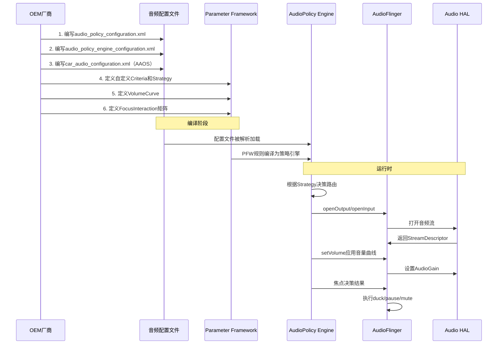

## 17.14 OEM深度定制实战

> [← 上一个](17_17.13_音效调试.md) | [返回目录](README.md) | [下一个 →](17_17.15_AudioFlinger_Tunable参数.md)

---


### 17.14.1 自定义EngineConfigurable引擎

OEM可通过Parameter Framework自定义AudioPolicy引擎（源码：`frameworks/av/services/audiopolicy/engineconfigurable/`）。

**EngineConfigurable架构**（基于Parameter Framework）：

| 组件 | 配置文件 | 说明 |
|------|----------|------|
| PFW配置 | `ParameterFrameworkConfigurationPolicy.xml` | Parameter Framework主配置 |
| Criteria | `PolicyCriterion.xml` | 决策条件定义 |
| CriterionTypes | `PolicyCriterionTypes.xml` | 条件类型定义（自动生成） |
| Strategies | `PolicyStrategy.xml` | 路由策略规则 |
| Domains | `PolicyDomain.xml` | 策略域定义 |

**自定义步骤**：

1. **创建PFW配置目录**：在`vendor/<oem>/audio/policy/`下创建配置文件
2. **定义Criterion**：添加OEM特有的音频属性条件
3. **定义Strategy**：编写路由策略规则XML
4. **编译集成**：修改Android.bp将OEM配置文件打包

```xml
<!-- 示例：自定义Criterion - 车辆状态 -->
<Criterion name="VehicleState">
    <CriterionType name="VehicleStateType" type="inclusive">
        <ValuePair literal="Parking" numerical="0"/>
        <ValuePair literal="Driving" numerical="1"/>
        <ValuePair literal="Reverse" numerical="2"/>
    </CriterionType>
</Criterion>
```

### 17.14.2 自定义VolumeCurve

VolumeCurve定义音量索引到衰减值的映射关系（源码：[`VolumeCurve.cpp`](frameworks/av/services/audiopolicy/engine/common/src/VolumeCurve.cpp)）。

**默认VolumeCurve分类**：

| 类别 | 设备类型 | 曲线特点 |
|------|----------|----------|
| DEVICECATEGORY_HEADSET | 耳机 | 低音量起点高，斜率缓 |
| DEVICECATEGORY_SPEAKER | 扬声器 | 低音量起点低，斜率陡 |
| DEVICECATEGORY_EARPIECE | 听筒 | 中间斜率 |
| DEVICECATEGORY_HEARING_AID | 助听器 | 类似HEADSET |
| DEVICECATEGORY_EXT_MEDIA | 外部媒体 | 线性映射 |

**自定义VolumeCurve方法**：

在`audio_policy_configuration.xml`中定义：

```xml
<volume streamType="AUDIO_STREAM_MUSIC">
    <deviceCategory category="DEVICECATEGORY_SPEAKER">
        <!-- index:minAttenuationInDb ... maxIndex:maxAttenuationInDb -->
        <point>0:-9000</point>   <!-- 最小音量: -90dB -->
        <point>33:-3600</point>  <!-- 1/3音量: -36dB -->
        <point>66:-1600</point>  <!-- 2/3音量: -16dB -->
        <point>100:0</point>     <!-- 最大音量: 0dB -->
    </deviceCategory>
</volume>
```

### 17.14.3 自定义ProductStrategy

ProductStrategy定义音频产品的路由优先级和策略（源码路径：`frameworks/av/services/audiopolicy/engineconfigurable/`）。

**内置ProductStrategy列表**：

| Strategy | 用途 | 优先级 |
|----------|------|--------|
| STRATEGY_MEDIA | 媒体播放 | 低 |
| STRATEGY_PHONE | 电话通话 | 高 |
| STRATEGY_SONIFICATION | 通知/铃声 | 高 |
| STRATEGY_ENFORCED_AUDIBLE | 强制发声 | 最高 |
| STRATEGY_DTMF | DTMF音 | 中 |
| STRATEGY_TRANSMITTED_THROUGH_SPEAKER | 强制扬声器 | 高 |
| STRATEGY_ACCESSIBILITY | 无障碍 | 中 |
| STRATEGY_REROUTING | 重路由 | 低 |
| STRATEGY_CALL_ASSISTANT | 通话助手 | 中 |

**自定义Strategy**：在`PolicyStrategy.xml`中添加OEM策略规则：

```xml
<Strategy name="OemNavigationStrategy" type="compound">
    <SelectionCriterion ref="VehicleState"/>
    <SelectionCriterion ref="StreamType"/>
    <Component type="OemNavRule_Parking"/>
    <Component type="OemNavRule_Driving"/>
</Strategy>
```

### 17.14.4 自定义FocusInteraction矩阵

FocusInteraction矩阵定义不同音频流之间的焦点交互规则（AAOS特有，源码：[`FocusInteraction.java`](packages/services/Car/service/src/com/android/car/audio/FocusInteraction.java)）。

**交互类型**：

| 交互类型 | 含义 | 示例 |
|----------|------|------|
| REJECT | 拒绝焦点请求 | 导航不能打断电话 |
| DUCK | 降低音量让出焦点 | 音乐被通知duck |
| PAUSE | 暂停让出焦点 | 音乐被通话暂停 |
| EXTERNAL_LOSS | 外部焦点丢失 | HAL主动接管焦点 |
| NONE | 无交互 | 两个流可同时播放 |

**自定义矩阵示例**：

```java
// 在FocusInteraction中自定义交互规则
// 矩阵格式: [requester][holder] = interaction
setInteraction(AUDIO_CONTEXT_MUSIC, AUDIO_CONTEXT_NAVIGATION, INTERACTION_DUCK);
setInteraction(AUDIO_CONTEXT_MUSIC, AUDIO_CONTEXT_CALL, INTERACTION_PAUSE);
setInteraction(AUDIO_CONTEXT_NAVIGATION, AUDIO_CONTEXT_CALL, INTERACTION_PAUSE);
setInteraction(AUDIO_CONTEXT_CALL, AUDIO_CONTEXT_MUSIC, INTERACTION_REJECT);
```

### 17.14.5 多音频Zone配置实战

AAOS14支持多音频Zone，允许不同座位独立播放音频。

**配置步骤**：

1. **定义car_audio_configuration.xml**：

```xml
<audioZoneConfiguration version="2.0">
    <zones>
        <zone name="primary" isPrimary="true" occupantZoneId="1">
            <zoneConfigs>
                <zoneConfig name="primary_default" isDefault="true">
                    <volumeGroups>
                        <group name="Media" deviceId="bus_1000">
                            <context context="music"/>
                        </group>
                        <group name="Navigation" deviceId="bus_1001">
                            <context context="navigation"/>
                        </group>
                    </volumeGroups>
                </zoneConfig>
            </zoneConfigs>
        </zone>
        <zone name="rear" isPrimary="false" occupantZoneId="2">
            <zoneConfigs>
                <zoneConfig name="rear_default" isDefault="true">
                    <volumeGroups>
                        <group name="RearMedia" deviceId="bus_2000">
                            <context context="music"/>
                        </group>
                    </volumeGroups>
                </zoneConfig>
            </zoneConfigs>
        </zone>
    </zones>
</audioZoneConfiguration>
```

2. **HAL层配置对应Bus设备**：确保每个zoneConfig中的deviceId在HAL层有对应实现
3. **Occupant Zone映射**：将物理座位映射到音频Zone
4. **验证配置**：使用`cmd car_service validate-car-audio-config`验证

### 17.14.6 BitPerfect模式配置

BitPerfect模式在AOSP14中新增，允许音频数据不经重采样/格式转换直接输出到DAC。

**配置方法**：

在`audio_policy_configuration.xml`中为output profile添加BitPerfect标志：

```xml
<mixPort name="bitperfect_output" role="source"
         flags="AUDIO_OUTPUT_FLAG_BIT_PERFECT">
    <profile name="" format="AUDIO_FORMAT_PCM_24_BIT_PACKED"
             samplingRates="96000,192000"
             channelMasks="AUDIO_CHANNEL_OUT_STEREO"/>
</mixPort>
```

**BitPerfect约束**：

| 约束 | 说明 |
|------|------|
| 采样率必须匹配 | 不执行重采样，源和输出采样率必须一致 |
| 格式必须匹配 | 不执行格式转换 |
| 独占使用 | BitPerfect Track独占输出线程，其他Track被mute |
| 音量控制受限 | 只能通过HAL增益控制，不能在AF层调整 |

### 17.14.7 完整OEM定制流程



---

