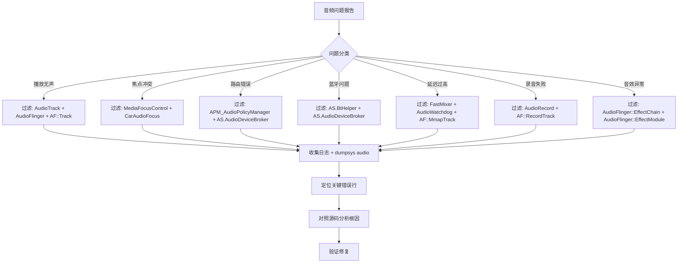

## 17.2 logcat音频日志过滤

> [← 上一个](17_17.1_dumpsys_audio-音频系统全量状态.md) | [← 返回17章](README.md) | [返回导航](../README.md) | [下一个 →](17_17.3_常见问题定位.md)

---

## 17.2.1 音频系统日志架构

Android音频系统的日志分散在多个层级，从Java Framework到Native Service再到HAL层，每一层都有独立的LOG TAG。理解这些TAG的命名规律和对应源码，是高效调试的基础。

```mermaid
graph TB
    subgraph JavaFramework
        AS[AS.AudioService]
        MFC[MediaFocusControl]
        ADB[AS.AudioDeviceBroker]
        ADI[AS.AudioDeviceInventory]
        BTH[AS.BtHelper]
        SPH[AS.SpatializerHelper]
        SDH[AS.SoundDoseHelper]
        PAM[AS.PlaybackActivityMon]
        FOM[AudioService.FadeOutManager]
        VC[VolumeController]
    end
    subgraph NativeService_AF
        AF[AudioFlinger]
        FM[FastMixer]
        FC[FastCapture]
        FT[FastThread]
        PP[AudioFlinger::PatchPanel]
        DEM[AudioFlinger::DeviceEffectManager]
        SDM[SoundDoseManager]
    end
    subgraph NativeService_APM
        APM[APM_AudioPolicyManager]
        APS[AudioPolicyService]
        ENG[APM::AudioPolicyEngine/Base]
        SER[APM::Serializer]
    end
    subgraph HAL
        AH[audio_hw]
        AC[AudioControl]
    end
    AS --> AF
    AS --> APM
    AF --> AH
    APM --> AH
    MFC --> AC
```



## 17.2.2 Java Framework层TAG完整列表

AudioService及其子模块统一使用 `AS.` 前缀（源码路径：`frameworks/base/services/core/java/com/android/server/audio/`）：

| TAG | 源码类 | 核心职责 | 关键日志场景 |
|-----|--------|----------|-------------|
| `AS.AudioService` | [`AudioService.java`](frameworks/base/services/core/java/com/android/server/audio/AudioService.java:250) | 音频服务主控 | 音量调节、模式切换、设备连接/断开、ringer模式变更 |
| `MediaFocusControl` | [`MediaFocusControl.java`](frameworks/base/services/core/java/com/android/server/audio/MediaFocusControl.java:63) | 音频焦点管理 | 焦点请求/放弃/丢失、焦点栈变化、duck/transient事件 |
| `AS.AudioDeviceBroker` | [`AudioDeviceBroker.java`](frameworks/base/services/core/java/com/android/server/audio/AudioDeviceBroker.java:75) | 设备连接中介 | A2DP/LE Audio连接、Wired耳机插拔、设备路由切换 |
| `AS.AudioDeviceInventory` | [`AudioDeviceInventory.java`](frameworks/base/services/core/java/com/android/server/audio/AudioDeviceInventory.java:79) | 设备清单管理 | 设备状态持久化、设备类型转换 |
| `AS.BtHelper` | [`BtHelper.java`](frameworks/base/services/core/java/com/android/server/audio/BtHelper.java:56) | 蓝牙音频辅助 | A2DP codec协商、SCO状态、LE Audio切换 |
| `AS.SpatializerHelper` | [`SpatializerHelper.java`](frameworks/base/services/core/java/com/android/server/audio/SpatializerHelper.java:64) | 空间音频辅助 | Spatializer开启/关闭、头部追踪器连接 |
| `AS.SoundDoseHelper` | [`SoundDoseHelper.java`](frameworks/base/services/core/java/com/android/server/audio/SoundDoseHelper.java:76) | 声剂量管理 | CSD警告、声剂量阈值触发 |
| `AS.PlaybackActivityMon` | [`PlaybackActivityMonitor.java`](frameworks/base/services/core/java/com/android/server/audio/PlaybackActivityMonitor.java:79) | 播放活动监控 | 播放状态变更、CSD激活/停用 |
| `AudioService.FadeOutManager` | [`FadeOutManager.java`](frameworks/base/services/core/java/com/android/server/audio/FadeOutManager.java:38) | 淡出管理 | 焦点夺取时的fade out动画 |
| `AudioService.RotationHelper` | [`RotationHelper.java`](frameworks/base/services/core/java/com/android/server/audio/RotationHelper.java:51) | 旋转辅助 | 设备旋转时音频设备重映射 |
| `AS.SfxHelper` | [`SoundEffectsHelper.java`](frameworks/base/services/core/java/com/android/server/audio/SoundEffectsHelper.java:62) | 系统音效 | 触摸音、通知音加载/播放 |
| `AudioSystemAdapter` | [`AudioSystemAdapter.java`](frameworks/base/services/core/java/com/android/server/audio/AudioSystemAdapter.java:58) | AudioSystem桥接 | 与native AudioSystem的IPC调用 |
| `VolumeController` | [`AudioService.java:VolumeController`](frameworks/base/services/core/java/com/android/server/audio/AudioService.java:11246) | 音量UI控制 | 音量面板显示/隐藏、滑块更新 |
| `AudioPolicyProxy` | [`AudioService.java:AudioPolicyProxy`](frameworks/base/services/core/java/com/android/server/audio/AudioService.java:12403) | 策略代理 | 第三方AudioPolicy注册/注销 |
| `FocusRequester` | [`FocusRequester.java`](frameworks/base/services/core/java/com/android/server/audio/FocusRequester.java:42) | 焦点请求者 | 焦点请求的详细信息封装 |
| `DefaultAudioPolicyFacade` | [`DefaultAudioPolicyFacade.java`](frameworks/base/services/core/java/com/android/server/audio/DefaultAudioPolicyFacade.java:38) | 默认策略门面 | 策略查询接口 |

## 17.2.3 Native AudioFlinger层TAG完整列表

AudioFlinger使用 `#define LOG_TAG` 定义日志标签（源码路径：`frameworks/av/services/audioflinger/`）：

| TAG | 源码文件 | 核心职责 |
|-----|----------|----------|
| `AudioFlinger` | [`AudioFlinger.cpp`](frameworks/av/services/audioflinger/AudioFlinger.cpp:19), [`Threads.cpp`](frameworks/av/services/audioflinger/Threads.cpp:19), [`Tracks.cpp`](frameworks/av/services/audioflinger/Tracks.cpp:19), [`Effects.cpp`](frameworks/av/services/audioflinger/Effects.cpp:19) | AF主逻辑、线程管理、Track管理、音效管理 |
| `FastMixer` | [`FastMixer.cpp`](frameworks/av/services/audioflinger/FastMixer.cpp:23) | Fast Mixer低延迟混音路径 |
| `FastCapture` | [`FastCapture.cpp`](frameworks/av/services/audioflinger/FastCapture.cpp:17) | Fast Capture低延迟录音路径 |
| `FastThread` | [`FastThread.cpp`](frameworks/av/services/audioflinger/FastThread.cpp:17) | Fast线程基类 |
| `FastMixerState` | [`FastMixerState.cpp`](frameworks/av/services/audioflinger/FastMixerState.cpp:17) | Fast Mixer状态机 |
| `FastMixerDumpState` | [`FastMixerDumpState.cpp`](frameworks/av/services/audioflinger/FastMixerDumpState.cpp:17) | Fast Mixer dump状态 |
| `FastCaptureDumpState` | [`FastCaptureDumpState.cpp`](frameworks/av/services/audioflinger/FastCaptureDumpState.cpp:17) | Fast Capture dump状态 |
| `AudioWatchdog` | [`AudioWatchdog.cpp`](frameworks/av/services/audioflinger/AudioWatchdog.cpp:17) | 看门狗：检测CPU饥饿 |
| `AudioFlinger::PatchPanel` | [`PatchPanel.cpp`](frameworks/av/services/audioflinger/PatchPanel.cpp:19) | 音频路由Patch管理 |
| `AudioFlinger::PatchCommandThread` | [`PatchCommandThread.cpp`](frameworks/av/services/audioflinger/PatchCommandThread.cpp:18) | Patch命令线程 |
| `AudioFlinger::DeviceEffectManager` | [`DeviceEffectManager.cpp`](frameworks/av/services/audioflinger/DeviceEffectManager.cpp:19) | 设备级音效管理 |
| `AudioFlinger::MelReporter` | [`MelReporter.cpp`](frameworks/av/services/audioflinger/MelReporter.cpp:19) | MEL声剂量上报 |
| `SoundDoseManager` | [`SoundDoseManager.cpp`](frameworks/av/services/audioflinger/sounddose/SoundDoseManager.cpp:19) | CSD声剂量管理 |
| `AudioHwDevice` | [`AudioHwDevice.cpp`](frameworks/av/services/audioflinger/AudioHwDevice.cpp:18) | HAL设备抽象 |
| `NBAIO_Tee` | [`NBAIO_Tee.cpp`](frameworks/av/services/audioflinger/NBAIO_Tee.cpp:17) | NBAIO数据Tee记录 |
| `StateQueue` | [`StateQueue.cpp`](frameworks/av/services/audioflinger/StateQueue.cpp:17) | 状态队列（Fast路径用） |
| `BufLog` | [`BufLog.cpp`](frameworks/av/services/audioflinger/BufLog.cpp:19) | 缓冲日志 |

**Track层细化TAG**（在[`Tracks.cpp`](frameworks/av/services/audioflinger/Tracks.cpp)中通过作用域重定义LOG_TAG）：

| TAG | 行号 | 用途 |
|-----|------|------|
| `AF::TrackBase` | [Tracks.cpp:74](frameworks/av/services/audioflinger/Tracks.cpp:74) | Track基类：共享内存、CBLK管理 |
| `AF::TrackHandle` | [Tracks.cpp:332](frameworks/av/services/audioflinger/Tracks.cpp:332) | Track Bp端代理 |
| `AF::Track` | [Tracks.cpp:614](frameworks/av/services/audioflinger/Tracks.cpp:614) | 播放Track：数据写入、underrun检测 |
| `AF::OutputTrack` | [Tracks.cpp:2000](frameworks/av/services/audioflinger/Tracks.cpp:2000) | 输出Track：线程间音频转发 |
| `AF::PatchTrack` | [Tracks.cpp:2266](frameworks/av/services/audioflinger/Tracks.cpp:2266) | Patch Track：软件路由桥接 |
| `AF::RecordHandle` | [Tracks.cpp:2412](frameworks/av/services/audioflinger/Tracks.cpp:2412) | 录音Track Bp端代理 |
| `AF::RecordTrack` | [Tracks.cpp:2470](frameworks/av/services/audioflinger/Tracks.cpp:2470) | 录音Track：数据读取、overrun检测 |
| `AF::PatchRecord` | [Tracks.cpp:2852](frameworks/av/services/audioflinger/Tracks.cpp:2852) | Patch Record：软件路由录音端 |
| `AF::PthrPatchRecord` | [Tracks.cpp:2961](frameworks/av/services/audioflinger/Tracks.cpp:2961) | 线程间Patch Record |
| `AF::MmapTrack` | [Tracks.cpp:3137](frameworks/av/services/audioflinger/Tracks.cpp:3137) | MMAP Track：低延迟直通路径 |

**Effect层细化TAG**（在[`Effects.cpp`](frameworks/av/services/audioflinger/Effects.cpp)中）：

| TAG | 行号 | 用途 |
|-----|------|------|
| `AudioFlinger::EffectBase` | [Effects.cpp:96](frameworks/av/services/audioflinger/Effects.cpp:96) | 音效基类 |
| `AudioFlinger::EffectModule` | [Effects.cpp:558](frameworks/av/services/audioflinger/Effects.cpp:558) | 音效模块：创建/启用/处理 |
| `AudioFlinger::EffectHandle` | [Effects.cpp:1751](frameworks/av/services/audioflinger/Effects.cpp:1751) | 音效客户端句柄 |
| `AudioFlinger::EffectChain` | [Effects.cpp:2179](frameworks/av/services/audioflinger/Effects.cpp:2179) | 音效链：Session内Effect集合 |
| `AudioFlinger::DeviceEffectProxy` | [Effects.cpp:3310](frameworks/av/services/audioflinger/Effects.cpp:3310) | 设备级音效代理 |

## 17.2.4 Native AudioPolicy层TAG完整列表

AudioPolicy Manager使用 `APM_` 前缀（源码路径：`frameworks/av/services/audiopolicy/`）：

| TAG | 源码文件 | 核心职责 |
|-----|----------|----------|
| `APM_AudioPolicyManager` | [`AudioPolicyManager.cpp`](frameworks/av/services/audiopolicy/managerdefault/AudioPolicyManager.cpp:17) | 策略管理器主逻辑 |
| `AudioPolicyService` | [`AudioPolicyService.cpp`](frameworks/av/services/audiopolicy/service/AudioPolicyService.cpp:17) | 策略服务Bn端 |
| `AudioPolicyIntefaceImpl` | [`AudioPolicyInterfaceImpl.cpp`](frameworks/av/services/audiopolicy/service/AudioPolicyInterfaceImpl.cpp:17) | 策略接口实现 |
| `AudioPolicyClientImpl` | [`AudioPolicyClientImpl.cpp`](frameworks/av/services/audiopolicy/service/AudioPolicyClientImpl.cpp:17) | 策略客户端实现 |
| `APM::AudioPolicyEngine/Base` | [`EngineBase.cpp`](frameworks/av/services/audiopolicy/engine/common/src/EngineBase.cpp:17) | 策略引擎基类 |
| `APM::AudioPolicyEngine` | [`Engine.cpp`](frameworks/av/services/audiopolicy/engineconfigurable/src/Engine.cpp:17) | 可配置策略引擎 |
| `APM::AudioPolicyEngine/PFWWrapper` | [`ParameterManagerWrapper.cpp`](frameworks/av/services/audiopolicy/engineconfigurable/wrapper/ParameterManagerWrapper.cpp:17) | PFW参数框架封装 |
| `APM::AudioPolicyEngine/ProductStrategy` | [`ProductStrategy.cpp`](frameworks/av/services/audiopolicy/engine/common/src/ProductStrategy.cpp:17) | 产品策略 |
| `APM::AudioPolicyEngine/VolumeGroup` | [`VolumeGroup.cpp`](frameworks/av/services/audiopolicy/engine/common/src/VolumeGroup.cpp:17) | 音量组 |
| `APM::VolumeCurve` | [`VolumeCurve.cpp`](frameworks/av/services/audiopolicy/engine/common/src/VolumeCurve.cpp:17) | 音量曲线 |
| `APM::AudioPolicyEngine/LastRemovableMediaDevices` | [`LastRemovableMediaDevices.cpp`](frameworks/av/services/audiopolicy/engine/common/src/LastRemovableMediaDevices.cpp:17) | 最近可移除设备 |
| `APM_Config` | [`AudioPolicyConfig.cpp`](frameworks/av/services/audiopolicy/common/managerdefinitions/src/AudioPolicyConfig.cpp:17) | 配置解析 |
| `APM::Serializer` | [`Serializer.cpp`](frameworks/av/services/audiopolicy/common/managerdefinitions/src/Serializer.cpp:17) | XML配置反序列化 |
| `APM::HwModule` | [`HwModule.cpp`](frameworks/av/services/audiopolicy/common/managerdefinitions/src/HwModule.cpp:17) | 硬件模块 |
| `APM::IOProfile` | [`IOProfile.cpp`](frameworks/av/services/audiopolicy/common/managerdefinitions/src/IOProfile.cpp:17) | IO Profile |
| `APM::Devices` | [`DeviceDescriptor.cpp`](frameworks/av/services/audiopolicy/common/managerdefinitions/src/DeviceDescriptor.cpp:17) | 设备描述符 |
| `APM_ClientDescriptor` | [`ClientDescriptor.cpp`](frameworks/av/services/audiopolicy/common/managerdefinitions/src/ClientDescriptor.cpp:17) | 客户端描述符 |
| `APM::PolicyAudioPort` | [`PolicyAudioPort.cpp`](frameworks/av/services/audiopolicy/common/managerdefinitions/src/PolicyAudioPort.cpp:17) | 音频端口策略 |
| `APM::EffectDescriptor` | [`EffectDescriptor.cpp`](frameworks/av/services/audiopolicy/common/managerdefinitions/src/EffectDescriptor.cpp:17) | 音效描述符 |
| `Spatializer` | [`Spatializer.cpp`](frameworks/av/services/audiopolicy/service/Spatializer.cpp:19) | 空间音频 |
| `SpatializerPoseController` | [`SpatializerPoseController.cpp`](frameworks/av/services/audiopolicy/service/SpatializerPoseController.cpp:23) | 头部追踪姿势 |
| `CaptureStateNotifier` | [`CaptureStateNotifier.cpp`](frameworks/av/services/audiopolicy/service/CaptureStateNotifier.cpp:1) | 录音状态通知 |
| `AudioPolicyEffects` | [`AudioPolicyEffects.cpp`](frameworks/av/services/audiopolicy/service/AudioPolicyEffects.cpp:17) | 策略层音效管理 |
| `APM_EngineLoader` | [`EngineLibrary.cpp`](frameworks/av/services/audiopolicy/managerdefault/EngineLibrary.cpp:17) | 策略引擎加载器 |

## 17.2.5 HAL层及App层TAG

| TAG | 层级 | 核心职责 |
|-----|------|----------|
| `audio_hw` | HAL | 主Audio HAL实现（vendor实现） |
| `audio_hw_primary` | HAL | Primary HAL模块 |
| `AudioControl` | HAL(AAOS) | AudioControl HAL焦点/静音回调 |
| `AudioTrack` | App API | 播放API日志：创建/写入/状态 |
| `AudioRecord` | App API | 录音API日志：创建/读取/状态 |
| `AudioManager` | App API | 音频管理器：音量/焦点/设备查询 |
| `AAudio` | App API | AAudio低延迟API |
| `CarAudioService` | AAOS | CarAudio服务主控 |
| `CarAudioFocus` | AAOS | 车载音频焦点（交互矩阵） |
| `CarVolumeGroup` | AAOS | 车载音量组管理 |

## 17.2.6 日志过滤模式详解

### 基本过滤语法

```bash
# 单TAG过滤（-s 表示 silent 其他TAG）
logcat -s AudioFlinger

# 多TAG过滤
logcat -s AudioFlinger MediaFocusControl AS.AudioService

# TAG + 优先级过滤
logcat -s AudioFlinger:V MediaFocusControl:D AS.AudioService:I

# 优先级说明：
# V=Verbose  D=Debug  I=Info  W=Warn  E=Error  F=Fatal
```

### 高级过滤技巧

```bash
# 使用正则表达式过滤（-e）
logcat -e "AudioFlinger|AudioPolicy|AudioService"

# 过滤特定PID的音频日志
logcat --pid=$(pidof audioserver)

# 过滤特定线程
logcat --pid=$(pidof audioserver) | grep "tid=1234"

# 使用buffer过滤
logcat -b main,system -s AudioFlinger

# 持续监控+时间戳
logcat -v time -s AudioFlinger AS.AudioService

# 使用grep组合过滤：追踪音量变化
logcat -v time | grep -E "AS.AudioService.*[Vv]olume|AudioFlinger.*volume"

# 使用grep过滤多个条件：Track创建和状态变化
logcat -v time | grep -E "AF::Track.*(create|start|stop|underrun)"
```

## 17.2.7 场景化日志过滤组合

### 播放问题追踪

```bash
# 追踪从App到HAL的完整播放链路
logcat -v time -s \
  AudioTrack:V \
  AudioFlinger:V \
  AF::Track:V \
  AF::TrackBase:V \
  audio_hw:V

# 只关注underrun和Track状态
logcat -v time | grep -E "underrun|AF::Track.*(ACTIVE|PAUSED|STOPPED)|AudioTrack.*state"

# FastMixer路径问题
logcat -v time -s FastMixer:V FastMixerState:V FastThread:V AudioWatchdog:V
```

### 焦点问题追踪

```bash
# 完整焦点链路追踪
logcat -v time -s \
  MediaFocusControl:V \
  FocusRequester:V \
  AS.AudioService:V \
  CarAudioFocus:V

# 焦点请求被拒绝时的日志
logcat -v time | grep -E "MediaFocusControl.*(request|abandon|loss|gain)"
```

### 设备路由追踪

```bash
# 设备连接和路由变化
logcat -v time -s \
  AS.AudioDeviceBroker:V \
  AS.AudioDeviceInventory:V \
  APM_AudioPolicyManager:V \
  AudioFlinger::PatchPanel:V \
  AS.BtHelper:V

# A2DP/LE Audio蓝牙音频
logcat -v time -s \
  AS.BtHelper:V \
  AS.AudioDeviceBroker:V \
  audio_hw:V
```

### 音量问题追踪

```bash
# 音量调节完整链路
logcat -v time -s \
  AS.AudioService:V \
  VolumeController:V \
  APM::VolumeCurve:V \
  APM::AudioPolicyEngine/VolumeGroup:V
```

### 录音问题追踪

```bash
# 录音链路追踪
logcat -v time -s \
  AudioRecord:V \
  AF::RecordTrack:V \
  AF::RecordHandle:V \
  FastCapture:V \
  audio_hw:V
```

### AAOS车载音频追踪

```bash
# CarAudio完整追踪
logcat -v time -s \
  CarAudioService:V \
  CarAudioFocus:V \
  CarVolumeGroup:V \
  AudioControl:V \
  AS.AudioService:V

# 车载焦点交互矩阵结果
logcat -v time | grep -E "CarAudioFocus.*(interaction|focus|duck)"
```

### 延迟和性能追踪

```bash
# Fast路径性能追踪
logcat -v time -s \
  FastMixer:V \
  FastMixerState:V \
  FastThread:V \
  AudioWatchdog:V \
  AF::MmapTrack:V

# Underrun监控
logcat -v time | grep -iE "underrun|overrun|watchdog|stall|throttle"
```

## 17.2.8 日志级别控制

### 动态调整日志级别

```bash
# 通过persist属性控制（重启保留）
adb shell setprop persist.log.tag.AudioFlinger DEBUG

# 通过log tag属性控制
adb shell setprop log.tag.AudioFlinger VERBOSE

# 查看当前日志级别
adb shell getprop log.tag.AudioFlinger
```

### AudioFlinger特定调试开关

```bash
# 启用AF详细日志（debugable build）
adb shell setprop af.tee 3       # 启用NBAIO Tee数据记录

# FastMixer详细dump
adb shell kill -33 $(pidof audioserver)  # 触发AF dump到logcat

# 线程节流控制
adb shell setprop af.thread.throttle false  # 禁用线程节流（调试延迟用）
```

## 17.2.9 日志分析工作流



## 17.2.10 日志关键字速查表

| 关键字 | 含义 | 常见TAG |
|--------|------|---------|
| `underrun` | Track数据不足 | AudioFlinger, AF::Track |
| `overrun` | 录音数据溢出 | AF::RecordTrack |
| `stale CBLK` | 共享内存不同步 | AudioFlinger |
| `INVALID` | Track状态无效 | AF::Track |
| `FORCE` | 强制设备路由 | APM_AudioPolicyManager |
| `STANDBY` | HAL进入待机 | audio_hw |
| `writelock` | 写锁竞争 | AudioFlinger |
| `timed out` | 操作超时（通常是HAL） | AudioFlinger |
| `not ready` | Track未就绪 | AF::Track |
| `FastMixer idle` | FastMixer无活跃Track | FastMixer |
| `AudioWatchdog` | CPU饥饿检测触发 | AudioWatchdog |
| `focus grant` | 焦点授予 | MediaFocusControl |
| `focus loss` | 焦点丢失 | MediaFocusControl |
| `focus request denied` | 焦点请求被拒 | MediaFocusControl |
| `A2DP suspend` | A2DP挂起 | AS.BtHelper |
| `codec config` | 蓝牙codec协商 | AS.BtHelper |

---

[← 上一个](17_17.1_dumpsys_audio-音频系统全量状态.md) | [← 返回17章](README.md) | [返回导航](../README.md) | [下一个 →](17_17.3_常见问题定位.md)