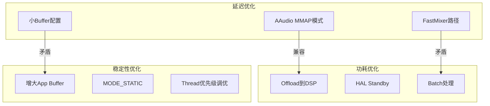
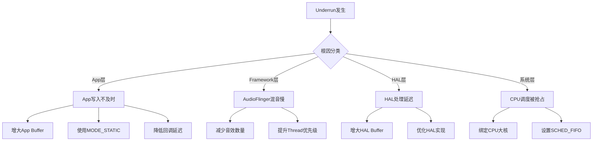

## 17.5 性能优化建议

> [← 上一个](17_17.4_OEM定制指南.md) | [← 返回17章](README.md) | [返回导航](../README.md) | [下一个 →](17_17.6_systraceperfetto音频追踪.md)

---

## 17.5.1 性能优化体系总览

音频系统性能优化涵盖三个核心维度：延迟（Latency）、功耗（Power）和稳定性（Underrun/Overrun）。三者之间存在固有矛盾——降低延迟需要更小的buffer和更高的中断频率，而降低功耗需要更大的buffer和更低的中断频率。OEM需要根据产品定位找到最佳平衡点。



## 17.5.2 延迟优化

### FastMixer低延迟路径

FastMixer是AudioFlinger中最关键的延迟优化组件，运行在独立的SCHED_FIFO高优先级线程上。

**源码路径**：[`FastMixer.cpp`](frameworks/av/services/audioflinger/FastMixer.cpp)

**FastMixer激活条件**（源码[`Threads.cpp`](frameworks/av/services/audioflinger/Threads.cpp:296)）：

```cpp
// Fast Track数量上限由Property控制
static const int kMaxFastTracks = property_get_int32("ro.audio.max_fast_tracks", 4);

// Fast Track multiplier控制每个Fast Track的sub-mix buffer数
static const int kFastTrackMultiplier = property_get_int32("af.fast_track_multiplier", 1);
// 限制范围1-2
if (kFastTrackMultiplier < 1 || kFastTrackMultiplier > 2) {
    kFastTrackMultiplier = 1;
}
```

**FastMixer状态机**：

```
COLD → IDLE → ACTIVE → IDLE
         ↑         |
         +---------+
```

| 状态 | 含义 | 触发条件 |
|------|------|----------|
| `COLD` | 冷启动，首次初始化 | AudioFlinger启动 |
| `IDLE` | 空闲，无活跃Fast Track | 所有Fast Track停止 |
| `ACTIVE` | 活跃混音 | 至少一个Fast Track在播放 |

**延迟计算公式**：

```
总延迟 = App Buffer + AudioFlinger Buffer + HAL Buffer + 硬件延迟

FastMixer路径:
  AudioFlinger Buffer = kFastTrackMultiplier × fastTrackCount × burstSize
  通常 = 1 × 1 × 96 = 96 frames ≈ 2ms @48kHz

普通Mixer路径:
  AudioFlinger Buffer = normalMixCount × burstSize
  通常 = 4 × 192 = 768 frames ≈ 16ms @48kHz
```

### AAudio MMAP模式

AAudio MMAP模式绕过AudioFlinger，直接在App进程和HAL之间建立共享内存通道。

**MMAP策略Property**（源码[`PropertyUtils.cpp`](frameworks/av/services/audioflinger/PropertyUtils.cpp)）：

```cpp
// MMAP策略: 1=NEVER, 2=AUTO, 3=ALWAYS
int32_t policy = property_get_int32("aaudio.mmap_policy", 2);  // AUTO

// MMAP独占策略: 1=NEVER, 2=AUTO, 3=ALWAYS  
int32_t exclusivePolicy = property_get_int32("aaudio.mmap_exclusive_policy", 2);
```

| MMAP策略值 | 含义 | 延迟 |
|-----------|------|------|
| 1 (NEVER) | 永不使用MMAP | ~20ms（标准路径） |
| 2 (AUTO) | HAL支持时自动使用 | ~5-10ms |
| 3 (ALWAYS) | 强制使用MMAP | ~3-5ms |

**AAudio Burst配置**：

```cpp
// mixer burst数量
int32_t mixerBursts = property_get_int32("aaudio.mixer_bursts", 2);

// HW burst最小值
int32_t hwBurstMin = property_get_int32("aaudio.hw_burst_min_usec", 0);
```

### 延迟优化最佳实践

| 场景 | 配置 | 预期延迟 |
|------|------|----------|
| 交互式音乐应用 | FastMixer + 48kHz/96帧 | ~5-8ms |
| 专业音频/乐器 | AAudio MMAP Exclusive + 48kHz | ~3-5ms |
| 语音通话 | FastMixer + 16kHz | ~10-15ms |
| 普通媒体播放 | 标准Mixer路径 | ~20-40ms |
| 后台播放 | 标准Mixer + 大Buffer | 不敏感 |

## 17.5.3 功耗优化

### Offload压缩解码

将MP3/AAC等压缩码流直接传递给DSP解码，避免CPU参与解码。

**Offload激活条件**：
1. Stream flag包含`AUDIO_OUTPUT_FLAG_COMPRESS_OFFLOAD`
2. HAL支持对应编码格式
3. audio_policy_configuration.xml中配置了offload mixPort

```xml
<!-- 配置Offload端口 -->
<mixPort name="compressed_offload" role="source" 
         flags="AUDIO_OUTPUT_FLAG_COMPRESS_OFFLOAD|AUDIO_OUTPUT_FLAG_DIRECT">
    <profile name="" format="AUDIO_FORMAT_MP3"
             samplingRates="44100,48000" channelMasks="AUDIO_CHANNEL_OUT_STEREO"/>
    <profile name="" format="AUDIO_FORMAT_AAC_LC"
             samplingRates="44100,48000" channelMasks="AUDIO_CHANNEL_OUT_STEREO"/>
    <profile name="" format="AUDIO_FORMAT_FLAC"
             samplingRates="44100,48000,96000" channelMasks="AUDIO_CHANNEL_OUT_STEREO"/>
</mixPort>
```

**Offload Wake Lock控制**（源码[`Threads.cpp`](frameworks/av/services/audioflinger/Threads.cpp:7114)）：

```cpp
// 控制Offload播放时是否持有wakelock
static const bool kEnableOffloadWakelock = property_get_bool(
    "ro.audio.offload_wakelock", true);
```

### HAL Standby机制

当所有Track停止后，AudioFlinger将输出线程置为Standby状态。

**Standby超时配置**（源码[`AudioFlinger.cpp`](frameworks/av/services/audioflinger/AudioFlinger.cpp:395)）：

```cpp
// Standby延迟时间（毫秒）
uint32_t standbyTimeMs = property_get_int32(
    "ro.audio.flinger_standbytime_ms", 3000);
```

| 配置值 | 效果 | 适用场景 |
|--------|------|----------|
| 1000ms | 快速进入Standby | 电池供电设备 |
| 3000ms | 默认，平衡 | 通用设备 |
| 5000ms | 延迟Standby | 车载设备（避免频繁启停） |
| 0ms | 立即Standby | 极致省电模式 |

### 线程节流

AudioFlinger在Mix线程中对CPU使用进行节流。

**Property控制**（源码[`Threads.cpp`](frameworks/av/services/audioflinger/Threads.cpp:3175)）：

```cpp
// 是否启用线程节流
static const bool kEnableThrottle = property_get_bool("af.thread.throttle", true);
```

| 场景 | 建议值 | 说明 |
|------|--------|------|
| 正常使用 | true | 节省CPU，功耗友好 |
| 低延迟调试 | false | 减少额外等待，降低延迟 |
| 性能测试 | false | 获取真实延迟数据 |

## 17.5.4 Underrun优化

### Underrun根因分析

Underrun发生在AudioFlinger没有及时向HAL提供数据时，导致DAC播放静音或重复上一帧。



### Buffer大小计算

```cpp
// 标准Buffer大小计算
// burstSize = HAL报告的framesPerBurst
// bufferCapacity = burstSize × burstCount

// 示例：48kHz, stereo, 16-bit
// framesPerBurst = 96 (2ms)
// 延迟与buffer关系：
//   2ms  → 1 burst  = 96 frames = 384 bytes
//   4ms  → 2 bursts = 192 frames = 768 bytes
//   8ms  → 4 bursts = 384 frames = 1536 bytes
//  16ms  → 8 bursts = 768 frames = 3072 bytes
```

**不同场景的Buffer建议**：

| 场景 | 建议Buffer | 理由 |
|------|-----------|------|
| 低延迟交互 | 2-4 bursts | 延迟优先 |
| 普通播放 | 8-16 bursts | 平衡 |
| 后台播放 | 24-48 bursts | 容错优先 |
| 网络流媒体 | 32-64 bursts | 抗网络抖动 |

### FastMixer Underrun诊断

```bash
# 查看FastMixer underrun统计
adb shell dumpsys media.audio_flinger | grep -A5 "FastMixer"

# 输出示例：
# FastMixer Underruns: 3
# FastMixer write errors: 0
# Fast track underruns: Track[0]: 1
```

**FastMixer Underrun统计字段**：

| 字段 | 含义 | 优化方向 |
|------|------|----------|
| `Underruns` | FastMixer自身underrun | 检查SCHED_FIFO调度 |
| `write errors` | 写HAL失败 | 检查HAL实现 |
| `Fast track underruns` | App端数据不足 | 增大App Buffer |

## 17.5.5 录音Overrun优化

### Overrun根因分析

录音Overrun发生在HAL有数据但AudioFlinger的RecordThread来不及读取时。

```bash
# 查看录音线程overrun统计
adb shell dumpsys media.audio_flinger | grep -A10 "Input thread"
# 关注 "overrun" 和 "read errors" 字段
```

**录音Buffer优化**：

```java
// 使用AAudio低延迟录音
AAudioStreamBuilder builder;
builder.setDirection(AAUDIO_DIRECTION_INPUT);
builder.setPerformanceMode(AAUDIO_PERFORMANCE_MODE_LOW_LATENCY);
builder.setSharingMode(AAUDIO_SHARING_MODE_EXCLUSIVE);
builder.setBufferCapacityInFrames(480);  // 10ms @48kHz
```

## 17.5.6 蓝牙音频优化

### A2DP延迟优化

| 优化手段 | 效果 | 配置方法 |
|----------|------|----------|
| 使用LDAC编码 | ~80-120ms | Codec优先级设为最高 |
| 使用aptX Adaptive | ~50-80ms | 需要耳机端支持 |
| 关闭AudioFlinger重采样 | 减少一帧延迟 | 统一48kHz采样率 |

### LE Audio优化

LE Audio（BLE Audio）是蓝牙音频的下一代标准：

| 特性 | A2DP | LE Audio |
|------|------|----------|
| 延迟 | ~150-200ms | ~20-30ms |
| 编码 | SBC/AAC/LDAC | LC3 |
| 多流 | 不支持 | 支持 |
| 广播 | 不支持 | 支持 |

```bash
# 检查LE Audio支持状态
adb shell dumpsys bluetooth_manager | grep -i "le.audio"

# 强制启用LE Audio
adb shell settings put global ble_scan_low_power 0
```

## 17.5.7 CPU调度优化

### SCHED_FIFO配置

AudioFlinger的FastMixer线程默认使用SCHED_FIFO实时调度：

```cpp
// Threads.cpp中线程优先级设置
// FastMixer: SCHED_FIFO, priority 2
// Normal Mixer: SCHED_OTHER, nice -16
// FastCapture: SCHED_FIFO, priority 2
```

**系统级优化**：

```bash
# 查看音频线程调度策略
adb shell ps -T -p $(pidof audioserver) | grep -E "FastMixer|mixer"

# 绑定FastMixer到大核
adb shell taskset -pc 4-7 $(pidof audioserver)

# 检查CPU频率策略
adb shell cat /sys/devices/system/cpu/cpu*/cpufreq/scaling_governor
```

### IRQ亲和性

对于低延迟音频，建议将音频相关的硬件中断绑定到特定CPU核心：

```bash
# 查看音频设备IRQ
cat /proc/interrupts | grep -i audio

# 设置IRQ亲和性（绑定到CPU 4-5）
echo 30 > /proc/irq/<irq_number>/smp_affinity
```

## 17.5.8 内存优化

### 共享内存配置

**客户端堆大小**（源码[`AudioFlinger.cpp`](frameworks/av/services/audioflinger/AudioFlinger.cpp:2798)）：

```cpp
// 客户端共享内存堆大小（KB）
size_t clientHeapSizeKbyte = property_get_int32(
    "ro.af.client_heap_size_kbyte", 0);  // 0表示默认
```

| 配置值 | 效果 | 适用场景 |
|--------|------|----------|
| 0（默认） | 自动计算 | 通用 |
| 4096 | 4MB固定堆 | 多Track并发 |
| 8192 | 8MB固定堆 | 专业音频应用 |

### NBAIO Tee数据记录

Tee数据用于调试，但会产生额外内存和CPU开销。

**Property控制**（源码[`NBAIO_Tee.h`](frameworks/av/services/audioflinger/NBAIO_Tee.h:182)）：

```cpp
// 仅在ro.debuggable=true时生效
// 值含义：1=input, 2=output, 3=both
static const int kTee = property_get_int32("af.tee", 0);
```

| 值 | 记录内容 | 性能影响 |
|----|----------|----------|
| 0 | 不记录 | 无影响 |
| 1 | 仅输入 | 微量 |
| 2 | 仅输出 | 微量 |
| 3 | 输入+输出 | 小量 |

> **注意**：`af.tee`仅在`ro.debuggable=true`的版本中生效，user版本自动忽略。

## 17.5.9 采样率优化

### 重采样开销

AudioFlinger在Mix线程中需要将不同采样率的Track重采样到输出采样率。

```bash
# 查看活跃Track的采样率
adb shell dumpsys media.audio_flinger | grep -E "sample rate|resampler"
```

**优化策略**：

| 策略 | 说明 | 效果 |
|------|------|------|
| 全局48kHz | 所有mixPort统一48kHz | 消除大部分重采样 |
| Direct输出 | 独享线程直通 | 完全无重采样 |
| SRC质量调整 | 降低重采样质量 | 减少CPU开销 |

### Direct输出优化

对于高采样率内容（如96kHz/192kHz Hi-Res），使用Direct输出线程避免重采样：

```xml
<mixPort name="direct" role="source" 
         flags="AUDIO_OUTPUT_FLAG_DIRECT">
    <profile name="" format="AUDIO_FORMAT_PCM_24_BIT_PACKED"
             samplingRates="96000,192000" 
             channelMasks="AUDIO_CHANNEL_OUT_STEREO"/>
</mixPort>
```

## 17.5.10 性能优化检查清单

| 优化项 | Property/配置 | 验证命令 | 目标值 |
|--------|-------------|----------|--------|
| FastMixer激活 | `ro.audio.max_fast_tracks=8` | `dumpsys media.audio_flinger \| grep Fast` | Fast tracks > 0 |
| MMAP启用 | `aaudio.mmap_policy=2` | `dumpsys media.audio_flinger \| grep MMAP` | MMAP enabled |
| Offload启用 | XML配置offload端口 | `dumpsys media.audio_flinger \| grep offload` | Offload active |
| Standby时间 | `ro.audio.flinger_standbytime_ms` | `dumpsys media.audio_flinger \| grep standby` | 合理超时 |
| Underrun | 增大Buffer | `dumpsys media.audio_flinger \| grep underrun` | Underruns = 0 |
| 线程优先级 | SCHED_FIFO | `ps -T -p $(pidof audioserver)` | FIFO priority |
| 采样率统一 | 48kHz全局 | `dumpsys media.audio_flinger \| grep rate` | 无重采样 |
| LE Audio | 系统设置 | `dumpsys bluetooth_manager \| grep LE` | LE Audio active |

## 17.5.11 性能优化速查表

| 优化目标 | 方法 | Property/配置 | 预期效果 |
|----------|------|--------------|----------|
| 降低播放延迟 | 启用FastMixer | `ro.audio.max_fast_tracks=8` | 延迟<10ms |
| 极低延迟 | AAudio MMAP Exclusive | `aaudio.mmap_policy=3` | 延迟<5ms |
| 减少功耗 | Offload压缩码流到DSP | XML配置offload端口 | CPU使用降低50%+ |
| 减少待机功耗 | HAL Standby | `ro.audio.flinger_standbytime_ms=3000` | 待机功耗降低 |
| 减少Underrun | 增大App Buffer | `setBufferSizeInFrames()` | 容错空间增大 |
| 零Underrun | 使用MODE_STATIC | `MODE_STATIC` | 无FIFO underrun |
| 蓝牙低延迟 | LE Audio替代A2DP | 系统设置 | 200ms→30ms |
| 消除重采样 | 统一48kHz采样率 | XML配置 | CPU降低5-10% |
| CPU调度 | SCHED_FIFO+绑定大核 | `taskset` | 调度延迟最小 |
| 录音低延迟 | AAudio MMAP Input | `aaudio.mmap_policy=2` | 录音延迟<5ms |

---

[← 上一个](17_17.4_OEM定制指南.md) | [← 返回17章](README.md) | [返回导航](../README.md) | [下一个 →](17_17.6_systraceperfetto音频追踪.md)