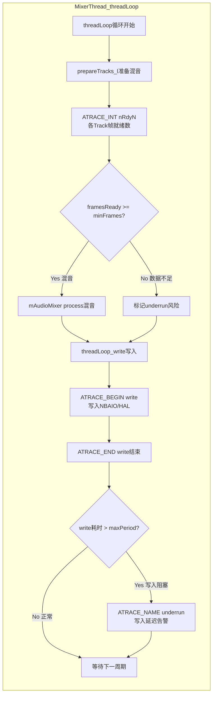
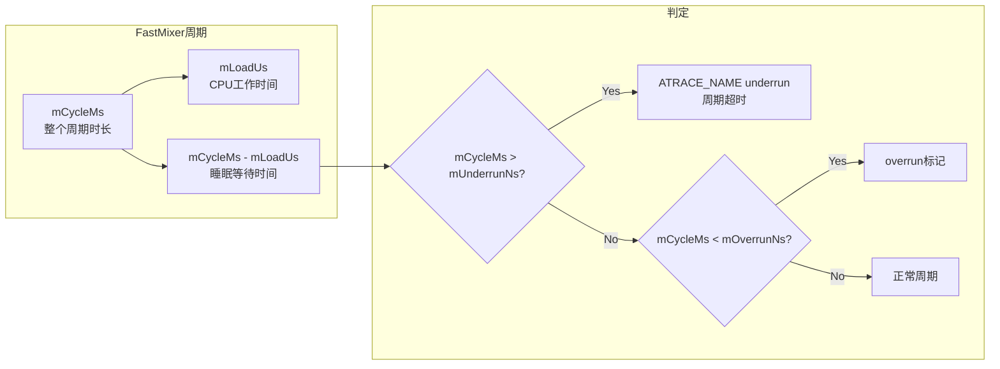
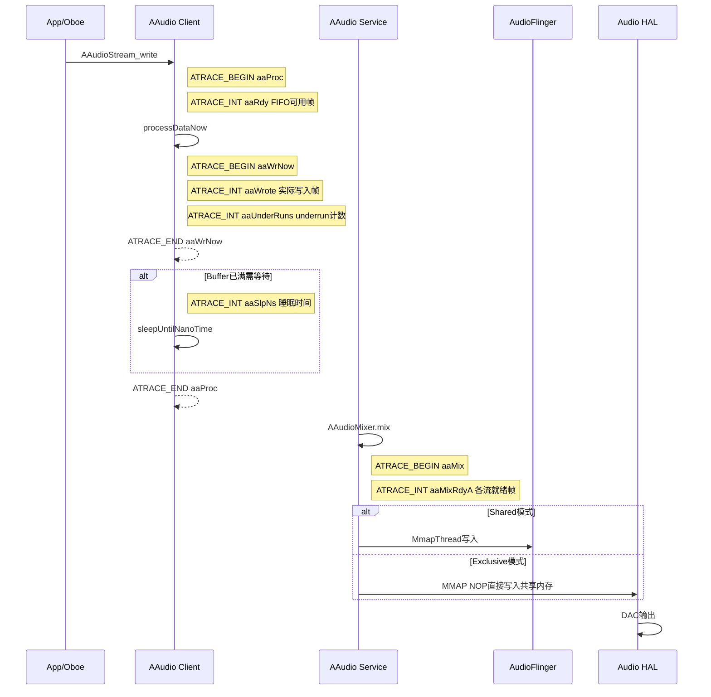
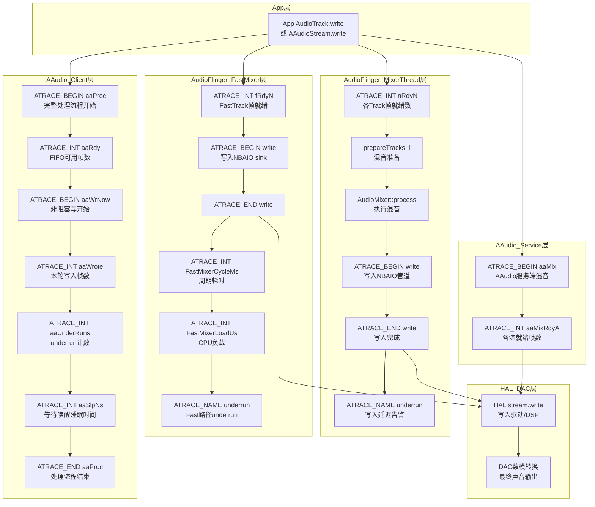
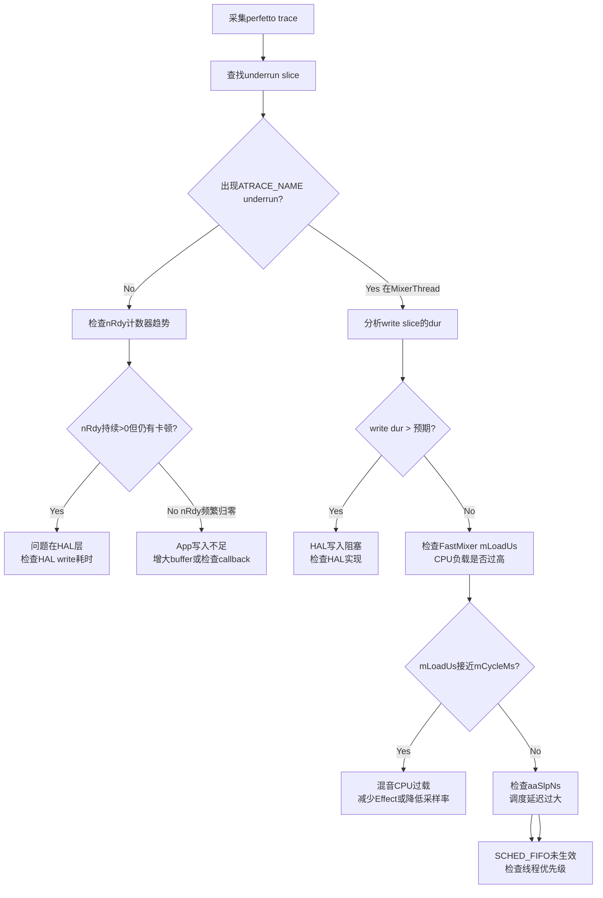

## 17.6 systrace/perfetto音频追踪

> [← 上一个](17_17.5_性能优化建议.md) | [返回目录](README.md) | [下一个 →](17_17.7_AudioFlinger详细dump解读.md)

---


> 音频系统的性能问题（延迟、underrun、调度抖动）往往跨越多个层级，单靠日志难以定位。AOSP14在AudioFlinger、AAudio等关键路径植入了ATRACE追踪点，配合perfetto工具可实现纳秒级全链路性能分析。

### 17.6.1 ATRACE机制概述

ATRACE是Android内核ftrace在用户空间的封装，通过`atrace`命令或perfetto采集后，可在perfetto UI（ui.perfetto.dev）可视化分析。

**ATRACE API分类**（定义在[`include/utils/Trace.h`](system/core/libutils/include/utils/Trace.h)）：

| API | 类型 | 说明 | perfetto中的表现 |
|-----|------|------|-----------------|
| `ATRACE_NAME(name)` | Slice | 自动作用域的切片，出作用域自动结束 | slice表中一条记录，dur=作用域时长 |
| `ATRACE_BEGIN(name)` / `ATRACE_END()` | Slice | 手动配对的切片 | 同上，需手动保证BEGIN/END配对 |
| `ATRACE_INT(name, value)` | Counter | 整数计数器 | counter表中一条记录，可画折线图 |
| `ATRACE_ENABLED()` | 检查 | 返回trace是否启用 | 用于条件追踪，减少不必要开销 |

**音频ATRACE TAG**：所有音频相关源码统一使用`ATRACE_TAG_AUDIO`，在atrace抓取时需启用`audio`分类：

```bash
# 使用atrace抓取音频trace（5秒）
atrace -t 5 audio freq idle am wm view sync

# 使用perfetto抓取（推荐，更灵活）
adb shell perfetto -c - --txt \
  buffers: { size_kb: 65536 } \
  data_sources: { config { name: "linux.ftrace" ftrace_config { 
    ftrace_events: "sched/sched_switch" 
    ftrace_events: "power/cpu_frequency"
    atrace_categories: "audio" 
    atrace_categories: "sched" 
  }}} \
  -o /data/misc/perfetto-traces/audio_trace.pb

# 拉取trace文件
adb pull /data/misc/perfetto-traces/audio_trace.pb
```

### 17.6.2 AudioFlinger PlaybackThread Trace点

AudioFlinger的MixerThread/DirectOutputThread在`threadLoop()`主循环中植入ATRACE点，覆盖混音准备、数据写入、underrun检测三大关键阶段。

**MixerThread threadLoop trace全链路**（源码：[`Threads.cpp`](frameworks/av/services/audioflinger/Threads.cpp)）：



**PlaybackThread核心trace点详细说明**：

| Trace点 | API | 源码位置 | 触发条件 | perfetto中的解读 |
|---------|-----|----------|----------|-----------------|
| `"nRdy"` + TrackId | `ATRACE_INT` | [`Threads.cpp`](frameworks/av/services/audioflinger/Threads.cpp) | prepareTracks_l中每个活跃Track | 值=帧就绪数，持续为0=App未写入 |
| `"nRdy"` + TrackId (Direct) | `ATRACE_INT` | [`Threads.cpp`](frameworks/av/services/audioflinger/Threads.cpp) | DirectPlaybackThread prepareTracks_l | 同上，Direct线程使用 |
| `"write"` | `ATRACE_BEGIN/END` | [`Threads.cpp`](frameworks/av/services/audioflinger/Threads.cpp) | MixerThread写入NBAIO MonoPipe | dur=写入耗时，过长=HAL阻塞 |
| `"write"` (Direct) | `ATRACE_BEGIN/END` | [`Threads.cpp`](frameworks/av/services/audioflinger/Threads.cpp) | DirectThread写入HAL | dur=HAL write耗时 |
| `"underrun"` | `ATRACE_NAME` | [`Threads.cpp`](frameworks/av/services/audioflinger/Threads.cpp) | write耗时超过maxPeriod | 出现=严重写入延迟 |

> **nRdy计数器命名规则**：`nRdy` + TrackId数字，如`nRdy5`、`nRdy12`。同一Track的nRdy计数器持续下降趋向0表示App端数据供给不足，即将发生underrun。

### 17.6.3 FastMixer/FastThread Trace点

FastMixer是低延迟播放的核心路径，使用SCHED_FIFO实时调度，其trace点更精细地追踪周期时间和CPU负载。

**FastThread核心trace点**（源码：[`FastThread.cpp`](frameworks/av/services/audioflinger/FastThread.cpp)）：

| Trace点 | API | 源码位置 | 含义 |
|---------|-----|----------|------|
| `"underrun"` | `ATRACE_NAME` | [`FastThread.cpp`](frameworks/av/services/audioflinger/FastThread.cpp) | Fast路径underrun：上一cycle耗时 > mUnderrunNs阈值 |
| `mCycleMs` | `ATRACE_INT` | [`FastThread.cpp`](frameworks/av/services/audioflinger/FastThread.cpp) | 每cycle实际耗时(ms)，正常值=bufferDuration |
| `mLoadUs` | `ATRACE_INT` | [`FastThread.cpp`](frameworks/av/services/audioflinger/FastThread.cpp) | 每cycle CPU负载(μs)，loadUs/cycleNs = CPU占用比 |

**FastMixer特有trace点**（源码：[`FastMixer.cpp`](frameworks/av/services/audioflinger/FastMixer.cpp)）：

| Trace点 | API | 源码位置 | 含义 |
|---------|-----|----------|------|
| `"fRdy"` + TrackIndex | `ATRACE_INT` | [`FastMixer.cpp`](frameworks/av/services/audioflinger/FastMixer.cpp) | Fast Track帧就绪数，命名如fRdy0、fRdy1 |
| `"write"` | `ATRACE_BEGIN/END` | [`FastMixer.cpp`](frameworks/av/services/audioflinger/FastMixer.cpp) | 写入NBAIO sink的时刻和耗时 |

**FastCapture trace点**（源码：[`FastCapture.cpp`](frameworks/av/services/audioflinger/FastCapture.cpp)）：

| Trace点 | API | 源码位置 | 含义 |
|---------|-----|----------|------|
| `"read"` | `ATRACE_BEGIN/END` | [`FastCapture.cpp`](frameworks/av/services/audioflinger/FastCapture.cpp) | 从HAL输入源读取数据，dur=读取耗时 |

> **FastMixer与MixerThread trace区别**：MixerThread使用`nRdy`前缀，FastMixer使用`fRdy`前缀。在perfetto中通过计数器名称前缀即可区分数据来自哪条路径。

**FastMixer周期性能分析示意图**：



### 17.6.4 Track/PatchTrack层Trace点

Track层trace点追踪数据从App端共享内存到AudioFlinger内部管道的流转过程。

**PlaybackThread::PatchTrack trace点**（源码：[`Tracks.cpp`](frameworks/av/services/audioflinger/Tracks.cpp)）：

| Trace点 | API | 源码位置 | 含义 |
|---------|-----|----------|------|
| `"PTnReq"` + TrackId | `ATRACE_INT` | [`Tracks.cpp`](frameworks/av/services/audioflinger/Tracks.cpp) | PatchTrack请求的帧数 |
| `"PTnObt"` + TrackId | `ATRACE_INT` | [`Tracks.cpp`](frameworks/av/services/audioflinger/Tracks.cpp) | PatchTrack实际获得的帧数 |

**RecordThread::PatchRecord trace点**：

| Trace点 | API | 源码位置 | 含义 |
|---------|-----|----------|------|
| `"PRnObt"` + TrackId | `ATRACE_INT` | [`Tracks.cpp`](frameworks/av/services/audioflinger/Tracks.cpp) | PatchRecord获得的帧数 |
| `"read"` | `ATRACE_NAME` | [`Tracks.cpp`](frameworks/av/services/audioflinger/Tracks.cpp) | PassthruPatchRecord从HAL读取数据 |

> **PTnReq vs PTnObt差异分析**：当`PTnReq` > `PTnObt`时，表示管道中数据不足，Upstream Thread写入速度不够快。如果持续出现，需要检查上游MixerThread是否存在underrun。

### 17.6.5 AudioPolicy间接追踪方法

AudioPolicy Service在AOSP14中未植入ATRACE点（`frameworks/av/services/audiopolicy/`目录无ATRACE调用），但可通过以下方式间接追踪其行为：

**方法一：MediaMetrics事件**

AudioPolicy通过mediametrics记录关键事件（源码：[`AudioPolicyInterfaceImpl.cpp`](frameworks/av/services/audiopolicy/service/AudioPolicyInterfaceImpl.cpp)），可通过`dumpsys media.metrics`查看：

```bash
# 查看AudioPolicy相关metrics
dumpsys media.metrics | grep -A 5 "audio_policy"
```

**方法二：logcat关键事件追踪**

| 事件 | logcat过滤 | 说明 |
|------|-----------|------|
| 设备连接/断开 | `logcat -s audiopolicy` | setDeviceConnectionState调用 |
| 路由决策 | `logcat -s audiopolicy AudioPolicyService` | getOutputForAttr/getInputForAttr结果 |
| 焦点变更 | `logcat -s AudioFocus MediaFocusControl` | requestAudioFocus/abandonAudioFocus |
| 音量调整 | `logcat -s AudioService` | setStreamVolume调整 |

**方法三：perfetto + logcat联动**

在perfetto抓取时同步录制logcat，通过时间戳对齐分析AudioPolicy事件与AudioFlinger trace的因果关系：

```bash
# perfetto + logcat同步采集
adb logcat -v epoch -s audiopolicy AudioService > audio_log.txt &
adb shell perfetto -c - --txt \
  buffers: { size_kb: 65536 } \
  data_sources: { config { name: "linux.ftrace" ftrace_config { 
    atrace_categories: "audio" 
  }}} \
  -t 5s -o /data/misc/perfetto-traces/audio_trace.pb
```

### 17.6.6 AAudio/Oboe Trace点

AAudio客户端库（libaaudio）在播放和录制路径上植入了详细的trace点，用于分析低延迟音频流的数据流状态。

**AAudio播放路径trace点**（源码：[`AudioStreamInternalPlay.cpp`](frameworks/av/media/libaaudio/src/client/AudioStreamInternalPlay.cpp)）：

| Trace点 | API | 源码位置 | 含义 |
|---------|-----|----------|------|
| `"aaWrNow"` | `ATRACE_BEGIN/END` | [`AudioStreamInternalPlay.cpp`](frameworks/av/media/libaaudio/src/client/AudioStreamInternalPlay.cpp) | 非阻塞写数据全过程，dur=写数据处理耗时 |
| `"aaUnderRuns"` | `ATRACE_INT` | [`AudioStreamInternalPlay.cpp`](frameworks/av/media/libaaudio/src/client/AudioStreamInternalPlay.cpp) | AAudio播放流underrun累计计数 |
| `"aaWrote"` | `ATRACE_INT` | [`AudioStreamInternalPlay.cpp`](frameworks/av/media/libaaudio/src/client/AudioStreamInternalPlay.cpp) | 本轮实际写入帧数，持续减少=buffer快满 |

**AAudio录制路径trace点**（源码：[`AudioStreamInternalCapture.cpp`](frameworks/av/media/libaaudio/src/client/AudioStreamInternalCapture.cpp)）：

| Trace点 | API | 源码位置 | 含义 |
|---------|-----|----------|------|
| `"aaOverRuns"` | `ATRACE_INT` | [`AudioStreamInternalCapture.cpp`](frameworks/av/media/libaaudio/src/client/AudioStreamInternalCapture.cpp) | AAudio录制流overrun累计计数 |
| `"aaRead"` | `ATRACE_INT` | [`AudioStreamInternalCapture.cpp`](frameworks/av/media/libaaudio/src/client/AudioStreamInternalCapture.cpp) | 本轮实际读取帧数 |

**AAudio通用处理路径trace点**（源码：[`AudioStreamInternal.cpp`](frameworks/av/media/libaaudio/src/client/AudioStreamInternal.cpp)）：

| Trace点 | API | 源码位置 | 含义 |
|---------|-----|----------|------|
| `"aaProc"` | `ATRACE_BEGIN/END` | [`AudioStreamInternal.cpp`](frameworks/av/media/libaaudio/src/client/AudioStreamInternal.cpp) | 完整processData流程（含阻塞等待），dur=总处理耗时 |
| `"aaRdy"` | `ATRACE_INT` | [`AudioStreamInternal.cpp`](frameworks/av/media/libaaudio/src/client/AudioStreamInternal.cpp) | FIFO中可用帧数，用于判断数据充裕度 |
| `"aaSlpNs"` | `ATRACE_INT` | [`AudioStreamInternal.cpp`](frameworks/av/media/libaaudio/src/client/AudioStreamInternal.cpp) | 等待唤醒前的睡眠时间(ns)，过大=调度延迟 |

**AAudio服务端（oboeservice）trace点**（源码：[`AAudioMixer.cpp`](frameworks/av/services/oboeservice/AAudioMixer.cpp)）：

| Trace点 | API | 源码位置 | 含义 |
|---------|-----|----------|------|
| `"aaMix"` | `ATRACE_BEGIN/END` | [`AAudioMixer.cpp`](frameworks/av/services/oboeservice/AAudioMixer.cpp) | AAudio服务端混音过程 |
| `"aaMixRdy#"` + 字母 | `ATRACE_INT` | [`AAudioMixer.cpp`](frameworks/av/services/oboeservice/AAudioMixer.cpp) | 各Stream在FIFO中的就绪帧数（aaMixRdyA, aaMixRdyB...） |

**AAudio MMAP策略配置**（源码：[`PropertyUtils.cpp`](frameworks/av/services/audioflinger/PropertyUtils.cpp)）：

| Property | 默认值 | 说明 | 影响trace表现 |
|----------|--------|------|--------------|
| `aaudio.mmap_policy` | NEVER(1) | MMAP默认策略 | AUTO/ALWAYS时出现MmapThread |
| `aaudio.mmap_exclusive_policy` | UNSPECIFIED | MMAP Exclusive策略 | ALWAYS时AAudio走exclusive路径 |
| `aaudio.mixer_bursts` | 2 | AAudio Mixer burst数 | 影响aaMix触发频率 |
| `aaudio.hw_burst_min_usec` | 1000 | 硬件burst最小时长(μs) | 影响MMAP buffer大小 |

```bash
# 查看当前AAudio property配置
adb shell getprop aaudio.mmap_policy
adb shell getprop aaudio.mmap_exclusive_policy
adb shell getprop aaudio.mixer_bursts
adb shell getprop aaudio.hw_burst_min_usec

# 启用MMAP AUTO模式（需重启audioserver）
adb shell setprop aaudio.mmap_policy 2
adb shell killall audioserver
```

**AAudio完整数据流trace链路图**：



使用perfetto UI（ui.perfetto.dev）分析音频trace时，SQL查询是核心分析手段。以下提供针对音频各子系统的实用查询模板。

**查询1：AudioFlinger线程调度分析**

```sql
-- 查看AudioFlinger各线程的运行/调度状态
SELECT 
  ts,
  dur / 1e6 AS dur_ms,
  name,
  track_id
FROM slice
WHERE name IN ('write', 'underrun')
  OR name LIKE 'nRdy%'
ORDER BY ts
LIMIT 100;
```

**查询2：FastMixer周期性能统计**

```sql
-- FastMixer cycle时间和CPU负载分析
SELECT 
  ts / 1e9 AS time_sec,
  name,
  value
FROM counter
WHERE name IN ('FastMixerCycleMs', 'FastMixerLoadUs')
  OR name LIKE 'fRdy%'
ORDER BY ts
LIMIT 200;
```

**查询3：AAudio流状态追踪**

```sql
-- AAudio播放流关键指标
SELECT 
  ts / 1e9 AS time_sec,
  name,
  value
FROM counter
WHERE name IN ('aaRdy', 'aaWrote', 'aaUnderRuns', 'aaSlpNs')
ORDER BY ts
LIMIT 200;
```

**查询4：underrun事件关联分析**

```sql
-- 查找underrun slice，关联前后的nRdy计数器变化
WITH underrun_events AS (
  SELECT ts, dur, track_id
  FROM slice
  WHERE name = 'underrun'
  ORDER BY ts
  LIMIT 20
)
SELECT 
  u.ts / 1e9 AS underrun_time_sec,
  u.dur / 1e6 AS underrun_dur_ms,
  c.name AS counter_name,
  c.value AS counter_value_before_underrun
FROM underrun_events u
JOIN counter c ON c.ts BETWEEN u.ts - 100000000 AND u.ts
WHERE c.name LIKE 'nRdy%'
ORDER BY u.ts, c.name;
```

**查询5：音频线程唤醒延迟分析**

```sql
-- 分析AudioFlinger线程的调度延迟
SELECT
  ts,
  dur / 1e6 AS sched_latency_ms,
  name
FROM slice
WHERE track_id IN (
  SELECT id FROM thread_track 
  WHERE name LIKE '%AudioFlinger%' OR name LIKE '%FastMixer%'
)
AND dur > 1000000
ORDER BY dur DESC
LIMIT 50;
```

**查询6：AAudio写入性能统计**

```sql
-- AAudio aaProc完整处理时间分布
SELECT
  name,
  COUNT(*) AS count,
  AVG(dur / 1e6) AS avg_ms,
  MIN(dur / 1e6) AS min_ms,
  MAX(dur / 1e6) AS max_ms,
  P50(dur / 1e6) AS p50_ms,
  P99(dur / 1e6) AS p99_ms
FROM slice
WHERE name IN ('aaProc', 'aaWrNow', 'aaMix', 'write')
GROUP BY name;
```

### 17.6.7 播放延迟全链路Trace分析流程图

以下流程图展示从App写入到DAC输出的完整trace链路，标注了各层ATRACE点的位置和含义：



### 17.6.8 延迟分析实战：从trace到根因

**场景：音乐播放出现间歇性卡顿**



**根因分析快速参考表**：

| 症状 | 关键trace指标 | 可能根因 | 修复建议 |
|------|-------------|----------|----------|
| 偶发卡顿 | `nRdy`间歇归零 | App写入不及时 | 增大bufferSize，使用callback模式 |
| 持续卡顿 | `underrun`频繁出现 | 系统级调度问题 | 检查SCHED_FIFO，关闭CPU省电模式 |
| FastMixer underrun | `mCycleMs` > 预期 | HAL write阻塞 | 检查HAL实现，减少write耗时 |
| AAudio高延迟 | `aaSlpNs`过大 | 调度唤醒延迟 | 启用MMAP exclusive模式 |
| 混音CPU过载 | `mLoadUs`接近`mCycleMs` | Effect过多 | 减少Effect Chain，使用Offload |

---

