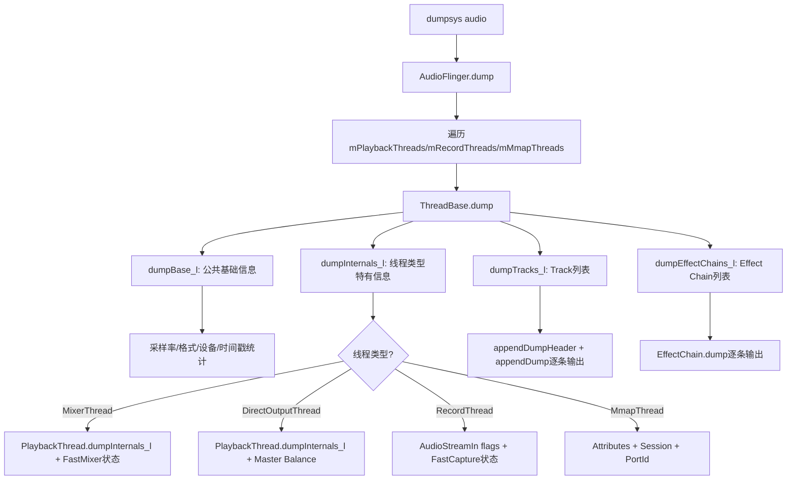
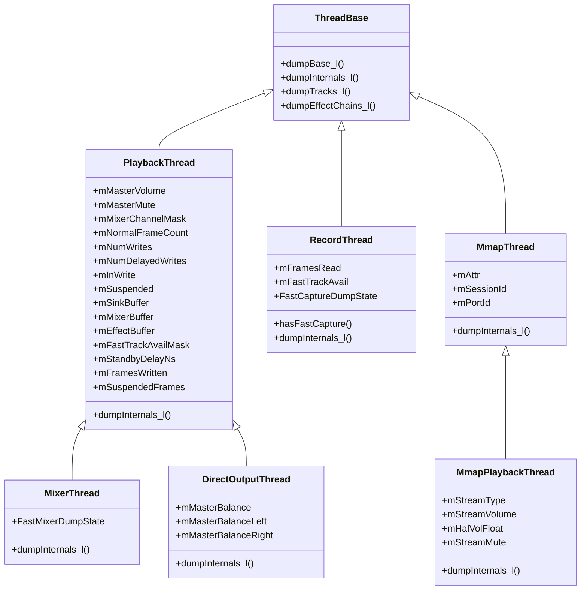
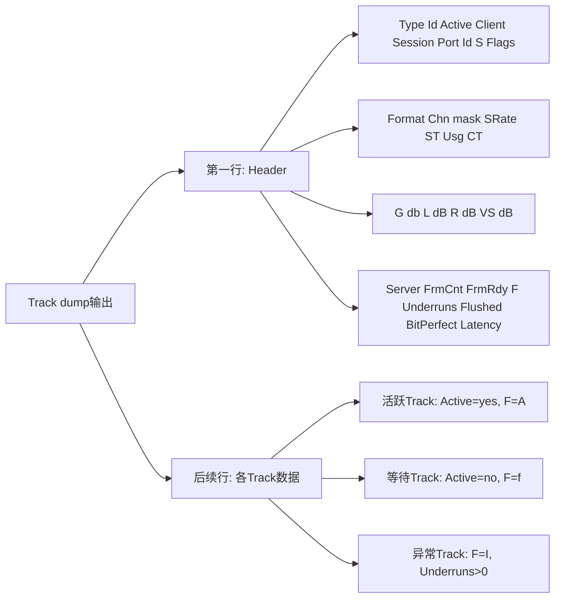
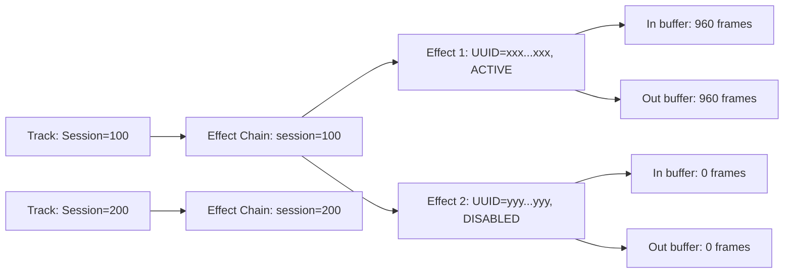
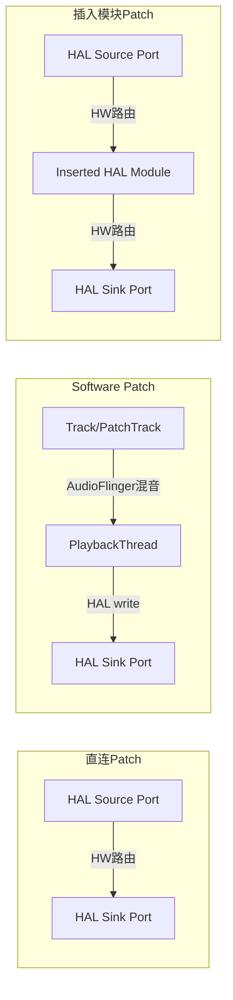
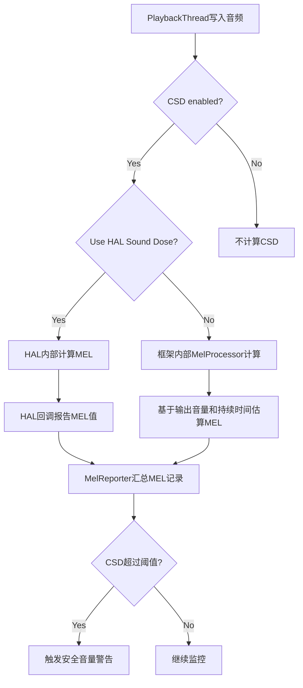
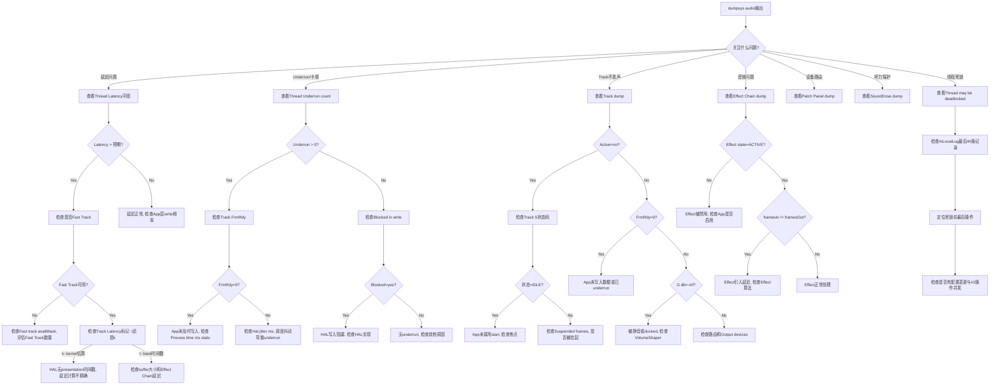

## 17.7 AudioFlinger详细dump解读

> [← 上一个](17_17.6_systraceperfetto音频追踪.md) | [返回目录](README.md) | [下一个 →](17_17.8_AAOS_CarAudio调试.md)

---


### 17.7.1 dump调用链与层次结构

AudioFlinger的dump由`dumpsys audio`触发，整体调用链如下：



**dump入口源码**（[`Threads.cpp`](frameworks/av/services/audioflinger/Threads.cpp)）：

```cpp
void AudioFlinger::ThreadBase::dump(int fd, const Vector<String16>& args) {
    dprintf(fd, "\n%s thread %p, name %s, tid %d, type %d (%s):\n",
            isOutput() ? "Output" : "Input",
            this, mThreadName, getTid(), type(), threadTypeToString(type()));
    bool locked = AudioFlinger::dumpTryLock(mLock);
    if (!locked) {
        dprintf(fd, "  Thread may be deadlocked\n");  // 关键：死锁告警
    }
    dumpBase_l(fd, args);       // 公共基础字段
    dumpInternals_l(fd, args);  // 子类特有字段
    dumpTracks_l(fd, args);     // Track列表
    dumpEffectChains_l(fd, args); // Effect Chain列表
    // ...
    mLocalLog.dump(fd, "   " /* prefix */, 40 /* lines */); // 最近40条本地日志
}
```

> **调试要点**：如果dump输出中出现`Thread may be deadlocked`，说明该线程持有mLock超过3秒，极有可能存在死锁问题，需结合`mLocalLog`最后几条记录定位。

### 17.7.2 dumpBase_l公共字段详解

所有Thread类型共享的基础字段（[`Threads.cpp`](frameworks/av/services/audioflinger/Threads.cpp)）：

| 字段 | 含义 | 正常参考值 | 异常关注点 |
|------|------|-----------|-----------|
| I/O handle | 线程唯一io_handle | 正整数 | 用于跨服务定位线程 |
| Standby | 是否待机 | 活跃时=no | 活跃播放时应=no |
| Sample rate | 线程采样率 | 48000 Hz | 与HAL配置一致 |
| HAL frame count | HAL缓冲区帧数 | 960/1920 | 影响延迟 |
| HAL format | HAL音频格式 | 0x5 (PCM_FLOAT) | 与Device能力匹配 |
| HAL buffer size | HAL缓冲区字节 | 7680 | =frameCount×frameSize |
| Channel count | 通道数 | 2(立体声) | 与Channel mask对应 |
| Channel mask | 通道掩码 | 0x3(STEREO) | 影响混音路径 |
| Processing format | 内部处理格式 | 0x5 (PCM_FLOAT) | MixerThread固定PCM_FLOAT |
| Processing frame size | 处理帧字节 | 8(2ch×4B) | =chCount×bytesPerSample |
| Output devices | 输出设备类型 | SPEAKER等 | 音频路由目标 |
| Input device | 输入设备类型 | BUILTIN_MIC等 | 录音源 |
| Audio source | 音频源 | VOICE_RECOGNITION等 | 影响HAL预处理 |
| Timestamp stats | 时间戳统计 | variance小 | 方差大=时钟漂移 |
| Last write/read occurred | 最近IO时间(ms) | <50ms | >500ms可能线程卡住 |
| Process time ms stats | 处理耗时统计 | mean<5ms | mean>10ms=CPU负载高 |
| Hal write/read jitter ms | HAL IO抖动统计 | std<2ms | std>5ms=调度不稳定 |
| Threadloop latency stats | 线程循环延迟 | mean<20ms | mean>40ms=延迟过高 |
| Monopipe pipe depth stats | 管道深度统计 | mean接近0 | 深度大=Fast路径瓶颈 |

> **关键统计字段**：`Process time ms stats`和`Hal jitter ms stats`是AOSP14新增的统计字段，格式为`n=N, mean=X.X, min=X.X, max=X.X, variance=X.X`，方差(variance)是判断系统稳定性的重要指标。

### 17.7.3 各线程类型dumpInternals_l差异



**PlaybackThread特有字段**（[`Threads.cpp`](frameworks/av/services/audioflinger/Threads.cpp)）：

| 字段 | 含义 | 调试关注点 |
|------|------|-----------|
| Master volume | 主音量值(0.0-1.0) | 为0时所有Track静音 |
| Master mute | 主静音状态(on/off) | on时所有Track静音 |
| Mixer channel Mask | 混音通道掩码 | 影响下混策略 |
| Haptic channel mask | 触觉通道掩码 | 非NONE时有触觉通道 |
| Normal frame count | 正常模式帧数 | 960=20ms@48kHz |
| Total writes | threadLoop总写入次数 | 持续增长=线程正常 |
| Delayed writes | 延迟写入次数 | >0表示写入跟不上 |
| Blocked in write | 当前是否写阻塞 | yes=线程卡在HAL写入 |
| Suspend count | 挂起计数 | >0=线程被挂起 |
| Sink buffer | 混音输出buffer指针 | 用于内存诊断 |
| Mixer buffer | 混音工作buffer指针 | 非NULL=使用float混音 |
| Effect buffer | Effect工作buffer指针 | 非NULL=有Effect处理 |
| Fast track availMask | 可用Fast Track位图 | 0xFF=8个Fast Track全可用 |
| Standby delay ns | 待机超时(纳秒) | 通常3秒 |
| Frames written | 已写入总帧数 | 用于计算播放时长 |
| Suspended frames | 挂起期间丢失帧数 | >0=有播放中断 |
| PipeSink frames written | 管道写入帧数 | FastMixer管道指标 |
| AudioStreamOut flags | HAL输出流标志 | 含FAST=支持低延迟 |

**DirectOutputThread额外字段**（[`Threads.cpp`](frameworks/av/services/audioflinger/Threads.cpp)）：

| 字段 | 含义 | 调试关注点 |
|------|------|-----------|
| Master balance | 主平衡值(-1.0~1.0) | 0=居中 |
| Left | 左声道增益 | 受balance影响 |
| Right | 右声道增益 | 受balance影响 |

**RecordThread特有字段**（[`Threads.cpp`](frameworks/av/services/audioflinger/Threads.cpp)）：

| 字段 | 含义 | 调试关注点 |
|------|------|-----------|
| AudioStreamIn flags | HAL输入流标志 | FAST=低延迟录制 |
| Frames read | 已读取总帧数 | 用于计算录制时长 |
| Fast capture thread | 是否有FastCapture | yes=低延迟录制路径 |
| Fast track available | Fast Track是否可用 | no=Fast路径被占用 |

**MmapThread特有字段**（[`Threads.cpp`](frameworks/av/services/audioflinger/Threads.cpp)）：

| 字段 | 含义 | 调试关注点 |
|------|------|-----------|
| Attributes content type | 内容类型 | SPEECH/MUSIC等 |
| Attributes usage | 用途 | MEDIA/VOICE_COMMUNICATION等 |
| Attributes source | 音频源 | MIC/VOICE_COMMUNICATION等 |
| Session | Session ID | 与AAudio流对应 |
| Port Id | Audio Port ID | 路由标识 |

**MmapPlaybackThread额外字段**（[`Threads.cpp`](frameworks/av/services/audioflinger/Threads.cpp)）：

| 字段 | 含义 | 调试关注点 |
|------|------|-----------|
| Stream type | 流类型 | 通常MUSIC |
| Stream volume | 流音量 | 0.0-1.0 |
| HAL volume | HAL侧音量 | 与Stream volume不同=HAL控制 |
| Stream mute | 流静音 | true=该流静音 |

### 17.7.4 Track dump完整字段说明

Track dump格式由[`Tracks.cpp`](frameworks/av/services/audioflinger/Tracks.cpp)定义，采用定宽列格式输出。

**Track dump输出结构**：



**Header格式**：
```
Type Id Active Client Session Port Id S Flags   Format Chn mask SRate
ST Usg CT  G db L dB R dB VS dB   Server FrmCnt FrmRdy F Underruns Flushed BitPerfect Latency
```

**字段详解**（源码：[`Tracks.cpp`](frameworks/av/services/audioflinger/Tracks.cpp)）：

| 字段 | 含义 | 输出格式 | 调试关注点 |
|------|------|---------|-----------|
| Type | Track类型 | S=Static,P=Patch,F=Fast | Fast=低延迟路径 |
| Id | Track唯一ID | %6u | 定位特定Track |
| Active | 是否活跃 | yes/no | 活跃Track应被混合 |
| Client | 客户端PID | %7u | 确认是哪个App |
| Session | 音频Session ID | %7u | 关联Effect Chain |
| Port Id | Audio Port ID | %7u | 路由到特定设备 |
| S | Track状态码 | 2字符 | 见下方状态码表 |
| Flags | CBLK mFlags | 0x03X | 含underrun标志 |
| Format | 音频格式 | 0xXXXXXXXX | 不匹配=重采样 |
| Chn mask | 通道掩码 | 0xXXXXXXXX | 不匹配=重采样 |
| SRate | 采样率 | %6u | ≠线程采样率=重采样 |
| ST | Stream Type | %2u | 音频流类型 |
| Usg | AudioAttributes.usage | %3x | 用途属性(hex) |
| CT | content_type | %2x | 内容类型(hex) |
| G db | 最终增益 | %5.2g dB | -inf=被静音 |
| L dB | 左声道客户端音量 | %5.2g dB | 客户端侧音量 |
| R dB | 右声道客户端音量 | %5.2g dB | 客户端侧音量 |
| VS dB | VolumeShaper音量 | %5.2g dB+标记 | A=VolumeShaper活跃 |
| Server | CBLK mServer位置 | %08X | 服务端写位置(hex) |
| FrmCnt | Buffer帧数 | %6zu+修饰符 | r=缩减,e=错误 |
| FrmRdy | 帧就绪数 | %6zu | 0=underrun风险 |
| F | 填充状态 | 单字符 | 见下方填充状态表 |
| Underruns | underrun帧计数 | %9u+修饰符 | >0=数据饥饿 |
| Flushed | flush帧计数 | %7u | 频繁flush=播放中断 |
| BitPerfect | BitPerfect模式 | true/false | 直通模式标志 |
| Latency | 延迟值 | %7.2lf+来源标记 | t=track时间戳,k=kernel |

**Track状态码（S字段）**：

| 状态码 | 含义 | 说明 |
|--------|------|------|
| ID | IDLE | Track已创建但未启动 |
| R | RESUMING | 从暂停恢复中 |
| ST | STARTED | Track已启动 |
| PA | PAUSING | 正在暂停 |
| ST | STOPPED | Track已停止 |
| FL | FLUSHED | Track已刷新 |
| JR | JITTER_UNDERRUN | 轻微数据不足 |
| UR | UNDERRUN | 严重数据不足 |

**填充状态（F字段）**（[`Tracks.cpp`](frameworks/av/services/audioflinger/Tracks.cpp)）：

| 状态码 | 枚举值 | 含义 |
|--------|--------|------|
| f | FS_FILLING | 正在填充，数据不足 |
| F | FS_FILLED | 填充完成 |
| A | FS_ACTIVE | 活跃播放中 |
| I | FS_INVALID | 无效状态，需关注 |

**Latency来源标记**（[`Tracks.cpp`](frameworks/av/services/audioflinger/Tracks.cpp)）：

| 标记 | 含义 | 精度 |
|------|------|------|
| t | 从track时间戳计算 | 最精确，基于HAL presentation时间 |
| k | 从kernel估算 | 精度较低，基于write位置 |
| unavail | 不可用 | mServer!=0但计算失败 |
| new | 新Track | mServer==0，尚未播放 |

> **实战解读示例**：
> ```
>   F   2 yes   12345  10001  42  ID 0x000 00000005 00000003  48000  3   1  2  -2.1 -4.2 -4.2 -1.5A 00001000   960  480 A         0         0    false    3.42 t
> ```
> 解读：Fast Track, ID=2, 活跃, PID=12345, Session=10001, Port=42, 状态IDLE(?),
> PCM_FLOAT格式(0x5), STEREO(0x3), 48kHz, StreamType=3, usage=1, contentType=2,
> 最终增益-2.1dB, 左右声道-4.2dB, VolumeShaper-1.5dB(活跃),
> Server位置0x1000, FrmCnt=960, FrmRdy=480(半满), 填充状态Active,
> 无underrun, 无flush, 非BitPerfect, 延迟3.42ms(来自track时间戳)

### 17.7.5 Effect Chain dump解读

Effect Chain dump格式（源码：[`Effects.cpp`](frameworks/av/services/audioflinger/Effects.cpp)）：

```
N effects for session S
  In buffer [frameInfo]   Out buffer [frameInfo]   Active tracks: M
  Effect N: [uuid] [name] [state] [framesIn] [framesOut]
```

**Effect Chain与Track的绑定关系**：



**关键字段解读**：

| 字段 | 含义 | 调试关注点 |
|------|------|-----------|
| session | 音频Session ID | 必须与Track Session ID对应 |
| Active tracks | 被处理的活跃Track数 | =0时Effect Chain应进入idle |
| In buffer | 输入buffer帧信息和格式 | 格式=Effect输入要求 |
| Out buffer | 输出buffer帧信息和格式 | 格式≠In buffer=有格式转换 |
| Effect UUID | Effect唯一标识 | 用于确认Effect类型 |
| Effect name | Effect名称 | 直观识别Effect类型 |
| Effect state | 处理状态 | 只有ACTIVE才处理音频 |
| framesIn/framesOut | Effect帧计数 | 差异=Effect引入延迟 |

**Effect状态枚举**：

| 状态 | 含义 | 音频处理 |
|------|------|---------|
| ACTIVE | 活跃 | 正在处理音频 |
| INITIALIZED | 已初始化 | 不处理，等待激活 |
| DISABLED | 已禁用 | 不处理，被App禁用 |
| UNINITIALIZED | 未初始化 | 不可用 |

> **延迟诊断**：如果framesIn和framesOut持续不等（差异>0），说明Effect引入了额外延迟。对于低延迟场景（如VoIP），需评估是否应绕过Effect Chain。

### 17.7.6 Patch Panel dump解读

Patch Panel dump（源码：[`PatchPanel.cpp`](frameworks/av/services/audioflinger/PatchPanel.cpp)）展示当前所有Audio Patch连接：

```
Patches:
  Patch handle N: [source ports] -> [sink ports] [type]
Tracked inserted modules:
  Module: [name] [handle] [streams]
```

**Audio Patch类型与数据流**：



**关键字段解读**：

| 字段 | 含义 | 调试关注点 |
|------|------|-----------|
| Patch handle | Patch唯一句柄 | 用于跨服务追踪 |
| Source ports | Patch源端口列表 | 含Audio Port ID和设备类型 |
| Sink ports | Patch目的端口列表 | 含Audio Port ID和设备类型 |
| Patch type | 类型标识 | Software=需线程转发 |
| Inserted modules | 插入的HAL模块 | 影响音频路径和延迟 |

**Software Patch vs 直连Patch**：
- **直连Patch**：HAL内部路由，零额外延迟，AudioFlinger仅创建路由不参与数据传输
- **Software Patch**：需要AudioFlinger内部线程（PatchTrack→PlaybackThread）转发数据，存在混音延迟
- **判断方法**：dump中标注`software`字样或source/sink涉及软件端口

> **实战场景**：AAOS中多Zone音频通常使用Software Patch，通过PatchTrack将一个Zone的输出转发到另一个Zone的输入，需关注PatchTrack的FrmRdy和Underruns字段。

### 17.7.7 MelReporter/SoundDose dump解读

MelReporter负责CSD（Cumulative Sound Dose）计算，用于EU听力保护合规（源码：[`MelReporter.cpp`](frameworks/av/services/audioflinger/MelReporter.cpp)）：

```
Sound Dose:
  CSD enabled: true/false
  Use HAL Sound Dose: true/false
  MEL values: [list of MEL recordings]
  CSD value: X (cumulative dose)
```

**听力保护数据流**：



**关键字段解读**：

| 字段 | 含义 | 调试关注点 |
|------|------|-----------|
| CSD enabled | 是否启用听力保护 | EU设备应为true |
| Use HAL Sound Dose | HAL是否负责MEL计算 | true=HAL计算更精确 |
| MEL values | 瞬时声音暴露级别记录 | 每条记录含时间和MEL值 |
| CSD value | 累积声音暴露值 | 超过阈值触发警告 |

> **OEM注意**：EU标准EN 50332-3要求CSD合规。如果`Use HAL Sound Dose=false`，框架基于输出音量估算MEL，精度较低。建议HAL实现ISoundDose接口提供精确MEL值。

### 17.7.8 dump解析决策树



### 17.7.9 dump实战分析案例

**案例1：音乐播放underrun诊断**

```
Output thread 0x7f8c1234000, name AudioOut_D, tid 1234, type 0 (MixerThread):
  ...
  Total writes: 123456
  Delayed writes: 47           ← 延迟写入47次
  Blocked in write: yes        ← 当前写阻塞
  ...
  2 Tracks of which 2 are active
    F   1 yes  10123  1001  10  ID 0x000 00000005 00000003  48000 ...
       ... 00005000   960     0 f        15         0    false   28.50 t
                                                                    ↑ FrmRdy=0  ↑ underrun
```

**诊断步骤**：
1. `Blocked in write: yes` → HAL写入阻塞，threadLoop卡在`mOutput->write()`
2. `FrmRdy=0` + `F=f` → Track数据饥饿，App未及时写入
3. `Underruns=15` → 已发生15次underrun
4. `Latency=28.50 t` → 延迟28.5ms，高于Fast路径典型值(<10ms)
5. **根因**：App写入线程优先级不够或被GC暂停

**案例2：录音无数据诊断**

```
Input thread 0x7f8c5678000, name AudioIn_1, tid 5678, type 1 (RecordThread):
  AudioStreamIn: 0x7f8c1111111 flags 0x1 (FAST)
  Frames read: 0               ← 未读取任何帧
  No active record clients     ← 无活跃录音客户端
  Fast capture thread: yes
  Fast track available: yes
```

**诊断步骤**：
1. `Frames read: 0` → HAL未提供任何数据
2. `No active record clients` → 无活跃RecordTrack
3. **根因**：App创建了AudioRecord但未调用start()，或焦点未获得

**案例3：AAOS多Zone音频路由诊断**

```
Patches:
  Patch handle 15: [port 3 (bus_100_media_out)] -> [port 7 (bus_200_zone2_in)] [software]
  Patch handle 16: [port 4 (bus_101_nav_out)] -> [port 8 (bus_201_zone2_nav_in)] [software]
```

**诊断步骤**：
1. 两个Patch都是`[software]` → 通过AudioFlinger PatchTrack转发
2. 如果Zone2听不到导航声：
   - 检查Patch handle 16的PatchTrack FrmRdy是否为0
   - 检查Zone2的PlaybackThread是否活跃
   - 检查CarVolumeGroup中Navigation Context的音量

---

