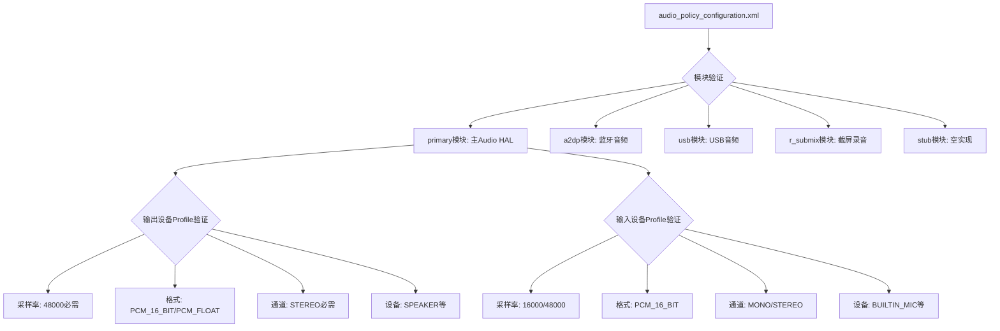
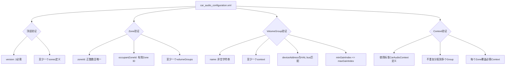

## 17.9 AudioPolicy配置验证

> [← 上一个](17_17.8_AAOS_CarAudio调试.md) | [返回目录](README.md) | [下一个 →](17_17.10_延迟调试深度指南.md)

---


### 17.9.1 audio_policy_configuration.xml验证

AudioPolicy配置文件是音频系统的核心配置，定义了设备、路由、格式等规则。

**配置验证方法**：

```bash
# 方法1：检查AudioPolicyManager加载日志
adb logcat -s AudioPolicyManager AudioPolicyConfig

# 方法2：查看已加载的配置摘要
adb shell dumpsys audio | head -100

# 方法3：直接查看配置文件
adb shell cat /vendor/etc/audio_policy_configuration.xml

# 方法4：验证配置是否被正确解析
adb shell dumpsys audio policy_rules
```

**配置文件关键验证点**：



**常见配置错误与修复**：

| 错误类型 | 症状 | 诊断方法 | 修复方案 |
|----------|------|---------|---------|
| 缺少必需采样率 | 某格式播放失败 | 检查Profile的sampleRates | 添加48000Hz |
| 缺少必需格式 | AudioTrack创建失败 | 检查Profile的formats | 添加PCM_16_BIT |
| 通道掩码不匹配 | 单/双声道路由错误 | 检查Profile的channelMasks | 添加STEREO |
| 设备未声明 | 音频无法路由到设备 | 检查attachedDevices | 添加设备到列表 |
| 缺少defaultOutputDevice | 无默认输出 | 检查defaultOutputDevice | 设置SPEAKER |
| module版本不匹配 | HAL加载失败 | 检查halVersion | 匹配HAL实现版本 |
| 地址缺失 | USB/A2DP无法路由 | 检查address属性 | 添加MAC/USB地址 |

> **AOSP14变化**：AIDL Audio HAL要求module版本为`3.0`或更高，HIDL版本为`2.0`。如果配置文件halVersion与实际HAL实现不匹配，AudioFlinger会拒绝加载该模块。

### 17.9.2 car_audio_configuration.xml验证

AAOS特有的CarAudio配置文件，定义Zone、Volume Group和Device绑定。

**配置验证命令**：

```bash
# 查看CarAudio配置加载日志
adb logcat -s CarAudioService CarAudioConfiguration

# 查看已加载的CarAudio配置
adb shell dumpsys car_audio

# 查看原始配置文件
adb shell cat /vendor/etc/car_audio_configuration.xml

# 验证Zone与设备绑定
adb shell dumpsys car_audio zones
```

**car_audio_configuration.xml结构验证**：



**AAOS配置常见错误**：

| 错误类型 | 症状 | 诊断方法 | 修复方案 |
|----------|------|---------|---------|
| Zone ID冲突 | Zone无法初始化 | 检查zoneId唯一性 | 修改重复的zoneId |
| Context分配冲突 | 音频路由到错误Zone | 检查Context在VolumeGroup间分配 | 确保Context唯一归属 |
| Device Address不匹配 | HAL bus找不到 | 对比配置与HAL bus列表 | 修正deviceAddress |
| 缺少必需Context | 某音频流无法路由 | 检查EMERGENCY/SAFETY等 | 添加缺失Context |
| Volume步骤为0 | 音量无法调节 | 检查step值 | 设置>=1的步长 |
| version字段缺失 | 配置解析失败 | 检查根元素version属性 | 添加version="2" |
| OccupantZoneId无效 | 乘客音频无法路由 | 检查OccupantZone分配 | 确保Zone ID有效 |

> **OEM定制要点**：
> 1. `version="2"`是AAOS CarAudio V2配置格式的必需属性
> 2. 每个VolumeGroup必须绑定一个HAL bus设备地址
> 3. EMERGENCY和SAFETY Context建议分配到独立VolumeGroup
> 4. 动态Zone（Dynamic Audio Zone）需在配置中声明`isDynamic="true"`

### 17.9.3 配置验证自动化脚本

```bash
#!/bin/bash
# audio_policy_validator.sh — AudioPolicy配置验证脚本
# 用法: ./audio_policy_validator.sh [device_serial]

DEVICE=${1:-""}
ADB="adb ${DEVICE:+-s $DEVICE}"

echo "=== AudioPolicy配置验证 ==="

# 1. 检查配置文件是否存在
echo "[1] 检查配置文件..."
for f in \
  /vendor/etc/audio_policy_configuration.xml \
  /vendor/etc/car_audio_configuration.xml \
  /vendor/etc/audio_policy_volumes.xml \
  /vendor/etc/default_volume_tables.xml; do
  if $ADB shell test -f $f && echo "$f: EXISTS" || echo "$f: MISSING"; then
    :
  fi
done

# 2. 验证primary模块
echo -e "\n[2] 验证primary模块..."
$ADB shell cat /vendor/etc/audio_policy_configuration.xml | \
  grep -q '<module name="primary"' && echo "primary module: OK" || echo "primary module: MISSING!"

# 3. 检查必需输出设备
echo -e "\n[3] 检查必需输出设备..."
for dev in SPEAKER; do
  $ADB shell cat /vendor/etc/audio_policy_configuration.xml | \
    grep -q "$dev" && echo "$dev: OK" || echo "$dev: MISSING!"
done

# 4. 验证采样率
echo -e "\n[4] 验证48kHz采样率支持..."
$ADB shell cat /vendor/etc/audio_policy_configuration.xml | \
  grep -q '48000' && echo "48kHz: OK" || echo "48kHz: MISSING!"

# 5. AAOS配置验证
echo -e "\n[5] 验证CarAudio配置..."
$ADB shell cat /vendor/etc/car_audio_configuration.xml | \
  grep -q 'version="2"' && echo "CarAudio V2: OK" || echo "CarAudio V2: MISSING or WRONG VERSION!"

# 6. Zone验证
echo -e "\n[6] Zone验证..."
ZONE_COUNT=$($ADB shell cat /vendor/etc/car_audio_configuration.xml | \
  grep -c '<zone ')
echo "Zone数量: $ZONE_COUNT"
if [ "$ZONE_COUNT" -lt 1 ]; then
  echo "WARNING: 至少需要一个Zone定义!"
fi

# 7. Context覆盖验证
echo -e "\n[7] Context覆盖验证..."
for ctx in MUSIC NAVIGATION VOICE_COMMAND CALL_RING ALARMS NOTIFICATION SYSTEM SAFETY EMERGENCY; do
  $ADB shell cat /vendor/etc/car_audio_configuration.xml | \
    grep -q "$ctx" && echo "$ctx: OK" || echo "$ctx: MISSING!"
done

echo -e "\n=== 验证完成 ==="
```

---

