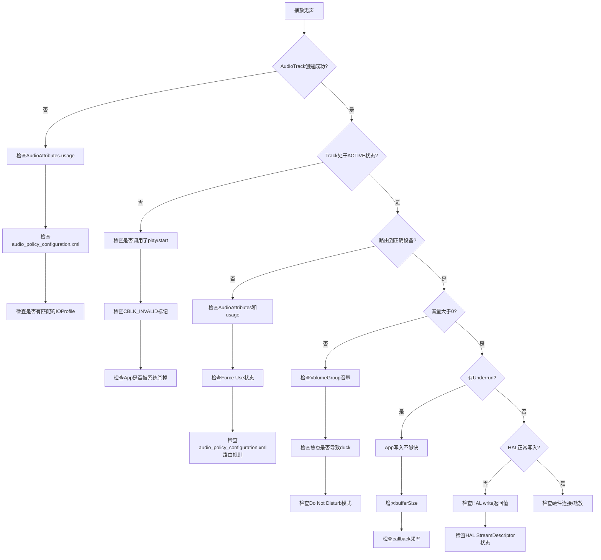
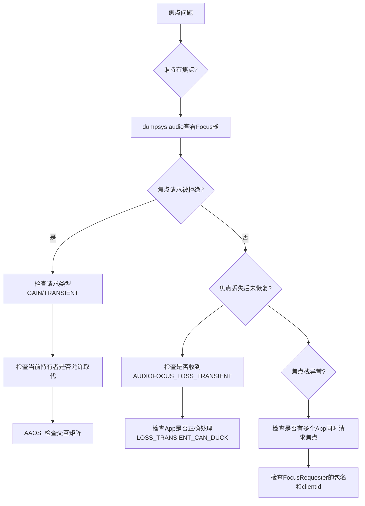
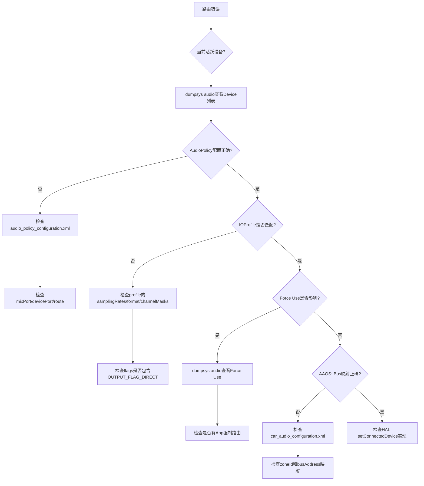
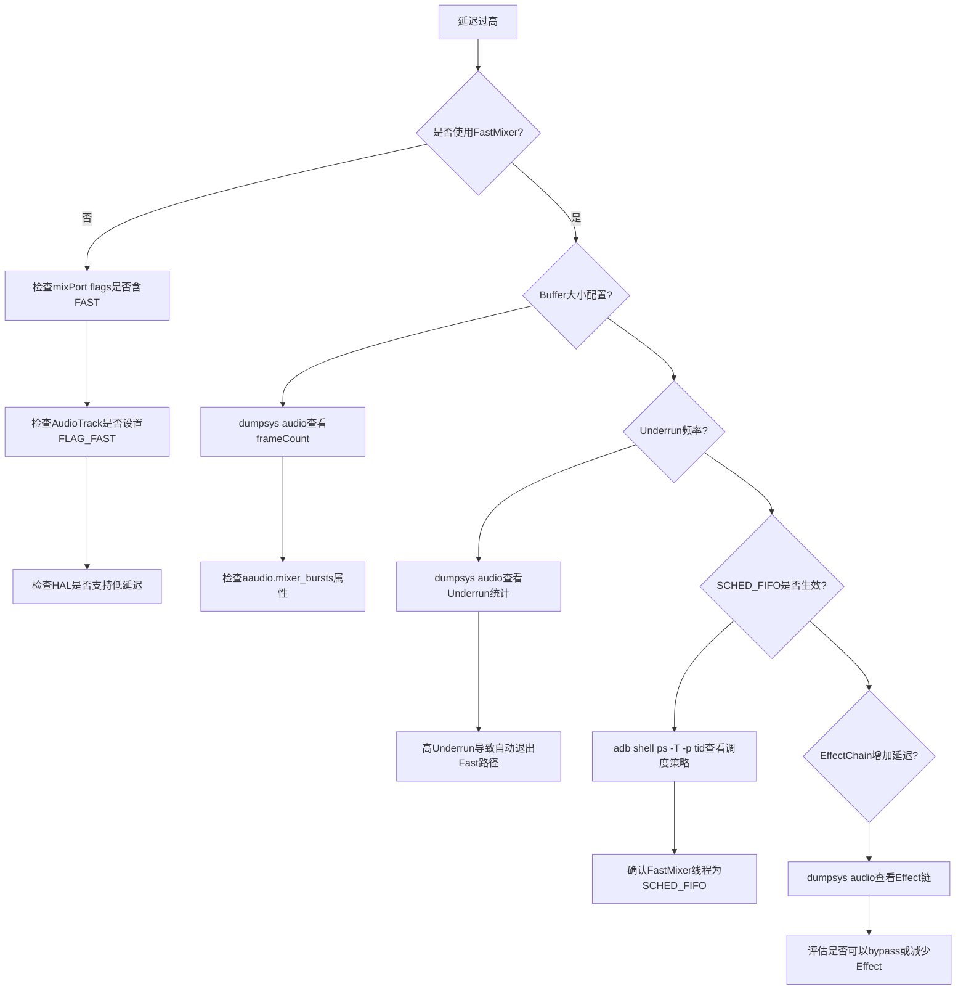
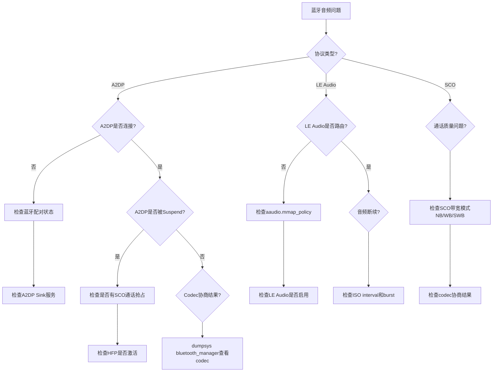
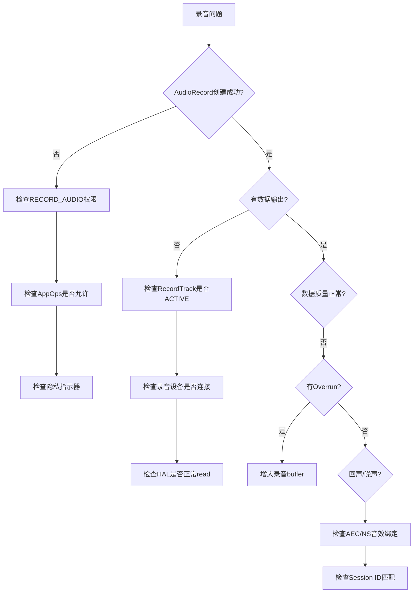
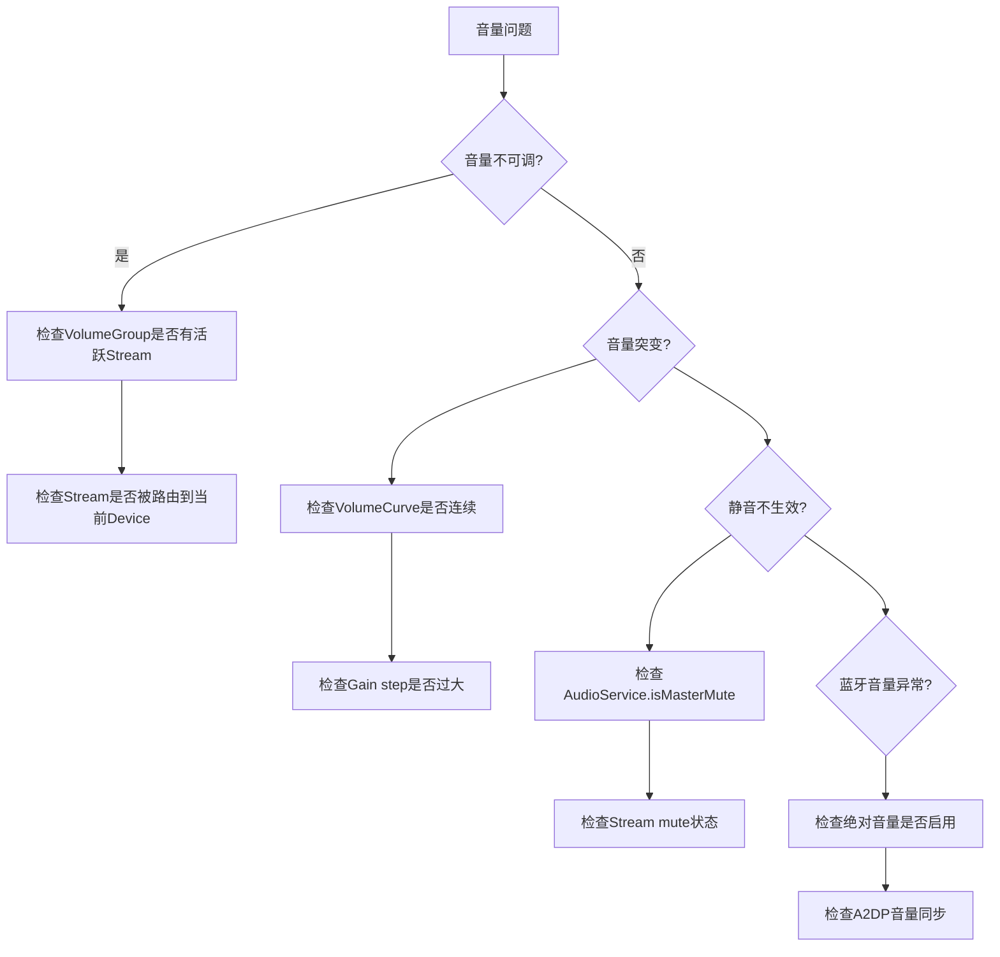
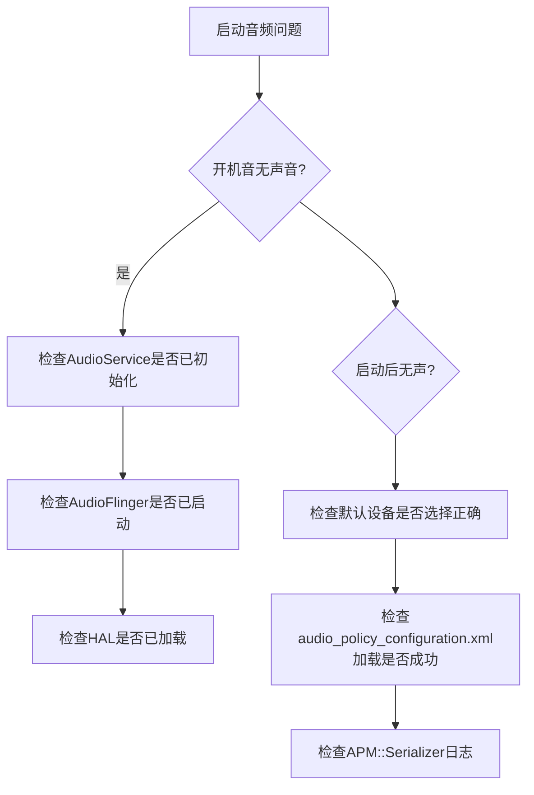
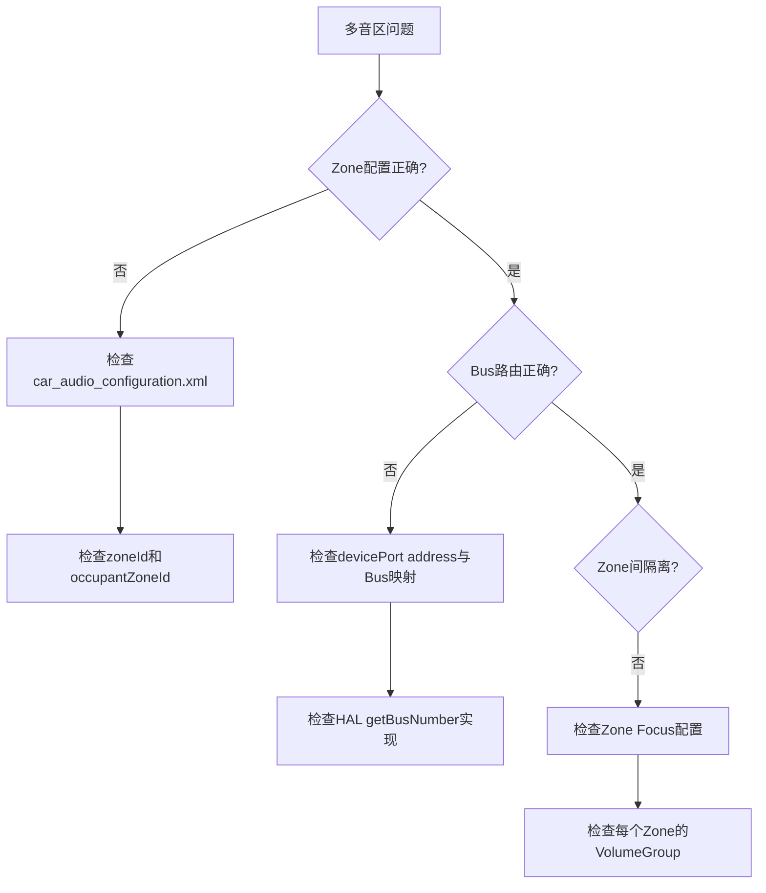

## 17.3 常见问题定位

> [← 上一个](17_2.1_logcat音频日志过滤.md) | [← 返回17章](README.md) | [返回导航](../README.md) | [下一个 →](17_4.1_OEM定制指南.md)

---

## 17.3.1 播放无声问题

播放无声是音频系统最常见的故障，需要从App层到HAL层逐级排查。



### 排查步骤详解

| 步骤 | 检查点 | 命令 | 关键日志TAG |
|------|--------|------|-------------|
| 1 | AudioTrack是否创建成功 | `dumpsys audio \| grep "Track"` | `AudioTrack`, `AF::Track` |
| 2 | 是否有活跃Track | `dumpsys audio \| grep "Active tracks"` | `AudioFlinger` |
| 3 | 路由到哪个设备 | `dumpsys audio \| grep "Device"` | `APM_AudioPolicyManager` |
| 4 | 音量是否为0 | `dumpsys audio \| grep "Volume"` | `AS.AudioService` |
| 5 | 是否有Underrun | `dumpsys audio \| grep "Underrun"` | `AF::Track` |
| 6 | HAL是否正常写入 | `logcat -s audio_hw` | `audio_hw` |
| 7 | 焦点是否被duck | `dumpsys audio \| grep "Focus"` | `MediaFocusControl` |
| 8 | DND模式 | `dumpsys notification \| grep dnd` | `AS.AudioService` |

### 关键dumpsys输出解读

```bash
# 查看Track的完整状态
dumpsys audio | grep -A 20 "Track .*session"
# 关注：
#   State: ACTIVE     ← 必须是ACTIVE
#   Volume: L:0.996   ← 不能是0.000
#   Fast track: yes   ← 如果需要低延迟
#   Underrun count: 0 ← 大于0表示App写入不够快

# 查看当前活跃输出设备
dumpsys audio | grep -A 3 "Output"
# 关注：
#   Device: AUDIO_DEVICE_OUT_SPEAKER  ← 确认路由正确
```

## 17.3.2 音频焦点问题

焦点问题在AAOS中尤其复杂，涉及交互矩阵和AudioControl HAL回调。



### 排查步骤详解

| 步骤 | 检查点 | 命令 | 关键日志TAG |
|------|--------|------|-------------|
| 1 | 谁持有焦点 | `dumpsys audio \| grep "Focus"` | `MediaFocusControl` |
| 2 | 焦点请求是否被拒绝 | `logcat -s MediaFocusControl` | `MediaFocusControl` |
| 3 | AAOS: 交互矩阵结果 | `logcat -s CarAudioFocus` | `CarAudioFocus` |
| 4 | AudioControl HAL回调 | `logcat -s AudioControl` | `AudioControl` |
| 5 | 焦点栈历史 | `dumpsys audio \| grep -A 50 "Audio Focus"` | `MediaFocusControl` |
| 6 | 焦点duck状态 | `logcat \| grep "duck\|DUCK"` | `MediaFocusControl` |

### AAOS焦点交互矩阵调试

```bash
# 查看CarAudioFocus交互矩阵
logcat -s CarAudioFocus | grep -i "interaction"

# 输出示例：
# CarAudioFocus: Interaction between MEDIA and NAVIGATION: CONCURRENT
# CarAudioFocus: Interaction between MEDIA and CALL: EXCLUSIVE
# CarAudioFocus: Interaction between CALL and SAFETY: EXCLUSIVE

# 如果交互矩阵不正确，检查car_audio_configuration.xml
adb shell cat /vendor/etc/car_audio_configuration.xml
```

### 常见焦点问题根因

| 问题现象 | 根因 | 解决方法 |
|----------|------|----------|
| 导航播报被音乐打断后不恢复 | App未正确处理LOSS_TRANSIENT | 检查App的onAudioFocusChange回调 |
| 通话时音乐不停 | 交互矩阵配置CONCURRENT | 修改交互矩阵为EXCLUSIVE或MUTE |
| 焦点请求被意外拒绝 | 请求者重复请求同一焦点 | 检查clientId唯一性 |
| 焦点栈泄漏 | App未abandon焦点 | 检查App生命周期，确保onPause时abandon |
| AudioControl未收到回调 | HAL服务未启动 | `adb shell lshal \| grep audio_control` |

## 17.3.3 路由错误问题

路由错误指音频没有输出到预期的设备，或设备切换不正确。



### 排查步骤详解

| 步骤 | 检查点 | 命令 | 关键日志TAG |
|------|--------|------|-------------|
| 1 | 当前活跃设备 | `dumpsys audio \| grep "Devices"` | `APM_AudioPolicyManager` |
| 2 | AudioPolicy配置 | 检查`audio_policy_configuration.xml` | `APM::Serializer` |
| 3 | IOProfile匹配 | `dumpsys audio \| grep "Profile"` | `APM::IOProfile` |
| 4 | Force Use | `dumpsys audio \| grep "Force"` | `APM_AudioPolicyManager` |
| 5 | 设备连接状态 | `dumpsys audio \| grep "Connected"` | `AS.AudioDeviceBroker` |
| 6 | Patch路由 | `dumpsys media.audio_flinger \| grep "Patch"` | `AudioFlinger::PatchPanel` |
| 7 | AAOS Bus映射 | 检查`car_audio_configuration.xml` | `CarAudioService` |

### Force Use调试

```bash
# 查看当前Force Use状态
dumpsys audio | grep "Force use"
# 输出示例：
# Force use for communications: FORCE_NONE
# Force use for media: FORCE_SPEAKER
# Force use for record: FORCE_NONE

# 清除Force Use（需root）
adb shell "dumpsys audio set-force-use 0 0"  # 0=COMMUNICATION, 0=FORCE_NONE

# Force Use枚举值：
# 0=FORCE_NONE, 1=FORCE_SPEAKER, 3=FORCE_HEADPHONES, 
# 4=FORCE_BT_SCO, 5=FORCE_BT_A2DP, 8=FORCE_VIBRATE
```

## 17.3.4 延迟过高问题

音频延迟过高影响用户体验，特别是交互式应用和语音通信。



### 排查步骤详解

| 步骤 | 检查点 | 命令 | 关键日志TAG |
|------|--------|------|-------------|
| 1 | 是否使用FastMixer | `dumpsys audio \| grep "Fast"` | `FastMixer` |
| 2 | Buffer大小配置 | `dumpsys audio \| grep "frameCount"` | `AudioFlinger` |
| 3 | Underrun频率 | `dumpsys audio \| grep "Underrun"` | `AF::Track` |
| 4 | SCHED_FIFO是否生效 | `adb shell ps -T -p <tid>` | `FastThread` |
| 5 | EffectChain增加延迟 | `dumpsys audio \| grep "Effect"` | `AudioFlinger::EffectChain` |
| 6 | HAL延迟 | `dumpsys audio \| grep "latency"` | `audio_hw` |
| 7 | MMAP是否可用 | `adb shell getprop aaudio.mmap_policy` | `AAudio` |

### 延迟计算公式

```
总延迟 = App Buffer延迟 + AF混合延迟 + HAL延迟 + 硬件延迟

App Buffer延迟 = App buffer帧数 / 采样率
AF混合延迟 = NormalFrameCount / 采样率  (Normal Mixer)
           = FastFrameCount / 采样率    (Fast Mixer)
HAL延迟 = HAL报告的latency_ms

示例(48kHz Normal Mixer):
  App Buffer: 960 frames = 20ms
  AF Normal: 960 frames = 20ms
  HAL: 10ms
  硬件: 5ms
  总延迟 ≈ 55ms
```

## 17.3.5 蓝牙音频问题

蓝牙音频问题涵盖A2DP、LE Audio和SCO三种协议。



### 排查步骤详解

| 步骤 | 检查点 | 命令 | 关键日志TAG |
|------|--------|------|-------------|
| 1 | A2DP是否连接 | `dumpsys audio \| grep "A2DP"` | `AS.BtHelper` |
| 2 | LE Audio是否路由 | `dumpsys audio \| grep "BLE\|LE_AUDIO"` | `AS.BtHelper` |
| 3 | 音量是否传递到耳机 | `logcat -s AS.AudioDeviceBroker` | `AS.AudioDeviceBroker` |
| 4 | A2DP是否被Suspend | `dumpsys audio \| grep "Suspend"` | `AS.BtHelper` |
| 5 | Codec协商结果 | `dumpsys bluetooth_manager \| grep codec` | `AS.BtHelper` |
| 6 | SCO模式 | `logcat -s AS.BtHelper \| grep SCO` | `AS.BtHelper` |
| 7 | 绝对音量 | `logcat \| grep "absolute volume"` | `AS.BtHelper` |

### A2DP Codec调试

```bash
# 查看当前A2DP codec配置
adb shell dumpsys bluetooth_manager | grep -A 10 "A2dpCodecConfig"

# 查看支持的codec列表
adb shell dumpsys bluetooth_manager | grep -A 5 "codec"

# 强制设置A2DP codec（需root）
# SBC=0, AAC=1, aptX=2, aptXHD=3, LDAC=4
adb shell settings put global bluetooth_a2dp_codec 4

# 查看A2DP连接状态
adb shell dumpsys audio | grep -i "a2dp"
```

## 17.3.6 录音问题

录音问题包括录音无声、录音数据异常、录音权限被拒等。



### 排查步骤详解

| 步骤 | 检查点 | 命令 | 关键日志TAG |
|------|--------|------|-------------|
| 1 | 录音权限 | `dumpsys audio \| grep "Record"` | `AS.AudioService` |
| 2 | RecordTrack状态 | `dumpsys audio \| grep "Input"` | `AF::RecordTrack` |
| 3 | 录音设备 | `dumpsys audio \| grep "Input.*Device"` | `APM_AudioPolicyManager` |
| 4 | Overrun | `dumpsys audio \| grep "Overrun"` | `AF::RecordTrack` |
| 5 | AEC/NS绑定 | `dumpsys audio \| grep "Effect.*session"` | `AudioFlinger::EffectChain` |
| 6 | HAL录音 | `logcat -s audio_hw \| grep "read"` | `audio_hw` |
| 7 | 隐私指示器 | `dumpsys audio \| grep "privacy"` | `AS.PlaybackActivityMon` |

## 17.3.7 音量问题

音量问题包括音量不可调、音量突变、静音不生效等。



### 排查步骤

| 步骤 | 检查点 | 命令 | 关键日志TAG |
|------|--------|------|-------------|
| 1 | 当前音量指数 | `dumpsys audio \| grep "Volume index"` | `AS.AudioService` |
| 2 | VolumeGroup映射 | `dumpsys audio \| grep "VolumeGroup"` | `APM::AudioPolicyEngine/VolumeGroup` |
| 3 | VolumeCurve | `dumpsys audio \| grep "Volume Curve"` | `APM::VolumeCurve` |
| 4 | 静音状态 | `dumpsys audio \| grep "Mute"` | `AS.AudioService` |
| 5 | DND模式 | `dumpsys notification \| grep dnd` | `AS.AudioService` |
| 6 | 蓝牙绝对音量 | `settings get global bluetooth_absolute_volume` | `AS.BtHelper` |
| 7 | AudioGain配置 | `dumpsys audio \| grep "Gain"` | `APM::Devices` |

## 17.3.8 系统启动音频问题

系统启动时的音频问题涉及AudioService初始化时序和HAL加载顺序。



### 启动时序关键日志

```bash
# 监控启动时序
logcat -b all -v time | grep -E "AudioFlinger|AudioPolicyService|AudioService|audio_hw" | head -100

# 关键时序点：
# 1. AudioFlinger: "AudioFlinger constructor" → AF初始化
# 2. APM::Serializer: "AudioPolicyConfig::parse" → 配置加载
# 3. AS.AudioService: "AudioService constructor" → Java服务初始化
# 4. audio_hw: "adev_open" → HAL打开
```

## 17.3.9 多音区问题（AAOS专属）

AAOS多音区问题涉及Zone配置和Bus路由映射。



### 排查步骤

| 步骤 | 检查点 | 命令 | 关键日志TAG |
|------|--------|------|-------------|
| 1 | Zone配置 | `dumpsys audio \| grep "Zone"` | `CarAudioService` |
| 2 | Bus映射 | `dumpsys audio \| grep "bus"` | `CarAudioService` |
| 3 | Zone焦点 | `dumpsys audio \| grep "Zone.*Focus"` | `CarAudioFocus` |
| 4 | Zone音量 | `dumpsys audio \| grep "Zone.*Volume"` | `CarVolumeGroup` |
| 5 | HAL Bus实现 | `logcat -s audio_hw \| grep "bus"` | `audio_hw` |

## 17.3.10 问题定位速查矩阵

| 问题现象 | 首查 | 次查 | 关键命令 |
|----------|------|------|----------|
| 播放无声 | Track状态+设备路由 | 音量+焦点 | `dumpsys audio \| grep -E "Track\|Device\|Volume"` |
| 录音无声 | 权限+设备 | HAL read | `dumpsys audio \| grep -E "Record\|Input"` |
| 焦点冲突 | Focus栈 | 交互矩阵 | `dumpsys audio \| grep "Focus"` |
| 路由错误 | 活跃设备 | Force Use+配置 | `dumpsys audio \| grep -E "Device\|Force"` |
| 延迟过高 | Fast路径 | Buffer+Underrun | `dumpsys audio \| grep -E "Fast\|Underrun\|frameCount"` |
| 蓝牙无声 | 连接状态 | Suspend+Codec | `dumpsys audio \| grep -E "A2DP\|BLE\|Suspend"` |
| 音量异常 | VolumeGroup | VolumeCurve+Gain | `dumpsys audio \| grep -E "Volume\|Gain"` |
| HAL Crash | tombstone | lshal状态 | `adb logcat -b all \| grep audio` |
| 启动无声 | 初始化时序 | HAL加载 | `logcat \| grep -E "AudioFlinger\|AudioPolicy"` |
| Zone路由错误 | car_audio_config | Bus映射 | `dumpsys audio \| grep -E "Zone\|bus"` |

---

[← 上一个](17_2.1_logcat音频日志过滤.md) | [← 返回17章](README.md) | [返回导航](../README.md) | [下一个 →](17_4.1_OEM定制指南.md)