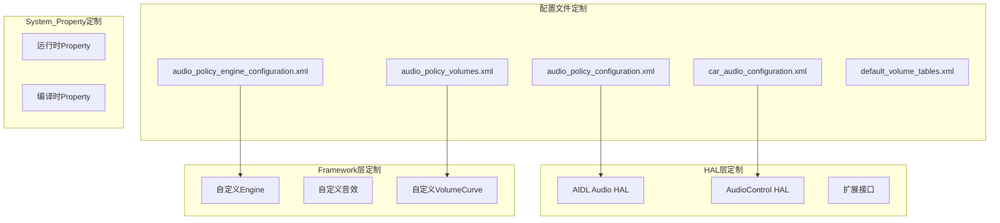

## 17.4 OEM定制指南

> [← 上一个](17_3.1_常见问题定位.md) | [← 返回17章](README.md) | [返回导航](../README.md) | [下一个 →](17_5.1_性能优化建议.md)

---

## 17.4.1 OEM定制体系总览

Android 14音频系统为OEM提供了多层次的定制能力，从配置文件修改到源码级扩展。理解每一层定制点及其约束条件是正确实施OEM定制的前提。



## 17.4.2 Audio HAL定制

### AIDL Audio HAL实现（推荐）

AOSP14推荐使用AIDL接口实现Audio HAL（源码路径：`hardware/interfaces/audio/core/aidl/`）。

**实现步骤**：

1. **创建Module实现**

```cpp
// 继承 BnModule
class AudioModule : public BnModule {
public:
    // 必须实现的核心接口
    ndk::ScopedAStatus openInputStream(
            const StreamOpenArguments& args,
            std::shared_ptr<IStreamIn>* ret) override;
    
    ndk::ScopedAStatus openOutputStream(
            const StreamOpenArguments& args,
            std::shared_ptr<IStreamOut>* ret) override;
    
    ndk::ScopedAStatus getAudioPorts(
            std::vector<AudioPort>* ports) override;
    
    ndk::ScopedAStatus getAudioRoutes(
            std::vector<AudioRoute>* routes) override;
    
    ndk::ScopedAStatus getAudioPort(
            int32_t id, AudioPort* port) override;
    
    // 设备连接
    ndk::ScopedAStatus connectExternalDevice(
            const AudioPort& port,
            std::vector<AudioPort>* connectedPorts) override;
    
    ndk::ScopedAStatus disconnectExternalDevice(int32_t portId) override;
    
    // Sound Dose
    ndk::ScopedAStatus setModuleDebug(
            const ModuleDebug& debug) override;
};
```

2. **在audio_policy_configuration.xml中声明模块**

```xml
<module name="primary" halVersion="3.0">
    <attachedDevices>
        <item>Speaker</item>
        <item>Built-In Mic</item>
    </attachedDevices>
    <defaultOutputDevice>Speaker</defaultOutputDevice>
    <mixPorts>
        <mixPort name="primary output" role="source" flags="AUDIO_OUTPUT_FLAG_PRIMARY">
            <profile name="" format="AUDIO_FORMAT_PCM_16_BIT"
                     samplingRates="48000" channelMasks="AUDIO_CHANNEL_OUT_STEREO"/>
        </mixPort>
        <mixPort name="fast output" role="source" flags="AUDIO_OUTPUT_FLAG_FAST">
            <profile name="" format="AUDIO_FORMAT_PCM_FLOAT"
                     samplingRates="48000" channelMasks="AUDIO_CHANNEL_OUT_STEREO"/>
        </mixPort>
        <mixPort name="compressed_offload" role="source" 
                 flags="AUDIO_OUTPUT_FLAG_COMPRESS_OFFLOAD">
            <profile name="" format="AUDIO_FORMAT_MP3"
                     samplingRates="44100,48000" channelMasks="AUDIO_CHANNEL_OUT_STEREO"/>
        </mixPort>
    </mixPorts>
    <devicePorts>
        <devicePort tagName="Speaker" type="AUDIO_DEVICE_OUT_SPEAKER" role="sink">
        </devicePort>
        <devicePort tagName="Built-In Mic" type="AUDIO_DEVICE_IN_BUILTIN_MIC" role="source">
        </devicePort>
    </devicePorts>
    <routes>
        <route type="mix" sink="Speaker" sources="primary output,fast output,compressed_offload"/>
        <route type="mix" sink="primary output" sources="Built-In Mic"/>
    </routes>
</module>
```

3. **注册AIDL服务**

```cpp
// Android.bp
cc_binary {
    name: "android.hardware.audio.core.IModule-service",
    srcs: ["AudioModule.cpp", ...],
    ...
}

// init.rc
service audio-hal /vendor/bin/hw/android.hardware.audio.core.IModule-service
    class hal
    user audio
    group audio drmrpc media
```

### HIDL Audio HAL实现（兼容旧版）

对于仍使用HIDL的遗留设备（`android.hardware.audio@7.x`）：

```cpp
// 继承 IDevicesFactory
class DevicesFactory : public IDevicesFactory {
    Return<void> openDevice(const hidl_string& name,
                            openDevice_cb _hidl_cb) override;
};

// 实现 IStreamOut
class StreamOut : public IStreamOut {
    Return<uint32_t> write(const void* data, uint32_t count) override;
    Return<void> getPresentationPosition(getPresentationPosition_cb _hidl_cb) override;
    // ...
};
```

## 17.4.3 AudioControl HAL定制（AAOS）

AudioControl HAL是AAOS的核心扩展接口，用于车辆域与Android域的音频交互。

### IAudioControl AIDL实现

```cpp
// hardware/interfaces/automotive/audiocontrol/aidl/
class AudioControl : public BnAudioControl {
public:
    // 焦点变化通知：Android → 车辆域
    ndk::ScopedAStatus onAudioFocusChange(
            const std::string& usage, int32_t zoneId,
            AudioFocusChange focusChange) override;
    
    // 焦点请求：车辆域 → Android
    ndk::ScopedAStatus registerFocusListener(
            const std::shared_ptr<IFocusListener>& listener) override;
    
    // 静音命令
    ndk::ScopedAStatus setMute(
            const MutingInfo& mutingInfo) override;
    
    // 音量变化通知
    ndk::ScopedAStatus onDevicesVolumeChanges(
            const std::vector<DevicesVolumeInfo>& infos) override;
};
```

### 自定义焦点交互矩阵

AAOS的焦点交互矩阵定义了不同音频用法之间的交互行为。

**方式一：修改CarAudioFocus源码**

在[`CarAudioFocus.java`](packages/services/Car/service/src/com/android/car/audio/CarAudioFocus.java)中修改交互矩阵。

**方式二：在car_audio_configuration.xml中声明**

```xml
<audioFocusConfiguration>
    <interactions>
        <interaction focusUsage="AUDIO_USAGE_MEDIA"
                     interactingFocusUsage="AUDIO_USAGE_ASSISTANCE_NAVIGATION_GUIDANCE"
                     interaction="CONCURRENT"/>
        <interaction focusUsage="AUDIO_USAGE_MEDIA"
                     interactingFocusUsage="AUDIO_USAGE_VOICE_COMMUNICATION"
                     interaction="EXCLUSIVE"/>
        <interaction focusUsage="AUDIO_USAGE_MEDIA"
                     interactingFocusUsage="AUDIO_USAGE_ASSISTANCE_SAFETY"
                     interaction="EXCLUSIVE"/>
    </interactions>
</audioFocusConfiguration>
```

**交互类型说明**：

| 交互类型 | 含义 | 适用场景 |
|----------|------|----------|
| `CONCURRENT` | 允许同时播放 | 导航+媒体音乐 |
| `EXCLUSIVE` | 新请求排斥旧持有 | 安全提示+媒体音乐 |
| `MUTE` | 新请求使旧持有静音 | 电话+媒体音乐 |
| `REJECT` | 新请求被拒绝 | 低优先级请求被拒 |

### IFocusListener回调

```java
// 车辆域请求Android焦点
IFocusListener listener = new IFocusListener.Stub() {
    @Override
    public void requestAudioFocus(String usage, int zoneId, int focusGainType) {
        // 车辆域请求焦点，转发到CarAudioFocus
    }
    
    @Override
    public void abandonAudioFocus(String usage, int zoneId) {
        // 车辆域放弃焦点
    }
};
```

## 17.4.4 路由策略定制

### 修改ProductStrategy映射

编辑`audio_policy_engine_configuration.xml`（通常在`/vendor/etc/`）：

```xml
<productStrategies>
    <strategy name="phone" configurable="true">
        <attributesStream>
            <item>
                <usage>AUDIO_USAGE_VOICE_COMMUNICATION</usage>
                <contentType>AUDIO_CONTENT_TYPE_SPEECH</contentType>
            </item>
        </attributesStream>
        <defaultDevice>AUDIO_DEVICE_OUT_EARPIECE</defaultDevice>
    </strategy>
    
    <strategy name="media" configurable="true">
        <attributesStream>
            <item>
                <usage>AUDIO_USAGE_MEDIA</usage>
                <contentType>AUDIO_CONTENT_TYPE_MUSIC</contentType>
            </item>
        </attributesStream>
        <defaultDevice>AUDIO_DEVICE_OUT_SPEAKER</defaultDevice>
    </strategy>
</productStrategies>
```

### 自定义Engine

继承[`EngineBase`](frameworks/av/services/audiopolicy/engine/common/src/EngineBase.cpp)实现自定义策略引擎：

```cpp
class CustomEngine : public EngineBase {
public:
    // 覆写设备选择逻辑
    DeviceVector getOutputDevicesForAttributes(
            const audio_attributes_t& attributes,
            bool& fromCache) const override {
        // 自定义路由逻辑
        // 例如：根据车辆状态选择不同设备
    }
    
    // 覆写输入设备选择
    DeviceVector getInputDevicesForAttributes(
            const audio_attributes_t& attributes,
            bool& fromCache) const override {
        // 自定义录音路由
    }
};
```

在`audio_policy_engine_configuration.xml`中指定自定义引擎：

```xml
<engine>
    <library name="custom_engine" path="/vendor/lib/libcustomaudiopolicyengine.so"/>
</engine>
```

## 17.4.5 音量曲线定制

### 修改audio_policy_volumes.xml

```xml
<volumes>
    <volume stream="AUDIO_STREAM_MUSIC" deviceCategory="DEVICE_CATEGORY_HEADSET">
        <point>0,-9000</point>   <!-- 最小音量: -90dB -->
        <point>33,-3600</point>  <!-- 33%: -36dB -->
        <point>66,-1600</point>  <!-- 66%: -16dB -->
        <point>100,0</point>     <!-- 最大音量: 0dB -->
    </volume>
    
    <volume stream="AUDIO_STREAM_MUSIC" deviceCategory="DEVICE_CATEGORY_SPEAKER">
        <point>0,-6000</point>
        <point>33,-3000</point>
        <point>66,-1200</point>
        <point>100,0</point>
    </volume>
    
    <volume stream="AUDIO_STREAM_VOICE_CALL" deviceCategory="DEVICE_CATEGORY_HEADSET">
        <point>0,-4200</point>
        <point>33,-2800</point>
        <point>66,-700</point>
        <point>100,0</point>
    </volume>
</volumes>
```

**音量曲线调优原则**：

| 原则 | 说明 | 示例 |
|------|------|------|
| 低音量段间距大 | 人耳对低音量更敏感 | 0-33%对应-90dB到-36dB |
| 高音量段间距小 | 高音量感知差异小 | 66-100%对应-16dB到0dB |
| 耳机曲线更平缓 | 保护听力 | 耳机最大音量更低 |
| 通话曲线偏线性 | 语音清晰度需求 | 通话曲线比音乐更线性 |

### 添加VolumeGroup

在`audio_policy_engine_configuration.xml`中：

```xml
<volumeGroups>
    <group name="media_group" stream="AUDIO_STREAM_MUSIC">
        <deviceCategory ref="DEVICE_CATEGORY_HEADSET"/>
        <deviceCategory ref="DEVICE_CATEGORY_SPEAKER"/>
        <deviceCategory ref="DEVICE_CATEGORY_EARPIECE"/>
    </group>
    <group name="call_group" stream="AUDIO_STREAM_VOICE_CALL">
        <deviceCategory ref="DEVICE_CATEGORY_HEADSET"/>
        <deviceCategory ref="DEVICE_CATEGORY_EARPIECE"/>
    </group>
</volumeGroups>
```

## 17.4.6 添加新的音频设备

### 步骤一：在audio_policy_configuration.xml中声明

```xml
<!-- 1. 添加devicePort -->
<devicePort tagName="USB Headset" type="AUDIO_DEVICE_OUT_USB_HEADSET" role="sink">
    <profile name="" format="AUDIO_FORMAT_PCM_16_BIT"
             samplingRates="44100,48000,96000" 
             channelMasks="AUDIO_CHANNEL_OUT_STEREO"/>
    <gains>
        <gain name="gain_1" mode="AUDIO_GAIN_MODE_JOINT"
              minValueMB="-3200" maxValueMB="600" defaultValueMB="0" stepValueMB="100"/>
    </gains>
</devicePort>

<!-- 2. 添加route连接 -->
<route type="mix" sink="USB Headset" 
       sources="primary output,fast output,compressed_offload"/>
```

### 步骤二：在Audio HAL中支持该设备

```cpp
// 在Module实现中声明端口
ndk::ScopedAStatus AudioModule::getAudioPorts(
        std::vector<AudioPort>* ports) {
    // 添加USB Headset端口描述
    AudioPort usbPort;
    usbPort.id = PORT_ID_USB_HEADSET;
    usbPort.name = "USB Headset";
    usbPort.type = AudioPortType::DEVICE;
    usbPort.ext.device.type = AudioDeviceType::OUT_USB_HEADSET;
    ports->push_back(usbPort);
    return ndk::ScopedAStatus::ok();
}
```

### 步骤三：AAOS中配置Bus映射

```xml
<!-- car_audio_configuration.xml -->
<zones>
    <zone name="primary zone" isPrimary="true" occupantZoneId="0">
        <audioGroups>
            <audioGroup name="media group">
                <audioDeviceAddress>bus0_media_out</audioDeviceAddress>
                <contextId>MUSIC</contextId>
            </audioGroup>
        </audioGroups>
    </zone>
</zones>
```

## 17.4.7 蓝牙音频定制

### A2DP Codec优先级

修改`/vendor/etc/bluetooth/audio_policy_config.xml`：

```xml
<audioPolicyConfig>
    <a2dp>
        <codecPreferences>
            <codec type="LDAC" priority="1000"/>
            <codec type="AAC" priority="800"/>
            <codec type="aptX" priority="600"/>
            <codec type="SBC" priority="400"/>
        </codecPreferences>
    </a2dp>
</audioPolicyConfig>
```

### LE Audio配置

```java
// 通过BluetoothManager控制LE Audio启用
IBluetoothLe leAudio = IBluetoothLe.Stub.asInterface(
    ServiceManager.getService("bluetooth_le"));
leAudio.setEnabled(true);  // 启用LE Audio
```

### SCO模式配置

```java
// 配置SCO带宽模式
IBluetoothHeadsetClient scoClient = ...;
scoClient.setScoConfig(
    SCO_MODE_WIDEBAND  // NB=窄带, WB=宽带, SWB=超宽带
);
```

## 17.4.8 系统属性定制

OEM可通过系统属性在编译时或运行时调整音频行为：

### 编译时属性（ro.*）

| 属性 | 用途 | 建议值 |
|------|------|--------|
| `ro.audio.max_fast_tracks` | 最大Fast Track数 | 8（默认4） |
| `ro.audio.flinger_standbytime_ms` | AF待机超时 | 3000（ms） |
| `ro.audio.silent` | 全局静音 | 0 |
| `ro.af.client_heap_size_kbyte` | 客户端堆大小 | 0（默认）或4096 |
| `ro.audio.offload_wakelock` | Offload wakelock | true |
| `ro.audio.monitorRotation` | 旋转监控 | true（手机） |

### 运行时属性（可动态设置）

| 属性 | 用途 | 调试建议 |
|------|------|----------|
| `af.fast_track_multiplier` | Fast Track倍数 | 1-2 |
| `af.thread.throttle` | 线程节流 | false（调试延迟时） |
| `af.patch_park` | Patch暂停调试 | false |
| `af.tee` | NBAIO Tee数据记录 | 3（input+output） |
| `aaudio.mmap_policy` | MMAP策略 | 2（AUTO）或3（ALWAYS） |

## 17.4.9 SELinux策略定制

添加自定义Audio HAL需要配置SELinux策略：

```sepolicy
# file: vendor/audio/hal/audio_hal.te
type audio_hal_service, service_manager_type;

# 允许HAL服务注册
allow audio_hal_server audio_hal_service:service_manager add;

# 允许访问音频设备
allow audio_hal_server audio_device:chr_file rw_file_perms;

# 允许访问共享内存
allow audio_hal_server ashmem_device:chr_file rw_file_perms;

# 允许与AudioFlinger通信
allow audio_hal_server audioserver_service:service_manager find;
```

## 17.4.10 OEM定制检查清单

| 定制项 | 配置文件/接口 | 验证方法 | 常见错误 |
|--------|-------------|----------|----------|
| Audio HAL | IModule AIDL | `lshal \| grep audio` | 未正确注册AIDL服务 |
| AudioControl HAL | IAudioControl AIDL | `lshal \| grep audio_control` | 焦点回调未实现 |
| 路由策略 | audio_policy_engine_configuration.xml | `dumpsys audio \| grep Strategy` | Strategy顺序错误 |
| 音量曲线 | audio_policy_volumes.xml | `dumpsys audio \| grep Volume` | 曲线不连续导致音量突变 |
| 设备声明 | audio_policy_configuration.xml | `dumpsys audio \| grep Profile` | 缺少route连接 |
| Bus映射 | car_audio_configuration.xml | `dumpsys audio \| grep Zone` | busAddress不匹配 |
| Codec优先级 | audio_policy_config.xml | `dumpsys bluetooth_manager` | 不支持的Codec列为高优先级 |
| SELinux | .te文件 | `dmesg \| grep avc` | 缺少必要的权限声明 |

---

[← 上一个](17_3.1_常见问题定位.md) | [← 返回17章](README.md) | [返回导航](../README.md) | [下一个 →](17_5.1_性能优化建议.md)