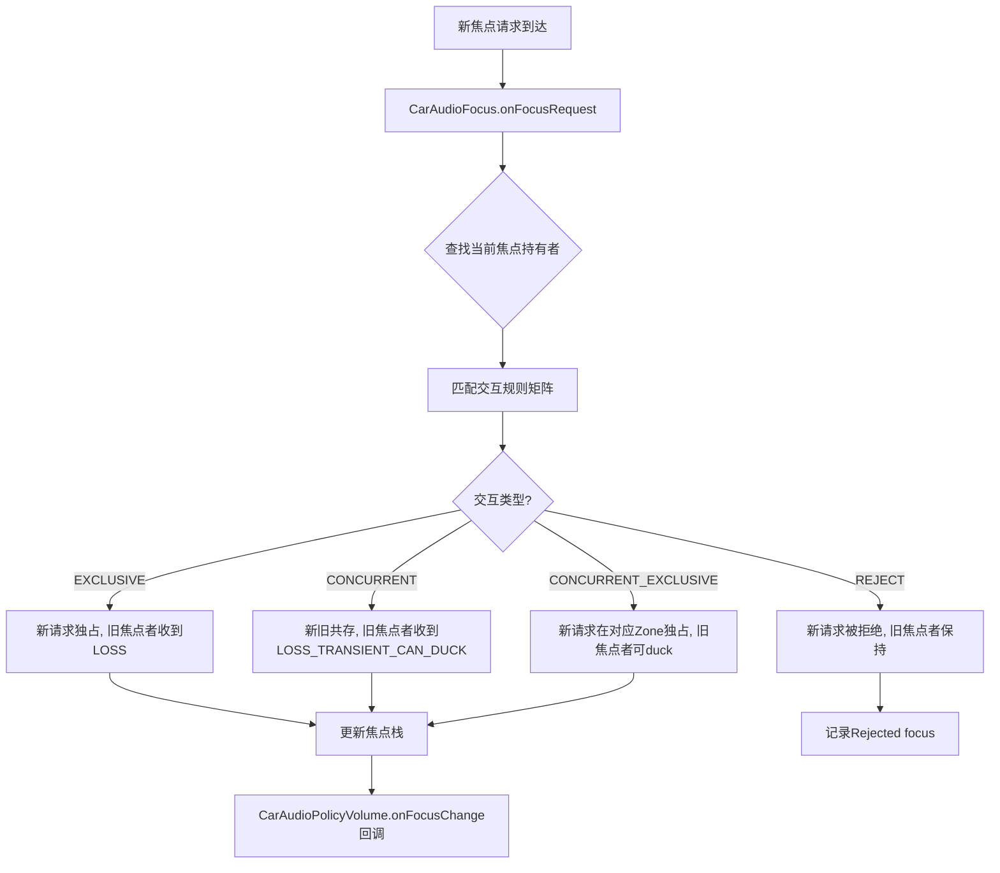
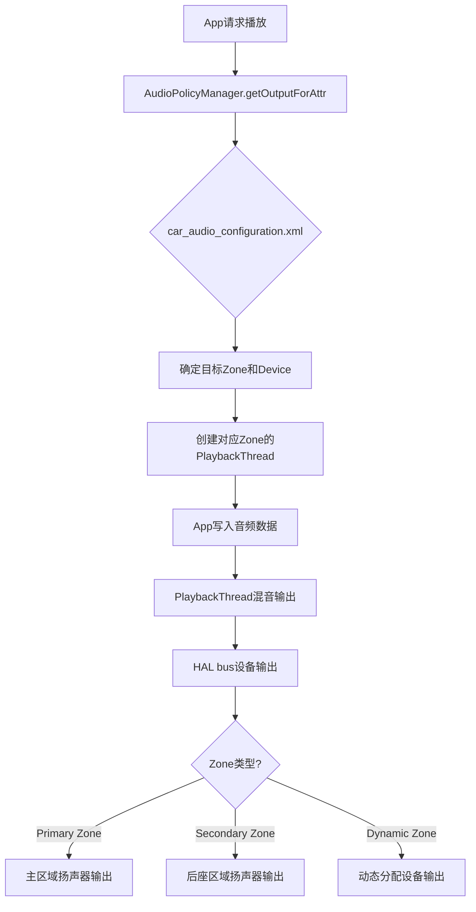
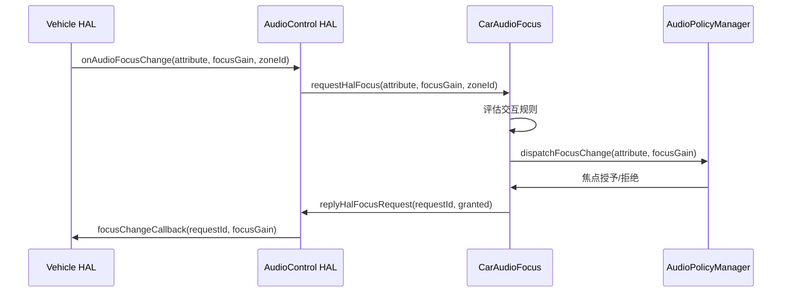
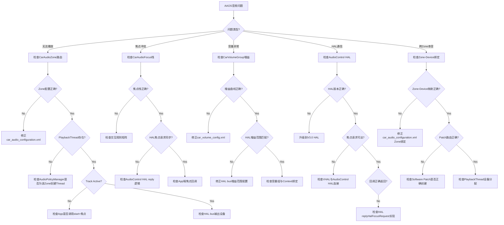

## O.8 AAOS CarAudio调试

> [← 上一个](17_7.1_AudioFlinger详细dump解读.md) | [返回目录](README.md) | [下一个 →](17_9.1_AudioPolicy配置验证.md)

---


O.8.1 CarAudioFocus调试

AAOS音频焦点通过CarAudioFocus管理，调试时需检查焦点栈和交互规则。

**焦点调试命令**：

```bash
# 查看当前焦点栈
adb shell dumpsys car_audio focus

# 查看焦点历史记录
adb shell dumpsys car_audio focus_history

# 监听焦点变化
adb logcat -s CarAudioFocus
```

**CarAudioFocus dump输出结构**：

```
Car Audio Focus:
  Focus stack size: N
  Focus entries:
    Entry 1: [clientId] [attribute] [focusGain] [lostFocus]
    Entry 2: [clientId] [attribute] [focusGain] [lostFocus]
    ...
  Rejected focus: [clientId] [attribute] [focusRequest]
  Pending focus: [clientId] [attribute] [focusRequest]
```

**焦点交互矩阵验证**：



> **常见焦点问题**：
> 1. 导航播报无法打断媒体 → 检查交互规则中NAVIGATION vs MEDIA的配置
> 2. 电话铃声无焦点 → 检查RING电话属性是否在焦点交互矩阵中
> 3. 多Zone焦点冲突 → 每个Zone有独立焦点栈，检查Zone间焦点转发逻辑

O.8.2 CarVolumeGroup调试

CarVolumeGroup管理音量分组和增益曲线。

**音量调试命令**：

```bash
# 查看所有Volume Group配置
adb shell dumpsys car_audio volume_groups

# 查看当前音量设置
adb shell dumpsys car_audio volumes

# 设置Zone 0的Media音量组到50%
adb shell cmd car_audio set_volume_zone_id 0 group_id 0 index 50

# 获取增益曲线配置
adb shell dumpsys car_audio gain_curve
```

**CarVolumeGroup dump输出**：

```
Car Volume Groups:
  Zone 0:
    Volume Group 0 (Media):
      Contexts: MUSIC, AUDIO_FOCUS
      Devices: bus_0_media_out
      Min gain: -80dB  Max gain: 0dB  Step: 1dB
      Current index: 70/100  Volume: -10dB
      Muted: false
      Gain curve: linear (min=-80dB, max=0dB, steps=100)
    Volume Group 1 (Navigation):
      Contexts: NAVIGATION
      Devices: bus_1_navigation_out
      ...
  Zone 1:
    Volume Group 0 (Media):
      ...
```

**增益曲线类型与适用场景**：

| 曲线类型 | 特征 | 适用场景 | 配置方法 |
|----------|------|---------|---------|
| Linear | 线性映射 | 通用场景 | 默认配置 |
| Logarithmic | 对数映射 | 人耳感知线性 | `car_volume_config.xml` |
| Exponential | 指数映射 | 低音量精细控制 | `car_volume_config.xml` |
| Piecewise | 分段线性 | 自定义映射 | `car_volume_config.xml` |

> **OEM定制要点**：
> 1. 增益曲线应在`car_volume_config.xml`中配置，而非硬编码
> 2. 每个Volume Group的Min/Max增益需与HAL bus设备增益范围匹配
> 3. 建议Navigation和Emergency组使用较陡的曲线，确保低音量时可听

O.8.3 CarAudioZone调试

CarAudioZone管理多区域音频路由，每个Zone有独立的PlaybackThread和Volume Group。

**Zone调试命令**：

```bash
# 查看所有Zone配置
adb shell dumpsys car_audio zones

# 查看Zone间音频路由
adb shell dumpsys car_audio routing

# 将音频流路由到Zone 1
adb shell cmd car_audio route_stream_zone_id MUSIC 1

# 查看当前Zone的活跃PlaybackThread
adb shell dumpsys audio | grep "AudioOut_" | grep "zone"
```

**CarAudioZone dump输出**：

```
Car Audio Zones:
  Zone 0 (Primary Zone):
    Zone Id: 0
    Occupant Zone Ids: [0]
    Audio Zones: [0]
    Volume Groups: [0, 1, 2, 3, 4]
    Input Audio Devices: [bus_100_media_in]
    Output Audio Devices: [bus_0_media_out, bus_1_navigation_out, ...]
    Playback Threads: [AudioOut_D, AudioOut_11]
  Zone 1 (Secondary Zone):
    Zone Id: 1
    Occupant Zone Ids: [1]
    Volume Groups: [0, 1]
    Input Audio Devices: [bus_200_zone2_in]
    Output Audio Devices: [bus_10_zone2_out, bus_11_zone2_nav_out]
    Playback Threads: [AudioOut_17, AudioOut_18]
```

**多Zone音频路由流程**：



> **常见Zone问题**：
> 1. Zone 1无法播放 → 检查PlaybackThread是否创建，HAL bus是否可用
> 2. 音频串Zone → 检查car_audio_configuration.xml中Zone和Device绑定是否正确
> 3. 焦点跨Zone → 每个Zone独立焦点栈，检查CarAudioFocus的Zone间转发逻辑

O.8.4 AudioControl HAL调试

AudioControl HAL是AAOS特有的HAL接口，负责车辆音频焦点请求和音量控制。

**AudioControl HAL版本对比**：

| 版本 | 接口 | 主要功能 | AOSP14支持 |
|------|------|---------|-----------|
| V1.0 | IAudioControl | 短暂焦点、音量变化 | 已弃用 |
| V2.0 | IAudioControl | 焦点请求+duck、音量变化 | 兼容模式 |
| V3.0 | IAudioControl | Zone感知焦点、音量调节 | 推荐使用 |

**AudioControl HAL调试命令**：

```bash
# 查看AudioControl HAL状态
adb shell dumpsys car_audio audio_control_hal

# 查看HAL焦点请求记录
adb shell dumpsys car_audio hal_focus_requests

# 监听HAL焦点回调
adb logcat -s AudioControlHal AudioControl

# 测试HAL焦点请求
adb shell cmd car_audio request_hal_focus NAVIGATION PERMANENT zone_id=0

# 测试HAL音量变化通知
adb shell cmd car_audio notify_hal_volume_change 0 0 50
```

**AudioControl HAL焦点请求流程**：



**关键调试点**：

| 检查项 | 方法 | 正常期望 | 异常处理 |
|--------|------|---------|---------|
| HAL是否加载 | `dumpsys car_audio audio_control_hal` | 显示V3.0版本 | 检查HAL模块配置 |
| 焦点请求是否到达 | `logcat -s AudioControlHal` | 收到onAudioFocusChange | 检查VHAL是否发送焦点请求 |
| 焦点授予回调 | `dumpsys car_audio hal_focus_requests` | requestId匹配 | 检查replyHalFocusRequest是否调用 |
| 音量通知是否工作 | `cmd car_audio notify_hal_volume_change` | 音量变化生效 | 检查CarVolumeGroup回调 |
| Duck是否触发 | `dumpsys car_audio duck_state` | 被duck的Stream静音 | 检查duck交互规则 |

> **OEM注意**：AudioControl HAL V3.0新增了zoneId参数，OEM需确保HAL实现正确传递zoneId。如果zoneId=-1（无效值），CarAudioFocus会拒绝请求。

O.8.5 CarAudio综合调试决策树



O.8.6 AAOS音频调试命令速查表

| 命令 | 功能 | 关键参数 |
|------|------|---------|
| `dumpsys car_audio` | CarAudio全量状态 | 无 |
| `dumpsys car_audio focus` | 焦点栈详情 | 无 |
| `dumpsys car_audio volume_groups` | 音量组配置 | zone_id |
| `dumpsys car_audio zones` | Zone配置详情 | 无 |
| `dumpsys car_audio routing` | 音频路由详情 | 无 |
| `dumpsys car_audio audio_control_hal` | HAL状态 | 无 |
| `cmd car_audio set_volume_zone_id` | 设置音量 | zone_id, group_id, index |
| `cmd car_audio request_hal_focus` | 测试HAL焦点 | attribute, duration, zone_id |
| `cmd car_audio notify_hal_volume_change` | 测试HAL音量通知 | zone_id, group_id, index |
| `dumpsys audio \| grep AudioOut` | 查看PlaybackThread | 无 |
| `dumpsys audio \| grep AudioIn` | 查看RecordThread | 无 |
| `logcat -s CarAudioFocus CarAudioPolicyVolume` | 监听焦点/音量日志 | 无 |
| `logcat -s AudioControlHal AudioControl` | 监听HAL日志 | 无 |

---

