# 第十七篇：SA8295 Vendor+QNX双域音频架构深度解析

> [← 上一篇：PAL架构深度解析](16_PAL_Architecture.md) | [返回导航](README.md) | [下一篇：调试方法与OEM定制指南 →](15_Debug_and_OEM_Guide.md)

---

## 17.1 概述

### 17.1.1 SA8295平台音频架构总览

高通SA8295是面向汽车信息娱乐系统(IVI)的高性能SoC，其音频架构采用**QNX主控+Android协作**的双域设计。核心架构特征：

- **QNX是ADSP唯一控制方** — QNX内置Audio Resource Manager，是唯一有权直接下发指令给ADSP固件的系统，所有物理音频通道/硬件混音/麦克风/功放开关统一由QNX配置ADSP路由矩阵(resourcemanager.xml/mixer_paths)
- **Android是上层应用发起方** — Android域无底层硬件控制权，音频请求通过GSL VM前端(gsl_fe)经MM-HAB跨虚拟化通道提交给QNX域的GSL VM后端(gsl_vm_be)，由QNX仲裁后统一通过GSL→APM下发ADSP
- **安全音频QNX直通** — 倒车雷达/仪表告警/碰撞预警/胎压提示等安全类音频完全由QNX独立生成+直通ADSP，不受Android崩溃影响
- **Hypervisor硬件隔离** — Android死机/崩溃时，Hypervisor保证QNX/ADSP/仪表告警音频完全不受影响

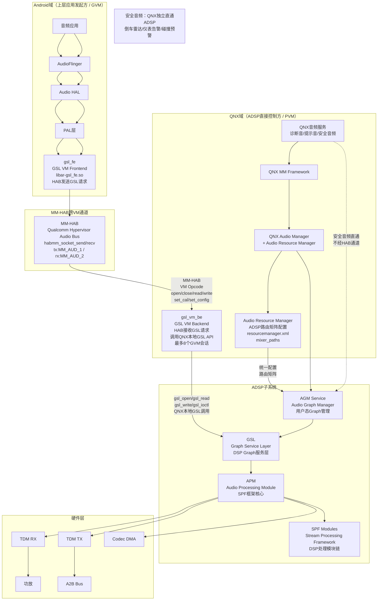

### 17.1.2 QNX主控+Android协作双域架构

SA8295平台采用虚拟化(Hypervisor)技术，在同一SoC上运行Android和QNX两个操作系统。**QNX是音频全局管理者，Android是上层应用发起方**：

| 特性 | Android域 | QNX域 |
|------|----------|-------|
| 角色 | 上层应用发起方（无底层硬件控制权） | 音频全局管理者（ADSP唯一控制方） |
| 音频栈 | AOSP标准音频栈+PAL | QNX Audio架构+MM Framework+Audio Resource Manager |
| DSP通信 | PAL→gsl_fe→MM-HAB→gsl_vm_be→GSL→ADSP | QNX AM→AGM→GSL→ADSP（直连） |
| ACDB | 与QNX共用同一套ACDB校准数据 | 持有ACDB文件，双域共享同一套校准 |
| 用途 | 媒体播放/导航/语音助手 | 诊断音/提示音/紧急音频/安全音频直通 |
| 安全隔离 | Android崩溃不影响QNX/ADSP | Hypervisor硬件隔离，保证安全音频不受影响 |
| 启动速度 | 较慢(完整Android启动) | 快速启动(QNX实时性) |

> **关键架构差异**：Android域的音频请求通过GSL VM前端(gsl_fe)经MM-HAB跨虚拟化通道提交给QNX域的GSL VM后端(gsl_vm_be)，gsl_vm_be在QNX侧调用本地GSL API（如gsl_open/gsl_read/gsl_write等），由QNX统一配置ADSP路由矩阵后下发指令。Android没有直接操作ADSP/Codec/功放的权限。安全类音频（倒车雷达/仪表告警/碰撞预警/胎压提示）完全由QNX独立生成+直通ADSP，不经MM-HAB通道。

### 17.1.3 Vendor层关键组件

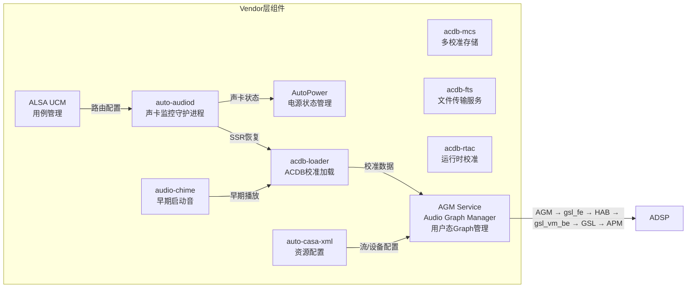

---

## 17.2 auto-audiod守护进程

> **为什么你可能没听说过auto-audiod？** auto-audiod是SA8295平台**Android域特有的vendor proprietary组件**，源码不在AOSP开源仓库中（位于`vendor/qcom/proprietary/`私有目录）。它在非虚拟化的手机平台上不存在——手机平台通常没有Android+QNX双域架构，因此不需要跨域的声卡监控守护进程。在SA8295的QNX主控架构下，auto-audiod只是Android域的辅助角色，真正控制ADSP的是QNX域的Audio Resource Manager。

### 17.2.1 架构概述

`auto-audiod`是SA8295 Android域的音频守护进程(vendor proprietary)，负责在Android域侧辅助管理音频硬件状态：

1. **声卡状态监控** — 轮询`/proc/asound/cardN/state`检测ADSP在线/离线（Android域视角）
2. **Hostless会话管理** — 在声卡上线时启用、下线时禁用TDM直连通路（这些通路最终由QNX域的Audio Resource Manager配置）
3. **SSR(Subsystem Restart)恢复** — ADSP重启后在Android域侧重新建立音频通路请求（实际ADSP控制由QNX域仲裁）
4. **Audio HAL通知** — 通过HIDL接口通知Audio HAL声卡状态变化，使Android域音频栈能做出相应调整

> **注意**：auto-audiod监控的ADSP声卡状态(`/proc/asound/cardN/state`)是QNX域控制下的ASOUND ALSA内核驱动暴露的接口。auto-audiod只是Android域的观察者和请求发起方，ADSP的真正控制权在QNX域的Audio Resource Manager手中。

```mermaid
graph TB
    subgraph AutoAudioDaemon["AutoAudioDaemon"]
        MAIN[main]
        THREADLOOP[threadLoop核心循环]
        WORKER[workerThread电源监控]
        NOTIFIER[notifyAudioDevice通知]
        HAL_DEATH[handleAudioHalDeath HAL死亡处理]
    end

    subgraph ProcFS["/proc/asound"]
        CARDS[/proc/asound/cards]
        STATE[/proc/asound/cardN/state]
        POWER[/proc/asound/cardN/power]
    end

    subgraph HIDL_Interface["HIDL接口"]
        IDEVICE[IDevice::setParameters]
        IFACTORY[IDevicesFactory]
    end

    subgraph Hostless["Hostless会话"]
        MERC[MERC_SESSION<br/>TERT_TDM_TX→SEC_TDM_RX]
        A2B[A2B_SESSION<br/>QUIN_TDM_TX→QUAT_TDM_RX]
    end

    MAIN --> THREADLOOP
    MAIN --> WORKER
    THREADLOOP -->|读取| CARDS
    THREADLOOP -->|poll| STATE
    WORKER -->|读取| POWER
    THREADLOOP -->|ONLINE/OFFLINE| NOTIFIER
    NOTIFIER -->|SND_CARD_STATUS| IDEVICE
    THREADLOOP -->|enable/disable| MERC
    THREADLOOP -->|enable/disable| A2B
    HAL_DEATH -->|重连| IFACTORY
```

### 17.2.2 AutoAudioDaemon类定义

`AutoAudioDaemon`继承`IBinder::DeathRecipient`，用于监听Audio HAL进程死亡事件：

```cpp
class AutoAudioDaemon : public IBinder::DeathRecipient {
public:
    AutoAudioDaemon();
    virtual ~AutoAudioDaemon();

    // IBinder::DeathRecipient
    void binderDied(const wp<IBinder>& who) override;

    // 核心方法
    int threadLoop();        // 主循环：监控声卡状态
    int workerThread();      // 工作线程：监控电源状态

private:
    // 声卡相关
    int getSndCardFDs();     // 获取声卡文件描述符
    void notifyAudioDevice(int card, const char *status);
    void handleAudioHalDeath();

    // Hostless管理
    void enable_hostless(int session_type);
    void disable_hostless(int session_type);

    // Audio HAL HIDL接口
    sp<IDevicesFactory> mDevicesFactory;
    sp<IDevice> mPrimaryDevice;

    // 声卡文件描述符
    struct snd_card_info {
        int card_num;
        int state_fd;       // /proc/asound/cardN/state
        int power_fd;       // /proc/asound/cardN/power
    };
    std::vector<snd_card_info> mSndCards;
};
```

### 17.2.3 threadLoop()核心循环

`threadLoop()`是auto-audiod的核心执行循环，通过`poll()`系统调用阻塞等待声卡状态变化：

```cpp
int AutoAudioDaemon::threadLoop() {
    while (!mExitRequested) {
        // Step 1: 获取声卡文件描述符
        getSndCardFDs();

        // Step 2: poll等待声卡状态变化
        int ret = poll(mPollFds, mPollFdCount, -1);

        if (ret > 0) {
            for (auto& card : mSndCards) {
                char state[32] = {0};
                lseek(card.state_fd, 0, SEEK_SET);
                read(card.state_fd, state, sizeof(state) - 1);

                if (strncmp(state, "ONLINE", 6) == 0) {
                    // ADSP上线：启用hostless会话并通知Audio HAL
                    enable_hostless(MERC_SESSION);
                    enable_hostless(A2B_SESSION);
                    notifyAudioDevice(card.card_num, "ONLINE");
                } else if (strncmp(state, "OFFLINE", 7) == 0) {
                    // ADSP离线：禁用hostless会话并通知Audio HAL
                    disable_hostless(MERC_SESSION);
                    disable_hostless(A2B_SESSION);
                    notifyAudioDevice(card.card_num, "OFFLINE");
                }
            }
        }
    }
    return 0;
}
```

### 17.2.4 getSndCardFDs()声卡发现

`getSndCardFDs()`通过读取`/proc/asound/cards`发现ADSP声卡，并打开其state和power文件描述符：

```cpp
int AutoAudioDaemon::getSndCardFDs() {
    FILE *fp = fopen("/proc/asound/cards", "r");
    if (!fp) return -errno;

    char line[256];
    while (fgets(line, sizeof(line), fp)) {
        int card_num;
        char card_name[64];
        // 解析声卡信息： " 0 [sa8295adpst]: sa8295-adp-star-snd-card"
        if (sscanf(line, " %d [%[^]]", &card_num, card_name) != 2)
            continue;

        // 过滤ADSP声卡：以msm/apq/sa开头
        if (strncmp(card_name, "msm", 3) != 0 &&
            strncmp(card_name, "apq", 3) != 0 &&
            strncmp(card_name, "sa", 2) != 0)
            continue;

        // 打开state和power文件描述符
        snd_card_info info;
        info.card_num = card_num;

        char path[128];
        snprintf(path, sizeof(path), "/proc/asound/card%d/state", card_num);
        info.state_fd = open(path, O_RDONLY);

        snprintf(path, sizeof(path), "/proc/asound/card%d/power", card_num);
        info.power_fd = open(path, O_RDONLY);

        mSndCards.push_back(info);
    }
    fclose(fp);
    return 0;
}
```

### 17.2.5 notifyAudioDevice()通知机制

当检测到声卡状态变化时，通过HIDL `IDevice::setParameters()`接口通知Audio HAL：

```cpp
void AutoAudioDaemon::notifyAudioDevice(int card, const char *status) {
    if (mPrimaryDevice == nullptr) {
        // 尝试重新连接Audio HAL
        handleAudioHalDeath();
        return;
    }

    char param[128];
    snprintf(param, sizeof(param), "SND_CARD_STATUS=%d,%s", card, status);

    // 通过HIDL接口通知Audio HAL
    Return<void> ret = mPrimaryDevice->setParameters(
        0 /*halVersion*/, param, [&](int ret) {
            if (ret != 0) {
                ALOGE("setParameters failed: %d", ret);
            }
        });
}
```

### 17.2.6 handleAudioHalDeath()死亡通知处理

当Audio HAL进程异常死亡时，`AutoAudioDaemon`需要重新建立HIDL连接：

```cpp
void AutoAudioDaemon::handleAudioHalDeath() {
    ALOGW("Audio HAL died, reconnecting...");

    // 重新获取IDevicesFactory服务
    mDevicesFactory = IDevicesFactory::getService();
    if (mDevicesFactory == nullptr) {
        ALOGE("Failed to get IDevicesFactory service");
        return;
    }

    // 注册死亡通知
    Return<bool> linked = mDevicesFactory->linkToDeath(
        this /*DeathRecipient*/, 0 /*cookie*/);
    if (!linked.isOk() || !linked) {
        ALOGE("Failed to linkToDeath on IDevicesFactory");
    }

    // 打开Primary Device
    Return<void> ret = mDevicesFactory->openPrimaryDevice(
        [&](Result result, const sp<IDevice>& device) {
            if (result == Result::OK && device != nullptr) {
                mPrimaryDevice = device;
            }
        });
}
```

### 17.2.7 workerThread()电源状态监控

`workerThread()`运行在独立线程中，监控ADSP电源状态变化(D3hot/D0)，用于低功耗状态下的hostless管理：

```cpp
int AutoAudioDaemon::workerThread() {
    while (!mExitRequested) {
        for (auto& card : mSndCards) {
            char power[32] = {0};
            lseek(card.power_fd, 0, SEEK_SET);
            read(card.power_fd, power, sizeof(power) - 1);

            if (strstr(power, "D3hot")) {
                // ADSP进入低功耗：禁用hostless
                ALOGI("Card %d entering D3hot, disabling hostless",
                      card.card_num);
                disable_hostless(MERC_SESSION);
                disable_hostless(A2B_SESSION);
            } else if (strstr(power, "D0")) {
                // ADSP恢复正常：启用hostless
                ALOGI("Card %d entering D0, enabling hostless",
                      card.card_num);
                enable_hostless(MERC_SESSION);
                enable_hostless(A2B_SESSION);
            }
        }
        usleep(100000); // 100ms轮询间隔
    }
    return 0;
}
```

### 17.2.8 Hostless会话详解

Hostless会话是SA8295平台的关键设计，它建立TDM TX→TDM RX的直连通路，音频数据不经Android域处理，直接在ADSP内部从输入路由到输出。

#### 会话类型

```cpp
// Hostless会话类型定义
typedef enum {
    MERC_SESSION = 0,  // Mercury会话：TERT_TDM_TX → SEC_TDM_RX
    A2B_SESSION  = 1,  // A2B会话：QUIN_TDM_TX → QUAT_TDM_RX
} hostless_session_t;

// PCM设备ID映射
#define SEC_TDM_RX_HOSTLESS   48  // Secondary TDM RX Hostless PCM
#define TERT_TDM_TX_HOSTLESS  49  // Tertiary TDM TX Hostless PCM
#define QUAT_TDM_RX_HOSTLESS  50  // Quaternary TDM RX Hostless PCM
#define QUAT_TDM_TX_HOSTLESS  51  // Quaternary TDM TX Hostless PCM
```

#### Hostless数据流

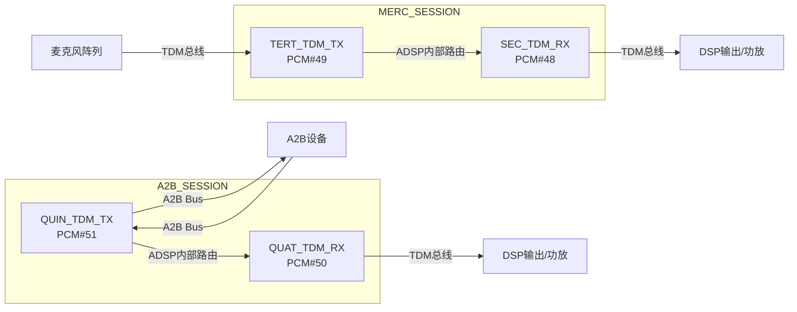

#### enable_hostless()实现

```cpp
int AutoAudioDaemon::enable_hostless(int session_type) {
    struct pcm *tx_pcm = nullptr, *rx_pcm = nullptr;
    struct mixer *mixer = mixer_open(SND_CARD);

    switch (session_type) {
    case MERC_SESSION: {
        // Step 1: 设置TDM Port Mixer（建立TX→RX路由）
        mixer_ctl_set_value(
            mixer_get_by_name(mixer,
                "TERT_TDM_TX_0 Port Mixer SEC_TDM_RX_0"),
            0, 1);

        // Step 2: 打开TX和RX PCM设备
        tx_pcm = pcm_open(SND_CARD, TERT_TDM_TX_HOSTLESS,
                          PCM_IN, &pcm_config_hostless);
        rx_pcm = pcm_open(SND_CARD, SEC_TDM_RX_HOSTLESS,
                          PCM_OUT, &pcm_config_hostless);

        // Step 3: 启动PCM
        pcm_start(tx_pcm);
        pcm_start(rx_pcm);

        // Step 4: 获取wakelock防止系统休眠
        acquire_wake_lock("hostless_merc");
        break;
    }
    case A2B_SESSION: {
        mixer_ctl_set_value(
            mixer_get_by_name(mixer,
                "QUIN_TDM_TX_0 Port Mixer QUAT_TDM_RX_0"),
            0, 1);

        tx_pcm = pcm_open(SND_CARD, QUAT_TDM_TX_HOSTLESS,
                          PCM_IN, &pcm_config_hostless);
        rx_pcm = pcm_open(SND_CARD, QUAT_TDM_RX_HOSTLESS,
                          PCM_OUT, &pcm_config_hostless);

        pcm_start(tx_pcm);
        pcm_start(rx_pcm);

        acquire_wake_lock("hostless_a2b");
        break;
    }
    }
    return 0;
}
```

#### disable_hostless()实现

```cpp
int AutoAudioDaemon::disable_hostless(int session_type) {
    switch (session_type) {
    case MERC_SESSION: {
        // Step 1: 关闭PCM设备
        pcm_close(mMercTxPcm);
        pcm_close(mMercRxPcm);
        mMercTxPcm = nullptr;
        mMercRxPcm = nullptr;

        // Step 2: 重置Port Mixer路由
        mixer_ctl_set_value(
            mixer_get_by_name(mixer,
                "TERT_TDM_TX_0 Port Mixer SEC_TDM_RX_0"),
            0, 0);

        // Step 3: 释放wakelock
        release_wake_lock("hostless_merc");
        break;
    }
    case A2B_SESSION: {
        pcm_close(mA2BTxPcm);
        pcm_close(mA2BRxPcm);
        mA2BTxPcm = nullptr;
        mA2BRxPcm = nullptr;

        mixer_ctl_set_value(
            mixer_get_by_name(mixer,
                "QUIN_TDM_TX_0 Port Mixer QUAT_TDM_RX_0"),
            0, 0);

        release_wake_lock("hostless_a2b");
        break;
    }
    }
    return 0;
}
```

### 17.2.9 Wakelock引用计数管理

Hostless会话使用wakelock防止系统进入休眠状态，采用引用计数机制：

```cpp
// Wakelock文件路径
static const char *wake_lock_path   = "/sys/power/wake_lock";
static const char *wake_unlock_path = "/sys/power/wake_unlock";

static int wakelock_ref_count = 0;

void acquire_wake_lock(const char *name) {
    wakelock_ref_count++;
    if (wakelock_ref_count == 1) {
        int fd = open(wake_lock_path, O_WRONLY);
        write(fd, name, strlen(name));
        close(fd);
    }
}

void release_wake_lock(const char *name) {
    if (wakelock_ref_count > 0) {
        wakelock_ref_count--;
    }
    if (wakelock_ref_count == 0) {
        int fd = open(wake_unlock_path, O_WRONLY);
        write(fd, name, strlen(name));
        close(fd);
    }
}
```

---

## 17.3 AutoPower与VHAL集成

### 17.3.1 架构概述

`AutoPower`模块负责管理车辆电源状态与音频系统的联动，通过HIDL VHAL(Vehicle HAL)接口订阅车辆电源状态变化，在deep sleep退出和shutdown延迟等场景下控制hostless会话。

```mermaid
graph TB
    subgraph VHAL["Vehicle HAL"]
        IVEHICLE[android.hardware.automotive.vehicle@2.0::IVehicle]
        CALLBACK[IVehicleCallback]
    end

    subgraph AutoPower["AutoPower"]
        INIT[initVehicle<br/>初始化VHAL连接]
        SUBSCRIBE[subscribe<br/>订阅电源属性]
        ON_PROPSET[onPropertySet<br/>处理属性变化]
        ENABLE_ALL[enable_hostless_all<br/>启用所有hostless]
        DISABLE_ALL[disable_hostless_all<br/>禁用所有hostless]
    end

    subgraph PowerStates["电源状态"]
        DEEP_SLEEP[DEEP_SLEEP_EXIT<br/>深度睡眠退出]
        SHUTDOWN[SHUTDOWN_POSTPONE<br/>关机延迟]
    end

    IVEHICLE --> INIT
    INIT --> SUBSCRIBE
    SUBSCRIBE -->|属性变化| ON_PROPSET
    ON_PROPSET -->|DEEP_SLEEP_EXIT| ENABLE_ALL
    ON_PROPSET -->|SHUTDOWN_POSTPONE| DISABLE_ALL
    ENABLE_ALL --> MERC[MERC_SESSION]
    ENABLE_ALL --> A2B[A2B_SESSION]
    DISABLE_ALL --> MERC2[MERC_SESSION]
    DISABLE_ALL --> A2B2[A2B_SESSION]
```

### 17.3.2 AutoPower类定义

`AutoPower`继承HIDL `IVehicleCallback`接口：

```cpp
class AutoPower : public IVehicleCallback {
public:
    AutoPower();
    virtual ~AutoPower();

    // 初始化VHAL连接
    int initVehicle();

    // IVehicleCallback接口实现
    Return<void> onPropertyEvent(
        const hidl_vec<VehiclePropValue>& propValues) override;
    Return<void> onPropertySet(
        const VehiclePropValue& value) override;
    Return<void> onPropertySetError(
        StatusCode errorCode, int32_t propId,
        int32_t areaId) override;

private:
    sp<IVehicle> mVehicle;  // VHAL服务代理

    void enable_hostless_all();
    void disable_hostless_all();
};
```

### 17.3.3 initVehicle()初始化流程

```cpp
int AutoPower::initVehicle() {
    // Step 1: 获取IVehicle服务
    mVehicle = IVehicle::getService();
    if (mVehicle == nullptr) {
        ALOGE("Failed to get IVehicle service");
        return -ENOENT;
    }

    // Step 2: 注册死亡通知
    Return<bool> linked = mVehicle->linkToDeath(
        this /*DeathRecipient*/, 0 /*cookie*/);
    if (!linked.isOk() || !linked) {
        ALOGW("Failed to linkToDeath on IVehicle");
    }

    // Step 3: 订阅AP_POWER_STATE_REPORT属性
    SubscribeOptions opts;
    opts.propId = (int32_t)VehicleProperty::AP_POWER_STATE_REPORT;
    opts.flags = SubscribeFlags::DEFAULT;

    Return<StatusCode> ret = mVehicle->subscribe(
        this /*callback*/, {opts});
    if (!ret.isOk() || ret != StatusCode::OK) {
        ALOGE("Failed to subscribe AP_POWER_STATE_REPORT");
        return -EIO;
    }

    ALOGI("AutoPower initialized, monitoring power state");
    return 0;
}
```

### 17.3.4 onPropertySet()电源状态处理

```cpp
Return<void> AutoPower::onPropertySet(
        const VehiclePropValue& value) {
    if (value.prop != (int32_t)VehicleProperty::AP_POWER_STATE_REPORT) {
        return Void();
    }

    // 解析电源状态
    int32_t state = value.value.int32Values[0];

    switch (state) {
    case (int32_t)VehicleApPowerStateReport::DEEP_SLEEP_EXIT:
        // 从深度睡眠退出：启用所有hostless会话
        ALOGI("Power state: DEEP_SLEEP_EXIT, enabling hostless");
        enable_hostless_all();
        break;

    case (int32_t)VehicleApPowerStateReport::SHUTDOWN_POSTPONE:
        // 关机延迟阶段：禁用所有hostless会话
        ALOGI("Power state: SHUTDOWN_POSTPONE, disabling hostless");
        disable_hostless_all();
        break;

    case (int32_t)VehicleApPowerStateReport::WAIT_FOR_VHAL:
        // 等待VHAL就绪
        ALOGI("Power state: WAIT_FOR_VHAL");
        break;

    case (int32_t)VehicleApPowerStateReport::SHUTDOWN_START:
        // 关机开始
        ALOGI("Power state: SHUTDOWN_START, disabling hostless");
        disable_hostless_all();
        break;

    default:
        ALOGD("Unhandled power state: %d", state);
        break;
    }

    return Void();
}
```

### 17.3.5 电源状态与音频联动

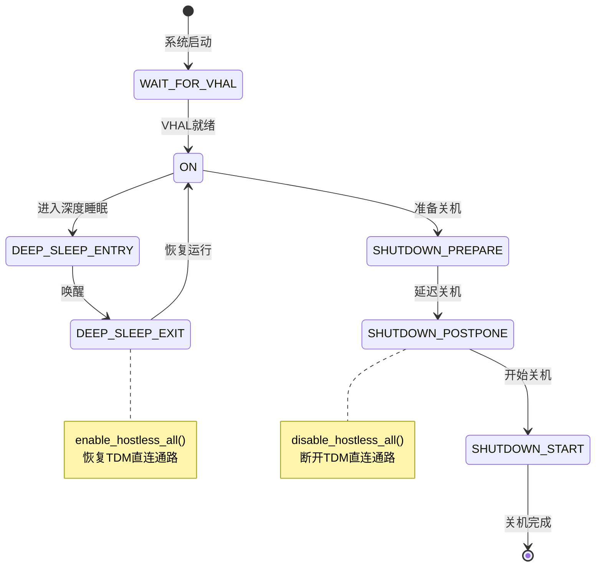

### 17.3.6 enable/disable_hostless_all()

```cpp
void AutoPower::enable_hostless_all() {
    ALOGI("Enabling all hostless sessions");
    enable_hostless(MERC_SESSION);
    enable_hostless(A2B_SESSION);
}

void AutoPower::disable_hostless_all() {
    ALOGI("Disabling all hostless sessions");
    disable_hostless(MERC_SESSION);
    disable_hostless(A2B_SESSION);
}
```

### 17.3.7 SSR恢复与电源协同

SSR(Subsystem Restart)与电源管理紧密协同：

| 场景 | 触发源 | auto-audiod行为 | AutoPower行为 |
|------|--------|----------------|---------------|
| ADSP重启 | /proc/asound/cardN/state→OFFLINE→ONLINE | 重新enable_hostless+通知Audio HAL | 无直接操作 |
| Deep Sleep退出 | VHAL AP_POWER_STATE_REPORT | 无直接操作 | enable_hostless_all |
| 系统关机 | VHAL SHUTDOWN_PREPARE | 无直接操作 | disable_hostless_all |
| Audio HAL死亡 | binderDied回调 | 重连HIDL接口+恢复hostless | 无直接操作 |

---

## 17.4 Silent Boot监控

### 17.4.1 静默启动模式概述

Silent Boot（静默启动）是车载系统的特殊启动模式。在车辆特定场景下（如后台升级后重启、低功耗唤醒），系统需要在不产生任何音频输出的情况下完成启动，避免突然播放声音惊扰用户。`audio_hal_plugin`与auto-audiod协同实现静默启动监控。

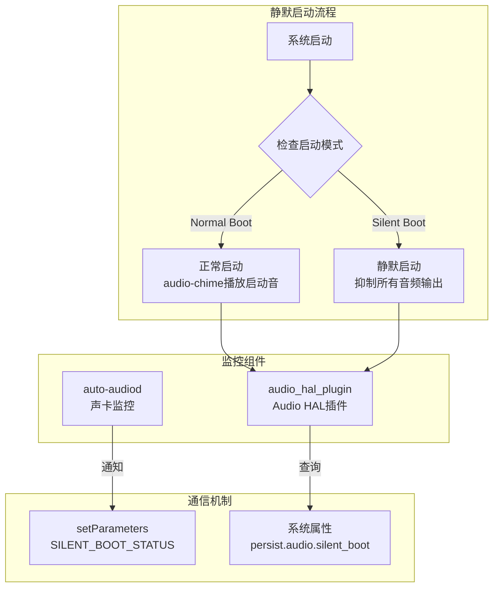

### 17.4.2 静默启动判定逻辑

```cpp
// audio_hal_plugin中的静默启动检查
bool AudioHalPlugin::isSilentBootMode() {
    // 读取系统属性判断是否为静默启动
    char value[PROPERTY_VALUE_MAX] = {0};
    property_get("persist.audio.silent_boot", value, "0");

    if (strcmp(value, "1") == 0) {
        ALOGI("Silent boot mode detected");
        return true;
    }

    // 检查启动原因
    char bootreason[PROPERTY_VALUE_MAX] = {0};
    property_get("sys.boot.reason", bootreason, "");

    // 特定启动原因触发静默模式
    if (strstr(bootreason, "thermal") ||
        strstr(bootreason, "watchdog") ||
        strstr(bootreason, "kernel_panic")) {
        ALOGI("Abnormal boot reason: %s, entering silent mode", bootreason);
        return true;
    }

    return false;
}
```

### 17.4.3 静默启动下的音频抑制

在静默启动模式下，以下音频行为会被抑制：

| 组件 | 正常启动行为 | 静默启动行为 |
|------|------------|------------|
| audio-chime | 播放启动提示音 | 跳过播放 |
| auto-audiod | 立即enable_hostless | 延迟enable直到Audio HAL就绪 |
| Audio HAL | 正常初始化所有设备 | 初始化但保持mute状态 |
| ACDB校准 | 立即推送 | 延迟到非静默模式 |

### 17.4.4 audio_hal_plugin通信机制

```cpp
// auto-audiod通知Audio HAL静默启动状态
void AutoAudioDaemon::notifySilentBootStatus(bool is_silent) {
    if (mPrimaryDevice == nullptr) return;

    char param[64];
    snprintf(param, sizeof(param), "SILENT_BOOT_STATUS=%s",
             is_silent ? "1" : "0");

    mPrimaryDevice->setParameters(0 /*halVersion*/, param,
        [&](int ret) {
            if (ret != 0) {
                ALOGE("Failed to set SILENT_BOOT_STATUS: %d", ret);
            }
        });
}
```

---

## 17.5 audio-chime早期提示音

### 17.5.1 架构概述

`audio-chime`是SA8295平台的早期启动音播放应用，它在Android启动早期（AudioFlinger尚未完全就绪时）直接通过tinyalsa PCM API播放提示音，确保用户在车辆启动后能快速听到反馈音。

```mermaid
graph TB
    subgraph AudioChime["audio-chime"]
        MAIN[main入口]
        INIT_ACDB[ACDB初始化<br/>dlopen+acdb_loader_init]
        INIT_MIXER[Mixer初始化<br/>设置TDM路由]
        PLAY[PCM播放<br/>tinyalsa接口]
        SSR_MONITOR[SSR监听<br/>声卡状态恢复]
    end

    subgraph Dependencies["依赖库"]
        LIBACDB[libacdbloaderclient.so<br/>ACDB客户端库]
        TINYALSA[libtinyalsa.so<br/>ALSA用户态库]
    end

    subgraph Kernel_Interface["内核接口"]
        PCM_DEV[/dev/snd/pcmC0D22p<br/>MULTIMEDIA23]
        MIXER_DEV[/dev/snd/controlC0<br/>Mixer控制]
    end

    MAIN --> INIT_ACDB
    MAIN --> INIT_MIXER
    MAIN --> PLAY
    MAIN --> SSR_MONITOR
    INIT_ACDB -->|dlopen| LIBACDB
    PLAY -->|pcm_open| PCM_DEV
    INIT_MIXER -->|mixer_ctl_set| MIXER_DEV
```

### 17.5.2 默认配置参数

```cpp
// audio-chime默认配置
static const struct chime_config {
    int app_type;       // 应用类型ID
    int acdb_id;        // ACDB设备校准ID
    int sample_rate;    // 采样率
    int fedai;          // Front-End DAI ID
    int channels;       // 通道数
    int format;         // PCM格式
} default_chime_config = {
    .app_type    = 69943,           // PAL_STREAM_TYPE_CHIME对应的应用类型
    .acdb_id     = 60,              // 媒体播放ACDB校准ID
    .sample_rate = 48000,           // 48kHz采样
    .fedai       = 22,              // MULTIMEDIA23 = 22 (0-indexed)
    .channels    = 2,               // 立体声
    .format      = PCM_FORMAT_S16_LE,  // 16-bit小端
};
```

### 17.5.3 ACDB初始化流程

audio-chime在播放启动音之前，必须先通过ACDB推送校准数据到ADSP，确保DSP graph正确配置：

```cpp
int AudioChime::initAcdb() {
    // Step 1: 动态加载ACDB客户端库
    void *acdb_handle = dlopen("libacdbloaderclient.so", RTLD_NOW);
    if (!acdb_handle) {
        ALOGE("Failed to dlopen libacdbloaderclient.so: %s", dlerror());
        return -ENOENT;
    }

    // Step 2: 获取ACDB loader函数指针
    acdb_loader_init_v4_t acdb_loader_init_v4 =
        (acdb_loader_init_v4_t)dlsym(acdb_handle, "acdb_loader_init_v4");
    acdb_loader_send_audio_cal_v6_t acdb_loader_send_audio_cal_v6 =
        (acdb_loader_send_audio_cal_v6_t)dlsym(acdb_handle,
            "acdb_loader_send_audio_cal_v6");

    if (!acdb_loader_init_v4 || !acdb_loader_send_audio_cal_v6) {
        ALOGE("Failed to resolve ACDB loader symbols");
        dlclose(acdb_handle);
        return -ENOENT;
    }

    // Step 3: 初始化ACDB loader
    int ret = acdb_loader_init_v4();
    if (ret != 0) {
        ALOGE("acdb_loader_init_v4 failed: %d", ret);
        return ret;
    }

    // Step 4: 发送音频校准数据
    // 参数：app_type, acdb_id, sample_rate, fedai
    ret = acdb_loader_send_audio_cal_v6(
        default_chime_config.app_type,    // 69943
        default_chime_config.acdb_id,     // 60
        default_chime_config.sample_rate, // 48000
        default_chime_config.fedai        // 22 (MULTIMEDIA23)
    );
    if (ret != 0) {
        ALOGE("acdb_loader_send_audio_cal_v6 failed: %d", ret);
        return ret;
    }

    ALOGI("ACDB calibration sent successfully for chime");
    return 0;
}
```

### 17.5.4 Mixer路由配置

audio-chime通过ALSA mixer控制配置TDM路由，将MULTIMEDIA23的输出路由到TERT_TDM_RX_0：

```cpp
int AudioChime::configureMixerRoute() {
    struct mixer *mixer = mixer_open(0 /*card*/);
    if (!mixer) {
        ALOGE("Failed to open mixer for card 0");
        return -ENODEV;
    }

    // 配置TERT_TDM_RX_0 Audio Mixer，将MultiMedia23路由到TDM输出
    struct mixer_ctl *ctl = mixer_get_by_name(mixer,
        "TERT_TDM_RX_0 Audio Mixer MultiMedia23");
    if (!ctl) {
        ALOGE("Failed to find TERT_TDM_RX_0 Audio Mixer MultiMedia23");
        mixer_close(mixer);
        return -ENOENT;
    }

    // 启用路由：设置值为1
    mixer_ctl_set_value(ctl, 0, 1);
    ALOGI("Configured TERT_TDM_RX_0 Audio Mixer MultiMedia23 = 1");

    // 可选：配置音量
    struct mixer_ctl *vol_ctl = mixer_get_by_name(mixer,
        "MultiMedia23 Volume");
    if (vol_ctl) {
        // 设置音量到合适级别
        mixer_ctl_set_value(vol_ctl, 0, CHIME_VOLUME_LEVEL);
    }

    mixer_close(mixer);
    return 0;
}
```

### 17.5.5 PCM播放实现

使用tinyalsa PCM API直接播放音频数据：

```cpp
int AudioChime::playChime(const char *wave_file) {
    struct pcm_config config;
    memset(&config, 0, sizeof(config));
    config.channels = default_chime_config.channels;     // 2
    config.rate = default_chime_config.sample_rate;      // 48000
    config.period_size = 1024;
    config.period_count = 4;
    config.format = default_chime_config.format;         // PCM_FORMAT_S16_LE

    // Step 1: 打开PCM设备 (MULTIMEDIA23 = PCM设备22)
    struct pcm *pcm = pcm_open(0 /*card*/, 22 /*device*/,
                               PCM_OUT, &config);
    if (!pcm_is_ready(pcm)) {
        ALOGE("Failed to open PCM device 22: %s", pcm_get_error(pcm));
        return -ENODEV;
    }

    // Step 2: 读取WAV文件数据
    FILE *fp = fopen(wave_file, "rb");
    if (!fp) {
        ALOGE("Failed to open wave file: %s", wave_file);
        pcm_close(pcm);
        return -ENOENT;
    }

    // Step 3: 写入PCM数据
    char buffer[4096];
    size_t bytes_read;
    while ((bytes_read = fread(buffer, 1, sizeof(buffer), fp)) > 0) {
        if (pcm_write(pcm, buffer, bytes_read) != 0) {
            ALOGE("PCM write error: %s", pcm_get_error(pcm));
            break;
        }
    }

    // Step 4: 清理
    fclose(fp);
    pcm_close(pcm);
    return 0;
}
```

### 17.5.6 SSR恢复机制

audio-chime注册了声卡状态监听，当ADSP发生SSR重启时，自动重新发送ACDB校准并重启播放：

```cpp
void AudioChime::ssrMonitor() {
    // 监听SND_CARD_STATUS变化
    // 当收到ONLINE通知时：
    //   1. 重新初始化ACDB校准
    //   2. 重新配置Mixer路由
    //   3. 重启PCM播放（如果需要）

    while (!mExitRequested) {
        // 等待声卡状态通知
        char state[32] = {0};
        int fd = open("/proc/asound/card0/state", O_RDONLY);
        read(fd, state, sizeof(state) - 1);
        close(fd);

        if (strncmp(state, "ONLINE", 6) == 0 && mNeedRecovery) {
            ALOGI("SSR recovery: re-initializing chime");
            initAcdb();
            configureMixerRoute();
            mNeedRecovery = false;
        } else if (strncmp(state, "OFFLINE", 7) == 0) {
            ALOGW("Sound card went OFFLINE, marking for recovery");
            mNeedRecovery = true;
        }

        sleep(1);  // 1秒轮询
    }
}
```

### 17.5.7 启动时序分析

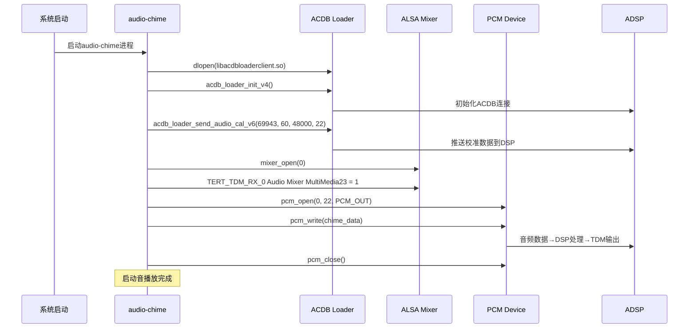

---

## 17.6 ACDB校准体系

### 17.6.1 ACDB概述

ACDB(Audio Calibration Database)是高通平台的核心校准体系，存储了音频设备的校准参数（如增益、滤波器系数、延迟补偿等），在音频流打开时推送到ADSP，确保DSP处理链使用正确的校准数据。

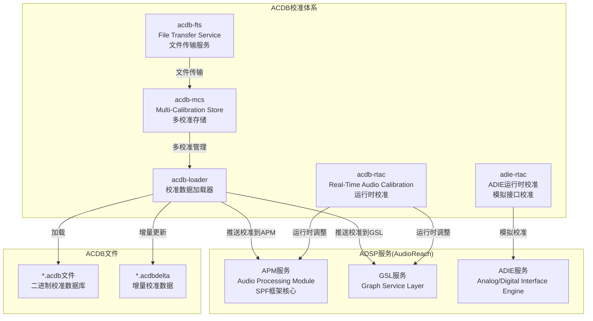

### 17.6.2 acdb-loader校准加载器

`acdb-loader`是ACDB体系的核心组件，负责从ACDB二进制数据库文件中读取校准数据并推送到ADSP：

```cpp
// acdb-loader核心API
class AcdbLoader {
public:
    // 初始化ACDB加载器
    static int acdb_loader_init_v4();

    // 发送音频校准数据（主接口）
    static int acdb_loader_send_audio_cal_v6(
        int app_type,      // 应用类型（如69943）
        int acdb_id,       // ACDB设备ID（如15=Speaker）
        int sample_rate,   // 采样率
        int fedai_id       // Front-End DAI ID
    );

    // 发送自定义校准
    static int acdb_loader_send_custom_cal(
        int acdb_id,
        int sample_rate,
        void *cal_data,
        size_t cal_size
    );

    // 发送AFE校准
    static int acdb_loader_send_afe_cal(
        int acdb_id,
        int sample_rate,
        int port_id
    );
};
```

#### 校准推送流程

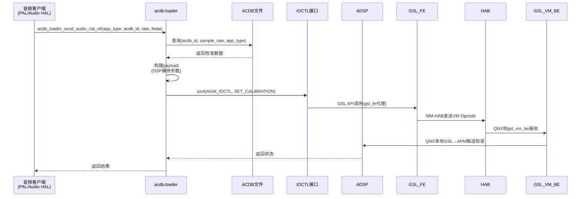

### 17.6.3 acdb-mcs多校准存储

`acdb-mcs`(Multi-Calibration Store)支持为同一设备存储多个校准配置，适应不同使用场景：

```cpp
// acdb-mcs API
class AcdbMcs {
public:
    // 分配校准ID
    static int acdb_mcs_alloc_cal_id(
        int acdb_id,
        int app_type,
        int sample_rate,
        int *cal_id);

    // 释放校准ID
    static int acdb_mcs_dealloc_cal_id(int cal_id);

    // 应用校准配置
    static int acdb_mcs_apply_cal(int cal_id);

    // 获取当前校准信息
    static int acdb_mcs_get_cal_info(
        int cal_id,
        struct cal_info *info);
};
```

**多校准场景示例**：

| 设备 | 校准场景A | 校准场景B | 校准场景C |
|------|----------|----------|----------|
| Speaker | 驻车模式(大音量) | 行驶模式(中等音量) | 夜间模式(低音量) |
| Headset | 32Ω耳机 | 16Ω耳机 | 高阻抗耳机 |
| BT SCO | 宽带语音 | 窄带语音 | HD Voice |

### 17.6.4 acdb-fts文件传输服务

`acdb-fts`(File Transfer Service)负责在Android域和ADSP之间传输校准文件：

```cpp
// acdb-fts核心功能
class AcdbFts {
public:
    // 传输ACDB文件到ADSP
    static int acdb_fts_send_file(
        const char *file_path,    // ACDB文件路径
        int partition_id          // 分区ID
    );

    // 获取ADSP侧ACDB版本
    static int acdb_fts_get_version(
        int *major,
        int *minor
    );

    // 同步增量校准
    static int acdb_fts_sync_delta(
        const char *delta_path    // .acdbdelta文件路径
    );
};
```

### 17.6.5 acdb-rtac运行时校准

`acdb-rtac`(Real-Time Audio Calibration)允许在音频流运行过程中动态调整校准参数，无需重新打开音频流：

```cpp
// acdb-rtac核心API
class AcdbRtac {
public:
    // 设置运行时校准
    static int acdb_rtac_set_cal(
        int port_id,              // AFE端口ID
        int acdb_id,              // ACDB设备ID
        void *cal_data,           // 校准数据
        size_t cal_size           // 数据大小
    );

    // 获取当前校准
    static int acdb_rtac_get_cal(
        int port_id,
        int acdb_id,
        void *cal_data,
        size_t *cal_size
    );

    // 设置ADIE校准
    static int adie_rtac_set_cal(
        int adie_id,
        void *cal_data,
        size_t cal_size
    );
};
```

### 17.6.6 ACDB ID映射表

ACDB ID是连接Android侧设备枚举和DSP校准数据的桥梁，每个音频设备都有唯一的ACDB ID：

#### 播放(RX)设备ACDB ID

| ACDB ID | 设备名称 | 说明 |
|---------|---------|------|
| 1 | HANDSET_RX | 手机听筒播放 |
| 7 | HANDSET_RX(alt) | 手机听筒播放(替代ID) |
| 10 | HEADSET_RX | 有线耳机播放 |
| 14 | SPEAKER_RX(alt) | 扬声器播放(替代ID) |
| 15 | SPEAKER_RX | 扬声器播放 |
| 18 | HDMI_RX | HDMI输出 |
| 22 | BT_SCO_RX | 蓝牙SCO播放 |
| 26 | BT_A2DP_RX | 蓝牙A2DP播放 |
| 45 | USB_RX | USB音频输出 |
| 60 | MEDIA_RX | 媒体播放(通用) |
| 66 | VOICE_RX | 语音通话播放 |

#### 录音(TX)设备ACDB ID

| ACDB ID | 设备名称 | 说明 |
|---------|---------|------|
| 4 | HANDSET_TX | 手机麦克风录音 |
| 11 | HEADSET_TX | 有线耳机麦克风录音 |
| 16 | SPEAKER_TX | 扬声器参考信号 |
| 19 | HDMI_TX | HDMI输入 |
| 23 | BT_SCO_TX | 蓝牙SCO录音 |
| 46 | USB_TX | USB音频输入 |

#### 车载特有ACDB ID

| ACDB ID | 设备名称 | 说明 |
|---------|---------|------|
| 60 | CHIME_RX | 提示音播放 |
| 89 | EC_REF_RX | 回声参考信号 |
| 130 | NAVI_RX | 导航提示音 |
| 131 | ANNOUNCEMENT_RX | 广播通知 |

### 17.6.7 ACDB校准数据结构

```cpp
// ACDB校准数据在DSP端的表示
struct acdb_cal_data {
    uint32_t cal_type;          // 校准类型
    uint32_t cal_size;          // 校准数据大小
    void     *cal_kv;           // 键值对数据
    uint32_t num_kv_pairs;      // 键值对数量
};

// 校准类型定义
enum acdb_cal_type {
    CAL_TYPE_AUDIO_RX    = 0,   // RX播放校准
    CAL_TYPE_AUDIO_TX    = 1,   // TX录音校准
    CAL_TYPE_AUDIO_AFE   = 2,   // AFE校准
    CAL_TYPE_AUDIO_APM   = 3,   // APM校准(AudioReach)
    CAL_TYPE_AUDIO_AGM   = 4,   // AGM校准(AudioReach)
    CAL_TYPE_AUDIO_ADIE  = 5,   // ADIE模拟校准
    // Legacy only(简略)
    CAL_TYPE_AUDIO_ADM   = 6,   // ADM校准(legacy)
    CAL_TYPE_AUDIO_ASM   = 7,   // ASM校准(legacy)
};

// ACDB键值对
struct acdb_kv_pair {
    uint32_t key;               // 参数键(如GAIN, DELAY等)
    uint32_t value;             // 参数值
};
```

### 17.6.8 ACDB与DSP服务交互

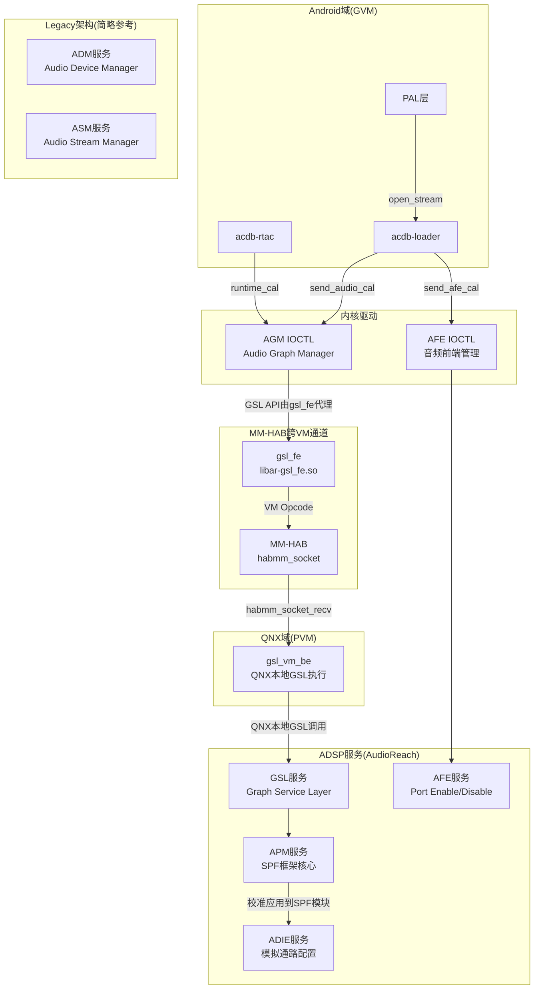

---

## 17.7 ACDB校准数据（Android与QNX双域共享）

### 17.7.1 ACDB架构概述

**Android域和QNX域共用同一套ACDB校准数据**，并非各自独立维护。ACDB(Audio Calibration Database)校准文件由QNX域持有和管理，Android域通过acdb-loader在运行时加载同一套校准数据并推送到ADSP。SA8295平台支持两种ACDB架构版本：**legacy架构**(`adp_8295`)和**AR架构**(`adp_8295_ar`)。

> **重要说明**：双域共用同一套ACDB校准数据，而非各自独立ACDB。QNX侧的ACDB文件同时也服务于Android域的acdb-loader，两者最终都将校准推送到同一个ADSP。

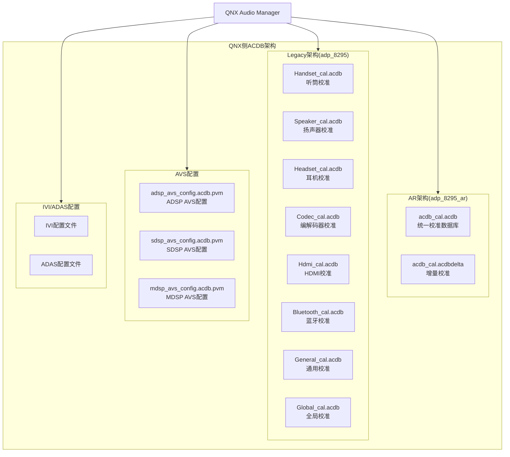

### 17.7.2 AR架构(adp_8295_ar)

AR(Audio Reach)架构是高通新一代音频架构，采用统一的ACDB数据库文件：

#### 目录结构

```
adp_8295_ar/
├── acdb_cal.acdb           # 统一校准数据库(所有设备校准合并)
├── acdb_cal.acdbdelta      # 增量校准数据(OEM定制覆盖)
└── avs_config/
    ├── adsp_avs_config.acdb.pvm   # ADSP AVS配置
    ├── sdsp_avs_config.acdb.pvm   # SDSP AVS配置
    └── mdsp_avs_config.acdb.pvm   # MDSP AVS配置
```

#### AR架构特点

| 特性 | 说明 |
|------|------|
| 统一数据库 | 所有设备校准合并在单个acdb_cal.acdb文件中 |
| 增量覆盖 | acdbdelta文件允许OEM在不修改主数据库的情况下覆盖特定参数 |
| Graph-based | 基于Graph(图)的音频处理架构，校准与Graph绑定 |
| 动态加载 | 支持运行时加载/替换校准数据 |

### 17.7.3 Legacy架构(adp_8295)

Legacy架构按设备类型分离校准文件：

#### 目录结构

```
adp_8295/
├── Handset_cal.acdb        # 听筒/手机麦克风校准
├── Speaker_cal.acdb        # 扬声器校准(增益/均衡/限幅)
├── Headset_cal.acdb        # 有线耳机校准
├── Codec_cal.acdb          # 编解码器校准(ADC/DAC配置)
├── Hdmi_cal.acdb           # HDMI输出校准
├── Bluetooth_cal.acdb      # 蓝牙SCO/A2DP校准
├── General_cal.acdb        # 通用校准(共享参数)
├── Global_cal.acdb         # 全局校准(系统级参数)
├── avs_config/
│   ├── adsp_avs_config.acdb.pvm
│   ├── sdsp_avs_config.acdb.pvm
│   └── mdsp_avs_config.acdb.pvm
├── ivi_config/             # IVI信息娱乐配置
│   ├── ivi_audio_route.conf
│   └── ivi_volume_table.conf
└── adas_config/            # ADAS高级驾驶辅助配置
    ├── adas_warning_tone.conf
    └── adas_chime_config.conf
```

#### 按设备分类校准内容

##### Speaker_cal.acdb

```ini
# 扬声器校准参数(示例)
[Speaker_RX]
acdb_id = 15
sample_rate = 48000

# 增益校准
rx_gain = 0dB              # 数字增益
rx_analog_gain = 3dB       # 模拟增益
spk_protection_threshold = 95dB  # 扬声器保护阈值

# 均衡器校准
eq_num_bands = 5
eq_band_1 = 100Hz, -3dB, Q=1.0
eq_band_2 = 500Hz, 0dB, Q=0.7
eq_band_3 = 2kHz, +2dB, Q=1.2
eq_band_4 = 5kHz, -1dB, Q=0.8
eq_band_5 = 10kHz, -4dB, Q=0.6

# 限幅器校准
limiter_threshold = -6dBFS
limiter_release = 50ms
```

##### Bluetooth_cal.acdb

```ini
# 蓝牙校准参数(示例)
[BT_SCO_RX]
acdb_id = 22
sample_rate = 16000         # NB: 8kHz, WB: 16kHz
nb_mode_rate = 8000
wb_mode_rate = 16000

[BT_A2DP_RX]
acdb_id = 26
sample_rate = 44100
supported_codecs = SBC,AAC,LDAC,AptX,AptX-HD
```

### 17.7.4 AVS配置文件

AVS(Audio Voice Subsystem)配置控制DSP子系统的行为：

```ini
# adsp_avs_config.acdb.pvm (ADSP AVS配置)
[ADSP_AVS]
# 性能模式
pvm_mode = PERFORMANCE      # PERFORMANCE / LOW_POWER / ULTRA_LOW_POWER

# 时钟配置
mips_budget = 500           # MIPS预算
clock_freq_khz = 768000    # 时钟频率

# 内存配置
lpaif_mem_size = 2048       # LPAIF内存大小(KB)

# 音频特性
afe_loopback_enable = 0     # AFE环回禁用
adm Copp.peak_detect = 1   # 峰值检测使能
```

```ini
# sdsp_avs_config.acdb.pvm (SDSP AVS配置 - 传感器处理域)
[SDSP_AVS]
pvm_mode = LOW_POWER
mips_budget = 200
```

```ini
# mdsp_avs_config.acdb.pvm (MDSP AVS配置 - 调制解调域)
[MDSP_AVS]
pvm_mode = PERFORMANCE
mips_budget = 300
```

### 17.7.5 IVI/ADAS配置

车载特定配置文件：

```ini
# ivi_audio_route.conf (IVI音频路由配置)
[IVI_ROUTES]
# 区域音频路由
zone0_output = TERT_TDM_RX   # 主区域输出
zone1_output = SEC_TDM_RX    # 副区域输出

# 优先级路由
navigation_priority = HIGH    # 导航高优先级
chime_priority = CRITICAL     # 提示音最高优先级
media_priority = NORMAL       # 媒体正常优先级
```

```ini
# adas_chime_config.conf (ADAS提示音配置)
[ADAS_CHIMES]
# 警告音配置
forward_collision_warning = chime_fcw.wav
lane_departure_warning = chime_ldw.wav
blind_spot_warning = chime_bsw.wav
parking_sensor_near = chime_park_near.wav
parking_sensor_far = chime_park_far.wav

# 提示音优先级
fcw_priority = 10  # 最高
ldw_priority = 8
bsw_priority = 6
park_priority = 4
```

### 17.7.6 Android与QNX侧ACDB共享对比

> **核心要点**：Android和QNX共用同一套ACDB校准数据，两者的校准最终都推送到同一个ADSP，仅加载方式和时机不同。

| 特性 | Android侧 | QNX侧 |
|------|----------|-------|
| 数据来源 | **同一套ACDB校准文件**（双域共享） | **同一套ACDB校准文件**（双域共享） |
| 加载方式 | acdb-loader运行时推送 | QNX AM启动时加载 |
| 文件格式 | 单个.acdb文件(AR架构) | 按设备分离或统一(取决于架构) |
| 更新机制 | acdb-rtac运行时更新 | 需要重启QNX AM |
| 校准路径 | /vendor/etc/acdbdata/ | /sys/platform/acdb/ |
| 增量支持 | .acdbdelta | .acdbdelta |
| DSP通信 | acdb-loader→gsl_fe→MM-HAB→gsl_vm_be→GSL→ADSP | QNX AM→AGM→GSL→ADSP(直连) |

---

## 17.8 ALSA UCM配置

### 17.8.1 UCM概述

ALSA UCM(Use Case Manager)定义了SA8295声卡的音频用例配置，包括设备路由、格式设置和使能控制。SA8295平台的UCM配置文件为`sa8295-adp-star-snd-card.conf`。

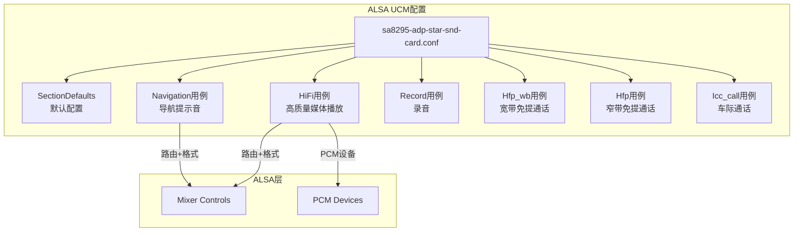

### 17.8.2 UCM配置文件结构

```uci
# sa8295-adp-star-snd-card.conf
# Syntax 2格式

SectionUseCase."HiFi" {
    Comment "High quality media playback"
    Enable {
        # TDM路由配置
        cset "name='TERT_TDM_RX_0 Audio Mixer MultiMedia1' 1"
        # 格式配置
        cset "name='MULTIMEDIA1 Format' 'S16_LE'"
        cset "name='MULTIMEDIA1 Rate' 48000"
        cset "name='MULTIMEDIA1 Channels' 2"
    }
    Disable {
        cset "name='TERT_TDM_RX_0 Audio Mixer MultiMedia1' 0"
    }
}

SectionUseCase."Navigation" {
    Comment "Navigation prompt audio"
    Enable {
        cset "name='SEC_TDM_RX_0 Audio Mixer MultiMedia5' 1"
        cset "name='MULTIMEDIA5 Format' 'S16_LE'"
        cset "name='MULTIMEDIA5 Rate' 48000"
    }
    Disable {
        cset "name='SEC_TDM_RX_0 Audio Mixer MultiMedia5' 0"
    }
}

SectionUseCase."Record" {
    Comment "Audio recording from microphone"
    Enable {
        cset "name='MultiMedia2 Mixer TERT_TDM_TX_0' 1"
        cset "name='TERT_TDM_TX_0 Sample Rate' 48000"
        cset "name='TERT_TDM_TX_0 Channels' 4"
    }
    Disable {
        cset "name='MultiMedia2 Mixer TERT_TDM_TX_0' 0"
    }
}

SectionUseCase."Hfp_wb" {
    Comment "Hands-free call wideband (16kHz)"
    Enable {
        cset "name='SEC_TDM_RX_0 Audio Mixer MultiMedia7' 1"
        cset "name='MultiMedia8 Mixer SLIMBUS_7_TX' 1"
        cset "name='MULTIMEDIA7 Rate' 16000"
    }
    Disable {
        cset "name='SEC_TDM_RX_0 Audio Mixer MultiMedia7' 0"
        cset "name='MultiMedia8 Mixer SLIMBUS_7_TX' 0"
    }
}

SectionUseCase."Hfp" {
    Comment "Hands-free call narrowband (8kHz)"
    Enable {
        cset "name='SEC_TDM_RX_0 Audio Mixer MultiMedia7' 1"
        cset "name='MultiMedia8 Mixer SLIMBUS_7_TX' 1"
        cset "name='MULTIMEDIA7 Rate' 8000"
    }
    Disable {
        cset "name='SEC_TDM_RX_0 Audio Mixer MultiMedia7' 0"
        cset "name='MultiMedia8 Mixer SLIMBUS_7_TX' 0"
    }
}

SectionUseCase."Icc_call" {
    Comment "Inter-car communication call"
    Enable {
        cset "name='TERT_TDM_RX_0 Audio Mixer MultiMedia9' 1"
        cset "name='MultiMedia10 Mixer QUIN_TDM_TX_0' 1"
        cset "name='MULTIMEDIA9 Rate' 16000"
        cset "name='MULTIMEDIA10 Rate' 16000"
    }
    Disable {
        cset "name='TERT_TDM_RX_0 Audio Mixer MultiMedia9' 0"
        cset "name='MultiMedia10 Mixer QUIN_TDM_TX_0' 0"
    }
}
```

### 17.8.3 SectionDefaults默认配置

```uci
SectionDefaults {
    # 指定声卡设备
    cdev "hw:0"

    # Instance ID支持(SA8295平台特性)
    cset "name='Instance ID Support' 1"

    # 默认TDM配置
    cset "name='TERT_TDM_RX_0 Sample Rate' 48000"
    cset "name='TERT_TDM_RX_0 Channels' 8"
    cset "name='TERT_TDM_RX_0 Bit Format' 'S16_LE'"

    cset "name='SEC_TDM_RX_0 Sample Rate' 48000"
    cset "name='SEC_TDM_RX_0 Channels' 8"
    cset "name='SEC_TDM_RX_0 Bit Format' 'S16_LE'"

    cset "name='QUAT_TDM_RX_0 Sample Rate' 48000"
    cset "name='QUAT_TDM_RX_0 Channels' 8"
    cset "name='QUAT_TDM_RX_0 Bit Format' 'S16_LE'"

    cset "name='QUIN_TDM_RX_0 Sample Rate' 48000"
    cset "name='QUIN_TDM_RX_0 Channels' 8"
    cset "name='QUIN_TDM_RX_0 Bit Format' 'S16_LE'"

    # TX通道配置
    cset "name='TERT_TDM_TX_0 Sample Rate' 48000"
    cset "name='TERT_TDM_TX_0 Channels' 8"
    cset "name='QUIN_TDM_TX_0 Sample Rate' 48000"
    cset "name='QUIN_TDM_TX_0 Channels' 8"
}
```

### 17.8.4 TDM通道映射

SA8295平台使用多组TDM总线连接不同的音频设备：

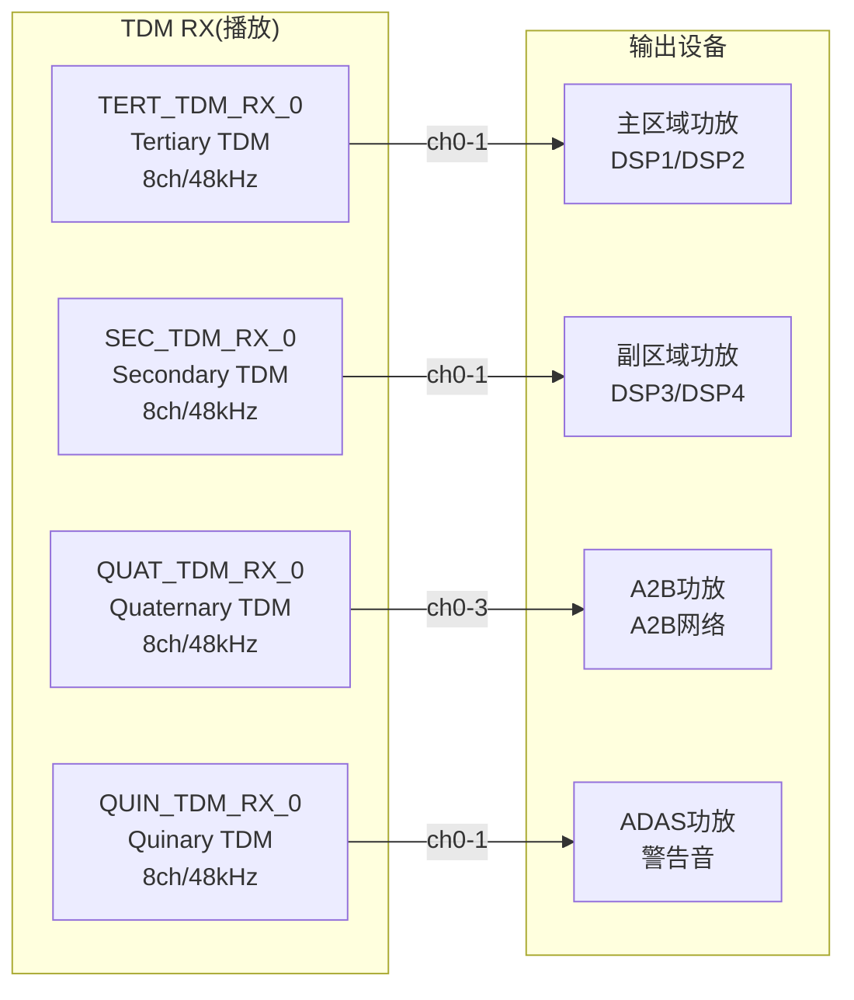

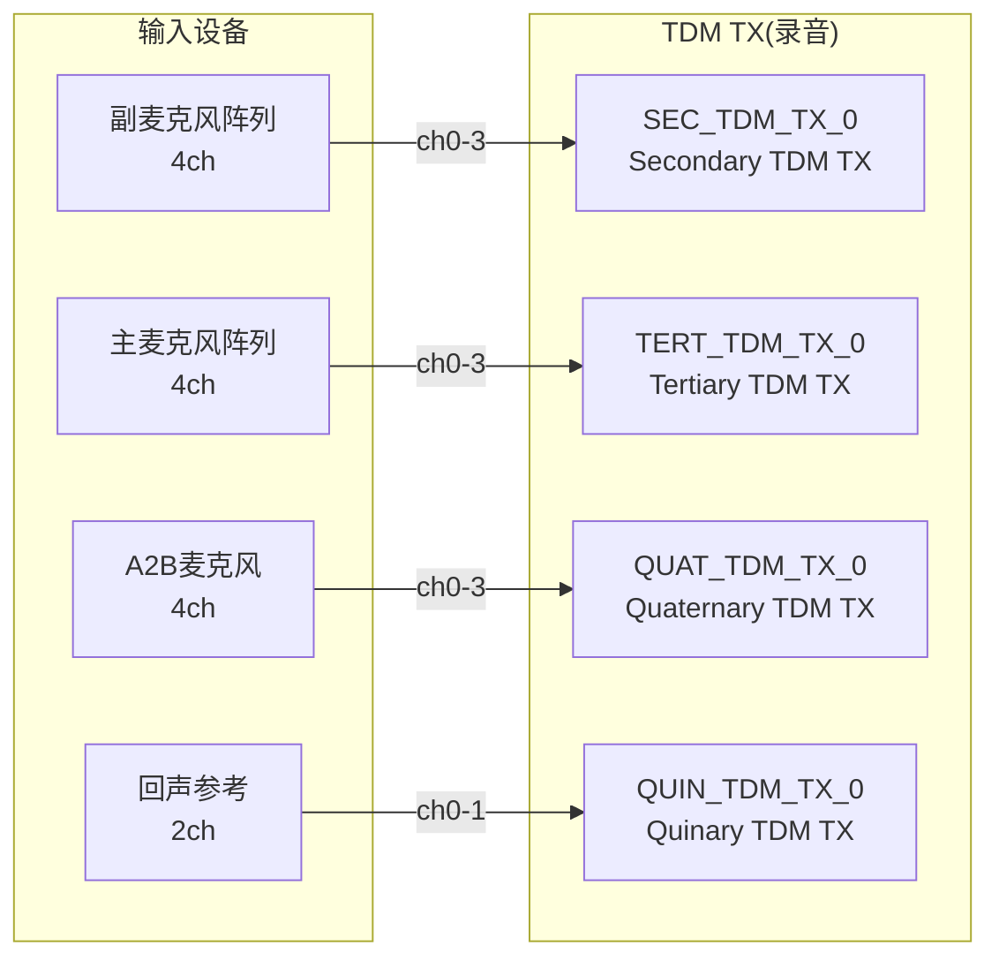

### 17.8.5 用例与PCM设备映射

| 用例 | RX PCM | TX PCM | 采样率 | 通道 | 说明 |
|------|--------|--------|--------|------|------|
| HiFi | MultiMedia1(PCM0) | — | 48kHz | 2ch | 高质量媒体播放 |
| Navigation | MultiMedia5(PCM4) | — | 48kHz | 2ch | 导航提示音 |
| Record | — | MultiMedia2(PCM1) | 48kHz | 4ch | 麦克风录音 |
| Hfp_wb | MultiMedia7(PCM6) | MultiMedia8(PCM7) | 16kHz | 1ch | 宽带免提 |
| Hfp | MultiMedia7(PCM6) | MultiMedia8(PCM7) | 8kHz | 1ch | 窄带免提 |
| Icc_call | MultiMedia9(PCM8) | MultiMedia10(PCM9) | 16kHz | 1ch | 车际通话 |

### 17.8.6 Instance ID Support

SA8295平台启用`Instance ID Support`，这是高通平台对ALSA PCM设备标识的增强，允许同一PCM设备名有多个实例：

```uci
# Instance ID Support = 1 启用后
# PCM设备引用格式变为：
#   hw:CARD,DEVICE,INSTANCE
# 例如：
#   hw:0,0,0   - MultiMedia1 实例0
#   hw:0,0,1   - MultiMedia1 实例1(并发流)
```

这支持Android的**multiple_mix_dsp**模式，允许多个音频流同时使用同一个PCM设备。

---

## 17.9 auto-casa-xml配置

### 17.9.1 概述

`auto-casa-xml`是PAL(Platform Abstraction Layer)层的资源配置文件，定义了音频流类型、设备配置、蓝牙编解码器、音量控制等关键参数。它是PAL运行时的"数据库"，决定了音频流如何被路由和处理。

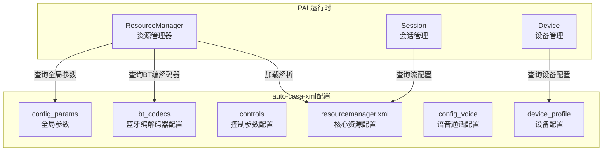

### 17.9.2 resourcemanager.xml结构

```xml
<?xml version="1.0" encoding="ISO-8859-1"?>
<audio_platform_info>
    <!-- 全局配置参数 -->
    <config_params>
        <param name="native_audio_mode" value="multiple_mix_dsp"/>
        <param name="max_sessions" value="128"/>
        <param name="max_aptx_sessions" value="4"/>
        <param name="max_aaaptx_sessions" value="4"/>
    </config_params>

    <!-- 蓝牙编解码器配置 -->
    <bt_codecs>
        <codec name="AAC" format="AUDIO_FORMAT_AAC"/>
        <codec name="SBC" format="AUDIO_FORMAT_SBC"/>
        <codec name="LDAC" format="AUDIO_FORMAT_LDAC"/>
        <codec name="AptX" format="AUDIO_FORMAT_APTX"/>
        <codec name="AptX-HD" format="AUDIO_FORMAT_APTX_HD"/>
        <codec name="AptX-Adaptive" format="AUDIO_FORMAT_APTX_ADAPTIVE"/>
        <codec name="AptX-DualMono" format="AUDIO_FORMAT_APTX_DUAL_MONO"/>
        <codec name="AptX-Adaptive-Speech" format="AUDIO_FORMAT_APTX_ADAPTIVE_SPEECH"/>
    </bt_codecs>

    <!-- 控制参数 -->
    <controls>
        <control name="PLUGIN_CONTROL_VOLUME" id="0"/>
        <control name="PLUGIN_CONTROL_BOOST" id="1"/>
        <control name="PLUGIN_CONTROL_HD_VOICE" id="2"/>
        <control name="PLUGIN_CONTROL_AUDIO_BUFFER" id="3"/>
        <control name="PLUGIN_CONTROL_AUDIO_LATENCY" id="4"/>
    </controls>

    <!-- 设备配置 -->
    <device_profile>
        <!-- 麦克风设备 -->
        <device id="PAL_DEVICE_IN_HANDSET_MIC">
            <profile name="TDM-LPAIF-TX-TERTIARY" channels="8"
                     samplerate="48000" bit_width="16"/>
        </device>

        <!-- 扬声器设备 -->
        <device id="PAL_DEVICE_OUT_SPEAKER">
            <profile name="TDM-LPAIF-RX-TERTIARY" channels="8"
                     samplerate="48000" bit_width="16"/>
        </device>

        <!-- 蓝牙A2DP设备 -->
        <device id="PAL_DEVICE_OUT_BLUETOOTH_A2DP">
            <profile name="SLIMBUS_6_RX" channels="2"
                     samplerate="48000" bit_width="16"/>
        </device>
    </device_profile>

    <!-- 语音通话配置 -->
    <config_voice>
        <vsid value="0xB3000000"/>
        <mode_map>
            <mode name="NORMAL" vsid="0xB3000000"/>
            <mode name="IN_CALL" vsid="0xB3000001"/>
            <mode name="RING" vsid="0xB3000002"/>
        </mode_map>
    </config_voice>
</audio_platform_info>
```

### 17.9.3 config_params全局参数详解

| 参数名 | 默认值 | 说明 |
|--------|-------|------|
| `native_audio_mode` | `multiple_mix_dsp` | DSP混音模式，允许多流并发 |
| `max_sessions` | `128` | 最大同时会话数 |
| `max_aptx_sessions` | `4` | 最大AptX并发会话数 |
| `max_aaaptx_sessions` | `4` | 最大AptX-Adaptive并发会话数 |

**native_audio_mode**取值说明：

| 模式 | 说明 | 适用场景 |
|------|------|---------|
| `multiple_mix_dsp` | DSP端混音，多流共享PCM | 车载多区域并发播放 |
| `multiple_mix_host` | Host端混音，单PCM | 低延迟场景 |
| `single_mix_dsp` | DSP端混音，单PCM | 简单设备 |
| `true_native` | Native直出 | 低延迟直通模式 |

### 17.9.4 bt_codecs蓝牙编解码器

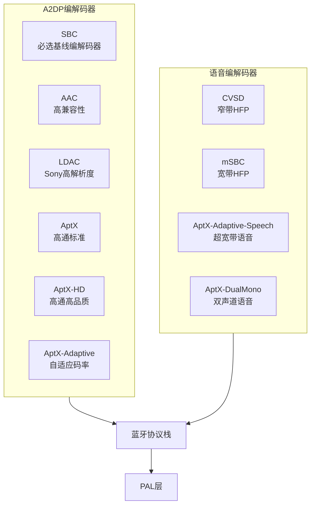

编解码器优先级（默认协商顺序）：

1. **LDAC** — 990kbps，最高音质
2. **AptX-Adaptive** — 自适应，平衡音质/延迟
3. **AptX-HD** — 576kbps，高品质
4. **AAC** — 320kbps，高兼容性
5. **AptX** — 352kbps，低延迟
6. **SBC** — 基线编解码器

### 17.9.5 controls控制参数

PAL插件控制用于在运行时调整音频处理行为：

```cpp
// 控制ID定义
typedef enum {
    PLUGIN_CONTROL_VOLUME       = 0,  // 音量控制
    PLUGIN_CONTROL_BOOST        = 1,  // 增益提升
    PLUGIN_CONTROL_HD_VOICE     = 2,  // HD语音模式
    PLUGIN_CONTROL_AUDIO_BUFFER = 3,  // 音频缓冲区配置
    PLUGIN_CONTROL_AUDIO_LATENCY = 4, // 延迟控制
} plugin_control_id_t;

// 控制使用示例
int PalStream::setControl(plugin_control_id_t id, int value) {
    switch (id) {
    case PLUGIN_CONTROL_VOLUME:
        return PayloadBuilder::setVolume(graphHandle, value);
    case PLUGIN_CONTROL_BOOST:
        return PayloadBuilder::setBoost(graphHandle, value);
    case PLUGIN_CONTROL_HD_VOICE:
        return PayloadBuilder::setHdVoice(graphHandle, value);
    case PLUGIN_CONTROL_AUDIO_BUFFER:
        return PayloadBuilder::setBufferSize(graphHandle, value);
    case PLUGIN_CONTROL_AUDIO_LATENCY:
        return PayloadBuilder::setLatency(graphHandle, value);
    }
}
```

### 17.9.6 device_profile设备配置

设备配置定义了PAL设备到物理接口的映射：

```xml
<!-- 设备配置映射 -->
<device_profile>
    <!-- 输入设备 -->
    <device id="PAL_DEVICE_IN_HANDSET_MIC">
        <profile name="TDM-LPAIF-TX-TERTIARY"
                 channels="8" samplerate="48000" bit_width="16"/>
        <acdb_id value="15"/>
    </device>

    <device id="PAL_DEVICE_IN_BLUETOOTH_SCO_HEADSET">
        <profile name="SLIMBUS_7_TX"
                 channels="1" samplerate="16000" bit_width="16"/>
        <acdb_id value="23"/>
    </device>

    <!-- 输出设备 -->
    <device id="PAL_DEVICE_OUT_SPEAKER">
        <profile name="TDM-LPAIF-RX-TERTIARY"
                 channels="8" samplerate="48000" bit_width="16"/>
        <acdb_id value="15"/>
    </device>

    <device id="PAL_DEVICE_OUT_BLUETOOTH_A2DP">
        <profile name="SLIMBUS_6_RX"
                 channels="2" samplerate="48000" bit_width="16"/>
        <acdb_id value="26"/>
    </device>

    <device id="PAL_DEVICE_OUT_HDMI">
        <profile name="HDMI-RX-PRIMARY"
                 channels="2" samplerate="48000" bit_width="16"/>
        <acdb_id value="18"/>
    </device>
</device_profile>
```

#### PAL设备ID与TDM接口映射

| PAL设备ID | 物理接口 | 通道数 | 采样率 | ACDB ID |
|-----------|---------|--------|--------|---------|
| PAL_DEVICE_IN_HANDSET_MIC | TDM-LPAIF-TX-TERTIARY | 8 | 48kHz | 15 |
| PAL_DEVICE_IN_BLUETOOTH_SCO_HEADSET | SLIMBUS_7_TX | 1 | 16kHz | 23 |
| PAL_DEVICE_OUT_SPEAKER | TDM-LPAIF-RX-TERTIARY | 8 | 48kHz | 15 |
| PAL_DEVICE_OUT_BLUETOOTH_A2DP | SLIMBUS_6_RX | 2 | 48kHz | 26 |
| PAL_DEVICE_OUT_HDMI | HDMI-RX-PRIMARY | 2 | 48kHz | 18 |
| PAL_DEVICE_OUT_USB_HEADSET | USB-RX | 2 | 48kHz | 45 |

### 17.9.7 config_voice语音通话配置

```xml
<!-- 语音通话配置 -->
<config_voice>
    <!-- VSID(Voice Session ID)定义 -->
    <vsid value="0xB3000000"/>

    <!-- 模式映射 -->
    <mode_map>
        <mode name="NORMAL"    vsid="0xB3000000"/>
        <mode name="IN_CALL"   vsid="0xB3000001"/>
        <mode name="RING"      vsid="0xB3000002"/>
    </mode_map>

    <!-- 语音设备映射 -->
    <voice_device_map>
        <device_rx="PAL_DEVICE_OUT_SPEAKER"
                  device_tx="PAL_DEVICE_IN_HANDSET_MIC"
                  vsid="0xB3000000"/>
        <device_rx="PAL_DEVICE_OUT_BLUETOOTH_SCO"
                  device_tx="PAL_DEVICE_IN_BLUETOOTH_SCO_HEADSET"
                  vsid="0xB3000001"/>
    </voice_device_map>
</config_voice>
```

### 17.9.8 PAL流类型定义

PAL定义了丰富的流类型，对应不同的音频使用场景：

```cpp
// PAL流类型枚举
typedef enum {
    PAL_STREAM_LOW_LATENCY       = 0,   // 低延迟播放
    PAL_STREAM_DEEP_BUFFER       = 1,   // 深缓冲播放
    PAL_STREAM_COMPRESSED        = 2,   // 压缩音频(Offload)
    PAL_STREAM_VOIP              = 5,   // VoIP通话
    PAL_STREAM_VOICE_CALL        = 6,   // 语音通话
    PAL_STREAM_VOICE_UI          = 7,   // 语音助手
    PAL_STREAM_PCM_HFP           = 8,   // 免提通话PCM
    PAL_STREAM_PROXY             = 9,   // 代理流
    PAL_STREAM_ULTRA_LOW_LATENCY = 10,  // 超低延迟
    PAL_STREAM_GENERIC_CHIME     = 11,  // 提示音
    PAL_STREAM_SPATIAL_AUDIO     = 12,  // 空间音频
    PAL_STREAM_CONTEXT_AWARE     = 13,  // 上下文感知
    PAL_STREAM_NAVI              = 14,  // 导航提示
    PAL_STREAM_SENSOR_AUDIO      = 15,  // 传感器音频
} pal_stream_type_t;
```

每种流类型对应不同的app_type和DSP处理链：

| PAL流类型 | app_type | PCM设备 | DSP处理链 |
|-----------|----------|---------|----------|
| LOW_LATENCY | 69940 | MultiMedia5 | 简单解码+音量 |
| DEEP_BUFFER | 69941 | MultiMedia1 | 完整处理链 |
| COMPRESSED | 69941 | MultiMedia2 | 解码+后处理 |
| VOIP | 69946 | MultiMedia7 | AEC+NS+编码 |
| VOICE_CALL | 69943 | VOICE | 完整语音处理 |
| GENERIC_CHIME | 69943 | MultiMedia23 | 提示音通路 |
| NAVI | 69942 | MultiMedia5 | 导航混音通路 |

---

## 17.10 AGM(Audio Graph Manager)深度解析

### 17.10.1 AGM概述与架构定位

AGM(Audio Graph Manager)是SA8295 AudioReach架构的核心中间层组件，位于PAL和GSL/APM之间，负责在用户态管理DSP音频图的完整生命周期。在AudioReach架构中，AGM替代了旧版legacy架构中的ADM(Audio Device Manager)角色，成为Android域与ADSP交互的统一入口。

> **关键区分**：AGM ≠ ADM。AGM是AudioReach架构的用户态Graph管理器，通过GSL与ADSP APM(SPF框架)通信；ADM是legacy架构的DSP端设备管理器，通过APR通信。SA8295默认使用AudioReach架构，AGM是主要交互通道。

> **SA8295虚拟化注意**：AGM Service内部调用GSL API（如gsl_open/gsl_read/gsl_write等），在GVM(Android)平台上这些GSL API由`libar-gsl_fe.so`代理实现，通过MM-HAB跨VM通道转发给QNX域的gsl_vm_be执行。因此完整路径为：AGM Service → gsl_fe(代理) → MM-HAB → gsl_vm_be(QNX) → GSL本地调用 → APM → ADSP。

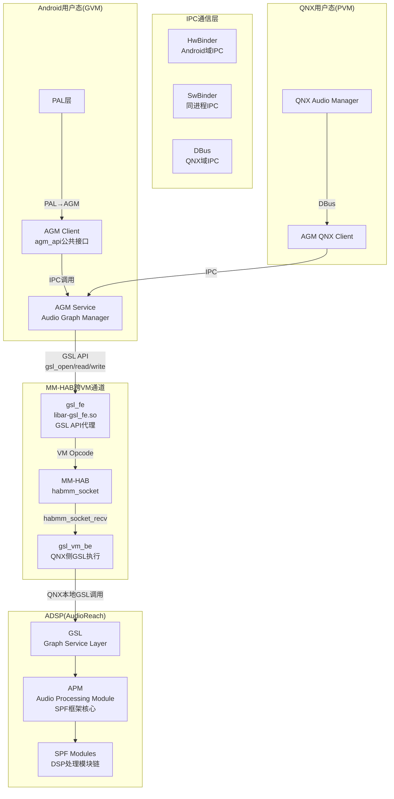

**源码路径**：`vendor/qcom/opensource/agm/`

AGM采用Client-Service架构：
- **AGM Client**（公共接口）：`agm_api.h`，PAL和primary-hal通过此接口调用AGM
- **AGM Service**（核心实现）：内部管理graph/device/session对象，通过GSL API与ADSP交互。源码中调用`gsl_open/gsl_read/gsl_write/gsl_ioctl`等GSL接口（源码：agm/service/src/graph.c），在GVM平台上由`libar-gsl_fe.so`代理→MM-HAB→QNX侧gsl_vm_be执行
- **IPC桥接**：Android域使用HwBinder/SwBinder，QNX域使用DBus
- **GSL链接**：AGM Service依赖`libar-gsl_fe`（GVM代理库）和`libar-gsl`（GSL公共头文件），源码确认：`agm/service/Android.mk`中`LOCAL_SHARED_LIBRARIES += libar-gsl_fe libar-gsl`

### 17.10.2 AGM公共API(agm_api.h)

AGM公共API定义在`agm_api.h`中，是PAL/primary-hal与AGM交互的唯一入口：

#### 核心数据结构

```cpp
// 键值对基础结构（gkv/ckv/tkv共用）
struct agm_key_value {
    uint32_t key;     // 参数键（如STREAMRX=流类型，DEVICERX=设备类型）
    uint32_t value;   // 参数值（如PAL_STREAM_DEEP_BUFFER=0x2）
};

// Graph Key Vector — 定义Graph拓扑
struct agm_key_vector_gsl {
    uint32_t num_kvs;              // 键值对数量
    struct agm_key_value *kvs;     // 键值对数组
};

// Cal Key Vector — 定义校准参数
// Tag Key Vector — 定义模块标签
// （结构与gkv相同，语义不同）

// AGM元数据（组合gkv+ckv）
struct agm_meta_data_gsl {
    struct agm_key_vector_gsl gkv;    // Graph Key Vector
    struct agm_key_vector_gsl ckv;    // Cal Key Vector
    struct agm_sg_props sg_props;     // Sub-graph属性
};
```

#### 媒体配置结构

```cpp
// 音频媒体格式配置
struct agm_media_config {
    uint32_t rate;          // 采样率（如48000）
    uint32_t channels;      // 通道数（如2）
    uint32_t format;        // 格式枚举值
};

// AGM格式枚举（PCM + 压缩格式）
enum agm_format {
    AGM_FORMAT_PCM_S8         = 0,
    AGM_FORMAT_PCM_S16_LE     = 1,    // 16-bit小端（最常用）
    AGM_FORMAT_PCM_S24_LE     = 2,
    AGM_FORMAT_PCM_S24_3LE    = 3,
    AGM_FORMAT_PCM_S32_LE     = 4,
    // 压缩格式
    AGM_FORMAT_MP3            = 5,
    AGM_FORMAT_AAC            = 6,
    AGM_FORMAT_FLAC           = 7,
    AGM_FORMAT_ALAC           = 8,
    AGM_FORMAT_APE            = 9,
    AGM_FORMAT_WMA            = 10,
    AGM_FORMAT_AMR_NB         = 11,
    AGM_FORMAT_AMR_WB         = 12,
    AGM_FORMAT_EVRC           = 13,
    AGM_FORMAT_G711            = 14,
};
```

#### 会话配置结构

```cpp
// AGM会话配置
struct agm_session_config {
    uint32_t dir;              // 方向：TX/RX/TX_RX
    uint32_t sess_mode;        // 会话模式枚举
    uint32_t start_threshold;  // 启动阈值
    uint32_t codec_config;     // 编解码器配置
    uint32_t data_mode;        // 数据模式
};

// AGM会话模式枚举
enum agm_session_mode {
    AGM_SESSION_DEFAULT   = 0,  // 默认模式（Host参与）
    AGM_SESSION_NO_HOST   = 1,  // Hostless模式（DSP自主运行）
    AGM_SESSION_NON_TUNNEL = 2, // 非隧道模式
    AGM_SESSION_NO_CONFIG  = 3, // 无配置模式
};
```

> **NO_HOST(Hostless)**模式是车载关键设计——TDM直连通路(MERC/A2B)使用此模式，音频数据不经Android域处理。

#### 缓冲区配置

```cpp
// AGM缓冲区配置
struct agm_buffer_config {
    uint32_t count;    // 缓冲区数量（通常4）
    uint32_t size;     // 每个缓冲区大小（字节）
};
```

### 17.10.3 AGM核心对象模型

AGM内部管理三个核心对象：**Session**、**Graph**、**Device**，它们的关系如下：

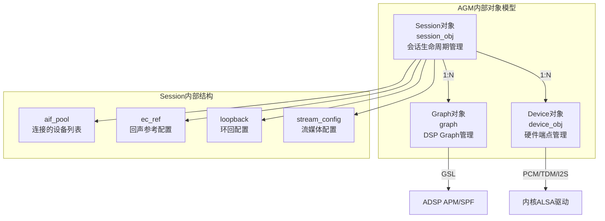

#### Device对象(device.h)

Device对象管理硬件端点（音频接口），对应物理音频通路：

```cpp
// Device对象核心结构
struct device_obj {
    char name[64];                  // 设备名称
    uint32_t card_id;               // ALSA声卡ID
    uint32_t pcm_id;                // PCM设备ID
    struct hw_ep_info hw_ep_info;   // 硬件端点配置
    struct agm_media_config media_config;  // 媒体格式
    struct agm_meta_data_gsl metadata;     // 元数据(gkv+ckv)
    enum device_state state;        // 设备状态机
};

// 硬件端点信息
struct hw_ep_info {
    enum hw_ep_intf intf;           // 接口类型枚举
    enum hw_ep_dir dir;             // 方向(TX/RX)
    struct hw_ep_config ep_config;  // 端点详细配置
};

// 硬件接口类型枚举（SA8295支持的接口）
enum hw_ep_intf {
    CODEC_DMA_INTERFACE,      // Codec DMA（内部编解码器）
    MI2S_INTERFACE,           // MI2S（多通道I2S）
    TDM_INTERFACE,            // TDM（时分复用，车载最常用）
    AUXPCM_INTERFACE,         // AUX PCM（辅助PCM）
    SLIMBUS_INTERFACE,        // SlimBus（高速音频总线）
    DISPLAY_PORT_INTERFACE,   // Display Port（HDMI音频）
    USB_AUDIO_INTERFACE,      // USB音频
    PCM_RT_PROXY_INTERFACE,   // PCM实时代理
    AUDIOSS_DMA_INTERFACE,    // AudioSS DMA（安全域DMA）
};

// PCM接口索引（对应LPAIF端口）
enum pcm_intf_idx {
    PRIMARY = 0,       // LPAIF_PRI
    SECONDARY = 1,     // LPAIF_SEC
    TERTIARY = 2,      // LPAIF_TER（车载主区域TDM）
    QUATERNARY = 3,    // LPAIF_QUAT（A2B区域TDM）
    QUINARY = 4,       // LPAIF_QUIN
    SENARY = 5,        // LPAIF_SEN
};

// Codec DMA I2S TDM配置（车载TDM核心）
struct hw_ep_cdc_dma_i2s_tdm_config {
    uint32_t lpaif_type;     // LPAIF类型
    uint32_t intf_idx;       // 接口索引（PRIMARY~SENARY）
    uint32_t sd_line_idx;    // SD线索引
};
```

#### Graph对象(graph.h)

Graph对象管理DSP端的音频处理图，是AGM与ADSP交互的核心：

```cpp
// Graph状态机
enum graph_state {
    GRAPH_CLOSED,      // 未打开
    GRAPH_OPENED,      // 已打开（GSL/APM分配资源）
    GRAPH_PREPARED,    // 已准备（DSP模块链配置完成）
    GRAPH_STARTED,     // 已启动（数据处理开始）
    GRAPH_STOPPED,     // 已停止
};

// Graph核心API流程
// 1. graph_open(meta_data_kv, session_obj, device_obj)
//    → 构建gkv/ckv → gsl_open_graph() → APM_CMD_GRAPH_OPEN
// 2. graph_prepare(graph_handle)
//    → gsl_prepare() → APM_CMD_GRAPH_PREPARE
// 3. graph_start(graph_handle)
//    → gsl_start() → APM_CMD_GRAPH_START
// 4. graph_read/write(graph_handle, buffer, size)
//    → 数据读写（PCM/TDM）
// 5. graph_stop(graph_handle)
//    → gsl_stop() → APM_CMD_GRAPH_STOP
// 6. graph_close(graph_handle)
//    → gsl_close() → APM_CMD_GRAPH_CLOSE
```

> **Graph生命周期**：CLOSED → open() → OPENED → prepare() → PREPARED → start() → STARTED → stop() → STOPPED → close() → CLOSED

#### Session对象(session_obj.h)

Session对象是AGM的最高层管理单元，一个Session对应一个音频流：

```cpp
// Session状态机
enum session_state {
    SESSION_CLOSED,    // 未打开
    SESSION_OPENED,    // 已打开
    SESSION_PREPARED,  // 已准备
    SESSION_STARTED,   // 已运行
    SESSION_STOPPED,   // 已停止
};

// Session核心结构
struct session_obj {
    uint32_t sess_id;                      // 会话ID
    enum session_state state;              // 会话状态
    struct agm_meta_data_gsl sess_meta;    // 会话元数据
    struct aif_pool *aif_pool;             // 连接的设备池
    struct graph *graph;                   // Graph对象引用
    struct agm_stream_config stream_config; // 流配置
    struct agm_ec_ref ec_ref;              // 回声参考配置
    struct agm_loopback loopback;          // 环回配置
};

// aif(Audio Interface)结构 — Session与Device的连接
struct aif {
    uint32_t aif_id;             // 接口ID
    struct device_obj *dev_obj;  // Device对象引用
    enum aif_state state;        // 连接状态
    struct agm_meta_data_gsl sess_aif_meta; // 连接元数据
};
```

**关键API**：

| API | 作用 | DSP对应命令 |
|------|------|------------|
| `session_obj_open()` | 打开会话+连接设备 | APM_CMD_GRAPH_OPEN |
| `session_obj_set_config()` | 设置会话参数 | APM_CMD_SET_CFG |
| `session_obj_prepare()` | 准备会话 | APM_CMD_GRAPH_PREPARE |
| `session_obj_start()` | 启动会话 | APM_CMD_GRAPH_START |
| `session_obj_stop()` | 停止会话 | APM_CMD_GRAPH_STOP |
| `session_obj_close()` | 关闭会话 | APM_CMD_GRAPH_CLOSE |
| `session_obj_sess_aif_connect()` | 连接/断开设备 | APM_CMD_SET_CFG |
| `session_obj_set_ec_ref()` | 设置回声参考 | APM_CMD_SET_CFG |
| `session_obj_set_loopback()` | 设置环回 | APM_CMD_SET_CFG |

### 17.10.4 AGM与APM(SPF)交互

AGM通过GSL层向APM发送GPR命令，APM是AudioReach架构的DSP端框架核心。在SA8295虚拟化架构下，AGM Service调用GSL API时，实际由gsl_fe代理→MM-HAB→gsl_vm_be在QNX侧执行：

```mermaid
sequenceDiagram
    participant PAL as PAL/primary-hal
    participant AGM as AGM Service
    participant GSL_FE as gsl_fe(GVM代理)
    participant HAB as MM-HAB
    participant GSL_VM_BE as gsl_vm_be(QNX)
    participant GSL as GSL(本地)
    participant APM as APM(SPF)
    participant SPF as SPF Modules

    PAL->>AGM: agm_session_open(sess_id, gkv, ckv)
    AGM->>AGM: 创建session_obj + device_obj
    AGM->>GSL_FE: gsl_open(gkv, ckv)
    GSL_FE->>HAB: GSL_VM_OPCODE_OPEN
    HAB->>GSL_VM_BE: habmm_socket_recv
    GSL_VM_BE->>GSL: gsl_open(gkv, ckv)
    GSL->>APM: GPR: APM_CMD_GRAPH_OPEN<br/>payload: sub_graph_cfg + container_cfg + modules_list
    APM->>SPF: 创建SubGraph + Container + Module实例
    APM-->>GSL: GPR_IBASIC_RSP_RESULT
    GSL-->>GSL_VM_BE: graph_handle
    GSL_VM_BE->>HAB: habmm_socket_send(响应)
    HAB-->>GSL_FE: 接收响应
    GSL_FE-->>AGM: graph_handle
    AGM-->>PAL: session_handle

    PAL->>AGM: agm_session_prepare(sess_id)
    AGM->>GSL_FE: gsl_prepare(graph_handle)
    GSL_FE->>HAB: GSL_VM_OPCODE_SET_CONFIG
    HAB->>GSL_VM_BE: 转发
    GSL_VM_BE->>GSL: gsl_prepare(graph_handle)
    GSL->>APM: GPR: APM_CMD_GRAPH_PREPARE
    APM->>SPF: 初始化模块资源+校准
    APM-->>GSL: 响应
    GSL-->>GSL_VM_BE: 成功
    GSL_VM_BE-->>GSL_FE: 成功
    GSL_FE-->>AGM: 成功

    PAL->>AGM: agm_session_start(sess_id)
    AGM->>GSL_FE: gsl_start(graph_handle)
    GSL_FE->>HAB: GSL_VM_OPCODE_IOCTL
    HAB->>GSL_VM_BE: 转发
    GSL_VM_BE->>GSL: gsl_start(graph_handle)
    GSL->>APM: GPR: APM_CMD_GRAPH_START
    APM->>SPF: 启动数据处理
    APM-->>GSL: 响应
    GSL-->>GSL_VM_BE: 成功
    GSL_VM_BE-->>GSL_FE: 成功
    GSL_FE-->>AGM: 成功

    Note over PAL,SPF: 音频数据流: PAL→AGM→PCM/TDM→SPF Modules→HW
```

#### APM命令体系(apm_api.h)

APM接收的GPR命令采用统一的命令头结构：

```cpp
// APM命令通用头（所有命令共用）
struct apm_cmd_header_t {
    uint32_t payload_address_lsw;  // Payload地址低32位
    uint32_t payload_address_msw;  // Payload地址高32位
    uint32_t mem_map_handle;       // 共享内存映射句柄
    uint32_t payload_size;         // Payload大小
};

// APM模块参数数据（跟随cmd_header）
struct apm_module_param_data_t {
    uint32_t module_instance_id;   // 模块实例ID
    uint32_t param_id;             // 参数ID
    uint32_t param_size;           // 参数数据大小
    uint32_t error_code;           // 错误码(DSP填写)
};
```

**APM_CMD_GRAPH_OPEN的Payload结构层次**：

```
apm_cmd_header_t
  → apm_module_param_data_t → APM_PARAM_ID_SUB_GRAPH_CONFIG
    → apm_sub_graph_cfg_t (performance_mode, direction, scenario_id)
  → apm_module_param_data_t → APM_PARAM_ID_CONTAINER_CONFIG
    → apm_container_cfg_t (container_type, stack_size, proc_domain)
  → apm_module_param_data_t → APM_PARAM_ID_MODULES_LIST
    → apm_module_cfg_t (module_instance_id, module_id)
  → apm_module_param_data_t → APM_PARAM_ID_MODULE_PROP
    → apm_module_prop_id_port_info_t (max_input/output_ports)
  → apm_module_param_data_t → APM_PARAM_ID_MODULE_CONN
    → apm_module_conn_cfg_t (src_module→dst_module连接)
```

### 17.10.5 AGM IPC机制

AGM Service与Client之间通过多种IPC机制通信：

| IPC类型 | 使用场景 | 特点 |
|---------|---------|------|
| **HwBinder** | Android域跨进程调用 | 标准Android IPC，支持SELinux |
| **SwBinder** | 同进程调用(PAL→AGM) | 低延迟，无序列化开销 |
| **DBus** | QNX域调用 | QNX IPC标准，跨OS域 |
| **GPR** | AGM→GSL内部通信(GSL→APM) | DSP端通用包路由，替代APR，GSL内部使用 |

```mermaid
graph LR
    subgraph IPC_Mechanisms["AGM IPC机制"]
        PAL_CLIENT[PAL Client] -->|SwBinder<br/>同进程| AGM_SERVICE[AGM Service]
        HAL_CLIENT[primary-hal Client] -->|HwBinder<br/>跨进程| AGM_SERVICE
        QNX_CLIENT[QNX AM Client] -->|DBus<br/>跨OS域| AGM_SERVICE
    end

    AGM_SERVICE -->|GSL API<br/>gsl_fe代理| GSL_FE[gsl_fe]
    GSL_FE -->|MM-HAB| GSL_VM_BE[gsl_vm_be]
    GSL_VM_BE -->|GSL本地调用<br/>GPR| ADSP_APM[ADSP APM]
```

### 17.10.6 AudioReach vs Legacy架构对比

SA8295支持两种DSP音频架构，AudioReach是默认和主要架构：

| 维度 | AudioReach架构 | Legacy架构 |
|------|---------------|-----------|
| **用户态管理** | AGM(Audio Graph Manager) | 无独立管理器，PAL直接通过IOCTL |
| **DSP框架** | APM(SPF框架核心) + SPF Modules | ADM(Audio Device Manager) |
| **DSP流管理** | SPF(Stream Processing Framework) | ASM(Audio Stream Manager) |
| **通信协议** | GPR(General Packet Router) | APR(Asynchronous Packet Router) |
| **Graph构建** | 基于KV描述→APM动态构建 | 基于COPP静态配置 |
| **校准推送** | AGM→gsl_fe→HAB→gsl_vm_be→GSL→APM | acdb-loader→ADM IOCTL |
| **模块配置** | SubGraph+Container+Module层次 | COPP(Audio Post Processor) |
| **配置灵活性** | 高(动态拓扑，实时Graph Change) | 低(固定拓扑，预设COPP链) |
| **适用场景** | SA8295默认架构，车载多区域 | 旧版平台兼容，简略补充 |

> **架构选择**：SA8295平台默认使用AudioReach架构，Legacy架构仅在特定兼容场景下使用。本文后续内容以AudioReach为主，Legacy仅作简略对比参考。

---

## 17.11 SessionGsl与GSL接口

### 17.11.1 概述

`SessionGsl`是PAL层Session子系统的一种实现，负责管理DSP音频图的创建、配置、启停和销毁。它将PAL Stream的音频语义转换为底层Graph操作。

> **架构说明**：在8295 AudioReach架构下，PAL通过AGM Service与DSP交互（PAL→AGM→gsl_fe→MM-HAB→gsl_vm_be→GSL→APM→SPF），SessionGsl的实现通过AGM API调用GSL服务。本章节保留GSL接口的详细描述（Legacy架构下SessionGsl直接调用GSL），以帮助理解GSL层的内部机制——这些机制在AudioReach架构下由AGM Service封装后，在GVM上通过libar-gsl_fe.so代理经MM-HAB跨VM转发给QNX侧gsl_vm_be执行。

```mermaid
graph TB
    subgraph PAL["PAL层"]
        STREAM[PalStream]
        RM[ResourceManager]
        SESSION_GSL[SessionGsl]
    end

    subgraph AR_Path["AudioReach路径"]
        AGM_SVC[AGM Service<br/>agm_graph_open/start<br/>stop/close]
        VM_CH["gsl_fe → MM-HAB → gsl_vm_be<br/>(SA8295跨VM通道)"]
        GSL_INTF[GSL Internal<br/>gsl_graph_open/start<br/>stop/close]
        APM_SPF[APM(SPF)<br/>APM_CMD_GRAPH_OPEN<br/>START/STOP/CLOSE]
    end

    subgraph Legacy_Path["Legacy路径(对比)"]
        GSL_API[gsl_open_graph/start<br/>stop/close<br/>直接调用]
        ADM_ASM[ADM+ASM<br/>COPP管理]
    end

    subgraph DSP_Modules["DSP处理"]
        MODULE_CHAIN[SPF Module Chain<br/>或COPP链]
        CAL_DATA[Calibration Data<br/>校准数据]
    end

    subgraph Payload["Payload构建"]
        PB[PayloadBuilder]
        GKV[gkv<br/>Graph Key Vector]
        CKV[ckv<br/>Cal Key Vector]
        TKV[tkv<br/>Tag Key Vector]
    end

    STREAM --> SESSION_GSL
    RM --> SESSION_GSL
    SESSION_GSL --> PB
    PB --> GKV
    PB --> CKV
    PB --> TKV

    SESSION_GSL -->|"AudioReach"| AGM_SVC
    AGM_SVC --> VM_CH
    VM_CH --> GSL_INTF
    GSL_INTF --> APM_SPF

    SESSION_GSL -.->|"Legacy"| GSL_API
    GSL_API -.-> ADM_ASM

    APM_SPF --> MODULE_CHAIN
    ADM_ASM -.-> CAL_DATA
    GSL_INTF --> CAL_DATA
```

### 17.11.2 SessionGsl类定义

```cpp
class SessionGsl : public Session {
public:
    SessionGsl(std::shared_ptr<ResourceManager> rm);
    virtual ~SessionGsl();

    // Session基类接口实现
    int open(Stream *s) override;
    int start(Stream *s) override;
    int stop(Stream *s) override;
    int close(Stream *s) override;
    int pause(Stream *s) override;
    int resume(Stream *s) override;
    int write(Stream *s, struct pal_buffer *buf) override;
    int read(Stream *s, struct pal_buffer *buf) override;
    int setParameters(Stream *s, uint32_t param_id,
                      void *payload) override;
    int getParameters(Stream *s, uint32_t param_id,
                      void **payload) override;

private:
    // GSL Graph句柄
    graph_handle_t graphHandle;

    // Key Vectors
    struct gsl_key_vector gkv;    // Graph Key Vector
    struct gsl_key_vector ckv;    // Cal Key Vector
    struct gsl_key_vector tkv;    // Tag Key Vector

    // Payload构建器
    std::shared_ptr<PayloadBuilder> payloadBuilder;

    // 辅助方法
    int buildGkv(Stream *s);
    int buildCkv(Stream *s);
    int buildTkv(Stream *s);
    int configureGraph(Stream *s);
    int sendCalData(Stream *s);
};
```

### 17.11.3 gsl_key_vector详解

GSL使用键值对(key-value pair)向量来描述和配置Graph，这是GSL的核心抽象：

```cpp
// gsl_key_vector结构定义
struct gsl_key_vector {
    uint32_t num_kv_pairs;           // 键值对数量
    struct gsl_key_value_pair *kvp;  // 键值对数组
};

struct gsl_key_value_pair {
    uint32_t key;                    // 参数键
    uint32_t value;                  // 参数值
};
```

#### 三种Key Vector的职责

| Key Vector | 全称 | 用途 | 设置时机 |
|-----------|------|------|---------|
| **gkv** | Graph Key Vector | 定义Graph的拓扑结构(流类型+设备类型) | open时设置 |
| **ckv** | Cal Key Vector | 定义校准参数(音量/增益等) | open/start时设置 |
| **tkv** | Tag Key Vector | 定义模块标签(特定DSP模块实例) | 配置阶段设置 |

#### gkv构建示例

```cpp
int SessionGsl::buildGkv(Stream *s) {
    struct pal_stream_attributes *attr = s->getAttributes();
    std::vector<std::pair<uint32_t, uint32_t>> gkv_pairs;

    // 流类型键值对
    gkv_pairs.push_back({STREAMRX, attr->type});  // 如PAL_STREAM_DEEP_BUFFER

    // 设备类型键值对
    for (auto& dev : s->getAssociatedDevices()) {
        gkv_pairs.push_back({DEVICERX, dev->getDeviceId()});
        // 如PAL_DEVICE_OUT_SPEAKER
    }

    // 实例ID键值对
    gkv_pairs.push_back({INSTANCE, instance_id});

    // 填充gkv结构
    gkv.num_kv_pairs = gkv_pairs.size();
    gkv.kvp = new gsl_key_value_pair[gkv.num_kv_pairs];
    for (size_t i = 0; i < gkv_pairs.size(); i++) {
        gkv.kvp[i].key = gkv_pairs[i].first;
        gkv.kvp[i].value = gkv_pairs[i].second;
    }

    return 0;
}
```

#### ckv构建示例

```cpp
int SessionGsl::buildCkv(Stream *s) {
    std::vector<std::pair<uint32_t, uint32_t>> ckv_pairs;

    // 音量校准键值对
    ckv_pairs.push_back({VOLUME, s->getVolume()});

    // 采样率校准
    ckv_pairs.push_back({SAMPLINGRATE, s->getSampleRate()});

    // 增益校准
    ckv_pairs.push_back({GAIN, s->getGain()});

    // 填充ckv结构
    ckv.num_kv_pairs = ckv_pairs.size();
    ckv.kvp = new gsl_key_value_pair[ckv.num_kv_pairs];
    for (size_t i = 0; i < ckv_pairs.size(); i++) {
        ckv.kvp[i].key = ckv_pairs[i].first;
        ckv.kvp[i].value = ckv_pairs[i].second;
    }

    return 0;
}
```

### 17.11.4 Session生命周期

```mermaid
stateDiagram-v2
    [*] --> Closed: 创建SessionGsl
    Closed --> Opening: open()
    Opening --> Open: gsl_open_graph成功
    Open --> Starting: start()
    Starting --> Running: gsl_start成功
    Running --> Stopping: stop()
    Stopping --> Open: gsl_stop成功
    Running --> Pausing: pause()
    Pausing --> Paused: gsl_stop成功
    Paused --> Resuming: resume()
    Resuming --> Running: gsl_start成功
    Open --> Closing: close()
    Running --> Closing: close()
    Closing --> Closed: gsl_close成功
    Closed --> [*]: 销毁SessionGsl

    note right of Opening
        buildGkv() + buildCkv()
        PayloadBuilder构建payload
        gsl_open_graph()
    end note

    note right of Starting
        sendCalData()
        gsl_start()
    end note
```

### 17.11.5 open()实现

```cpp
int SessionGsl::open(Stream *s) {
    int ret = 0;

    // Step 1: 构建Key Vectors
    ret = buildGkv(s);
    if (ret) goto error;

    ret = buildCkv(s);
    if (ret) goto error;

    ret = buildTkv(s);
    if (ret) goto error;

    // Step 2: 构建Payload
    std::vector<std::pair<int, void *>> payload_list;
    ret = payloadBuilder->buildPayload(s, &payload_list);
    if (ret) goto error;

    // Step 3: 打开GSL Graph
    ret = gsl_open_graph(&gkv, &graphHandle);
    if (ret) {
        ALOGE("gsl_open_graph failed: %d", ret);
        goto error;
    }

    // Step 4: 配置Graph（发送模块配置）
    ret = configureGraph(s);
    if (ret) goto error;

    // Step 5: 发送校准数据
    ret = sendCalData(s);
    if (ret) goto error;

    return 0;

error:
    if (graphHandle) {
        gsl_close(graphHandle);
        graphHandle = nullptr;
    }
    return ret;
}
```

### 17.11.6 start()/stop()/close()实现

```cpp
int SessionGsl::start(Stream *s) {
    int ret = gsl_start(graphHandle);
    if (ret) {
        ALOGE("gsl_start failed: %d", ret);
    }
    return ret;
}

int SessionGsl::stop(Stream *s) {
    int ret = gsl_stop(graphHandle);
    if (ret) {
        ALOGE("gsl_stop failed: %d", ret);
    }
    return ret;
}

int SessionGsl::close(Stream *s) {
    int ret = 0;

    if (graphHandle) {
        // 停止Graph
        gsl_stop(graphHandle);

        // 关闭Graph
        ret = gsl_close(graphHandle);
        if (ret) {
            ALOGE("gsl_close failed: %d", ret);
        }
        graphHandle = nullptr;
    }

    // 释放Key Vector资源
    delete[] gkv.kvp;
    delete[] ckv.kvp;
    delete[] tkv.kvp;
    gkv.num_kv_pairs = 0;
    ckv.num_kv_pairs = 0;
    tkv.num_kv_pairs = 0;

    return ret;
}
```

### 17.11.7 PayloadBuilder

`PayloadBuilder`将PAL的Stream/Device参数转换为DSP可识别的payload，依赖`kvh2xml.h`键值映射表：

```cpp
class PayloadBuilder {
public:
    // 构建完整payload
    int buildPayload(Stream *s,
                     std::vector<std::pair<int, void *>> *payload_list);

    // 构建特定模块payload
    int buildPcmTdmPayload(struct pcm_tdm_config *cfg,
                           void **payload, size_t *size);
    int buildCodecDmaPayload(struct codec_dma_config *cfg,
                             void **payload, size_t *size);
    int buildI2sPayload(struct i2s_config *cfg,
                        void **payload, size_t *size);
    int buildMediaFmtPayload(struct media_format *fmt,
                             void **payload, size_t *size);
    int buildVolumePayload(struct volume_config *cfg,
                           void **payload, size_t *size);
    int buildMfcPayload(struct mfc_config *cfg,
                        void **payload, size_t *size);

    // 通用payload构建
    int buildGenericPayload(uint32_t module_id, uint32_t param_id,
                            void *param_data, size_t param_size,
                            void **payload, size_t *payload_size);
};
```

#### Payload结构

```cpp
// DSP模块payload通用头
struct apm_module_param_data {
    uint32_t module_instance_id;    // 模块实例ID
    uint32_t param_id;              // 参数ID
    uint32_t param_size;            // 参数数据大小
    uint32_t error_code;            // 错误码(由DSP填写)
};

// 完整payload = header + param_data
// [apm_module_param_data][param_data...]
```

### 17.11.8 DSP模块API体系

PayloadBuilder支持多种DSP模块API，每种API对应不同的音频处理功能：

```mermaid
graph TB
    subgraph DSP_Module_APIs["DSP模块API"]
        APM[apm_api<br/>Audio Processing Module<br/>通用音频处理]
        CMN[module_cmn_api<br/>通用模块API<br/>音量/静音/路由]
        MEDIA[media_fmt_api<br/>媒体格式API<br/>采样率/位深/声道]
        PCM_TDM[pcm_tdm_api<br/>PCM TDM接口API<br/>TDM配置]
        CODEC_DMA[codec_dma_api<br/>Codec DMA接口API<br/>DMA配置]
        I2S_API[i2s_api<br/>I2S接口API<br/>I2S配置]
        MFC[mfc_api<br/>Media Format Converter<br/>格式转换]
        EC_NS[ec_ns_api<br/>回声消除/降噪API<br/>AEC/NS参数]
    end

    PB[PayloadBuilder] --> APM
    PB --> CMN
    PB --> MEDIA
    PB --> PCM_TDM
    PB --> CODEC_DMA
    PB --> I2S_API
    PB --> MFC
    PB --> EC_NS
```

#### 模块API示例：pcm_tdm_api

```cpp
// PCM TDM配置payload
struct pcm_tdm_module_config {
    struct apm_module_param_data param_data;  // 通用头
    uint32_t tdm_cfg_minor_version;           // 版本
    uint32_t lane_ctrl;                       // Lane控制
    uint32_t port_id;                         // 端口ID
    uint32_t bit_width;                       // 位宽
    uint32_t channel;                         // 通道数
    uint32_t sample_rate;                     // 采样率
    uint32_t sync_src;                        // 同步源
    uint32_t ctrl_data_out_enable;            // 数据输出使能
    uint32_t ctrl_invert_sync;                // 反相同步
    uint32_t ctrl_sync_res;                   // 同步分辨率
    uint32_t ctrl_clk_framed;                 // 时钟帧模式
    uint32_t slot_width;                      // Slot宽度
    uint32_t slot_mask;                       // Slot掩码
    uint32_t data_format;                     // 数据格式
    uint32_t pcm_width;                       // PCM宽度
};
```

#### 模块API示例：media_fmt_api

```cpp
// 媒体格式payload
struct media_format_module_config {
    struct apm_module_param_data param_data;
    uint32_t minor_version;
    uint32_t sample_rate;                     // 采样率
    uint16_t bit_width;                       // 位宽
    uint16_t channel_count;                   // 通道数
    uint8_t  channel_mapping[8];              // 通道映射
    uint32_t data_format;                     // 数据格式
    uint32_t alignment;                       // 对齐方式
    uint32_t bit_depth;                       // 位深度
    uint32_t packet_size;                     // 包大小
};
```

### 17.11.9 kvh2xml键值映射

`kvh2xml.h`定义了PAL语义键到DSP模块参数的映射关系：

```cpp
// kvh2xml.h关键映射定义
// Stream类型到DSP模块的映射
static const struct kvh2xml_entry stream_kv_map[] = {
    {PAL_STREAM_LOW_LATENCY,       STREAMRX, 0xB3000001},
    {PAL_STREAM_DEEP_BUFFER,       STREAMRX, 0xB3000002},
    {PAL_STREAM_COMPRESSED,        STREAMRX, 0xB3000003},
    {PAL_STREAM_VOIP,              STREAMRX, 0xB3000005},
    {PAL_STREAM_VOICE_CALL,        STREAMRX, 0xB3000006},
    {PAL_STREAM_GENERIC_CHIME,     STREAMRX, 0xB300000B},
    {PAL_STREAM_NAVI,              STREAMRX, 0xB300000E},
};

// Device类型到DSP模块的映射
static const struct kvh2xml_entry device_kv_map[] = {
    {PAL_DEVICE_OUT_SPEAKER,       DEVICERX, 0xB3000015},
    {PAL_DEVICE_OUT_HDMI,          DEVICERX, 0xB3000012},
    {PAL_DEVICE_OUT_BLUETOOTH_A2DP,DEVICERX, 0xB300001A},
    {PAL_DEVICE_IN_HANDSET_MIC,    DEVICETX, 0xB3000004},
    {PAL_DEVICE_IN_BLUETOOTH_SCO,  DEVICETX, 0xB3000017},
};

// 校准键映射
static const struct kvh2xml_entry cal_kv_map[] = {
    {VOLUME,      CAL_KEY_VOLUME, 0xB3000001},
    {GAIN,        CAL_KEY_GAIN,   0xB3000002},
    {SAMPLINGRATE,CAL_KEY_RATE,   0xB3000003},
};
```

### 17.11.10 configureGraph()实现

```cpp
int SessionGsl::configureGraph(Stream *s) {
    int ret = 0;

    // 获取流和设备属性
    struct pal_stream_attributes *attr = s->getAttributes();
    auto devices = s->getAssociatedDevices();

    // 1. 配置媒体格式模块
    struct media_format_module_config media_cfg;
    memset(&media_cfg, 0, sizeof(media_cfg));
    media_cfg.sample_rate = attr->in_media_config.sample_rate;
    media_cfg.bit_width = attr->in_media_config.bit_width;
    media_cfg.channel_count = attr->in_media_config.ch_info.channels;

    void *media_payload = nullptr;
    size_t media_payload_size = 0;
    ret = payloadBuilder->buildMediaFmtPayload(&media_cfg,
            &media_payload, &media_payload_size);
    if (ret) goto exit;

    ret = gsl_set_config(graphHandle, &gkv, 0, media_payload);
    free(media_payload);

    // 2. 配置设备接口模块（TDM/I2S/CodecDMA）
    for (auto& dev : devices) {
        void *dev_payload = nullptr;
        size_t dev_payload_size = 0;

        switch (dev->getDeviceInterface()) {
        case TDM_INTERFACE:
            ret = payloadBuilder->buildPcmTdmPayload(
                dev->getConfig(), &dev_payload, &dev_payload_size);
            break;
        case CODEC_DMA_INTERFACE:
            ret = payloadBuilder->buildCodecDmaPayload(
                dev->getConfig(), &dev_payload, &dev_payload_size);
            break;
        case I2S_INTERFACE:
            ret = payloadBuilder->buildI2sPayload(
                dev->getConfig(), &dev_payload, &dev_payload_size);
            break;
        }

        if (ret) goto exit;

        ret = gsl_set_config(graphHandle, &gkv, 0, dev_payload);
        free(dev_payload);
    }

    // 3. 配置音量模块
    void *vol_payload = nullptr;
    size_t vol_payload_size = 0;
    ret = payloadBuilder->buildVolumePayload(s->getVolumeConfig(),
            &vol_payload, &vol_payload_size);
    if (!ret) {
        gsl_set_config(graphHandle, &gkv, 0, vol_payload);
        free(vol_payload);
    }

exit:
    return ret;
}
```

---

## 17.12 Android+QNX双域架构总结

### 17.12.1 双域数据流全景

> **架构核心**：QNX域是ADSP唯一控制方(Audio Resource Manager)，Android域所有音频请求通过gsl_fe→MM-HAB→gsl_vm_be跨虚拟化通道提交给QNX，由QNX统一配置ADSP路由矩阵。

```mermaid
graph TB
    subgraph Android_Domain["Android域（上层应用发起方）"]
        subgraph App_Layer["应用层"]
            MEDIA_APP[媒体播放器]
            NAVI_APP[导航应用]
            VOICE_APP[语音助手]
        end

        subgraph FW_Layer["框架层"]
            AF[AudioFlinger]
            APM_ANDROID[AudioPolicyManager]
        end

        subgraph HAL_PAL["HAL+PAL层"]
            AHAL[Audio HAL 7.0]
            PAL_STREAM[PAL Stream]
        end

        subgraph Vendor_Services["Vendor服务"]
            AUTO_AUDIOD[auto-audiod<br/>声卡监控守护进程]
            AUTO_POWER[AutoPower]
            AUDIO_CHIME[audio-chime]
        end
    end

    subgraph Cross_VM_Channel["跨虚拟化通道"]
        HAB_VM[MM-HAB<br/>Qualcomm Hypervisor Audio Bus<br/>habmm_socket_send/recv]
    end

    subgraph QNX_Domain["QNX域（ADSP直接控制方）"]
        subgraph QNX_Apps["QNX应用"]
            DIAG[诊断音服务]
            EARLY_CHIME[早期提示音]
            SAFETY_AUDIO[安全音频<br/>倒车雷达/仪表告警/碰撞预警]
        end

        subgraph QNX_FW["QNX框架"]
            QNX_MM[QNX MM Framework]
            QNX_AM[QNX Audio Manager]
            QNX_ARM[Audio Resource Manager<br/>路由矩阵配置<br/>resourcemanager.xml]
        end
    end

    subgraph DSP_Subsystem["ADSP子系统"]
        AGM_SVC[AGM Service]
        GSL[GSL]
        APM_DSP[APM/SPF]
        SND_CARD[ALSA声卡<br/>sa8295-adp-star-snd-card]
    end

    subgraph ACDB_Shared["ACDB校准（双域共享）"]
        ACDB_FILES[ACDB校准文件<br/>双域共用同一套]
    end

    MEDIA_APP --> AF --> AHAL --> PAL_STREAM --> HAB_VM
    NAVI_APP --> AF
    VOICE_APP --> AF
    HAB_VM -->|"gsl_fe→MM-HAB→gsl_vm_be<br/>GSL VM Opcode跨VM提交"| QNX_AM
    QNX_AM --> QNX_ARM -->|"统一配置路由矩阵"| AGM_SVC
    QNX_Apps --> QNX_MM --> QNX_AM
    SAFETY_AUDIO -.->|"安全音频直通<br/>不经MM-HAB"| AGM_SVC
    AGM_SVC --> GSL --> APM_DSP --> SND_CARD

    AUTO_AUDIOD -->|声卡状态监控| SND_CARD
    AUTO_AUDIOD -->|SND_CARD_STATUS| AHAL
    AUTO_POWER -->|VHAL| AUTO_AUDIOD

    ACDB_FILES -->|acdb-loader推送| AHAL
    ACDB_FILES -->|QNX AM加载| QNX_AM
```

### 17.12.2 双域启动时序

> **关键顺序**：QNX域率先启动并成为ADSP唯一控制方，Android域随后启动并通过gsl_fe→MM-HAB→gsl_vm_be跨VM通道与QNX协商音频请求。

```mermaid
sequenceDiagram
    participant BOOT as 系统启动
    participant QNX as QNX域
    participant ADSP as ADSP
    participant AUDIOD as auto-audiod
    participant CHIME as audio-chime
    participant AHAL as Audio HAL
    participant AF as AudioFlinger

    BOOT->>QNX: QNX率先启动(实时性)
    QNX->>QNX: Audio Resource Manager初始化
    QNX->>ADSP: 加载ACDB校准数据(双域共享)
    QNX->>ADSP: 配置ADSP路由矩阵(resourcemanager.xml)
    QNX->>ADSP: 播放早期提示音(安全音频直通)

    BOOT->>ADSP: ADSP初始化完成(QNX控制下)
    ADSP-->>AUDIOD: card state = ONLINE

    BOOT->>AUDIOD: auto-audiod启动(Android域)
    AUDIOD->>ADSP: poll(/proc/asound/card0/state)
    AUDIOD-->>AUDIOD: 检测到ONLINE
    AUDIOD->>AUDIOD: enable_hostless(MERC + A2B)
    AUDIOD->>AHAL: setParameters(SND_CARD_STATUS=0,ONLINE)

    BOOT->>CHIME: audio-chime启动
    CHIME->>CHIME: initAcdb()
    CHIME->>CHIME: configureMixerRoute()
    CHIME->>ADSP: 播放启动提示音(通过MM-HAB→QNX仲裁→ADSP)

    BOOT->>AHAL: Audio HAL初始化
    AHAL->>AHAL: 初始化PAL(通过gsl_fe→MM-HAB连接QNX的gsl_vm_be)
    AHAL->>AHAL: 加载ACDB校准数据(双域共享)

    BOOT->>AF: AudioFlinger启动
    AF->>AHAL: openOutput/openInput
    AHAL->>QNX: 音频请求通过gsl_fe→MM-HAB→gsl_vm_be跨VM提交
    QNX->>ADSP: QNX仲裁后配置ADSP通路
    Note over AF: Android音频系统完全就绪(通过QNX仲裁间接使用ADSP)
```

### 17.12.3 ACDB共享机制

**Android域和QNX域共用同一套ACDB校准数据**，两者最终都服务于同一个ADSP，仅加载方式和时机不同：

```mermaid
graph TB
    subgraph ACDB_Sharing["ACDB共享机制"]
        ANDROID_ACDB[Android侧ACDB<br/>/vendor/etc/acdbdata/]
        QNX_ACDB[QNX侧ACDB<br/>/sys/platform/acdb/]
    end

    subgraph ADSP_Cal["ADSP校准管理(AudioReach)"]
        APM_CAL[APM校准<br/>SPF模块级校准]
        GSL_CAL[GSL校准<br/>Graph级校准]
        AFE_CAL[AFE校准<br/>前端校准]
    end

    ANDROID_ACDB -->|acdb-loader| APM_CAL
    ANDROID_ACDB -->|acdb-loader| GSL_CAL
    ANDROID_ACDB -->|acdb-loader| AFE_CAL

    QNX_ACDB -->|QNX AM| APM_CAL
    QNX_ACDB -->|QNX AM| GSL_CAL
    QNX_ACDB -->|QNX AM| AFE_CAL

    subgraph Conflict_Resolution["冲突解决"]
        PRIORITY[优先级规则<br/>后设置者覆盖]
        INSTANCE_ID[实例ID隔离<br/>不同域使用不同实例]
    end

    APM_CAL --> PRIORITY
    GSL_CAL --> INSTANCE_ID
```

**ACDB冲突解决策略**：

| 场景 | 冲突类型 | 解决策略 |
|------|---------|---------|
| Android播放媒体 + QNX播放提示音 | 同一Graph实例竞争 | 使用不同Graph实例，DSP内部混音 |
| Android设置Speaker校准 + QNX设置Speaker校准 | 校准数据覆盖 | 最后设置者生效，通常Android域优先 |
| 双域同时打开录音流 | APM路由冲突 | 使用不同TDM通道，AFE端口隔离 |

### 17.12.4 SSR协同恢复

当ADSP发生SSR(Subsystem Restart)时，两个域需要协同恢复：

```mermaid
sequenceDiagram
    participant ADSP as ADSP
    participant AUDIOD as auto-audiod
    participant AHAL as Audio HAL(PAL)
    participant QNX_AM as QNX Audio Manager
    participant CHIME as audio-chime

    Note over ADSP: ADSP异常，触发SSR
    ADSP-->>AUDIOD: card state = OFFLINE
    ADSP-->>QNX_AM: GSL disconnect

    AUDIOD->>AUDIOD: disable_hostless_all()
    AUDIOD->>AHAL: setParameters(SND_CARD_STATUS=0,OFFLINE)
    AHAL->>AHAL: 关闭所有Session
    AHAL->>AHAL: 等待ADSP恢复
    QNX_AM->>QNX_AM: 关闭所有Graph

    Note over ADSP: ADSP重启完成
    ADSP-->>AUDIOD: card state = ONLINE

    AUDIOD->>AUDIOD: enable_hostless_all()
    AUDIOD->>AHAL: setParameters(SND_CARD_STATUS=0,ONLINE)

    AHAL->>AHAL: 重新推送ACDB校准
    AHAL->>AHAL: 重新打开Session
    AHAL->>AHAL: 恢复音频播放

    CHIME->>CHIME: 检测到ONLINE
    CHIME->>CHIME: 重新发送ACDB校准

    QNX_AM->>QNX_AM: 重新加载ACDB
    QNX_AM->>QNX_AM: 重新打开Graph
    QNX_AM->>QNX_AM: 恢复QNX音频服务
```

### 17.12.5 双域音频优先级

在车载场景中，不同域的音频优先级由**QNX域Audio Resource Manager统一仲裁**，Android域的音频焦点请求通过gsl_fe→MM-HAB跨VM提交给QNX协商：

| 优先级 | 音频类型 | 来源域 | 处理方式 |
|--------|---------|--------|---------|
| 1(最高) | 紧急警告(ADAS) | QNX域(直通ADSP) | Duck所有其他音频，不受Android崩溃影响 |
| 2 | 安全提示音 | QNX域(直通ADSP) | Duck媒体音频 |
| 3 | 语音通话 | Android域(经MM-HAB→QNX仲裁) | 暂停媒体播放 |
| 4 | 导航提示 | Android域(经MM-HAB→QNX仲裁) | Duck媒体音频 |
| 5 | 通知提示音 | Android域(经MM-HAB→QNX仲裁) | 短暂Duck |
| 6(最低) | 媒体播放 | Android域(经MM-HAB→QNX仲裁) | 正常播放 |

### 17.12.6 关键配置文件汇总

| 配置文件 | 路径 | 作用域 | 说明 |
|---------|------|--------|------|
| resourcemanager.xml | /vendor/etc/ | Android域 | PAL资源配置 |
| sa8295-adp-star-snd-card.conf | /vendor/etc/ | Android域 | ALSA UCM配置 |
| acdb_cal.acdb | 双域共享 | Android+QNX | ACDB校准数据库（双域共用同一套） |
| acdb_cal.acdbdelta | 双域共享 | Android+QNX | ACDB增量校准（双域共用同一套） |
| audio_policy_configuration.xml | /vendor/etc/ | Android域 | 音频策略配置 |
| car_audio_configuration.xml | /vendor/etc/ | Android域 | 车载音频区域配置 |
| resourcemanager.xml | /sys/platform/audio/ | QNX域 | QNX Audio Resource Manager配置 |
| mixer_paths.xml | /sys/platform/audio/ | QNX域 | QNX Mixer路由配置(ADSP路由矩阵) |
| adsp_avs_config.acdb.pvm | /sys/platform/acdb/ | QNX域 | AVS配置 |

---

## 17.13 Primary HAL(AudioReach版)深度解析

### 17.13.1 概述与架构定位

Primary HAL(AudioReach版)是8295平台上AudioReach架构的Audio HAL 7.0实现，位于PAL层之上，将Android框架的音频语义转换为PAL API调用。与旧版`audio-hal`不同，AR版专为AudioReach架构设计，通过PAL→AGM→gsl_fe→MM-HAB→gsl_vm_be→GSL→APM路径与DSP交互。

**源码路径**：`vendor/qcom/opensource/audio-hal-ar/primary-hal/hal-pal/`

**核心类关系**：

```mermaid
graph TB
    subgraph AndroidFW["Android框架"]
        AF[AudioFlinger]
        APM_FW[AudioPolicyManager]
    end

    subgraph PrimaryHAL["Primary HAL(AR版)"]
        AD[AudioDevice<br/>设备管理/初始化]
        SO[StreamOutPrimary<br/>输出流]
        SI[StreamInPrimary<br/>输入流]
        AV[AudioVoice<br/>语音通话]
    end

    subgraph PAL["PAL层"]
        PAL_API[PAL API<br/>pal_stream_open/start/stop/close]
    end

    subgraph AGM_GSL["AGM+GSL(跨VM)"]
        AGM[AGM Service]
        VM_FE[gsl_fe]
        HAB_CH[MM-HAB]
        VM_BE[gsl_vm_be]
        GSL_DSP[GSL→APM→SPF]
    end

    AF --> AD
    AF --> SO
    AF --> SI
    APM_FW --> AD
    AD --> AV
    SO --> PAL_API
    SI --> PAL_API
    AV --> PAL_API
    PAL_API --> AGM
    AGM --> VM_FE
    VM_FE --> HAB_CH
    HAB_CH --> VM_BE
    VM_BE --> GSL_DSP
```

### 17.13.2 AudioDevice类

`AudioDevice`是Primary HAL的核心管理类，负责设备初始化、流创建/销毁、Audio Patch管理和麦克风特性解析。

**关键定义**（[`AudioDevice.h`](vendor/qcom/opensource/audio-hal-ar/primary-hal/hal-pal/AudioDevice.h)）：

| 常量/类型 | 值 | 说明 |
|-----------|-----|------|
| COMPRESS_VOIP_IO_BUF_SIZE_NB | 320 | VoIP窄带缓冲区 |
| COMPRESS_VOIP_IO_BUF_SIZE_WB | 640 | VoIP宽带缓冲区 |
| COMPRESS_VOIP_IO_BUF_SIZE_SWB | 1280 | VoIP超宽带缓冲区 |
| COMPRESS_VOIP_IO_BUF_SIZE_FB | 1920 | VoIP全频带缓冲区 |
| MIN_VOLUME_VALUE_MB | -6000 | 最小音量(mB) |
| MAX_VOLUME_VALUE_MB | 0 | 最大音量(mB) |

**核心方法**：

```cpp
class AudioDevice {
public:
    static std::shared_ptr<AudioDevice> GetInstance();
    int Init(hw_device_t **device, const hw_module_t *module);
    // 流管理
    std::shared_ptr<StreamOutPrimary> CreateStreamOut(...);
    void CloseStreamOut(std::shared_ptr<StreamOutPrimary> stream);
    std::shared_ptr<StreamInPrimary> CreateStreamIn(...);
    void CloseStreamIn(std::shared_ptr<StreamInPrimary> stream);
    // Audio Patch
    int CreateAudioPatch(audio_patch_handle_t* handle,
                         const std::vector<struct audio_port_config>& sources,
                         const std::vector<struct audio_port_config>& sinks);
    int ReleaseAudioPatch(audio_patch_handle_t handle);
    // 设备映射
    int GetPalDeviceIds(const std::set<audio_devices_t>& hal_device_id,
                        pal_device_id_t* pal_device_id);
    // 参数控制
    int SetParameters(const char *kvpairs);
    char* GetParameters(const char *keys);
    int SetMode(const audio_mode_t mode);
    int SetVoiceVolume(float volume);
    int SetMicMute(bool state);
    // 麦克风特性(XML解析)
    static microphone_characteristics_t microphones;
    static snd_device_to_mic_map_t microphone_maps[PAL_MAX_INPUT_DEVICES];
protected:
    std::shared_ptr<AudioVoice> voice_;
    std::vector<std::shared_ptr<StreamOutPrimary>> stream_out_list_;
    std::vector<std::shared_ptr<StreamInPrimary>> stream_in_list_;
    std::map<audio_devices_t, pal_device_id_t> android_device_map_;
    std::map<audio_patch_handle_t, AudioPatch*> patch_map_;
};
```

**AudioPatch类**：支持3种Patch类型

| PatchType | 说明 |
|-----------|------|
| PATCH_PLAYBACK | 播放Patch(源→输出设备) |
| PATCH_CAPTURE | 录音Patch(输入设备→源) |
| PATCH_DEVICE_LOOPBACK | 设备间Loopback |

**麦克风特性解析**：通过Expat XML解析器解析`microphone_characteristics.xml`，将PAL设备ID映射到`audio_microphone_characteristic_t`结构体。

### 17.13.3 AudioStream类与延迟参数

`StreamOutPrimary`和`StreamInPrimary`继承自`StreamPrimary`基类，负责音频流的打开、读写、路由和生命周期管理。

**延迟参数定义**（[`AudioStream.h`](vendor/qcom/opensource/audio-hal-ar/primary-hal/hal-pal/AudioStream.h)）：

| 常量 | 值(ms) | 说明 |
|------|--------|------|
| LOW_LATENCY_PLATFORM_DELAY | 13 | 低延迟播放延迟 |
| DEEP_BUFFER_PLATFORM_DELAY | 70 | Deep Buffer播放延迟 |
| PCM_OFFLOAD_PLATFORM_DELAY | 30 | PCM Offload播放延迟 |
| MMAP_PLATFORM_DELAY | 3 | MMAP播放延迟 |
| ULL_PLATFORM_DELAY | 4 | Ultra Low Latency延迟 |

**缓冲区参数**：

| 常量 | 值 | 说明 |
|------|-----|------|
| LOW_LATENCY_PLAYBACK_PERIOD_SIZE | 240帧(5ms@48kHz) | 低延迟播放周期大小 |
| LOW_LATENCY_PLAYBACK_PERIOD_COUNT | 2 | 低延迟播放周期数 |
| DEEP_BUFFER_PLAYBACK_PERIOD_SIZE | 1920帧(40ms@48kHz) | Deep Buffer播放周期大小 |
| DEEP_BUFFER_PLAYBACK_PERIOD_COUNT | 2 | Deep Buffer播放周期数 |
| MMAP_PERIOD_SIZE | 48帧(1ms@48kHz) | MMAP播放周期大小 |
| MMAP_PERIOD_COUNT_DEFAULT | 512 | MMAP周期数(最大) |
| ULL_PERIOD_SIZE | 48帧(1ms@48kHz) | ULL周期大小 |
| ULL_PERIOD_COUNT_DEFAULT | 512 | ULL周期数 |
| DEFAULT_OUTPUT_SAMPLING_RATE | 48000 | 默认输出采样率 |

**UseCase枚举**（完整映射）：

| 分类 | UseCase | 字符串标识 |
|------|---------|-----------|
| 播放 | USECASE_AUDIO_PLAYBACK_DEEP_BUFFER | deep-buffer-playback |
| 播放 | USECASE_AUDIO_PLAYBACK_LOW_LATENCY | low-latency-playback |
| 播放 | USECASE_AUDIO_PLAYBACK_ULL | audio-ull-playback |
| 播放 | USECASE_AUDIO_PLAYBACK_MMAP | mmap-playback |
| 播放 | USECASE_AUDIO_PLAYBACK_OFFLOAD(0-9) | compress-offload-playback(0-9) |
| 播放 | USECASE_AUDIO_PLAYBACK_VOIP | audio-playback-voip |
| 录音 | USECASE_AUDIO_RECORD | audio-record |
| 录音 | USECASE_AUDIO_RECORD_LOW_LATENCY | low-latency-record |
| 录音 | USECASE_AUDIO_RECORD_VOIP | audio-record-voip |
| 录音 | USECASE_AUDIO_RECORD_MMAP | mmap-record |
| 语音 | USECASE_VOICEMMODE1_CALL | voicemmode1-call |
| 语音 | USECASE_VOICEMMODE2_CALL | voicemmode2-call |
| 车载 | USECASE_AUDIO_PLAYBACK_MEDIA | media-playback |
| 车载 | USECASE_AUDIO_PLAYBACK_SYS_NOTIFICATION | sys-notification-playback |
| 车载 | USECASE_AUDIO_PLAYBACK_NAV_GUIDANCE | nav-guidance-playback |
| 车载 | USECASE_AUDIO_PLAYBACK_PHONE | phone-playback |
| FM | USECASE_AUDIO_PLAYBACK_FM | play-fm |
| HFP | USECASE_AUDIO_HFP_SCO | hfp-sco |
| 通话录音 | USECASE_INCALL_REC_UPLINK | incall-rec-uplink |

**车载音频流类型**：

| 常量 | 值 | 说明 |
|------|-----|------|
| CAR_AUDIO_STREAM_MEDIA | 0 | 媒体流 |
| CAR_AUDIO_STREAM_SYS_NOTIFICATION | 1 | 系统通知流 |
| CAR_AUDIO_STREAM_NAV_GUIDANCE | 2 | 导导流 |
| CAR_AUDIO_STREAM_PHONE | 3 | 电话流 |
| CAR_AUDIO_STREAM_FRONT_PASSENGER | 8 | 前排乘客流 |
| CAR_AUDIO_STREAM_REAR_SEAT | 16 | 后排座椅流 |
| MAX_CAR_AUDIO_STREAMS | 32 | 最大车载流数 |

**StreamOutPrimary核心方法**：

```cpp
class StreamOutPrimary : public StreamPrimary {
public:
    ssize_t write(const void *buffer, size_t bytes);  // PCM数据写入
    int Open();                                        // 打开PAL Stream
    int Standby();                                     // 待机
    int SetVolume(float left, float right);            // 音量设置
    int Pause()/Resume();                              // 暂停/恢复
    int Drain(audio_drain_type_t type);                // Drain操作
    int Flush();                                       // 刷新
    int RouteStream(const std::set<audio_devices_t>&); // 路由切换
    static pal_stream_type_t GetPalStreamType(
        audio_output_flags_t halStreamFlags, char *address);
    int64_t GetRenderLatency(audio_output_flags_t flags, char *address);
    // Offload Effects
    int StartOffloadEffects(audio_io_handle_t, pal_stream_handle_t*);
    int StopOffloadEffects(audio_io_handle_t, pal_stream_handle_t*);
    // MMAP支持
    int CreateMmapBuffer(int32_t min_size_frames, struct audio_mmap_buffer_info *info);
    int GetMmapPosition(struct audio_mmap_position *position);
protected:
    pal_stream_handle_t* pal_stream_handle_;           // PAL流句柄
    struct pal_stream_attributes streamAttributes_;    // PAL流属性
    audio_output_flags_t flags_;                       // HAL输出标志
};
```

**格式映射表**（Android格式→PAL格式）：

| Android格式 | PAL格式 |
|-------------|---------|
| AUDIO_FORMAT_PCM_16_BIT | PAL_AUDIO_FMT_PCM_S16_LE |
| AUDIO_FORMAT_PCM_24_BIT_PACKED | PAL_AUDIO_FMT_PCM_S24_3LE |
| AUDIO_FORMAT_PCM_8_24_BIT | PAL_AUDIO_FMT_PCM_S24_LE |
| AUDIO_FORMAT_PCM_32_BIT | PAL_AUDIO_FMT_PCM_S32_LE |
| AUDIO_FORMAT_MP3 | PAL_AUDIO_FMT_MP3 |
| AUDIO_FORMAT_AAC | PAL_AUDIO_FMT_AAC |
| AUDIO_FORMAT_FLAC | PAL_AUDIO_FMT_FLAC |
| AUDIO_FORMAT_ALAC | PAL_AUDIO_FMT_ALAC |
| AUDIO_FORMAT_APE | PAL_AUDIO_FMT_APE |

### 17.13.4 AudioVoice类与语音VSID

`AudioVoice`管理语音通话的生命周期，包括VSID映射、通话状态更新和设备路由。

**VSID定义**（[`AudioVoice.h`](vendor/qcom/opensource/audio-hal-ar/primary-hal/hal-pal/AudioVoice.h)）：

| 常量 | 值 | 说明 |
|------|-----|------|
| VOICEMMODE1_VSID | 0x11C05000 | Voice Mode 1 VSID |
| VOICEMMODE2_VSID | 0x11DC5000 | Voice Mode 2 VSID |
| MAX_VOICE_SESSIONS | 2 | 最大语音会话数 |
| CALL_INACTIVE | 1 | 通话未激活 |
| CALL_ACTIVE | 2 | 通话激活 |

**语音会话结构**：

```cpp
struct voice_session_t {
    call_state_t state;           // current_/new_ 通话状态
    uint32_t vsid;                // VSID标识
    uint32_t tty_mode;            // TTY模式(tty_off/vco/hco/full)
    pal_stream_handle_t* pal_voice_handle;  // PAL语音流句柄
    bool volume_boost;            // 音量增强
    bool slow_talk;               // 慢速通话
    bool hd_voice;                // HD语音
    struct pal_volume_data *pal_vol_data;  // PAL音量数据
    pal_device_mute_t device_mute;         // 设备静音
};
```

**语音参数Key**：

| 参数Key | 说明 |
|---------|------|
| AUDIO_PARAMETER_KEY_VSID | VSID标识 |
| AUDIO_PARAMETER_KEY_CALL_STATE | 通话状态 |
| AUDIO_PARAMETER_KEY_DEVICE_MUTE | 设备静音 |
| AUDIO_PARAMETER_KEY_DIRECTION | 麦克风/扬声器方向 |
| AUDIO_PARAMETER_KEY_VOLUME_BOOST | 音量增强 |
| AUDIO_PARAMETER_KEY_SLOWTALK | 慢速通话 |
| AUDIO_PARAMETER_KEY_HD_VOICE | HD语音 |
| AUDIO_PARAMETER_KEY_TTY_MODE | TTY模式 |

**AudioVoice核心方法**：

```cpp
class AudioVoice {
public:
    int VoiceStart(voice_session_t *session);    // 启动语音
    int VoiceStop(voice_session_t *session);     // 停止语音
    int VoiceSetDevice(voice_session_t *session); // 设置语音设备
    int UpdateCallState(uint32_t vsid, int call_state); // 更新通话状态
    int SetMicMute(bool mute);                   // 麦克风静音
    int SetVoiceVolume(float volume);            // 语音音量
    int RouteStream(const std::set<audio_devices_t>&);  // 语音路由
    int GetMatchingTxDevices(...);                // TX设备匹配
    pal_device_id_t pal_voice_tx_device_id_;     // TX PAL设备ID
    pal_device_id_t pal_voice_rx_device_id_;     // RX PAL设备ID
};
```

### 17.13.5 audio_extn扩展模块

Primary HAL通过`audio_extn`扩展模块支持多种音频功能：

| 扩展模块 | 说明 | AudioReach适配 |
|----------|------|---------------|
| auto_hal | 车载音频区域管理 | 通过PAL Car Stream映射 |
| battery_listener | 电池状态监听 | 影响PA供电策略 |
| FM | FM收音机 | FM Tuner→PAL Stream |
| Hfp | HFP蓝牙通话 | SCO→PAL Voice Session |
| soundtrigger | 语音触发 | PAL SVA/Hotword Stream |
| Gef | Generic Effect Framework | Offload Effect Plugin |
| Gain | 增益控制 | PAL Volume Control |
| a2dp | A2DP蓝牙音频 | PAL A2DP Stream |
|custom_compress|自定义压缩格式| PAL Compress Offload |

### 17.13.6 Primary HAL(AR版) vs Legacy版对比

| 维度 | AR版(audio-hal-ar) | Legacy版(audio-hal) |
|------|--------------------|--------------------|
| DSP架构 | AudioReach(AGM+APM+SPF) | Legacy(ADM+ASM+COPP) |
| DSP通信路径 | PAL→AGM→gsl_fe→HAB→gsl_vm_be→GSL→APM→SPF | PAL→GSL→ADM→ASM→COPP |
| Graph管理 | AGM Session+Graph对象 | SessionGsl直接管理 |
| 流类型 | PAL_STREAM_ULL新增 | 无ULL支持 |
| 车载流 | Media/Nav/Phone/SysNoti | 无专用车载流 |
| 语音VSID | VOICEMMODE1/2双模 | VOICEMMODE1单模 |
| MMAP | 支持(48帧/1ms周期) | 支持但配置不同 |
| Format | PAL_AUDIO_FMT完整映射 | 部分格式缺失 |
| Offload | libqcompostprocbundle.so | 同 |
| 编译路径 | hal-pal/ | hal/ |

---

## 17.14 GSL(Graph Service Layer)内部架构深度解析

### 17.14.1 概述与架构定位

GSL(Graph Service Layer)是DSP端AudioReach架构的Graph服务层，位于AGM Service和APM(SPF)之间。在SA8295虚拟化架构下，GSL运行在QNX域(PVM)，Android域(GVM)的AGM Service通过gsl_fe→MM-HAB→gsl_vm_be跨VM通道与GSL交互。GSL负责Graph的创建、状态管理、数据路径配置和GPR通信，是DSP Graph操作的核心引擎。

**源码路径**：`vendor/qcom/proprietary/args/gsl/inc/`（私有源码）

**GSL在AudioReach架构中的位置**：

```mermaid
graph TB
    subgraph Userspace["Android域用户态(GVM)"]
        AGM[AGM Service<br/>Session/Graph/Device管理]
    end

    subgraph VM_Channel["SA8295跨VM通道"]
        GSL_FE[gsl_fe<br/>GSL API代理]
        HAB_CH[MM-HAB<br/>habmm_socket]
        GSL_BE[gsl_vm_be<br/>VM Backend]
    end

    subgraph GSL_Layer["GSL层(QNX域 PVM)"]
        GSL_GRAPH[gsl_graph<br/>状态机+GKV管理]
        GSL_DP[gsl_datapath<br/>数据路径+Buffer管理]
        GSL_COMMON[gsl_common<br/>GPR通信+信号机制]
    end

    subgraph SPF["SPF框架(DSP端)"]
        APM[APM<br/>Graph命令处理]
        SP_MODULES[SPF Modules<br/>音频处理模块链]
    end

    AGM -->|"GSL API<br/>gsl_open/read/write"| GSL_FE
    GSL_FE -->|"VM Opcode<br/>序列化"| HAB_CH
    HAB_CH -->|"habmm_socket<br/>跨VM传输"| GSL_BE
    GSL_BE -->|"GSL本地调用"| GSL_GRAPH
    GSL_GRAPH -->|"APM_CMD_GRAPH_OPEN<br/>PREPARE/START/STOP"| APM
    GSL_DP -->|"Data Buffer<br/>Read/Write"| SP_MODULES
    GSL_COMMON -->|"GPR Packet<br/>Signal机制"| APM
    APM --> SP_MODULES
```

### 17.14.2 Graph状态机

GSL Graph遵循严格的状态机模型，每个状态对应特定的SPF命令和允许的操作（[`gsl_graph.h`](vendor/qcom/proprietary/args/gsl/inc/gsl_graph.h)）。

```mermaid
stateDiagram-v2
    IDLE --> OPENED : gsl_graph_open<br/>APM_CMD_GRAPH_OPEN
    OPENED --> PREPARED : gsl_graph_prepare<br/>APM_CMD_GRAPH_PREPARE
    PREPARED --> STARTED : gsl_graph_start<br/>APM_CMD_GRAPH_START
    STARTED --> STOPPED : gsl_graph_stop<br/>APM_CMD_GRAPH_STOP
    STOPPED --> PREPARED : gsl_graph_prepare<br/>APM_CMD_GRAPH_PREPARE
    STOPPED --> OPENED : 重新准备
    OPENED --> IDLE : gsl_graph_close<br/>APM_CMD_GRAPH_CLOSE
    STARTED --> ERROR_ALLOW_CLEANUP : 非致命错误<br/>允许close/stop
    ERROR_ALLOW_CLEANUP --> CLOSED : gsl_graph_close
    CLOSED --> IDLE : 去初始化
    ERROR_ALLOW_CLEANUP --> ERROR : 致命错误升级
    ERROR : 不可恢复<br/>无SPF操作允许
```

**状态详细说明**：

| 状态 | 描述 | 允许的操作 |
|------|------|-----------|
| GRAPH_IDLE | 初始化完成，等待open | open |
| GRAPH_OPENED | Graph在SPF上成功打开 | prepare, close, set_config, add_new, change |
| GRAPH_STARTED | Graph在SPF上运行 | stop, write, read, set_config, flush |
| GRAPH_STOPPED | Graph在SPF上停止 | prepare, close, start |
| GRAPH_CLOSED | Graph在SPF上关闭，未去初始化 | re-init |
| GRAPH_ERROR_ALLOW_CLEANUP | 非致命错误，允许清理操作 | close, stop |
| GRAPH_ERROR | 不可恢复错误 | 无SPF操作 |

**控制信号分组**：

| 信号组 | 包含操作 | 说明 |
|--------|---------|------|
| GRAPH_CTRL_GRP1_CMD_SIG | OPEN, CLOSE, PREPARE, START, STOP, CONFIGURE_READ/WRITE_BUFFERS | 串行化控制命令 |
| GRAPH_CTRL_GRP2_CMD_SIG | SET_CFG, REGISTER_CFG, FLUSH, REGISTER_MODULE_EVENTS | 并行配置命令 |

### 17.14.3 GKV Node与SubGraph管理

GKV(Graph Key Vector)Node是GSL管理Graph的核心数据结构，每个GKV对应一组SubGraph。

**gsl_graph_gkv_node结构**（[`gsl_graph.h`](vendor/qcom/proprietary/args/gsl/inc/gsl_graph.h)）：

```cpp
struct gsl_graph_gkv_node {
    ar_list_node_t node;                   // 链表节点
    struct gsl_key_vector gkv;             // Graph Key Vector
    struct gsl_key_vector ckv;             // Calibration Key Vector
    uint32_t num_of_subgraphs;             // SubGraph数量
    struct gsl_subgraph **sg_array;        // SubGraph指针数组
    uint32_t num_of_gp_cals;               // 全局持久校准数
    struct gsl_glbl_persist_cal_iid_list *glbl_persist_cal_list;
    struct gsl_graph_sg_conn_data sg_conn_data;  // SubGraph连接数据

    uint32_t sg_stop_mask;                 // SubGraph停止位掩码(最多32个)
    uint32_t sg_start_mask;                // SubGraph启动位掩码(最多32个)
    uint32_t spf_ss_mask;                  // SPF子系统掩码(ADSP/CDSP等)
    struct gsl_graph_rtc_cache rtc_cache;  // 实时校准缓存
};
```

**SubGraph连接数据**：

```cpp
struct gsl_graph_sg_conn_data {
    uint32_t num_sgs;                      // SubGraph数量
    size_t size;                           // 连接数据大小
    AcdbSubgraph *subgraphs;               // ACDB SubGraph数据
};
```

**RTGM(Real-Time Graph Change)缓存**：

```cpp
struct gsl_graph_rtc_cache {
    struct gsl_sgid_list pruned_plus_reopen_sgids;     // 需重新打开的SG ID列表
    struct gsl_graph_sg_conn_data pruned_plus_reopen_sg_conn;  // 需重新打开的SG连接数据
};
```

**gsl_graph核心结构**：

```cpp
struct gsl_graph {
    enum gsl_graph_states graph_state;      // 当前状态
    ar_osal_mutex_t graph_lock;             // Graph操作锁
    ar_osal_mutex_t get_set_cfg_lock;       // 配置操作锁
    struct gsl_signal graph_signal[GRAPH_CMD_SIG_MAX]; // 控制信号数组
    struct gsl_transient_state_info transient_state_info; // 瞬态信息
    uint32_t src_port;                      // GPR源端口
    uint32_t proc_id;                       // 处理器ID
    struct gsl_data_path_info read_info;    // 读数据路径
    struct gsl_data_path_info write_info;   // 写数据路径
    gsl_cb_func_ptr cb;                     // 客户端回调
    void *client_data;                      // 客户端数据
    uint32_t num_gkvs;                      // GKV数量
    struct ar_list_t gkv_list;              // GKV链表
    ar_osal_mutex_t gkv_list_lock;          // GKV链表锁
    uint32_t ss_mask;                       // SPF子系统掩码
};
```

### 17.14.4 GPR通信与信号机制

GSL通过GPR(Generic Packet Router)与SPF/APM通信，信号机制用于同步命令响应（[`gsl_common.h`](vendor/qcom/proprietary/args/gsl/inc/gsl_common.h)）。

**GPR域ID配置**：

| 常量 | 值 | 说明 |
|------|-----|------|
| GSL_GPR_SRC_DOMAIN_ID | GPR_IDS_DOMAIN_ID_APPS_V | APPS域(源) |
| GSL_GPR_DST_DOMAIN_ID | GPR_IDS_DOMAIN_ID_ADSP_V | ADSP域(目标) |

**SPF超时配置**：

| 常量 | 值(ms) | 说明 |
|------|--------|------|
| GSL_SPF_TIMEOUT_MS | 1000 | SPF通用超时 |
| GSL_GRAPH_OPEN_TIMEOUT_MS | 4000 | Graph Open超时(更长) |
| GSL_SPF_READ_WRITE_TIMEOUT_MS | 1000 | Read/Write超时 |

**信号事件掩码**：

| 事件掩码 | 值 | 说明 |
|----------|-----|------|
| GSL_SIG_EVENT_MASK_SPF_RSP | 0x1 | SPF响应收到 |
| GSL_SIG_EVENT_MASK_CLOSE | 0x2 | 客户端触发close |
| GSL_SIG_EVENT_MASK_RTGM_DONE | 0x4 | 实时Graph切换完成 |
| GSL_SIG_EVENT_CLIENT_OP_DONE | 0x8 | 客户端操作完成 |
| GSL_SIG_EVENT_MASK_SSR | 0x10 | SSR(子系统重启)事件 |

**GSL信号结构**：

```cpp
struct gsl_signal {
    ar_osal_signal_t sig;        // OS信号对象
    ar_osal_mutex_t *lock;       // 同步锁
    uint32_t flags;              // 事件标志(SPF_RSP/CLOSE/RTGM_DONE/SSR)
    int32_t status;              // 信号状态
    void *gpr_packet;            // GPR包指针(携带响应数据)
};
```

**GPR命令发送流程**：

```cpp
// 1. 分配GPR包
gsl_allocate_gpr_packet(opcode, src_port, dst_port, payload_size,
                         token, dest_domain, &packet);
// 2. 发送并等待响应
gsl_send_spf_cmd(&packet, &signal, &rsp_pkt);
// 或发送并等待basic response
gsl_send_spf_cmd_wait_for_basic_rsp(&packet, &signal);
```

**SPF Basic Response**：

```cpp
struct spf_cmd_basic_rsp {
    uint32_t opcode;     // 响应的操作码
    int32_t status;      // 执行状态码
};
```

### 17.14.5 DataPath与Buffer管理

GSL DataPath负责Graph的数据读写路径管理，包括Buffer分配、队列管理和SPF数据传输（[`gsl_datapath.h`](vendor/qcom/proprietary/args/gsl/inc/gsl_datapath.h)）。

**Buffer内部结构**：

```cpp
struct gsl_buff_internal {
    gsl_msg_t gsl_msg;               // 内存分配消息
    uint32_t size_from_spf;          // SPF返回的数据大小(读场景)
    uint64_t spf_timestamp;          // SPF时间戳(读场景)
    uint32_t spf_flags;              // SPF标志(读场景)
};

struct gsl_metadata_buff_internal {
    gsl_msg_t gsl_msg;               // 内存分配消息
    uint8_t *client_md_ptr;          // 客户端Metadata缓冲区
    uint32_t size;                   // Metadata大小
    uint32_t md_size_from_spf;       // SPF返回的Metadata大小
    uint32_t md_status_from_spf;     // SPF返回的Metadata状态
};
```

**DataPath信息结构**：

```cpp
struct gsl_data_path_info {
    struct gsl_cmd_configure_read_write_params config; // 客户端配置
    struct gsl_buff_internal *buff_list;               // Buffer数组(最多16个)
    struct gsl_metadata_buff_internal *md_buff_list;   // Metadata Buffer数组
    struct gsl_signal dp_signal;                       // DataPath信号
    int32_t buff_used_status;                          // Buffer使用位掩码
    int32_t curr_buff_index;                           // 当前Buffer索引
    uint32_t miid;                                     // 缓存的Module IID
    uint32_t cached_tag;                               // 缓存的Tag ID
    uint32_t processed_buf_cnt;                        // 已处理Buffer计数
    uint32_t src_port;                                 // GPR源端口
    bool_t oob_metadata_flag;                          // OOB Metadata标志
    uint32_t master_proc_id;                           // 主处理器ID
    bool_t is_shmem_supported;                         // 共享内存支持标志
};
```

**DataPath核心API**：

| API | 说明 |
|-----|------|
| gsl_data_path_init | 初始化数据路径 |
| gsl_data_path_deinit | 去初始化数据路径 |
| gsl_dp_config_data_path | 配置数据路径(读写方向/Buffer数/共享内存) |
| gsl_dp_read | 从SPF读取数据 |
| gsl_dp_write | 向SPF写入数据 |
| gsl_dp_write_send_eos | 发送EOS标记 |
| gsl_handle_read_buff_done | 处理读Buffer完成回调 |
| gsl_handle_write_buff_done | 处理写Buffer完成回调 |
| gsl_dp_queue_read_buffers_to_spf | 将读Buffer队列提交给SPF |
| gsl_wait_for_all_buffs_to_be_avail | 等待所有Buffer可用 |

### 17.14.6 Graph操作API汇总

| API | 对应APM命令 | 说明 |
|-----|-------------|------|
| gsl_graph_open | APM_CMD_GRAPH_OPEN | 打开Graph(加载GKV到SPF) |
| gsl_graph_prepare | APM_CMD_GRAPH_PREPARE | 准备Graph(配置数据路径) |
| gsl_graph_start | APM_CMD_GRAPH_START | 启动Graph(开始数据流) |
| gsl_graph_stop | APM_CMD_GRAPH_STOP | 停止Graph(停止数据流) |
| gsl_graph_close | APM_CMD_GRAPH_CLOSE | 关闭Graph(释放SPF资源) |
| gsl_graph_flush | APM_CMD_GRAPH_FLUSH | 刷新Graph(清空缓冲区) |
| gsl_graph_set_cal | APM_CMD_SET_CFG | 设置校准(CKV→SPF) |
| gsl_graph_set_config | APM_CMD_SET_CFG | 设置配置(Tag+TKV→SPF) |
| gsl_graph_set_custom_config | APM_CMD_SET_CFG | 自定义配置(Payload→SPF) |
| gsl_graph_get_custom_config | APM_CMD_GET_CFG | 获取配置(SPF→Payload) |
| gsl_graph_add_new | APM_CMD_GRAPH_OPEN | 添加新GKV到现有Graph |
| gsl_graph_change | APM_CMD_GRAPH_OPEN+CLOSE | 切换Graph(旧GKV→新GKV) |
| gsl_graph_change_single_gkv | RTGM流程 | 单GKV切换(实时校准) |
| gsl_graph_remove_old | APM_CMD_GRAPH_CLOSE | 移除旧GKV |
| gsl_acdb_get_graph | ACDB查询 | 从ACDB获取Graph信息 |

### 17.14.7 gsl_FE与gsl_BE：GSL虚拟化前后端

在SA8295虚拟化架构中，GSL（Graph Service Layer）被分为**VM前端(gsl_fe)**和**VM后端(gsl_vm_be)**，运行在不同的VM域中，通过MM-HAB跨VM通道通信。这是QNX主控架构在GSL层的核心实现机制。

> **源码验证**：本节内容基于`code/qc`目录下的实际源码验证：
> - QNX侧gsl_vm_be：`Qnx/apps/qnx_ap/AMSS/multimedia/audio/audio_ar/audio_driver/gsl_be/`
> - Android侧gsl_fe：`Android/lagvm/.../prebuilt_HY11/.../gsl_fe/`（预编译库libar-gsl_fe.so）
> - 共享消息定义：`gsl_vm_msg.h` / `gsl_vm_common.h`

#### VM前后端架构定义

| 概念 | 全称 | 运行位置 | 说明 |
|------|------|---------|------|
| gsl_fe | GSL VM Frontend | Android域(GVM) | 预编译库libar-gsl_fe.so，将GSL API调用序列化为VM Opcode，通过MM-HAB发送给QNX侧 |
| gsl_vm_be | GSL VM Backend | QNX域(PVM) | 接收HAB消息，反序列化Opcode，调用QNX本地GSL API（gsl_open/gsl_read/gsl_write等），直接与ADSP交互 |
| MM-HAB | Multimedia Hypervisor Audio Bus | 跨VM通道 | Qualcomm的跨VM通信机制，基于habmm_socket API，音频通道：tx=MM_AUD_1, rx=MM_AUD_2 |

> **关键区别**：gsl_fe/gsl_vm_be是**虚拟化层级**的FE/BE概念，不是DSP内部AFE/ABE概念。gsl_fe在Android域代理所有GSL API调用，gsl_vm_be在QNX域执行真正的GSL操作。Android域完全不直接访问ADSP，所有GSL请求必须通过gsl_fe→MM-HAB→gsl_vm_be路径。

#### VM前后端交互架构

```mermaid
graph LR
    subgraph Android_GVM["Android域 (GVM - Guest VM)"]
        PAL_LAYER[PAL层] --> GSL_FE[gsl_fe<br/>libar-gsl_fe.so<br/>GSL API代理]
    end

    subgraph HAB_Channel["MM-HAB跨VM通道"]
        HAB_TX[tx: MM_AUD_1<br/>habmm_socket_send<br/>Opcode+Payload]
        HAB_RX[rx: MM_AUD_2<br/>habmm_socket_recv<br/>Event+Response]
    end

    subgraph QNX_PVM["QNX域 (PVM - Primary VM)"]
        GSL_VM_BE[gsl_vm_be<br/>GSL VM Backend<br/>Opcode反序列化<br/>本地GSL调用]
        GSL_LOCAL[GSL本地实现<br/>gsl_open/read/write<br/>gsl_ioctl/set_cal]
        QNX_APP[QNX安全音频<br/>直通GSL]
    end

    subgraph ADSP_Sub["ADSP子系统"]
        APM_DSP[APM/SPF]
    end

    GSL_FE -->|"GSL_VM_OPCODE_*<br/>open/close/read<br/>write/set_cal"| HAB_TX
    HAB_TX -->|"habmm_socket_recv<br/>QNX侧接收"| GSL_VM_BE
    GSL_VM_BE -->|"调用QNX本地GSL"| GSL_LOCAL
    GSL_LOCAL -->|"GPR消息"| APM_DSP
    QNX_APP -->|"直通(不经HAB)"| GSL_LOCAL
    APM_DSP -->|"事件回调"| GSL_LOCAL
    GSL_LOCAL -->|"事件通知"| GSL_VM_BE
    GSL_VM_BE -->|"habmm_socket_send"| HAB_RX
    HAB_RX -->|"habmm_socket_recv<br/>Android侧接收"| GSL_FE
```

#### VM Opcode协议

gsl_fe和gsl_vm_be之间通过`gsl_vm_opcode_t`枚举定义的Opcode进行通信（源码：gsl_vm_msg.h）：

| Opcode | 值 | 对应GSL API | 说明 |
|--------|-----|------------|------|
| GSL_VM_OPCODE_GET_VERSION | 1 | gsl_get_version() | 版本协商 |
| GSL_VM_OPCODE_INIT | 2 | gsl_init() | 初始化GSL |
| GSL_VM_OPCODE_INIT_V2 | 35 | gsl_init() V2 | 支持GUEST内存模式 |
| GSL_VM_OPCODE_DEINIT | 3 | gsl_deinit() | 反初始化 |
| GSL_VM_OPCODE_OPEN | 4 | gsl_open() | 打开Graph |
| GSL_VM_OPCODE_CLOSE | 5 | gsl_close() | 关闭Graph |
| GSL_VM_OPCODE_SET_CAL | 6 | gsl_set_cal() | 设置校准数据 |
| GSL_VM_OPCODE_SET_CONFIG | 7 | gsl_set_config() | 设置配置 |
| GSL_VM_OPCODE_IOCTL | 13 | gsl_ioctl() | IO控制(start/stop/flush) |
| GSL_VM_OPCODE_READ | 14 | gsl_read() | 读取音频数据 |
| GSL_VM_OPCODE_WRITE | 15 | gsl_write() | 写入音频数据 |
| GSL_VM_OPCODE_REGISTER_EVENT_CB | 16 | gsl_register_event_cb() | 注册事件回调 |
| GSL_VM_OPCODE_SET_CAL_TO_ACDB | 20 | gsl_set_cal_data_to_acdb() | 写校准到ACDB |
| GSL_VM_OPCODE_ADD_ACDB_DATABASE | 38 | - | 添加GVM的ACDB数据库 |
| GSL_VM_OPCODE_INTERNAL_REQUEST_BUFF | 33 | - | GVM从PVM请求OOB缓冲区(HOST模式) |
| GSL_VM_OPCODE_INTERNAL_RELEASE_BUFF | 34 | - | GVM释放OOB缓冲区(HOST模式) |
| GSL_VM_OPCODE_INTERNAL_PROVIDE_BUFF | 36 | - | GVM向PVM提供OOB缓冲区(GUEST模式) |
| GSL_VM_OPCODE_INTERNAL_RETRIEVE_BUFF | 37 | - | GVM取回OOB缓冲区(GUEST模式) |

#### MM-HAB通信机制

gsl_vm_be在QNX侧通过MM-HAB与Android域通信，核心代码流程（源码：gsl_be.c）：

1. **BE服务启动**：gsl_vm_be服务在QNX侧启动，通过`habmm_socket_open()`打开两个HAB通道
   - `MM_AUD_1`：命令通道(tx)，接收Android域的GSL请求
   - `MM_AUD_2`：事件通道(rx)，向Android域发送DSP事件通知
   - 标志：`HABMM_SOCKET_OPEN_FLAGS_SINGLE_BE_SINGLE_FE`（一对一连接）

2. **请求处理循环**：每个GVM会话一个线程
   - `habmm_socket_recv(tx_hab_handle)` → 阻塞等待Android域请求
   - 解析Opcode → 调用对应的QNX本地GSL API（如`gsl_open()`、`gsl_read()`）
   - `habmm_socket_send(tx_hab_handle)` → 发送响应回Android域

3. **事件回调通道**：ADSP事件从QNX侧推送到Android域
   - GSL事件回调 → `habmm_socket_send(rx_hab_handle)` → Android域gsl_fe接收

4. **会话管理**：最多支持8个GVM会话（`GSL_BE_MAX_SESSIONS = 8`），每个会话独立线程

#### 双内存模式

| 模式 | 值 | 说明 | OOB缓冲区操作 |
|------|-----|------|-------------|
| GSL_VM_MEM_TYPE_HOST | 0 | PVM(QNX)侧分配内存 | GVM用REQUEST_BUFF/RELEASE_BUFF |
| GSL_VM_MEM_TYPE_GUEST | 1 | GVM(Android)侧分配内存 | GVM用PROVIDE_BUFF/RETRIEVE_BUFF |

> V2版本(GSL_VM_VERSION_2)支持GUEST内存模式，允许Android域分配共享内存，减少一次HAB数据拷贝。

#### 典型场景的VM前后端交互流程

| 音频场景 | Android域(gsl_fe) | MM-HAB | QNX域(gsl_vm_be) | ADSP |
|---------|-------------------|--------|-------------------|------|
| 媒体播放 | PAL→gsl_fe发送OPEN+WRITE | OPCODE_OPEN→OPCODE_WRITE | gsl_open()→gsl_write() | APM创建Graph→处理音频 |
| 麦克风录音 | PAL→gsl_fe发送OPEN+READ | OPCODE_OPEN→OPCODE_READ | gsl_open()→gsl_read() | APM创建Graph→回传音频 |
| 校准设置 | acdb-loader→gsl_fe发送SET_CAL | OPCODE_SET_CAL | gsl_set_cal() | APM应用校准 |
| 安全音频 | (不经gsl_fe) | (不经MM-HAB) | QNX直通GSL | APM处理安全流 |
| ADSP事件 | gsl_fe接收事件回调 | Event via rx_hab | 事件回调触发send | APM→GSL→BE→FE |

#### 源码位置参考

| 组件 | 源码路径 | 关键文件 |
|------|---------|---------|
| gsl_vm_be | `Qnx/.../audio_ar/audio_driver/gsl_be/` | `gsl_be.c`(HAB通信), `gsl_vm_be.c`(Opcode处理), `gsl_vm_be.h`(API声明), `gsl_be_i.h`(内部结构体) |
| 共享消息定义 | `gsl_be/inc/` | `gsl_vm_msg.h`(Opcode+消息结构体), `gsl_vm_common.h`(公共定义) |
| QNX本地GSL | `Qnx/.../audio_ar/audio_driver/audio_reach/gsl/` | `gsl_graph.c`, `gsl_main.c`, `gsl_datapath.c`等 |
| gsl_fe | `Android/.../prebuilt_HY11/.../gsl_fe/` | `gsl_intf.h`(预编译头文件), `libar-gsl_fe.so`(预编译库) |
| MM-HAB | `Android/.../mm-hab/` | `habmm.h`(HAB API头文件), `uhab.c`(用户态实现) |
| acph_vm_fe | `Android/.../mm-audio-auto-cal/audcal/acph_vm_fe/` | `acph_vm_fe.c`(ACDB校准VM前端，也使用HAB通道) |

---

## 17.15 常见问题与解答(Q&A)

### Q1: auto-audiod检测不到ADSP声卡上线怎么办？

**A**: 按以下步骤排查：

1. 确认ADSP是否正常启动：
   ```bash
   cat /proc/asound/cards
   # 应能看到sa8295-adp-star-snd-card
   ```

2. 检查state文件是否可读：
   ```bash
   cat /proc/asound/card0/state
   # 应显示ONLINE
   ```

3. 查看auto-audiod日志：
   ```bash
   logcat -s AutoAudioDaemon
   # 检查getSndCardFDs()是否成功
   ```

4. 确认声卡名匹配过滤条件（以msm/apq/sa开头）

5. 检查ADSP是否在D3hot低功耗状态：
   ```bash
   cat /proc/asound/card0/power
   ```

### Q2: Hostless会话无法启用怎么排查？

**A**: Hostless启用失败常见原因：

1. **Mixer控制不存在**：检查Port Mixer名称是否匹配当前平台
   ```bash
   tinymix -D 0 | grep "Port Mixer"
   # 应能看到 TERT_TDM_TX_0 Port Mixer SEC_TDM_RX_0
   ```

2. **PCM设备打开失败**：检查PCM设备是否被占用
   ```bash
   ls -la /dev/snd/pcmC0D*
   # PCM#48-51应为hostless专用
   ```

3. **ADSP未就绪**：确认声卡处于ONLINE和D0状态
   ```bash
   cat /proc/asound/card0/state  # ONLINE
   cat /proc/asound/card0/power  # D0
   ```

4. **Wakelock问题**：检查wakelock是否正常
   ```bash
   cat /sys/power/wake_lock
   # 应包含hostless_merc和hostless_a2b
   ```

### Q3: audio-chime启动音播放失败怎么排查？

**A**: 按以下顺序排查：

1. **ACDB初始化失败**：
   ```bash
   logcat -s AudioChime
   # 检查acdb_loader_init_v4和acdb_loader_send_audio_cal_v6返回值
   ```

2. **Mixer路由未配置**：
   ```bash
   tinymix -D 0 "TERT_TDM_RX_0 Audio Mixer MultiMedia23"
   # 应为1
   ```

3. **PCM设备打开失败**：
   ```bash
   # 检查MULTIMEDIA23(PCM#22)是否可用
   tinypcminfo -D 0 -c 22
   ```

4. **静默启动模式**：检查系统属性
   ```bash
   getprop persist.audio.silent_boot
   # 如果为1，audio-chime不会播放
   ```

5. **WAV文件不存在**：
   ```bash
   ls -la /vendor/etc/chime/*.wav
   ```

### Q4: ACDB校准数据没有正确推送到ADSP怎么排查？

**A**: ACDB推送失败的常见原因：

1. **ACDB文件缺失**：
   ```bash
   ls -la /vendor/etc/acdbdata/*.acdb
   # 确认ACDB文件存在且非空
   ```

2. **acdb-loader初始化失败**：
   ```bash
   logcat -s AcdbLoader
   # 检查acdb_loader_init_v4返回值
   ```

3. **ACDB ID不匹配**：确认使用的acdb_id在ACDB文件中有对应条目
   ```cpp
   // 常见ID：15=Speaker, 60=Media, 22=BT_SCO_RX
   ```

4. **ADSP服务未就绪**：确认APM/AGM服务已启动
   ```bash
   cat /proc/asound/card0/state  # ONLINE
   ```

5. **IOCTL调用失败**：检查内核日志
   ```bash
   dmesg | grep -E "apm|adm|acdb"
   ```

### Q5: QNX侧音频无法播放怎么排查？

**A**: QNX侧音频问题排查：

1. 确认QNX Audio Manager服务状态
2. 检查QNX侧ACDB文件是否正确加载
3. 确认ADSP Graph是否成功打开（QNX AM日志）
4. 检查TDM通道是否被Android域占用（需要双域通道隔离）
5. 确认AVS配置是否正确（adsp_avs_config.acdb.pvm）

### Q6: ADSP SSR后音频未恢复怎么办？

**A**: SSR恢复流程排查：

1. **确认auto-audiod检测到ONLINE**：
   ```bash
   logcat -s AutoAudioDaemon | grep "ONLINE"
   ```

2. **确认hostless重新启用**：
   ```bash
   cat /sys/power/wake_lock | grep hostless
   tinymix -D 0 | grep "Port Mixer"
   ```

3. **确认Audio HAL收到通知**：
   ```bash
   logcat -s AudioHAL | grep "SND_CARD_STATUS"
   ```

4. **确认ACDB重新推送**：
   ```bash
   logcat -s AcdbLoader
   # SSR后需要重新推送所有校准数据
   ```

5. **手动触发恢复**（如果自动恢复失败）：
   ```bash
   # 通知Audio HAL声卡上线
   setprop persist.audio.ssr_recovery 1
   ```

### Q7: 如何理解gkv、ckv、tkv三个Key Vector的区别？

**A**: 三种Key Vector是GSL的参数传递机制，区别如下：

- **gkv(Graph Key Vector)**：描述"你要什么样的Graph"。包含流类型(如DEEP_BUFFER)和设备类型(如SPEAKER)，GSL据此选择正确的DSP模块链。类比：告诉餐厅"我要一份牛肉饭"。

- **ckv(Cal Key Vector)**：描述"这个Graph用什么校准参数"。包含音量、增益、采样率等参数，GSL据此从ACDB获取校准数据。类比：告诉厨师"牛肉要五分熟，不放辣"。

- **tkv(Tag Key Vector)**：描述"针对Graph中的哪个模块"。包含模块实例标签，用于精确定位DSP模块链中的特定模块。类比：告诉服务员"这是2号桌的订单"。

### Q8: SessionGsl的open()和start()有什么区别？

**A**: 两个方法对应DSP Graph的不同阶段：

- **open()**：创建并配置Graph。执行`gsl_open_graph()`，此时DSP分配资源、构建模块链、配置参数（媒体格式、设备接口、校准数据），但Graph不处理数据。

- **start()**：启动Graph数据处理。执行`gsl_start()`，DSP开始处理音频数据（从PCM读取→模块链处理→输出到设备）。

类比：open()是"搭建舞台、安装设备"，start()是"演出开始"。

### Q9: multiple_mix_dsp模式和single_mix_dsp模式有什么区别？

**A**: 

- **multiple_mix_dsp**：多个音频流共享同一个PCM设备，在ADSP内部进行混音。每个流有独立的app_type和ACDB校准，DSP为每个流创建独立的Graph实例(SP Module Chain)，最终在DSP端混音后输出。适合车载多区域并发场景。

- **single_mix_dsp**：只有一个PCM设备，同一时间只有一个活跃流。多流需要串行处理，不适合并发场景。

SA8295车载平台默认使用`multiple_mix_dsp`模式，因为需要同时支持媒体播放、导航提示、语音通话等多个并发音频流。

### Q10: 如何调试DSP Graph配置问题？

**A**: DSP Graph调试方法：

1. **启用GSL调试日志**：
   ```bash
   setprop persist.audio.gsl.debug 1
   ```

2. **检查Graph Key Vector**：
   ```bash
   logcat -s SessionGsl | grep "gkv"
   # 确认gkv中的流类型和设备类型是否正确
   ```

3. **检查Payload内容**：
   ```bash
   logcat -s PayloadBuilder
   # 查看发送到DSP的payload结构
   ```

4. **ADSP日志**：
   ```bash
   # 通过QXDM抓取ADSP日志
   # 或通过debugfs查看Graph状态
   cat /sys/kernel/debug/audio/adsp_graph_status
   ```

5. **RTAC运行时校准验证**：
   ```bash
   # 使用acdb-rtac读取当前DSP校准值
   # 确认校准数据是否正确应用
   ```

6. **常见Graph错误码**：
   | 错误码 | 含义 | 解决方法 |
   |--------|------|---------|
   | 0x0001 | Module not found | 检查gkv映射 |
   | 0x0002 | Invalid param | 检查payload结构 |
   | 0x0003 | Calibration missing | 检查ACDB数据 |
   | 0x0004 | Resource busy | 检查是否有流冲突 |
   | 0x0005 | Graph not ready | 等待ADSP就绪 |

### Q11: 如何理解AutoPower的deep sleep和shutdown流程？

**A**:

**Deep Sleep流程**：
1. 车辆熄火→MCU发送sleep信号→Android进入Deep Sleep
2. `AutoPower`收到`SHUTDOWN_PREPARE`→`disable_hostless_all()`
3. 系统进入Deep Sleep，ADSP进入D3hot
4. 车辆唤醒→MCU发送wake信号→Android退出Deep Sleep
5. `AutoPower`收到`DEEP_SLEEP_EXIT`→`enable_hostless_all()`
6. `auto-audiod`检测到ADSP ONLINE→重新推送ACDB校准

**Shutdown流程**：
1. 长按电源键或系统关机请求
2. `AutoPower`收到`SHUTDOWN_PREPARE`
3. 延迟阶段(`SHUTDOWN_POSTPONE`)：`disable_hostless_all()`
4. 开始关机(`SHUTDOWN_START`)：所有音频服务停止
5. 系统完全关闭

### Q12: Android域和QNX域的音频如何互不干扰？

**A**: 双域音频隔离通过以下机制实现：

1. **TDM通道隔离**：不同域使用不同的TDM通道（Android用TERT/SEC，QNX用QUAT/QUIN），物理上不冲突
2. **Graph实例隔离**：每个域打开独立的Graph实例，DSP内部隔离处理
3. **ACDB校准隔离**：每个域维护自己的ACDB校准数据，通过Instance ID区分
4. **PCM设备隔离**：Android使用MultiMedia1-23，QNX使用独立的PCM设备
5. **混音策略**：DSP内置混音器支持多Graph实例的输出混音，按优先级规则处理

---

> [← 上一篇：PAL架构深度解析](16_PAL_Architecture.md) | [返回导航](README.md) | [下一篇：调试方法与OEM定制指南 →](15_Debug_and_OEM_Guide.md)

> **本章小结**：SA8295平台的Vendor+QNX音频架构是一个复杂的双域系统，核心组件包括auto-audiod(声卡监控+hostless管理)、AutoPower(电源联动)、audio-chime(早期提示音)、ACDB校准体系、ALSA UCM配置、auto-casa-xml资源配置和SessionGsl(GSL会话管理)。理解这些组件的协作机制，特别是双域ACDB共享、SSR协同恢复和TDM通道隔离，是掌握SA8295车载音频架构的关键。